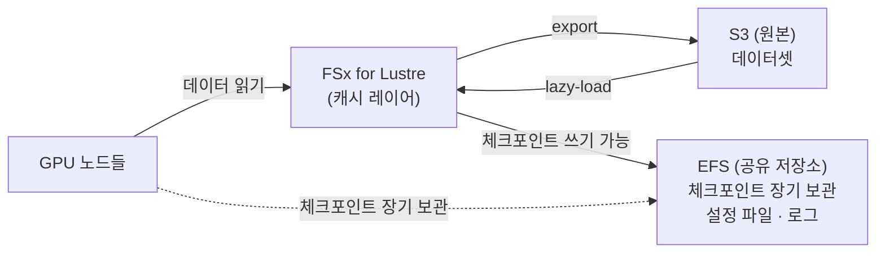
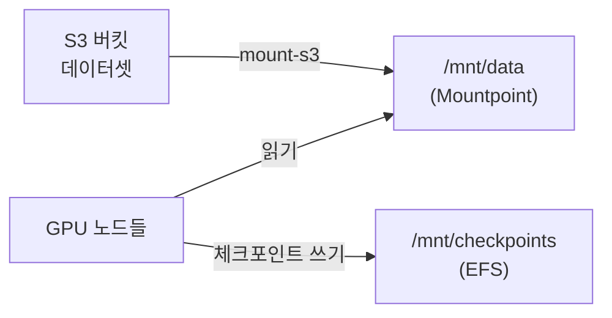

해당 포스팅은 현재 재직중인 회사에 관련이 없고, 개인 역량 개발을 위한 스터디 자료로 활용할 예정입니다.

지난 두 편에서 노드 간 **네트워크**(EFA)를 다뤘다. 빠르게 대화하는 건 해결했는데, 분산 학습에는 또 하나의 큰 질문이 남아 있다.

**"그 많은 노드가 학습 데이터와 체크포인트를 어디서 같이 읽고 쓰지?"**

노드가 2대일 때는 각 노드에 데이터를 복사해도 되지만, 수십\~수백 노드로 스케일하면 그건 불가능하다. 공유 스토리지가 필요하다. AWS에서 선택지는 크게 세 가지다.

1. **FSx for Lustre** - HPC용 고성능 병렬 파일시스템
2. **EFS (Elastic File System)** - 범용 NFS
3. **Mountpoint for Amazon S3** - S3를 POSIX 파일시스템처럼 마운트

이 글에서는 각각의 특성을 분산 학습 관점에서 비교하고, 언제 뭘 쓰면 되는지 정리한다.

<!--truncate-->

## 분산 학습에서 스토리지에 요구되는 것

본격적으로 비교하기 전에, 분산 학습이 스토리지에 요구하는 조건을 짚어보자.

### 읽기: 학습 데이터 로딩

* **높은 읽기 처리량(throughput)**: 수십\~수백 GPU가 동시에 데이터를 읽는다. 단일 노드 기준 수 GB/s 이상의 읽기 대역폭이 필요할 수 있다.
* **랜덤 읽기 성능**: 이미지 분류처럼 작은 파일을 랜덤하게 읽는 패턴이면 IOPS가 중요하다.
* **순차 읽기 성능**: LLM 학습에서 토크나이즈된 대용량 바이너리를 순차 스트리밍하는 경우 throughput이 지배적이다.

### 쓰기: 체크포인트 저장

* **쓰기 대역폭**: 수십\~수백 GB 크기의 모델 체크포인트를 주기적으로 저장한다. 쓰기가 느리면 학습 GPU가 idle 상태로 대기하게 된다.
* **일관성(consistency)**: 여러 노드가 동시에 쓸 때 데이터가 꼬이지 않아야 한다.
* **내구성(durability)**: 수일간의 학습 결과물이므로 잃어버리면 안 된다.

### 공통

* **POSIX 호환**: PyTorch/TensorFlow의 데이터 로더는 기본적으로 파일시스템 경로를 기대한다.
* **멀티노드 동시 접근**: 모든 노드가 같은 경로를 마운트할 수 있어야 한다.

## 1. FSx for Lustre - 고성능 병렬 파일시스템

### 개요

[FSx for Lustre](https://docs.aws.amazon.com/fsx/latest/LustreGuide/what-is.html)는 오픈소스 병렬 파일시스템 Lustre를 AWS가 완전관리형으로 제공하는 서비스다. 온프레미스 HPC 클러스터에서 수십 년간 검증된 Lustre를 클라우드에서 그대로 쓸 수 있다.

### 특성

* **병렬 I/O**: 데이터를 여러 스토리지 서버(OST)에 스트라이핑한다. 클라이언트(노드)가 늘어날수록 aggregate throughput이 선형으로 증가한다.
* **높은 처리량**: Persistent 2 배포 유형 기준, 스토리지 용량에 비례해 최대 수백 GB/s까지 확장 가능하다. 1TB당 최대 1,000 MB/s(1000 처리량 티어).
* **낮은 지연**: sub-millisecond latency. 메타데이터 연산도 빠르다.
* **S3 통합**: S3 버킷을 Data Repository로 연결하면, FSx가 S3 데이터를 자동으로 lazy-load(처음 접근 시 가져옴)하고, 결과를 S3로 export할 수 있다.
* **POSIX 완전 호환**: 심볼릭 링크, 하드 링크, 파일 잠금 등 모두 지원.

### 분산 학습에서의 장점

* GPU가 수백 개여도 데이터 로딩이 병목이 되지 않는다. Lustre의 병렬 스트라이핑이 핵심.
* 체크포인트를 빠르게 쓸 수 있다 - 대형 모델(수백 GB)도 수십 초 내에 저장 가능.
* S3에 원본 데이터를 두고, FSx를 캐시처럼 쓰는 패턴이 일반적이다.

### 주의점

* **프로비저닝 필요**: 파일시스템 생성에 수 분이 걸리고, 용량을 미리 정해야 한다(자동 확장 불가, 수동 증설은 가능).
* **AZ 제약**: 단일 AZ에 배포된다. 다른 AZ에서 접근하면 cross-AZ 지연이 붙는다.
* **임시 작업에는 과하다**: 짧은 실험(몇 시간)에 FSx를 띄웠다 내리면 생성/삭제 시간이 추가가 된다.

### 캐시 워밍(preload) - 첫 에폭이 느린 이유와 해결

앞서 "S3에 원본을 두고 FSx를 캐시처럼 쓴다"고 했는데, 이 구조에는 함정이 하나 있다. 먼저 개념을 정리하자.

* **Data Repository Association(DRA)**: FSx와 S3 버킷을 연결하는 설정. 이걸 걸면 S3의 객체들이 FSx에 **파일 메타데이터(이름·크기)만 먼저** 나타난다. 실제 데이터는 아직 FSx로 안 옮겨진 상태다.
* **lazy-load**: 그 파일을 **처음 읽는 순간** FSx가 S3에서 실제 내용을 가져온다. 미리 다 복사해두지 않고 "필요할 때 당겨오는" 방식이다.
* **HSM(계층형 스토리지 관리)**: FSx는 "데이터가 지금 어디 있는지"를 Lustre의 **HSM(Hierarchical Storage Management)** 으로 관리한다. HSM은 원래 빠른 스토리지(FSx)와 느린 백엔드(S3) 두 계층을 두고, 파일 실체를 두 계층 사이에서 옮기며 메타데이터로 위치를 추적하는 구조다. FSx에서는 S3가 그 백엔드(archive) 역할을 한다.
  * **`released`**: 파일 실체가 아직 S3에만 있고 FSx엔 없는 상태(메타데이터만 존재). `lfs hsm_state`가 `released`로 표시한다.
  * **`exists archived`**: 실체가 FSx에도 올라와 있고 S3에도 백업돼 있는 상태. 즉 캐시에 적재된 상태다.

  이 상태를 다루는 Lustre 명령이 `lfs`다.

  * **`lfs hsm_state <파일>`**: 현재 상태(`released`/`exists archived` 등) 조회.
  * **`lfs hsm_restore <파일>`**: `released` 파일을 S3에서 FSx로 **미리 당겨오는(복원)** 명령. 첫 읽기를 기다리지 않고 이걸로 앞당겨 실행하는 게 이 절의 핵심이다. 복원은 **비동기**로 진행돼 명령은 곧바로 반환되고, 진행 상황은 `lfs hsm_action <파일>`로 확인한다(`RESTORE running` → 완료 시 `NOOP`).
  * **`lfs hsm_release <파일>`**: 반대로, FSx의 실체를 비우고 다시 `released`로 되돌려 FSx 공간을 회수하는 명령(참고).

문제는 이거다. lazy-load이기 때문에 **처음 접근하는 파일은 그 순간 S3에서 끌어오고, 그래서 첫 에폭은 cold cache로 느리다.** 두 번째 에폭부터는 이미 FSx에 올라와 있어 빠르다. 즉 학습 초반에만 데이터 로딩이 병목이 되는, 놓치기 쉬운 구간이다.

대규모 학습에서는 학습을 시작하기 전에 데이터를 미리 적재(preload)해 두는 게 좋다.

```bash
# DRA(Data Repository Association)로 연결된 경로를 Lustre HSM으로 미리 restore 해 캐시를 채운다
find /mnt/fsx/dataset -type f -print0 | xargs -0 -P 32 -n 1 sudo lfs hsm_restore
```

* **`find /mnt/fsx/dataset -type f`**: 데이터셋 경로 아래의 모든 **일반 파일**(디렉터리 제외)을 나열한다. `released` 상태라도 메타데이터는 이미 FSx에 있으므로 `find`로 경로를 그대로 뽑을 수 있다.
* **`-print0`**: 결과를 개행이 아니라 **널 문자(`\0`)로 구분**해 출력한다. 파일 이름에 공백·특수문자가 있어도 안전하게 넘기기 위함이다. (`xargs -0`와 짝을 이룬다.)
* **`| xargs -0 ...`**: `find`가 넘긴 널 구분 목록을 받아, 뒤의 명령을 파일마다 실행한다.
* **`-P 32`**: 최대 **32개를 동시에(병렬)** 실행한다. restore는 S3에서 당겨오는 네트워크 I/O 바운드 작업이라, 병렬도를 높이면 전체 워밍 시간이 크게 준다. 노드의 vCPU·네트워크 대역폭에 맞춰 조정한다.
* **`-n 1`**: `lfs hsm_restore` 한 번에 **파일 1개씩** 넘긴다. (한 번에 여러 개를 넘기는 것보다 병렬 스케줄링이 고르게 퍼진다.)
* **`sudo lfs hsm_restore <파일>`**: 해당 파일을 S3에서 FSx로 **미리 복원**한다. 실제 복원은 비동기로 진행되며(`lfs hsm_action`에 `RESTORE running` 표시), 끝나면 `hsm_state`가 `released` → `exists archived`로 바뀐다.

정리하면 **"데이터셋의 모든 파일을 32개씩 병렬로 미리 restore 해서, 학습이 시작되기 전에 FSx 캐시를 다 채워두는"** 명령이다.

첫 접근 지연을 학습 시작 전에 몰아두면, 본 학습에서는 캐시 히트로 일정한 throughput을 얻는다. 이 단계를 건너뛰면 첫 에폭의 데이터 로딩이 S3 대역폭에 묶여 GPU가 idle 상태로 대기하게 된다.

이 효과를 직접 확인해봤다. S3 DRA를 연결한 FSx(PERSISTENT\_2, 1.2 TiB)에 8 GiB 파일을 두고, `lfs hsm_state`가 `released`(S3에만 있고 아직 캐시 안 됨)인 상태에서 `dd`로 읽었다.

| 상태                                 | 읽기             | 비고                    |
| :--------------------------------- | :------------- | :-------------------- |
| **Cold** (released, 첫 접근)          | 약 **287 MB/s** | S3에서 lazy-load 하며 읽음  |
| **Warm** (preload 후, FSx-resident) | 약 **619 MB/s** | 캐시 히트, 2회 모두 619 MB/s |

첫 접근이 warm 대비 **약 2.2배 느렸다.** cold 읽기가 끝나면 `hsm_state`가 `released`에서 `exists archived`로 바뀌어(= 캐시에 적재됨), 이후 읽기는 FSx 로컬 속도(619 MB/s, 이 구성의 단일 노드 상한인 5 Gbps ≈ 625 MB/s에 근접)로 올라온다.

`lfs hsm_restore`도 이 DRA 구성에서 명시적으로 확인했다. `released` 상태의 파일에 실행하니 **종료 코드 0**으로 반환됐고, `lfs hsm_action`에 `RESTORE running`이 뜬 뒤(비동기 복원) 곧 `NOOP`으로 바뀌며 `hsm_state`가 `released` → `exists archived`로 전이했다. 즉 첫 읽기를 기다리지 않고 학습 전에 `hsm_restore`로 미리 복원해 cold 페널티를 없애는 게 preload의 핵심이다.

## 2. EFS (Elastic File System) 

### 개요

[EFS](https://docs.aws.amazon.com/efs/latest/ug/whatisefs.html)는 AWS의 완전관리형 NFS 서비스다. 생성 즉시 사용 가능하고, 용량이 자동으로 늘었다 줄었다 한다.

### 특성

* **완전 탄력적**: 용량을 미리 정할 필요 없다. 쓴 만큼만 과금.
* **멀티 AZ**: 기본적으로 리전 내 여러 AZ에서 동시에 마운트 가능. 고가용성.
* **POSIX 호환**: NFS 기반이라 대부분의 POSIX 연산을 지원한다.
* **처리량 모드**:
  * Bursting: 저장 용량에 비례한 기본 처리량 + 버스트 크레딧
  * Elastic: 워크로드에 따라 자동 확장 (최대 읽기 10 GB/s, 쓰기 3 GB/s)
  * Provisioned: 고정 처리량 할당

### 분산 학습에서의 장점

* **설정이 간단하다**: 파일시스템 만들고 마운트 타깃만 잡으면 된다. 별도 클라이언트 설치 없이 `mount -t nfs4`로 바로 붙는다.
* **체크포인트 저장소로 적합**: 여러 AZ에 중복 저장돼 내구성·가용성이 높아 체크포인트를 안전하게 보관할 수 있다.
* **Infrequent Access 클래스**: 오래된 체크포인트를 IA 스토리지 클래스로 자동 전환할 수 있다.

### 주의점

* **throughput 한계**: Elastic 모드에서도 읽기 최대 10 GB/s다. GPU 수백 대가 동시에 데이터를 읽으면 부족할 수 있다. FSx for Lustre의 수백 GB/s와는 차이가 크다.
* **latency가 상대적으로 높다**: NFS 프로토콜 특성상 Lustre보다 메타데이터 연산이 느리다. 작은 파일 수십만 개를 읽는 패턴에서는 병목이 된다.
* **랜덤 I/O 성능**: 작은 파일을 대량으로 읽는 이미지 분류 등에서는 IOPS가 부족할 수 있다.
* **활용**: 데이터 로딩보다는 **체크포인트 저장, 설정 파일 공유, 소규모 학습** 에 더 어울린다.

## 3. Mountpoint for Amazon S3

### 개요

[Mountpoint for Amazon S3](https://docs.aws.amazon.com/AmazonS3/latest/userguide/mountpoint.html)는 S3 버킷을 로컬 파일시스템 경로에 마운트해주는 오픈소스 FUSE 클라이언트다. 2023년에 GA되었고, 꾸준히 성능이 개선되고 있다.

### 특성

* **무제한 용량**: 스토리지 용량을 미리 정할 필요가 없다. S3 버킷에 담기는 만큼 그대로 쓴다.
* **높은 읽기 처리량**: S3의 대역폭을 그대로 활용한다. 단일 인스턴스에서도 수십 Gbps의 읽기 처리량을 낼 수 있다(인스턴스 네트워크 대역폭이 허용하는 한).
* **순차 읽기에 최적화**: 대용량 파일을 순차적으로 읽는 패턴에서 뛰어난 성능을 보인다. LLM 학습 데이터(토크나이즈된 바이너리) 로딩에 적합.
* **서버리스**: 별도 인프라를 프로비저닝할 필요가 없다. `mount-s3` 명령어 하나로 마운트.
* **S3 Express One Zone**: 저지연이 필요하면 S3 Express One Zone 버킷을 쓸 수 있다. 일반 S3 대비 latency가 크게 낮다.

### 분산 학습에서의 장점

* **데이터가 이미 S3에 있다면 유력한 선택**: 대부분의 ML 파이프라인은 전처리된 데이터를 S3에 저장한다. 별도 복사 없이 바로 마운트해서 읽으면 된다.
* **스케일 제한이 없다**: 노드가 몇 대든 동시에 읽을 수 있다. S3 자체가 사실상 무한한 읽기 병렬성을 제공한다.
* **PyTorch DataLoader와 호환**: 마운트 경로를 그냥 데이터 디렉토리로 지정하면 된다.

### 주의점

* **쓰기 제약**: 새 파일 생성(sequential write)은 가능하지만, **기존 파일 수정(overwrite)이나 append는 불가**하다. 체크포인트를 매번 새 파일로 써야 한다.
* **랜덤 읽기 성능**: S3는 object storage다. 파일 내 특정 offset을 seek해서 읽는 패턴은 비효율적이다. 작은 파일 수만 개를 랜덤으로 읽으면 S3 API 호출 오버헤드가 생긴다.
* **메타데이터 연산이 느리다**: `ls`로 수만 개 파일을 나열하거나, stat 호출이 빈번한 패턴에서는 체감 지연이 있다.
* **POSIX 부분 지원**: 심볼릭 링크, 하드 링크, rename, chmod 등은 지원하지 않는다. 일부 학습 프레임워크가 이런 연산에 의존하면 문제가 될 수 있다.
* **결론**: 순차 읽기 중심의 **데이터 로딩에 강하고**, 쓰기가 많은 체크포인트 저장에는 제약이 있다.

## 한눈에 비교

| 항목                  | FSx for Lustre                     | EFS               | Mountpoint for S3        |
| :------------------ | :--------------------------------- | :---------------- | :----------------------- |
| **프로토콜**            | Lustre (POSIX)                     | NFS v4.1 (POSIX)  | FUSE + S3 API (부분 POSIX) |
| **최대 읽기 처리량**       | 수백 GB/s (용량 비례)                    | 10 GB/s (Elastic) | 인스턴스 네트워크 대역폭 한도         |
| **실측 읽기 (단일 노드)** ¹ | 약 600 MB/s                         | 약 330\~540 MB/s   | 약 1.5\~1.9 GB/s          |
| **실측 쓰기 (단일 노드)** ¹ | 약 600 MB/s                         | 약 540 MB/s        | 약 500 MB/s (PUT)         |
| **실측 랜덤 4K 읽기** ¹   | 약 75k IOPS                         | 약 13\~14k IOPS    | - (오브젝트)                 |
| **latency**         | sub-ms                             | 수 ms              | 수\~수십 ms (첫 바이트)         |
| **쓰기**              | 완전 POSIX                           | 완전 POSIX          | 새 파일만 (overwrite 불가)     |
| **용량 관리**           | 프로비저닝 (수동 증설)                      | 자동 확장             | 무제한 (S3)                 |
| **내구성**             | Persistent: 복제 / Scratch: 없음       | 다중 AZ 중복 저장       | 11 9's (S3)              |
| **멀티 AZ**           | 단일 AZ                              | 멀티 AZ             | 리전 전체                    |
| **S3 연동**           | Data Repository (lazy-load/export) | 없음 (별도 복사 필요)     | 네이티브 (S3 자체)             |
| **프로비저닝 시간**        | 수 분                                | 즉시                | 즉시 (mount 명령)            |
| **적합한 역할**          | 데이터 로딩 + 체크포인트                     | 체크포인트 + 설정 공유     | 데이터 로딩 (읽기 중심)           |

¹ `c5n.9xlarge`(50 Gbps) 노드에서 `fio`로 측정한 **단일 런 근사값**이다(런·설정에 따라 변동). FSx는 PERSISTENT\_2 기준. 측정 조건·노드 스케일링·변동성은 아래 [직접 측정해본 결과](#직접-측정해본-결과)에서 자세히 다룬다.

## 직접 측정해본 결과

표로 정리한 특성을 실제로 확인하기 위해, 세 스토리지를 같은 노드에 붙여 동일한 조건으로 측정했다. 단순 대역폭뿐 아니라 분산 학습에서 실제로 중요한 **랜덤 작은 파일 읽기(IOPS·지연)** 와 **멀티노드 합산 처리량(aggregate)** 까지 봤다.

### 측정 환경

* 인스턴스: `c5n.9xlarge` 2대 (50 Gbps 네트워크, 36 vCPU), us-east-1
* OS: Amazon Linux 2023, 커널 6.1 / 도구: `fio` 3.32, `mount-s3` 1.22.3
* FSx for Lustre: **PERSISTENT\_2, 1.2 TiB**, Lustre 2.15 - 단일 노드 표는 500 MB/s/TiB, 노드 스케일링 표는 1000 MB/s/TiB 티어로 측정(단일 노드 처리량은 클라이언트에 막혀 티어와 무관하게 동일)
* EFS: Elastic 처리량 모드, NFS 4.1
* S3: Mountpoint(`mount-s3`)

> 아래 스토리지 대역폭·IOPS 표는 위 구성(최대 2노드)에서 측정했다. 이후의 **캐시 워밍·데이터 로더(num\_workers)·WebDataset 실험은 단일** **`c5n.9xlarge`** **한 대**에서 별도로 측정한 것이며, 로더 실험은 GPU 없이 CPU 디코딩 기준이다.

### 사용한 도구와 명령

측정에 쓴 도구는 세 가지다.

* **[fio](https://fio.readthedocs.io/)** - 순차 대역폭과 랜덤 IOPS·지연 측정. 파일시스템(FSx, EFS)처럼 POSIX·`O_DIRECT`를 지원하는 대상에 사용했다.
* **`dd`** - S3 Mountpoint 순차 읽기 측정. Mountpoint(FUSE)는 `O_DIRECT`를 지원하지 않아 fio `direct=1`이 마운트를 멈추게 하므로, 버퍼드 순차 읽기로 측정했다.
* **`aws s3 cp`** - S3 업로드(PUT) 경로 처리량 측정.

각 스토리지를 먼저 마운트한다.

```bash
# FSx for Lustre (lustre-client 설치 후, 커널 모듈 로드)
sudo mount -t lustre -o relatime,flock \
  <fs-id>.fsx.us-east-1.amazonaws.com@tcp:/<mount-name> /mnt/fsx

# EFS (DNS가 안 풀리면 마운트 타깃 IP로 직접 마운트)
sudo mount -t nfs4 -o nfsvers=4.1,rsize=1048576,wsize=1048576,hard,timeo=600,retrans=2,noresvport \
  <mount-target-ip>:/ /mnt/efs

# S3 Mountpoint
mount-s3 <bucket-name> /mnt/s3 --allow-other
```

> `--allow-other`는 학습 컨테이너 등 다른 사용자가 마운트에 접근하도록 허용한다. 먼저 `/etc/fuse.conf`에 `user_allow_other`가 켜져 있어야 동작한다.

측정 명령은 다음과 같다.

```bash
# 순차 쓰기 (병렬 8잡으로 파일시스템 포화)
fio --name=sw --directory=/mnt/fsx --size=2G --bs=1M --rw=write \
    --ioengine=libaio --iodepth=32 --direct=1 --numjobs=8 --group_reporting

# 순차 읽기 (읽기 전 페이지 캐시 비우기)
sync; echo 3 | sudo tee /proc/sys/vm/drop_caches
fio --name=sr --directory=/mnt/fsx --size=2G --bs=1M --rw=read \
    --ioengine=libaio --iodepth=32 --direct=1 --numjobs=8 --group_reporting

# 랜덤 4K 읽기 (IOPS·지연)
fio --name=rr --directory=/mnt/fsx --size=2G --bs=4k --rw=randread \
    --ioengine=libaio --iodepth=64 --direct=1 --numjobs=4 \
    --runtime=30 --time_based --group_reporting

# S3 순차 읽기 (버퍼드) / 업로드
dd if=/mnt/s3/big8g of=/dev/null bs=4M
time aws s3 cp ./big8g s3://<bucket-name>/big8g
```

> `O_DIRECT`(`direct=1`)는 파일시스템 캐시를 건너뛰어 실제 스토리지 성능을 재기 위해 쓴다. 단, FUSE 기반인 S3 Mountpoint에서는 지원하지 않으므로 S3는 `dd` 버퍼드 읽기로 측정했다. 캐시 효과를 줄이려고 읽기 직전에 `drop_caches`로 페이지 캐시를 비웠다.

### 결과 - 단일 노드 (근사값)

> 아래 수치는 **단일 런 근사값**이다. 스토리지 벤치마크는 fio 설정·버스트 상태·서비스 내부 동작에 민감해서 런마다 흔들린다. 실제로 EFS 순차 읽기는 fio 설정(잡 수·파일 구성)만 바꿔도 약 330~~540 MB/s로 1.6배 차이가 났고, S3 순차 읽기도 런마다 1.5~~1.9 GB/s로 ±25% 정도 변동했다. 그러니 **정확한 절대치보다 자릿수와 상대 비교**로 읽는 게 맞다.

| 지표                | FSx for Lustre | EFS             | S3 Mountpoint                |
| :---------------- | :------------- | :-------------- | :--------------------------- |
| 순차 읽기             | 약 600 MB/s     | 약 330\~540 MB/s | **약 1.5\~1.9 GB/s**          |
| 순차 쓰기             | 약 600 MB/s     | 약 540 MB/s      | 약 500 MB/s (`aws s3 cp` PUT) |
| 랜덤 4K 읽기 IOPS     | **약 75k**      | 약 13\~14k       | 해당 없음 (오브젝트)                 |
| 랜덤 4K 읽기 지연       | **약 3 ms**     | 약 18 ms         | 해당 없음                        |
| 작은 오브젝트 단일 스레드 읽기 | -              | -               | 초당 수\~십수 개 (지연 바운드)          |

단일 노드에서 순차 읽기는 S3 Mountpoint가 가장 높았다(객체를 여러 구간으로 나눠 병렬 GET). 가장 또렷한 차이는 **랜덤 작은 파일 읽기**로, FSx가 EFS 대비 IOPS·지연 모두 **약 5배** 앞섰다. 이 격차는 fio 설정 변동과 무관하게 일관되게 재현됐다.

### 노드 스케일링 (읽기, 근사값)

분산 학습의 핵심 질문은 "노드를 늘리면 합산 처리량이 따라 오르는가"다. 단일 클라이언트는 어느 스토리지든 인스턴스·클라이언트 한계에 먼저 막히므로, 노드를 1·2·4로 늘려 동시에 읽어봤다(FSx·EFS는 fio 30초 지속, S3는 콜드 `dd`).

| 스토리지                        | 1노드        | 4노드 합산     | 경향    |
| :-------------------------- | :--------- | :--------- | :---- |
| FSx for Lustre (P2 1000 티어) | 약 600 MB/s | 약 2.5 GB/s | 거의 선형 |
| EFS (Elastic)               | 약 330 MB/s | 약 1.3 GB/s | 거의 선형 |
| S3 Mountpoint               | 약 1.5 GB/s | 약 7 GB/s   | 거의 선형 |

세 스토리지 모두 **노드 수에 거의 비례해 합산 처리량이 올라갔다.** 다만 상한을 정하는 방식이 다르다. EFS와 S3는 클라이언트별로 대역폭이 붙어 사실상 노드 수에 비례한다. FSx는 **프로비저닝(용량 × 처리량 티어)이 상한을 정하고**, 그 안에서 여러 노드가 동시에 읽어야 프로비저닝한 처리량이 살아난다 - 단일 노드로는 풀을 다 못 쓴다. 즉 **FSx는 클러스터 전체 기준으로 처리량을 설계해 두고 병렬로 소비**하고, **S3는 노드가 늘수록 알아서 스케일**한다고 이해하면 된다.

> **단일 노드가 약 600 MB/s에서 막힌 이유**는 측정 한계가 아니라 문서화된 제약이다. AWS 문서에 따르면 [개별 클라이언트와 개별 FSx 오브젝트 스토리지 서버(OSS) 사이의 트래픽은 5 Gbps로 제한](https://docs.aws.amazon.com/fsx/latest/LustreGuide/performance.html)된다(5 Gbps ≈ 625 MB/s). 이번 파일시스템은 OST(스토리지 서버)가 1개여서 단일 클라이언트가 이 한 대와만 통신했고, 그래서 정확히 5 Gbps 부근에서 막혔다. 용량을 키워 OST가 여러 개가 되면 단일 클라이언트도 여러 서버에 스트라이핑해 이 이상을 낼 수 있다.

### 결과 해석

* **순차 읽기는 S3 Mountpoint가 가장 높았다**(병렬 GET). FSx·EFS는 그보다 낮은 비슷한 구간으로, 단일 클라이언트에선 인스턴스·클라이언트 한계가 먼저 작용한다.
* **결정적 차이는 랜덤 작은 파일 읽기다.** FSx가 EFS 대비 IOPS·지연 약 5배 우위. 이미지 분류처럼 작은 파일 수십만 개를 랜덤하게 읽는 워크로드라면 이 격차가 학습 처리량을 직접 좌우한다. Lustre가 HPC·학습용으로 선택되는 핵심 이유다.
* **S3는 오브젝트 스토리지다.** 작은 오브젝트를 단일 스레드로 읽으면 GET 왕복 지연에 묶인다. 데이터 로더 워커를 여러 개 띄우면 완화되지만 블록 단위 랜덤 저장소는 아니다. 반대로 대용량 순차 스트리밍에서는 가장 빨랐다.
* **합산 처리량은 셋 다 노드 수에 따라 올라간다.** 단일 노드 수치만으로 우열을 단정하면 안 된다.

### 측정의 한계 - "4노드면 보장"은 아니다

위 스케일링 결과는 분명한 동시에, 과대 해석은 경계해야 한다.

* **포화점을 확인하지 못했다.** 4노드(합산 약 2.5 GB/s)에서도 파일시스템을 포화시키지 못했다. 노드를 더 늘리면 어딘가에서 평평해지며, 그 상한은 프로비저닝(용량 × 티어)과 파일서버 네트워크 한도로 정해진다.
* **30초 윈도우 기준이다.** 읽기·쓰기 모두 4노드에서 비슷한 수준으로 선형 확장했지만(쓰기도 동일하게 확인), 이는 30초 지속값이다. PERSISTENT\_2는 기준치 위로 버스트하므로, 수시간짜리 학습에서는 버스트 크레딧이 소진되며 공칭 디스크 기준치(이 구성은 1,200 MB/s) 쪽으로 수렴할 수 있다. 장시간 거동은 짧은 벤치마크로 단정할 수 없다.
* **레이아웃·패턴 의존.** 이 파일시스템은 OST가 1개인 1.2 TiB 구성이고, 대용량 순차 I/O를 쟀다. 용량이 큰(OST가 여러 개인) 파일시스템이나 랜덤·메타데이터 위주 패턴은 다르게 거동한다.

즉 정확한 결론은 *"병렬 클라이언트가 있어야 프로비저닝한 처리량이 실현되고, 버스트·프로비저닝 한도 안에서 노드 수에 비례해 오른다"* 까지다. "노드 N대면 성능이 자동 보장"이 아니라, **프로비저닝으로 상한을 사고, 병렬 클라이언트로 그 상한을 채우는** 구조로 이해하는 게 맞다.

> FSx와 EC2는 켜 두면 시간당 과금된다. 실습이 끝나면 인스턴스 종료와 파일시스템·버킷 삭제까지 습관처럼 정리하는 게 좋다.

### 측정값과 공식 문서 대조

단일 런 측정이라 절대치는 흔들리지만, **관측한 경향이 AWS 공식 문서의 설계 사양과 맞는지** 대조해봤다. 핵심은 대부분 문서로 설명된다.

| 관측                           | 공식 문서 근거                                                                                                                                              | 해석                                   |
| :--------------------------- | :---------------------------------------------------------------------------------------------------------------------------------------------------- | :----------------------------------- |
| FSx 단일 클라이언트 \~600 MB/s 고정   | [클라이언트↔OSS 트래픽 5 Gbps 제한](https://docs.aws.amazon.com/fsx/latest/LustreGuide/performance.html) (≈625 MB/s)                                            | OST 1개 구성이라 한 서버에 묶여 정확히 일치          |
| 노드 늘리면 합산 선형 증가              | 클라이언트별 독립 연결 + [네트워크 I/O 크레딧 버스트](https://docs.aws.amazon.com/fsx/latest/LustreGuide/ssd-storage.html), "수천 노드 동시 접근"                                 | 병렬 클라이언트로 합산을 채우는 구조                 |
| 읽기가 공칭 디스크 기준치(1,200) 초과     | [SSD 성능표](https://docs.aws.amazon.com/fsx/latest/LustreGuide/ssd-storage.html): 네트워크 baseline이 디스크보다 큼(PERSISTENT-500 기준 1,300 vs 500 MBps/TiB) + 버스트 | 읽기는 디스크 기준치 위에서 동작 가능                |
| FSx 랜덤 4K 약 75k IOPS         | SSD 성능표: 네트워크 IOPS "수만 baseline \~ 수십만 버스트"/TiB                                                                                                       | baseline\~버스트 구간으로 타당                |
| EFS 단일 노드 330\~540 MB/s      | [EFS 성능 사양](https://docs.aws.amazon.com/efs/latest/ug/performance.html): Elastic **클라이언트당 1,500 MiBps**                                               | 상한 한참 아래 → EFS 한계가 아니라 우리 fio 설정이 병목 |
| S3 단일 1.5\~1.9 GB/s, 다노드 합산↑ | [S3 FAQ](https://aws.amazon.com/s3/faqs/): "높은 단일 인스턴스 전송률 ... 인스턴스 합산으로 수 Tb/s"                                                                      | 단일 고처리량 + 인스턴스 스케일 일치                |
| S3 쓰기는 새 파일만                 | [Mountpoint 문서](https://docs.aws.amazon.com/AmazonS3/latest/userguide/mountpoint.html): "기존 파일 수정·디렉터리 삭제 불가"                                         | overwrite 불가 특성 확인                   |

한 가지 주의: **지연(latency)** 은 문서값(FSx sub-ms, EFS 읽기 ~1 ms)이 무부하 기준이고, 우리가 측정한 3.4 ms·18 ms는 `iodepth=64` 부하에서의 큐잉 지연이다. 방향(FSx가 더 낮음)은 일치하지만 절대치는 부하 조건이 달라 직접 비교 대상이 아니다.

## 데이터 로딩 파이프라인 - 스토리지와 GPU 사이

스토리지 자체 성능만큼 중요한 게, 그 위에서 도는 **데이터 로더**다. 아무리 빠른 스토리지를 붙여도 로더가 받쳐주지 못하면 GPU는 데이터를 기다리며 논다(이른바 data starvation). 반대로 잘 짜인 로더는 스토리지의 약점을 상당 부분 가려준다.

### PyTorch DataLoader 튜닝

* **`num_workers`**: 데이터를 읽고 전처리하는 워커 프로세스 수. 워커가 많을수록 스토리지의 I/O 지연을 병렬로 숨길 수 있다. S3 Mountpoint처럼 단일 스레드 랜덤 읽기가 느린 경우, 워커를 늘리면 여러 GET이 동시에 나가 체감 throughput이 크게 오른다.
* **`prefetch_factor`**: 워커당 미리 읽어둘 배치 수. 다음 스텝에 쓸 데이터를 선행 로딩해 스토리지 지연을 학습 스텝에 묻는다.
* **`pin_memory=True`**: 호스트 메모리를 page-lock해서 GPU 전송(H2D)을 빠르게 한다. 스토리지와 직접 관련은 없지만 로딩 파이프라인 끝단의 병목을 줄인다.
* **`persistent_workers=True`**: 에폭마다 워커를 재생성하지 않아, 마운트 재접속·캐시 워밍 비용을 아낀다.

`num_workers`의 효과를 S3 Mountpoint에서 직접 측정했다(작은 JPEG를 랜덤하게 읽는 ImageFolder, 단일 `c5n.9xlarge`에서 디코딩까지 측정, GPU 없이 CPU 디코딩). 데이터는 **합성 노이즈 JPEG**라 압축이 거의 안 돼 실제 사진과 디코딩 특성이 다르다. 그러니 아래 절대 samples/s가 아니라 **워커 수에 따른 배수**로 읽어야 한다.

측정에 쓴 코드는 다음과 같다. S3를 Mountpoint로 마운트해 두고(`mount-s3 <bucket> /mnt/s3 --allow-other`), `num_workers`만 바꿔가며 초당 처리한 샘플 수를 쟀다.

```python
import time
from torch.utils.data import DataLoader
from torchvision.datasets import ImageFolder
from torchvision import transforms

tfm = transforms.Compose([transforms.Resize((224, 224)), transforms.ToTensor()])
ds = ImageFolder("/mnt/s3/imagenet-subset", transform=tfm)

for nw in [0, 2, 4, 8]:
    dl = DataLoader(ds, batch_size=64, shuffle=True, num_workers=nw,
                    prefetch_factor=(4 if nw else None),
                    pin_memory=True, persistent_workers=(nw > 0))
    t0, n = time.time(), 0
    for i, (x, _) in enumerate(dl):
        n += x.size(0)
        if i + 1 >= 8:            # 8배치만 측정
            break
    print(f"num_workers={nw}: {n / (time.time() - t0):.0f} samples/s")
```

| num\_workers | 처리량            | 배수       |
| :----------- | :------------- | :------- |
| 0            | 약 7 samples/s  | ×1.0     |
| 2            | 약 15 samples/s | ×2.2     |
| 4            | 약 30 samples/s | ×4.2     |
| 8            | 약 69 samples/s | **×9.7** |

워커 0개일 때는 S3 GET 왕복 지연에 완전히 묶여(7 samples/s) GPU를 굶긴다. 워커를 8개로 늘리자 GET이 병렬화되며 **약 10배**로 뛰었다. 스토리지를 못 바꿔도 로더 설정만으로 체감 throughput이 이만큼 달라진다.

### 샤드 기반 로더 - 랜덤을 순차로 바꾸기

이 글의 측정에서 드러난 핵심 약점은 **작은 파일 랜덤 읽기**였다(S3는 GET 왕복 지연, EFS는 메타데이터 지연). 이 문제를 근본적으로 우회하는 방법이 **데이터를 큰 샤드로 묶어 순차로 읽는 것**이다.

* **[WebDataset](https://github.com/webdataset/webdataset)**: 샘플 수십만 개를 `.tar` 샤드로 묶어, 스토리지에는 순차 읽기만 시킨다. S3·Lustre 모두에서 랜덤 small-file 패턴이 순차 스트리밍으로 바뀌어 throughput이 크게 오른다.
* **[NVIDIA DALI](https://github.com/NVIDIA/DALI)**: 디코딩·증강을 GPU로 오프로드해 CPU 전처리 병목을 줄인다.
* **[FFCV](https://github.com/libffcv/ffcv)**: 전용 바이너리 포맷으로 묶어 작은 파일 오버헤드를 없앤다.

> 측정에서 "S3는 작은 오브젝트 랜덤에 약하다"고 했는데, 그럼에도 실무에서 S3로 학습 데이터를 읽는 팀이 많은 이유가 바로 이것이다. **원본을 그대로 두지 않고 tar/포맷 샤드로 묶어** S3의 순차 읽기 강점만 쓰기 때문이다. 스토리지 선택만큼 데이터 레이아웃 설계가 중요하다.

같은 데이터를 (a) 원본 작은 파일 랜덤 읽기와 (b) WebDataset `.tar` 샤드(순차 읽기)로 나눠 S3 Mountpoint에서 측정했다(둘 다 `num_workers=8`).

먼저 ImageFolder를 tar 샤드로 묶는다. `webdataset`의 `ShardWriter`가 샘플당 `jpg`+`cls`를 한 tar에 페어로 담아준다.

```python
import glob, os, webdataset as wds

classes = sorted(os.listdir("/data/imagenet-subset"))
idx = {c: i for i, c in enumerate(classes)}
# 1000개 샘플마다 새 샤드(shard-000000.tar, shard-000001.tar, ...)
with wds.ShardWriter("/data/shards/shard-%06d.tar", maxcount=1000) as sink:
    for c in classes:
        for p in glob.glob(f"/data/imagenet-subset/{c}/*.jpg"):
            sink.write({"__key__": f"{c}_{os.path.basename(p)}",
                        "jpg": open(p, "rb").read(),
                        "cls": str(idx[c])})
# 만든 샤드를 S3로 업로드
#   aws s3 cp /data/shards s3://<bucket>/webdataset --recursive
```

그다음 baseline(원본 ImageFolder)과 WebDataset(tar 샤드 순차 읽기)를 같은 `num_workers=8`로 비교한다.

```python
import time, webdataset as wds
from torch.utils.data import DataLoader
from torchvision.datasets import ImageFolder
from torchvision import transforms

tfm = transforms.Compose([transforms.Resize((224, 224)), transforms.ToTensor()])

# (a) baseline: 원본 작은 파일 랜덤 읽기
base = DataLoader(ImageFolder("/mnt/s3/imagenet-subset", transform=tfm),
                  batch_size=64, shuffle=True, num_workers=8, pin_memory=True)

# (b) WebDataset: tar 샤드 순차 읽기
def preprocess(s):
    img, label = s
    return tfm(img), label

wds_ds = (wds.WebDataset("/mnt/s3/webdataset/shard-{000000..000012}.tar",
                         shardshuffle=True)
          .shuffle(1000).decode("pil").to_tuple("jpg", "cls").map(preprocess))
wl = wds.WebLoader(wds_ds, batch_size=64, num_workers=8)

for name, dl in [("baseline", base), ("webdataset", wl)]:
    t0, n = time.time(), 0
    for i, (x, _) in enumerate(dl):
        n += len(x)
        if i + 1 >= 8:
            break
    print(f"{name}: {n / (time.time() - t0):.0f} samples/s")
```

| 로딩 방식                  | 처리량             | 배수       |
| :--------------------- | :-------------- | :------- |
| 원본 small-file (랜덤)     | 약 66 samples/s  | ×1.0     |
| WebDataset tar 샤드 (순차) | 약 297 samples/s | **×4.5** |

같은 노드·같은 데이터에서 샤딩만으로 **약 4.5배** 빨라졌다. 랜덤 GET 다발이 몇 개의 큰 순차 GET으로 바뀌면서 S3의 강점(순차 처리량)을 그대로 활용한 결과다. (원본 small-file 66 samples/s는 앞의 `num_workers=8` 측정값 69와 같은 조건이며, 런 변동 ±5% 범위다. 여기서도 합성 이미지 기준이라 절대치보다 배수가 핵심이다.)

## 실전 조합 패턴

실무에서는 하나만 쓰기보다 **역할에 따라 조합**하는 경우가 많다.

### 패턴 1: S3(데이터) + FSx for Lustre(캐시) + EFS(체크포인트)

가장 일반적인 대규모 학습 구성이다.



* S3에 원본 데이터를 두고, FSx for Lustre가 Data Repository로 연결해 lazy-load
* GPU 노드는 FSx를 마운트해서 고속으로 읽기
* 체크포인트는 FSx에 쓰거나, 내구성이 더 중요하면 EFS에 저장
* 학습이 끝나면 FSx를 삭제해 정리한다

### 패턴 2: Mountpoint for S3(데이터) + EFS(체크포인트)

FSx를 띄우기 부담스러운 경우(프로비저닝 시간, 관리 부담).



* 데이터 로딩: S3를 Mountpoint로 마운트. 순차 읽기 중심이면 충분한 성능.
* 체크포인트: Mountpoint는 overwrite가 안 되니, EFS에 쓴다.
* FSx 대비 관리 포인트가 적다.
* LLM 학습처럼 대용량 파일을 순차로 읽는 워크로드에 특히 잘 맞는다.

### 패턴 3: FSx for Lustre 올인

성능이 최우선인 대규모 프로덕션 학습.

* 데이터 로딩 + 체크포인트 모두 FSx에서 처리
* Persistent 2 배포 유형으로 내구성 확보
* S3 Data Repository로 원본 연동 + 결과 export
* SageMaker HyperPod나 ParallelCluster에서 이 구성을 기본으로 제공

## 비용 관점 - 성능만으로 고르지 않는다

선택은 성능뿐 아니라 과금 모델로도 갈린다. 대략의 구조만 짚는다(요금은 리전·시점에 따라 다르니 정확한 수치는 공식 요금 계산기를 확인하자).

* **FSx for Lustre**: **프로비저닝한 용량(GB-month) × 처리량 티어**로 과금된다. 띄워 둔 시간만큼 계속 비용이 나가므로, 짧은 실험에 큰 용량을 잡으면 비싸다. 반대로 장기 대규모 학습에서는 단위 처리량당 비용이 합리적이다.
* **EFS**: **저장한 용량 + 처리량 모드** 과금. Elastic 모드는 읽고 쓴 양에 비례하고, IA 클래스로 옮기면 저장 비용이 크게 준다. 쓴 만큼만 내므로 idle 비용 부담이 적다.
* **S3 + Mountpoint**: **스토리지(GB-month) + 요청 수(GET/PUT)** 과금. Mountpoint는 읽을 때 GET 요청이 발생하므로, 작은 파일을 대량으로 랜덤 읽으면 요청 비용이 의외로 커질 수 있다(샤드로 묶으면 요청 수가 줄어 비용도 준다). 데이터를 보관만 할 때의 저장 단가는 가장 싸다.

대략의 손익 감각은 이렇다.

* **짧은 실험 / 데이터가 이미 S3에 있음** → S3 Mountpoint가 가장 저렴하다(프로비저닝 idle 비용 없음).
* **장기 대규모 학습 / 랜덤 IOPS 중요** → FSx가 결국 유리하다. 성능으로 GPU idle을 줄이는 게 스토리지 비용보다 큰 절감이 된다 - **GPU 시간이 가장 비싸다**는 점을 기억하자.
* **체크포인트 장기 보관** → EFS(IA) 또는 S3가 저렴하다.

## 선택 가이드 - 언제 뭘 쓸까

### FSx for Lustre를 고르는 경우

* GPU 수십\~수백 대 이상의 대규모 학습
* 작은 파일(이미지 등) 수백만 개를 랜덤으로 읽는 워크로드
* 체크포인트 쓰기 속도가 학습 효율에 직접적으로 영향을 주는 경우
* 이미 SageMaker HyperPod / ParallelCluster를 쓰고 있는 경우

### EFS를 고르는 경우

* 체크포인트 저장이 주 용도 (읽기 성능은 덜 중요)
* 여러 AZ에서 동시에 접근해야 하는 경우
* 설정 파일, 소스코드, 로그 등 소규모 공유 데이터
* 프로비저닝 없이 바로 쓰고 싶을 때
* 소규모 학습(GPU 수 대)에서 데이터 로딩까지 겸할 때

### Mountpoint for S3를 고르는 경우

* 데이터가 이미 S3에 있고, 별도 복사 없이 바로 쓰고 싶을 때
* 대용량 파일을 순차로 읽는 패턴 (LLM 학습 데이터, 동영상 등)
* FSx를 띄울 만큼 장기 학습이 아닌 짧은 실험
* 쓰기가 새 파일 생성(체크포인트를 매번 새 파일로)으로 충분한 경우

> **S3 Express One Zone**: latency가 중요한데 Mountpoint를 쓰고 싶다면 고려하자. 일반 S3 대비 첫 바이트 지연이 크게 줄어든다. (이번 측정에는 포함하지 않았다 - 일반 S3 기준 수치다.)

## 체크포인트 전략 보충

분산 학습에서 체크포인트 쓰기는 단순히 "어디에 저장하냐"만의 문제가 아니다. 몇 가지 실무적 고려사항을 짚는다.

### 동기 체크포인트 vs 비동기 체크포인트

* **동기**: 모든 GPU가 체크포인트 쓰기가 끝날 때까지 기다린다. 쓰기 대역폭이 곧 학습 중단 시간이다. → FSx for Lustre의 고속 쓰기가 유리.
* **비동기**: 체크포인트를 백그라운드에서 저장하고 학습을 계속한다. PyTorch의 `torch.distributed.checkpoint`가 이 패턴을 지원한다. → 쓰기 속도가 덜 중요해지므로 EFS나 S3도 선택지가 된다.

### 체크포인트 크기와 주기

* 70B 파라미터 모델의 체크포인트는 옵티마이저 상태 포함 시 **수백 GB\~1TB**에 달한다.
* 주기가 짧을수록(예: 매 100 스텝) 스토리지 쓰기 부담이 크다.
* 큰 모델 + 짧은 주기라면 FSx의 throughput이 필요하고, 작은 모델 + 긴 주기라면 EFS로 충분하다.

### sharded checkpoint

대형 모델은 FSDP(Fully Sharded Data Parallel)나 DeepSpeed ZeRO로 파라미터를 샤딩한다. 이 경우 각 노드가 자기 샤드만 독립적으로 저장하므로, 파일시스템에 대한 동시 쓰기 부하가 분산된다. FSx의 병렬 I/O가 유리한 지점이다.

### 체크포인트 재개(resume)와 정합성

쓰기만큼 **읽어서 재개**하는 경로도 중요하다.

* **read storm**: 학습을 재개할 때 수백 노드가 동시에 같은 체크포인트를 읽으면 순간 읽기 부하가 몰린다. FSx의 병렬 읽기나 S3의 높은 병렬성이 유리하고, 한 노드가 읽어 나머지에 브로드캐스트하는 방식으로 부하를 줄이기도 한다.
* **버전 관리**: S3 Mountpoint는 overwrite가 안 되므로, 체크포인트를 `step-001000/`처럼 **스텝·타임스탬프 디렉터리로 나눠** 저장하는 게 자연스럽다. 재개 시에는 최신 디렉터리를 찾아 로드한다.
* **원자성**: 쓰는 도중 죽으면 깨진 체크포인트가 남을 수 있다. 임시 경로에 다 쓴 뒤 rename 하거나(POSIX 파일시스템), "완료 마커" 파일을 마지막에 써서 온전한 체크포인트만 재개 대상으로 삼는다. S3는 rename이 없으므로 마커 방식이 맞다.

## 마무리

분산 학습의 스토리지 선택은 결국 **읽기 패턴, 쓰기 요구, 운영 편의성**의 균형이다. 이번 측정을 반영하면, "성능 최우선"을 한 곳으로 몰지 말고 **어떤 성능이 중요한지**로 나누는 게 맞다.

* 작은 파일 랜덤 접근·낮은 지연이 중요하면 → **FSx for Lustre** (랜덤 IOPS·지연에서 약 5배 우위)
* 대용량 순차 처리량과 노드 확장이 중요하면 → **Mountpoint for S3** (단일 노드 순차·다노드 합산 모두 가장 높았고, 데이터가 이미 S3에 있으면 더 유리)
* 간편함·내구성·멀티 AZ가 우선이면 → **EFS** (설정이 가장 단순하고, 측정에선 노드당 처리량이 가장 낮았다)

그리고 실전에서는 이 셋을 조합해서 쓴다. 데이터 읽기는 S3/FSx, 체크포인트 쓰기는 EFS/FSx - 역할에 맞게 배치하는 것이 핵심이다.

> 한 가지 더: 스토리지 트래픽도 결국 노드의 네트워크를 탄다. EFA로 통신을 가속하는 구성에서도 데이터 로딩·체크포인트 I/O가 같은 NIC 대역폭을 나눠 쓰므로, 스토리지와 통신 트래픽을 함께 고려해 대역폭을 설계해야 한다. 1·2편의 네트워크와 이 글의 스토리지는 결국 같은 파이프 위에서 만난다.

이 시리즈의 지금까지를 정리하면:

1. [1편: 일반 InfiniBand vs AWS EFA](https://ddii.dev/aws/infiniband-vs-efa/) - 개념 비교
2. [2편: AWS EFA 직접 써보기](https://ddii.dev/aws/efa-hands-on/) - 핸즈온
3. **3편: 분산 학습을 위한 AWS 공유 스토리지** (이 글) - 스토리지 선택

네트워크(EFA)로 노드 간 통신을 빠르게 하고, 스토리지(FSx/S3)로 데이터 공급을 원활하게 하면, 분산 학습의 두 가지 인프라 병목을 모두 해결한 셈이다.

### 다음 글 예고

그런데 인프라를 다 갖춰도 막상 학습을 돌리면 이런 질문을 만난다 - **"GPU를 여러 장 붙였는데 왜 기대만큼 안 빨라지지?"** 성능이 안 나오는 이유는 대개 **한 곳의 병목**인데, 그게 컴퓨트(GPU)인지 통신(네트워크·NCCL)인지 데이터(스토리지·로더)인지 눈에 잘 안 보인다.

다음 글에서는 바로 이 지점을 파헤친다. 학습이 느릴 때 **범인이 컴퓨트인지 통신인지 데이터인지 가려내는 관측·프로파일링** 방법을 살펴보고, 이 글에서 본 스토리지·데이터 로더가 실제로 병목인지 확인하는 데까지 이어갈 예정이다.

## 참고 문서

* [Amazon FSx for Lustre User Guide](https://docs.aws.amazon.com/fsx/latest/LustreGuide/what-is.html)
* [Amazon FSx for Lustre 성능 (클라이언트당 처리량·5 Gbps/OSS 제한)](https://docs.aws.amazon.com/fsx/latest/LustreGuide/performance.html)
* [Amazon FSx for Lustre SSD/HDD 성능 특성](https://docs.aws.amazon.com/fsx/latest/LustreGuide/ssd-storage.html)
* [Amazon EFS User Guide](https://docs.aws.amazon.com/efs/latest/ug/whatisefs.html)
* [Amazon EFS 성능 사양](https://docs.aws.amazon.com/efs/latest/ug/performance.html)
* [Mountpoint for Amazon S3 Documentation](https://docs.aws.amazon.com/AmazonS3/latest/userguide/mountpoint.html)
* [Mountpoint for Amazon S3 GitHub](https://github.com/awslabs/mountpoint-s3)
* [fio (Flexible I/O Tester) 문서](https://fio.readthedocs.io/)
* [S3 Express One Zone](https://docs.aws.amazon.com/AmazonS3/latest/userguide/s3-express-one-zone.html)
* [Best practices for distributed training on AWS](https://docs.aws.amazon.com/sagemaker/latest/dg/distributed-training-best-practices.html)
* [PyTorch Distributed Checkpoint](https://pytorch.org/docs/stable/distributed.checkpoint.html)
* [PyTorch DataLoader 문서](https://pytorch.org/docs/stable/data.html)
* [WebDataset](https://github.com/webdataset/webdataset)
* [NVIDIA DALI](https://github.com/NVIDIA/DALI)
* [FFCV](https://github.com/libffcv/ffcv)
* [FSx for Lustre 데이터 리포지토리 (S3 연동)](https://docs.aws.amazon.com/fsx/latest/LustreGuide/fsx-data-repositories.html)
