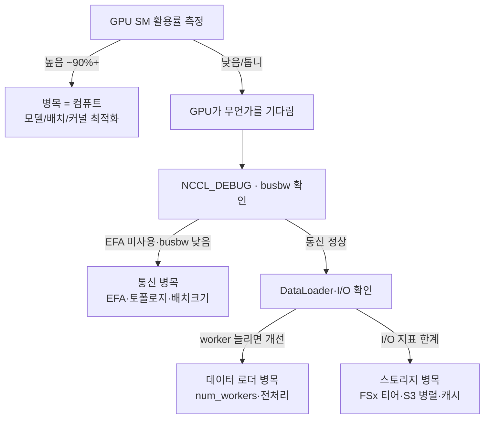

해당 포스팅은 현재 재직중인 회사에 관련이 없고, 개인 역량 개발을 위한 스터디 자료로 활용할 예정입니다.

앞의 세 편에서 분산 학습의 두 인프라 병목을 다뤘다. [네트워크(EFA)](https://ddii.dev/aws/efa-hands-on/)로 노드 간 통신을 빠르게 하고 [스토리지(FSx/EFS/S3)](https://ddii.dev/aws/distributed-training-storage/)로 데이터 공급을 풀었다. 그런데 막상 학습을 돌리면 이런 상황을 마주한다.

**"GPU를 여러 장 붙였는데 왜 기대만큼 안 빨라지지?"**

분산 학습에서 성능이 안 나오는 이유는 대부분 **한 곳의 병목**이다. 문제는 그 한 곳이 컴퓨트(GPU)인지 통신(네트워크·NCCL)인지 데이터(스토리지·로더)인지 눈에 잘 안 보인다는 것. 이 글에서는 그 범인을 가려내는 관측·프로파일링 방법을 다룬다.

<!--truncate-->

## 분산 학습의 3대 병목 후보

멀티노드 학습 한 스텝은 크게 세 단계로 나뉜다.

1. **데이터 공급** - 스토리지에서 배치를 읽고(I/O), CPU에서 전처리·증강해 GPU로 올린다.
2. **컴퓨트** - GPU가 forward/backward 연산을 한다.
3. **통신** - 그래디언트를 노드 간에 동기화한다(all-reduce 등).

이 셋은 잘 돌아갈 때는 서로 겹쳐서(overlap) 진행된다. 데이터 로더가 다음 배치를 준비하는 사이 GPU가 계산하고 계산이 끝나면 통신이 백그라운드로 돈다. 그런데 어느 하나가 느리면 나머지가 그걸 기다리느라 GPU가 유휴 상태가 된다. **결국 "GPU 활용률이 낮다"가 거의 모든 병목의 공통 증상**이다.

## 1순위 지표 - GPU 활용률

진단은 항상 GPU부터 본다. GPU가 100%에 가깝게 일하면 병목은 컴퓨트 자체이고(모델·배치·커널 최적화 영역), GPU가 유휴 상태면 범인은 **데이터 아니면 통신**이다.

* `nvidia-smi` - 가장 빠른 확인. `utilization.gpu`, 메모리 사용량.
* `nvidia-smi dmon` / `dcgmi dmon` - 시계열로 SM 활용률, 메모리 대역폭, NVLink/PCIe 트래픽, 전력을 본다. DCGM(Data Center GPU Manager)이 분산 환경의 표준 도구다.
* `dcgm-exporter` - 위 두 개가 노드에 붙어 그때그때 보는 **단발 진단**이라면, `dcgm-exporter`는 DCGM 지표를 Prometheus로 내보내 Grafana에 시계열로 쌓는 **지속·전체(fleet) 모니터링**이다. 노드가 수십·수백 대면 SSH로 하나씩 `dcgmi`를 보기 어렵다. dcgm-exporter를 각 노드(또는 Kubernetes DaemonSet)로 띄워 두면 모든 GPU의 SM active·메모리·전력·XID 에러를 한 대시보드에서 보고 스트래글러(유독 느린 노드)를 한눈에 찾을 수 있다. 학습 중 GPU 활용률이 언제 떨어졌는지 사후에 되짚을 때도 유용하다.
* 핵심 질문: **GPU SM 활용률이 꾸준히 높은가, 아니면 주기적으로 0으로 떨어지는가?** 톱니 모양으로 떨어지면 매 스텝 뭔가를 기다린다는 신호다.

> **`nvidia-smi`의** **`utilization.gpu`는 "지난 구간에 커널이 하나라도 돈 시간 비율"일 뿐 진짜 계산 효율이 아니다.** 작은 커널이 띄엄띄엄 돌거나 통신을 기다리며 spin만 해도 100%로 찍힌다. 그래서 한 단계 더 들어가려면 다음을 봐야한다.
>
> * **SM active / Tensor active** (DCGM 필드 `DCGM_FI_PROF_SM_ACTIVE`, `DCGM_FI_PROF_PIPE_TENSOR_ACTIVE`): SM과 텐서코어가 실제로 얼마나 바쁜지.
>
> * **MFU(Model FLOPs Utilization)**: 실측 처리량(초당 토큰 수)으로 계산한 실효 FLOPs를 GPU 이론 FLOPs로 나눈 값. 대형 LLM 학습에서 40~50%면 양호한 편이다. `utilization.gpu`가 100%여도 MFU가 20%면 어딘가에서 새고 있다는 뜻이다.

> 실측 예시: 아래 [데이터 병목 재현](#직접-재현--데이터-병목일-때만-worker가-약이다)에서 `dcgmi dmon`으로 GPU 활용률과 SM active를 초 단위로 찍어봤다. 데이터 공급이 밀리면 GPU 활용률이 0 근처까지 떨어졌다가 worker를 늘리면 다시 올라오는데, 그 변화가 초 단위로 그대로 드러난다.

> **멀티노드에선 한 rank만 보면 안 된다.** all-reduce는 가장 느린 노드에 맞춰지므로(동기 지점), 한 GPU·한 노드만 느려도(이른바 **스트래글러**) 전체가 그 속도로 끌려간다. 모든 rank의 SM 활용률·스텝 시간을 나란히 놓고 **유독 느린 노드가 있는지** 봐야 한다. 스트래글러의 원인은 특정 노드의 열 스로틀링, 불량 NIC, cross-AZ 배치, 디스크 지연 등 다양하다.

### dcgm-exporter + Grafana로 실제 지표 보기

앞서 말한 지표들을 실제로 대시보드에 올려봤다. 단일 T4 노드에 dcgm-exporter → Prometheus → Grafana를 Docker로 띄우고, resnet18(fp32) 학습을 돌리며 추천 메트릭을 관찰한 화면이다. (dcgm-exporter 기본 카운터에는 꺼져 있는 프로파일링 지표 `DCGM_FI_PROF_*`를 커스텀 카운터 파일로 켜야 아래 패널들이 채워진다.)


이 한 장에서 확인할 수 있는 것:

* **GPU Util 100% ≠ 다 쓴 것.** 왼쪽 위 패널에서 GPU Util과 SM Active는 100%까지 올라가지만 **SM Occupancy는 60% 대에 그친다.** SM Occupancy는 SM에 실제로 올라간 스레드가 이론상 최대치의 몇 %인지를 나타내는데, 이게 60%면 GPU가 돌고는 있어도 계산 자원을 다 채우지는 못했다는 뜻이다. 앞에서 짚은 대로 `utilization.gpu`가 100%라고 해서 GPU를 다 쓴 게 아니다.
* **어떤 연산 파이프가 도는가.** FP32가 약 60%로 활동하고 **Tensor는 거의 0**이다. fp32로 학습하니 텐서코어를 안 쓰는 것 - mixed precision(AMP)으로 바꾸면 Tensor가 올라오고 FP32가 내려갈 자리다. 즉 텐서코어를 쓰고 있는지까지 지표로 판별된다.
* **열(Thermal) 스로틀링이 실제로 잡혔다.** 오른쪽 아래 스로틀링 패널에서 **Thermal Violation이 지속 부하 중 올라왔다.** T4가 열 한계에 걸려 클럭을 낮춘 것으로, 멀티노드였다면 이 노드가 스트래글러가 됐을 상황이다. Power Violation은 0이라 전력이 아니라 온도가 원인임도 구분된다.
* **에러는 깨끗하다.** XID·ECC 패널이 모두 0 - 하드웨어 이상은 없다는 뜻. 학습이 이유 없이 느려지거나 죽으면 여기부터 본다.

`dcgmi dmon`이 한 노드를 그때그때 들여다보는 도구라면, 이렇게 dcgm-exporter로 쌓아 두면 **여러 노드·긴 시간에 걸쳐** 위 지표를 한 화면에서 추적하고 스트래글러를 바로 짚어낼 수 있다.

#### 멀티 GPU·멀티 노드로 확장하기

위 실습은 단일 노드·단일 GPU였다. 규모가 커져도 원칙은 동일하다 - **exporter는 "노드당 1개"로 고정하고, 달라지는 건 배포 자동화와 수집·집계 방식이다.**

* **한 노드에 GPU가 여러 개**: 추가 설정이 거의 없다. dcgm-exporter는 노드의 모든 GPU를 자동으로 내보내고 각 시계열에 `gpu="0"`, `gpu="1"`, `UUID` 라벨을 붙인다. Grafana에서는 `by (gpu)`로 집계하거나 `$gpu` 템플릿 변수로 나눠 보면 된다. (MIG를 켜면 GPU instance 라벨이 더 붙는다.)
* **노드가 여러 대**: 노드마다 dcgm-exporter를 하나씩 띄우고, 중앙 Prometheus가 이들을 자동으로 찾아 수집하게 한다.
  * **Kubernetes(EKS)**: **NVIDIA GPU Operator**가 dcgm-exporter를 **DaemonSet**(GPU 노드당 1 파드)으로 배포하고, Prometheus는 `ServiceMonitor`로 전 노드를 자동 수집한다. 가장 표준적인 방식.
  * **비-K8s(ParallelCluster·Slurm·순수 EC2)**: 각 노드에 dcgm-exporter를 systemd 서비스나 컨테이너로 올리고, Prometheus는 static 타깃 대신 **`ec2_sd_config`(태그로 GPU 노드 자동 발견)** 로 수집한다. 오토스케일로 노드가 늘고 줄어도 자동 반영된다.
* **스트래글러 찾기**: dcgm-exporter의 `Hostname` 라벨(과 Prometheus의 `instance` 라벨)로 노드를 구분한다. 노드별 SM active를 나란히 비교하면 느린 노드가 드러난다.

  ```promql
  # 노드별 SM 활용률 - 유독 낮은 노드가 스트래글러
  min by (Hostname) (DCGM_FI_PROF_SM_ACTIVE)
  # 노드별 열 스로틀링 발생
  max by (Hostname) (rate(DCGM_FI_DEV_THERMAL_VIOLATION[1m]))
  ```

  Grafana 테이블·히트맵으로 노드별 정렬하면 한눈에 보인다.

* **규모 주의**: 수십~~수백 GPU에서는 이 데모의 2초 scrape가 과하다. 10~~15초로 늘리고, 저장이 단일 Prometheus 한계를 넘으면 **remote-write → Thanos/Mimir**, AWS라면 **AMP(Amazon Managed Prometheus) + AMG(Managed Grafana)** 로 수집·저장만 확장한다. exporter 구성은 그대로 둔다.

> EKS에서 GPU Operator로 DaemonSet을 띄워 멀티노드로 수집하는 실습은 5편(오케스트레이션)에서 다룬다.

## 2순위 - 통신인가 데이터인가 좁히기

GPU가 유휴 상태라면, 다음은 통신과 데이터 중 어느 쪽인지 확인한다.

### 통신(네트워크/NCCL) 의심

**NCCL**(NVIDIA Collective Communications Library)은 GPU들이 서로 데이터를 주고받게 해주는 통신 라이브러리다. 분산 학습에서는 매 스텝 각 GPU가 계산한 그래디언트를 하나로 합쳐 다시 나눠 갖는데(이 연산이 **all-reduce**), 이 통신을 NCCL이 담당한다. 이게 느리면 GPU가 통신을 기다리느라 유휴 상태가 된다.

통신이 병목인지 보는 방법은 이렇다.

* **경로 확인**: `NCCL_DEBUG=INFO`를 켜면 NCCL이 어떤 네트워크 경로로 통신하는지 로그로 찍힌다. AWS에서 빠른 경로는 EFA인데, 설정이 어긋나면 느린 TCP로 조용히 떨어진다([2편](https://ddii.dev/aws/efa-hands-on/)에서 다룬 함정). 로그에 `Selected provider is efa`가 보여야 정상이다.
* **대역폭 측정**: `nccl-tests`라는 공식 벤치마크의 `all_reduce_perf`로 통신 대역폭을 잰다. 여기서 나오는 **busbw**(bus bandwidth)는 하드웨어 실효 대역폭에 맞춰 보정한 값으로, 이 숫자가 기대치보다 낮으면 통신이 병목이다.
* **트래픽 확인**: EFA 네트워크 인터페이스의 카운터를 보면 실제 데이터가 EFA로 흐르는지 확인할 수 있다.
* **간단한 신호**: 배치 크기를 키워서 "계산 대비 통신 비중"을 줄였을 때 GPU 활용률이 오르면 통신이 병목이었을 가능성이 크다.

EFA가 실제로 얼마나 차이를 내는지는 [2편](https://ddii.dev/aws/efa-hands-on/)에서 이미 측정했다. `g6.12xlarge` 2노드(노드당 GPU 1개)에서 `all_reduce_perf` busbw를 비교하면 1 MB 메시지 기준 **EFA 2.37 GB/s vs TCP 0.77 GB/s로 약 3배**, 메시지가 커질수록 3\~4배까지 벌어졌다. NCCL이 EFA를 못 타고 TCP(`NET/Socket`)로 떨어지면 노드 간 통신이 3~4배 느려지고 이게 그대로 스텝 시간 병목이 된다. 그래서 진단은 `NCCL_DEBUG=INFO` 로그에서 `NET/OFI Selected provider is efa`가 뜨는지부터 확인한다.

한 가지 배경을 더 알아두면 진단이 쉬워진다. 학습 한 스텝은 크게 두 단계다. 먼저 각 GPU가 자기 데이터로 오차를 계산하고(역전파, backward), 그 결과인 그래디언트를 GPU끼리 합친다(통신). 이때 통신을 계산이 전부 끝난 뒤에 몰아서 하면 그동안 GPU가 유휴 상태가 된다. 그래서 학습 프레임워크는 **계산과 통신을 시간적으로 겹쳐(overlap)** 처리한다. 계산이 끝난 부분부터 통신을 백그라운드로 먼저 시작해, 남은 계산 시간 뒤로 통신을 숨기는 것이다.

PyTorch에서 이 역할을 하는 것이 **DDP**(DistributedDataParallel)다. DDP는 그래디언트를 하나씩 보내지 않고 여러 개를 묶음(**버킷**)으로 모아 한 번에 전송해 효율을 높인다. 이 겹치기가 깨지면 통신이 계산 뒤에 그대로 노출되어 GPU가 유휴 상태가 된다.

그래서 통신 병목이 의심되면 다음 설정도 함께 살펴본다(모두 PyTorch 옵션).

* **묶음 크기**(`bucket_cap_mb`): 앞서 말한 버킷을 얼마나 크게 잡을지 정한다. 너무 작으면 통신 횟수가 늘어 오버헤드가 커지고, 너무 크면 계산과 겹칠 여지가 줄어든다. 그 사이에서 균형을 맞춘다.
* **`gradient_as_bucket_view=True`**: 그래디언트를 버킷에 복사하지 않고 원본을 그대로 참조하게 하는 옵션. 불필요한 복사가 사라져 메모리와 시간을 아낀다.
* **FSDP / ZeRO**: 모델이 커서 GPU 한 장에 다 올라가지 않을 때, 모델을 여러 GPU에 나눠 싣는 방식이다. 대신 연산할 때마다 흩어진 조각을 다시 모으고 나누는 통신이 더해져, 일반 DDP보다 통신량이 많다. 큰 모델을 학습한다면 이 추가 통신 비용을 감안해야 한다.

### 데이터(스토리지+로더) 의심

데이터 쪽은 두 단계로 나눠 본다. **① 스토리지에서 읽는 I/O**와 **② CPU에서 디코딩·증강하는 전처리**다. 둘 중 하나라도 GPU 속도를 못 따라가면 GPU가 배치를 기다린다.

* **로더 대기 시간**: PyTorch `DataLoader`가 다음 배치를 얼마나 기다리게 하는지 본다. `num_workers`(데이터를 미리 읽어오는 병렬 프로세스 수)가 적거나 전처리가 무거우면 GPU가 배치를 기다리며 유휴 상태가 된다.
* **스토리지 I/O**: [3편](https://ddii.dev/aws/distributed-training-storage/)에서 쓴 방법 그대로 `fio`로 IOPS·지연·처리량을 잰다. 작은 파일 랜덤 읽기면 FSx, 대용량 순차 읽기면 S3가 유리하다. 3편에서 본 처방(`num_workers`와 **prefetch**[다음 배치 미리 읽기] 튜닝, **WebDataset**\[작은 파일을 tar로 묶어 순차 읽기], FSx 캐시 워밍)이 그대로 이 병목의 해법이다.
* **CPU 포화 확인**: 데이터 로더 워커는 CPU에서 이미지 디코딩·증강을 한다. `htop`으로 봤을 때 워커들이 CPU를 100% 물고 있으면, 스토리지가 아니라 **CPU 전처리가 병목**이다. 이땐 워커를 더 늘려도 소용없고(코어가 이미 꽉 참), 전처리를 GPU로 넘기거나(**DALI** 같은 GPU 디코딩 라이브러리) 증강을 가볍게 해야 한다.
* 신호: `num_workers`를 늘렸을 때 GPU 활용률이 오르면 데이터 로더 병목, I/O 지표가 한계면 스토리지 병목, CPU가 이미 포화면 전처리 병목이다.

#### 직접 재현 - 데이터 병목일 때만 worker가 약이다

단일 GPU 노드(`g4dn.xlarge`, T4 1장, vCPU 4개)에서 resnet18 학습 루프를 돌리며 `num_workers`를 바꿔 GPU 활용률과 스텝 처리량을 측정했다. 합성 이미지라 절대치보다 \*\*변화 방향(Pattern)\*\*이 핵심이다. 그런데 결과가 전처리 무게에 따라 정반대로 나타났다.

**케이스 A - 가벼운 전처리(Resize만).** GPU가 이미 계산으로 인한 사용율이 높은 상태이다.

| num\_workers | 스텝 처리량      | GPU 활용률 |
| :----------- | :---------- | :------ |
| 0            | 5.78 step/s | 94%     |
| 2            | 5.42 step/s | 92%     |
| 4            | 5.15 step/s | 88%     |
| 8            | 4.57 step/s | 83%     |

워커를 늘려도 나아지지 않고 오히려 **느려졌다.** GPU가 이미 94%라 데이터가 병목이 아니었고 vCPU 4개짜리 노드에서 워커만 늘리니 프로세스 오버헤드가 붙은 것이다.

**케이스 B - 무거운 전처리(512 리사이즈 + RandomResizedCrop + ColorJitter + 회전 + 블러).** CPU 전처리가 GPU를 못 따라간다.

| num\_workers | 스텝 처리량      | GPU 활용률 |
| :----------- | :---------- | :------ |
| 0            | 1.12 step/s | **16%** |
| 1            | 1.03 step/s | 18%     |
| 2            | 1.74 step/s | 30%     |
| 3            | 1.84 step/s | **31%** |

여기서는 `num_workers=0`일 때 GPU 활용률이 **16%까지 떨어졌다.** 워커를 3개로 늘리자 GPU 활용률이 약 2배(31%), 처리량은 1.6배로 올랐다(vCPU 4개라 3\~4에서 상한).

**교훈: "worker를 늘리면 GPU가 빨라진다"는 데이터가 병목일 때만 맞다.** 그래서 순서가 중요하다. 먼저 GPU 활용률을 보고 낮을 때만(케이스 B) 데이터 로더를 손댄다. 이미 높으면(케이스 A) worker를 늘려봐야 헛수고이거나 역효과다.

`dcgmi dmon`으로 학습 중 GPU를 초 단위로 들여다보면 차이가 더 또렷하다. 케이스 B에서 워커를 0 → 3으로 바꿨을 때 GPU 활용률(GPUTL)과 SM active(SMACT)를 나란히 찍은 결과다.

```
# worker=0 (데이터 공급 부족) - GPU가 내내 유휴 상태다
#Entity   GPUTL   SMACT
GPU 0     0       0.000
GPU 0     0       0.000
GPU 0     0       0.000
GPU 0     0       0.000
...        (내내 0)

# worker=3 (워커가 공급) - GPU가 실제로 일한다
#Entity   GPUTL   SMACT
GPU 0     61      0.367
GPU 0     100     0.557
GPU 0     100     0.437
GPU 0     75      0.292
GPU 0     100     0.576
...        (0~100 사이로 바쁘게 오르내림)
```

worker=0에서는 GPUTL·SMACT가 **거의 0에 머문다.** GPU가 데이터를 기다리며 유휴 상태로 있는 것이 초 단위로 그대로 보인다. worker=3에서는 SM active가 0.3\~0.6 구간에서 오르내리며 GPU가 실제로 계산한다. (참고로 SM active는 SM이 얼마나 바쁜지 나타내는 값이고, Tensor active는 fp32 학습이라 거의 0으로 이 워크로드에선 의미가 없다.)

PyTorch Profiler로도 같은 결론이 나온다. 케이스 B에서 `enumerate(DataLoader)` 대기가 스텝당 **890ms(`num_workers=0`) → 451ms(`num_workers=3`)** 로 절반이 됐다. `key_averages()` 상위에 `enumerate(DataLoader)`가 CPU 시간의 85\~93%를 차지하면 데이터가 범인이라는 명확한 신호다.

같은 상황을 `nsys`로 떠서 GUI 타임라인으로 보면 병목이 시각적으로 드러난다. 아래는 heavy-aug + `num_workers=2`로 20초 프로파일한 화면이다(`nsys profile -t cuda,cudnn,cublas,osrt ...`).


읽는 법:

* **`CUDA HW (Tesla T4)`** **행**: 실제 GPU 커널·메모리 복사가 도는 구간이다. 연속적으로 꽉 차 있지 않고 **띄엄띄엄 몰려 있다** - 커널과 커널 사이의 빈 곳이 GPU가 다음 배치를 기다리며 유휴 상태로 있는 시간이다.
* **`pt_data_worker`** **프로세스들**(`num_workers=2`라 워커 프로세스가 2개, 각자 하위 스레드): CPU에서 이미지 디코딩·증강으로 **쉬지 않고 바쁘다.** GPU는 유휴 상태인데 데이터 워커는 풀로 돌고 있다는 게 데이터 병목의 전형적인 양상이다.
* **메인·autograd 스레드의** **`pthread_cond_wait`/`sem_clockwait`** **블록**: 긴 대기 구간 = 워커가 배치를 채워주길 기다리는 시간.

즉 "GPU HW 행의 빈 갭 + 데이터 워커의 풀가동 + 대기 블록"이 겹쳐 보이면 데이터 파이프라인이 범인이다. 반대로 컴퓨트 바운드라면 CUDA HW 행이 갭 없이 꽉 차고 데이터 워커는 한가하다. nsys는 이렇게 **어느 구간이 서로 겹치고 어디서 갈라지는지**를 눈으로 짚게 해준다.

## 진단 워크플로 (한 장 요약)



## 프로파일링 도구 - 한 단계 깊이

지표로 방향을 좁혔으면, 프로파일러로 타임라인을 본다.

* **PyTorch Profiler** - 스텝을 연산/통신/데이터 로딩 구간으로 쪼개 보여준다. overlap이 깨진 지점이 한눈에 보인다. `schedule(wait=1, warmup=1, active=3)`으로 **워밍업 스텝을 제외**하고 몇 스텝만 잡는 게 핵심이다(첫 스텝은 CUDA 컨텍스트·cuDNN autotune·컴파일 때문에 느려 대표성이 없다). `key_averages()` 표에서 항목별 비중을 보면 어디에 시간이 쏠렸는지 드러난다 - `enumerate(DataLoader)`가 크면 데이터, `aten::`(PyTorch 연산 커널)이 크면 컴퓨트, `nccl`(통신)이 크면 통신 병목이다.
* **NVIDIA Nsight Systems(`nsys`)** - CUDA 커널, NCCL 통신, CPU 활동을 한 타임라인에 겹쳐 본다. GPU 갭이 통신 때문인지 데이터 때문인지 시각적으로 판별.
* **NCCL Tests** - 통신 대역폭의 상한을 따로 떼어 측정.

> 어떤 도구로 재든 **워밍업 스텝(보통 첫 몇 스텝)은 빼고** 측정한다. 지연 로딩·오토튠·JIT 컴파일이 첫 스텝에 몰려 있어, 이걸 포함하면 병목을 엉뚱한 곳으로 오인하기 쉽다.

## 정리 - 병목별로 재현하고 확인하기

추측하지 말고 병목을 **일부러 만들어** 지표가 어떻게 반응하는지 보는 게 가장 확실하다. 이 글에서 세 병목을 그렇게 확인했다.

| 병목               | 이 글에서 확인한 방법                                                               | 핵심 결과                                              |
| :--------------- | :------------------------------------------------------------------------- | :------------------------------------------------- |
| **데이터**(로더·전처리)  | 단일 T4에서 `num_workers` 스윕(케이스 A/B) + `dcgmi dmon` + PyTorch Profiler + nsys | 무거운 전처리에서 GPU 16% → 31%, DataLoader 대기 890 → 451ms |
| **컴퓨트**          | 케이스 A(가벼운 전처리)에서 GPU가 이미 94%                                               | worker를 늘려도 개선 없음 → 데이터가 병목이 아님                    |
| **통신**(NCCL/EFA) | [2편](https://ddii.dev/aws/efa-hands-on/)의 `all_reduce_perf` 실측 참조          | EFA 2.37 vs TCP 0.77 GB/s (\~3배)                   |

직접 더 해보면 좋은 확장은 두 가지다. ① **baseline·데이터·통신을 한 리그에서 나란히** 돌려 스텝 시간을 대조하는 통합 실험, ② **멀티노드 스트래글러**를 실제로 재현해 노드별 지표가 갈리는 모습 확인. 통신 병목을 직접 만들어보려면 NCCL을 TCP로 강등하면 된다(`NCCL_NET=Socket` + `NCCL_SOCKET_IFNAME=<eth>`, 또는 `NCCL_NET_PLUGIN=none`).

## 마무리

분산 학습 튜닝의 첫걸음은 어디가 느린지 추측하지 말고 직접 측정하는 것이다. GPU 활용률에서 시작해 통신과 데이터로 좁혀가는 이 워크플로 정도만 이해해도 앞선 글들에서 사용한 인프라(EFA·FSx)가 제대로 활용을 잘 되고 있는지 알 수 있다. 

시리즈 흐름:

1. [1편: InfiniBand vs AWS EFA](https://ddii.dev/aws/infiniband-vs-efa/) - 개념
2. [2편: AWS EFA 직접 써보기](https://ddii.dev/aws/efa-hands-on/) - 네트워크 핸즈온
3. [3편: 분산 학습을 위한 AWS 공유 스토리지](https://ddii.dev/aws/distributed-training-storage/) - 스토리지
4. **4편: 분산 학습 병목 찾기** (이 글) - 관측·프로파일링
5. 5편(예정): 분산 학습 클러스터 오케스트레이션 - HyperPod / ParallelCluster / EKS

## 참고 문서

* [NVIDIA DCGM 문서](https://docs.nvidia.com/datacenter/dcgm/latest/)
* [dcgm-exporter (GitHub)](https://github.com/NVIDIA/dcgm-exporter)
* [PyTorch Profiler](https://pytorch.org/tutorials/recipes/recipes/profiler_recipe.html)
* [NVIDIA Nsight Systems](https://docs.nvidia.com/nsight-systems/)
* [NCCL 환경 변수](https://docs.nvidia.com/deeplearning/nccl/user-guide/docs/env.html)
* [NCCL Tests (GitHub)](https://github.com/NVIDIA/nccl-tests)
* [Monitor an Elastic Fabric Adapter - AWS](https://docs.aws.amazon.com/AWSEC2/latest/UserGuide/efa-working-monitor.html)
