> 해당 포스팅은 현재 재직중인 회사에 관련이 없고, 개인 역량 개발을 위한 스터디 자료로 활용할 예정입니다.

# Transformer 완벽 이해 가이드


> 인터랙티브 실습: [Transformer Explainer (Georgia Tech)](https://poloclub.github.io/transformer-explainer/)
> 참고: *Hands-On LLM Serving and Optimization* (O'Reilly 2026)
> GPT-2 (small, 124M params) 기준

이 글은 두 파트로 구성된다. Part 1에서는 GPT-2를 기준으로 Transformer의 동작 원리를 하나의 예시 문장("The cat sat on the")이 입력부터 다음 단어 예측까지 거치는 전체 경로를 따라가며 설명한다. Embedding, Self-Attention, MLP, Output 각 단계에서 데이터가 어떤 형태로 변환되는지를 코드와 함께 추적한다. Part 2에서는 학습된 모델을 실제로 서빙할 때의 문제 — Auto-Regressive 생성의 비효율, KV Cache 메모리 관리, Prefill/Decode 병목 — 를 다루고, Continuous Batching, PagedAttention, Quantization, Speculative Decoding 등 주요 최적화 기법과 vLLM/TensorRT-LLM 같은 서빙 프레임워크를 정리한다.

<!--truncate-->

---

## 용어 사전 (Glossary)

이 문서에서 나오는 머신러닝/딥러닝 용어를 먼저 정리해둠. 모르는 게 나올 때마다 여기로 돌아와서 확인하면 된다.

### 기본 ML 용어

| 용어 | 설명 |
|------|------|
| <a id="term-parameter"></a>**파라미터 (Parameter)** | 모델이 학습하는 숫자들. 가중치(weight)와 편향(bias)을 합쳐서 파라미터라 부름. GPT-2는 1억 2400만 개의 파라미터를 가짐. |
| <a id="term-weight"></a>**가중치 (Weight)** | 입력에 곱해지는 학습 가능한 숫자. 행렬(Matrix) 형태로 존재하며, 학습 = 이 숫자들을 최적값으로 조정하는 과정. |
| <a id="term-bias"></a>**편향 (Bias)** | 가중치 곱셈 결과에 더해지는 값. 선형 변환에서 절편 역할. |
| <a id="term-forward-pass"></a>**Forward Pass** | 입력 → 모델 → 출력 방향으로 한 번 계산하는 것. 추론(inference) 시에는 이것만 수행. |
| <a id="term-backward-pass-역전파"></a>**Backward Pass (역전파)** | 출력의 오차를 역방향으로 전파해서 각 파라미터의 기울기를 계산하는 것. 학습(training)에만 필요. |
| <a id="term-gradient"></a>**기울기 (Gradient)** | 파라미터를 어느 방향으로 얼마나 바꿔야 오차가 줄어드는지 알려주는 값. 역전파로 계산된다. |
| <a id="term-loss-손실함수"></a>**Loss (손실함수)** | 모델 예측과 정답 간의 차이를 수치화한 것. 학습 목표 = loss를 최소화하는 것. |
| <a id="term-epoch"></a>**Epoch** | 전체 학습 데이터를 한 번 다 본 것 = 1 epoch. 보통 수십~수백 epoch 반복. |
| <a id="term-batch"></a>**Batch** | 한 번의 forward/backward에 묶어서 처리하는 데이터 단위. batch size=32면 32개 샘플을 한번에 처리. |
| <a id="term-inference-추론"></a>**Inference (추론)** | 학습 완료된 모델로 새 입력에 대한 예측을 생성하는 것. Forward Pass만 수행. |
| <a id="term-fine-tuning"></a>**Fine-tuning** | 사전학습된 모델을 특정 태스크에 맞게 추가 학습하는 것. 전체 파라미터 or 일부만 업데이트. |

### 신경망 구조 관련

| 용어 | 설명 |
|------|------|
| <a id="term-recurrent-neural-network"></a>**RNN (Recurrent Neural Network)** | 시퀀스를 순서대로 처리하는 신경망. 이전 시점의 출력을 다음 시점 입력에 연결(순환). 단점: 순차 처리라 느림, 긴 시퀀스에서 앞 정보 잊어버림(기울기 소실). Transformer 이전의 NLP 표준. |
| <a id="term-long-short-term-memory"></a>**LSTM (Long Short-Term Memory)** | RNN의 기울기 소실 문제를 개선한 구조. "게이트" 메커니즘으로 중요한 정보를 선택적으로 유지/삭제. 그래도 순차 처리라 병렬화 불가. |
| <a id="term-convolutional-neural-network"></a>**CNN (Convolutional Neural Network)** | 이미지 처리에 주로 쓰이는 신경망. 필터(커널)를 슬라이딩하면서 지역적 패턴을 포착. NLP에서도 쓰이긴 했으나 장거리 의존성 포착에 한계. |
| <a id="term-encoder"></a>**Encoder** | 입력 시퀀스를 고정 길이 벡터(또는 시퀀스)로 압축/인코딩하는 모듈. BERT가 대표적 Encoder 모델. 양방향(bidirectional) — 미래 토큰도 참조 가능. |
| <a id="term-decoder"></a>**Decoder** | 인코딩된 정보를 바탕으로 출력 시퀀스를 생성하는 모듈. GPT가 대표적 Decoder-only 모델. 단방향(causal) — 이전 토큰만 참조 가능. |
| <a id="term-encoder-decoder"></a>**Encoder-Decoder** | 입력을 Encoder로 이해하고, Decoder로 출력을 생성하는 구조. 번역(T5), 요약에 적합. |
| <a id="term-ffn"></a>**Feed-Forward Network (FFN)** | 입력→은닉층→출력으로 한 방향으로만 흐르는 기본 신경망. MLP(Multi-Layer Perceptron)와 동의어. |
| <a id="term-activation-function-활성화-함수"></a>**Activation Function (활성화 함수)** | 선형 변환 후 적용하는 비선형 함수. 이게 없으면 층을 여러 개 쌓아도 하나의 선형 변환과 동일 → 표현력 없다. 예: ReLU, GELU, Sigmoid. |

### Transformer 핵심 용어

| 용어 | 설명 |
|------|------|
| <a id="term-token"></a>**Token** | 모델이 처리하는 텍스트의 최소 단위. 단어 또는 단어의 일부(서브워드). "hello" = 1토큰, "unhappiness" = "un"+"happiness" = 2토큰일 수 있다. |
| <a id="term-embedding"></a>**Embedding** | 이산적인 토큰(정수 ID)을 연속적인 벡터(실수 배열)로 변환하는 것. 모델이 처리 가능한 형태. |
| <a id="term-positional-encoding"></a>**Positional Encoding** | 토큰의 순서 정보를 벡터로 표현한 것. Transformer는 순서를 자체적으로 모르기 때문에 위치 정보를 별도로 주입. |
| <a id="term-self-attention"></a>**Self-Attention** | 같은 시퀀스 내 토큰끼리 서로의 관련성을 계산하는 메커니즘. "이 토큰을 이해하려면 다른 어떤 토큰을 봐야 하나?"를 결정. |
| <a id="term-multi-head-attention"></a>**Multi-Head Attention** | Self-Attention을 여러 개(Head)로 나눠서 병렬 수행. 각 Head가 다른 유형의 관계를 학습. |
| <a id="term-q"></a>**Query (Q)** | Attention에서 "나는 어떤 정보가 필요한가"를 나타내는 벡터. |
| <a id="term-k"></a>**Key (K)** | Attention에서 "나는 어떤 정보를 제공하는가"를 나타내는 벡터. Q와 K의 내적 = 유사도. |
| <a id="term-v"></a>**Value (V)** | Attention에서 실제 전달되는 정보 벡터. 유사도가 높은 토큰의 V가 많이 가져와진다. |
| <a id="term-attention-score"></a>**Attention Score** | Q와 K의 내적 결과. 높을수록 두 토큰이 서로 관련있음을 의미. |
| <a id="term-causal-mask"></a>**Causal Mask** | 미래 위치를 -∞로 설정해서 현재 토큰이 미래 토큰을 볼 수 없게 하는 마스크. GPT 계열 모델에서 사용. |
| <a id="term-residual-connection"></a>**Residual Connection** | 변환의 출력에 원래 입력을 더하는 구조 (출력 = x + F(x)). 기울기 소실 방지, 깊은 네트워크 학습 가능. |
| <a id="term-layer-normalization"></a>**Layer Normalization** | 벡터의 평균=0, 분산=1로 정규화. 학습 안정화 목적. |
| <a id="term-softmax"></a>**Softmax** | 임의의 실수 배열을 확률분포(합=1, 각 값 0~1)로 변환하는 함수. `softmax(x_i) = exp(x_i) / Σ exp(x_j)`. |
| <a id="term-logits"></a>**Logits** | Softmax 적용 전의 원시 점수. 아직 확률이 아님 (음수 가능, 합≠1). |
| <a id="term-temperature"></a>**Temperature** | Logits를 나누는 값. 낮으면 확정적, 높으면 다양한 출력. |
| <a id="term-top-k-sampling"></a>**Top-k Sampling** | 확률 상위 k개 토큰만 후보로 남기고 나머지 제거 후 샘플링. |
| <a id="term-nucleus"></a>**Top-p (Nucleus) Sampling** | 확률을 높은 순으로 누적해서 합이 p를 넘는 최소 집합에서 샘플링. 상황 적응적. |
| <a id="term-dropout"></a>**Dropout** | 학습 시 뉴런을 랜덤으로 비활성화하여 과적합 방지. 추론 시에는 비활성화. |
| <a id="term-gelu"></a>**GELU** | 활성화 함수의 한 종류. `GELU(x) = x × Φ(x)`. ReLU보다 부드럽고 NLP에서 성능 좋다. |
| <a id="term-byte-pair-encoding"></a>**BPE (Byte Pair Encoding)** | 토큰화 알고리즘. 빈번한 문자 쌍을 반복적으로 병합하여 어휘를 구축. GPT 계열에서 사용. |

### LLM Serving 용어 (Part 2)

| 용어 | 설명 |
|------|------|
| <a id="term-serving-서빙"></a>**Serving (서빙)** | 학습 완료된 모델을 배포하여 실시간 요청에 대한 예측을 제공하는 것. |
| <a id="term-latency-지연"></a>**Latency (지연)** | 요청을 보낸 후 응답이 돌아올 때까지의 시간. 낮을수록 좋다. |
| <a id="term-throughput-처리량"></a>**Throughput (처리량)** | 단위 시간당 처리할 수 있는 요청/토큰 수. 높을수록 좋다. |
| <a id="term-time-to-first-token"></a>**TTFT (Time to First Token)** | 요청 후 첫 번째 토큰이 생성되기까지의 시간. 사용자 체감 속도에 중요. |
| <a id="term-time-per-output-token"></a>**TPOT (Time Per Output Token)** | 토큰 하나 생성에 걸리는 시간. 스트리밍 속도 결정. |
| <a id="term-prefill"></a>**Prefill** | 입력 프롬프트 전체를 한 번에 처리하는 단계. GPU 연산 집약적. KV Cache를 초기 생성. |
| <a id="term-decode"></a>**Decode** | 토큰을 하나씩 순차 생성하는 단계. GPU 메모리 대역폭 병목. |
| <a id="term-kv-cache"></a>**KV Cache** | 이전 토큰의 Key, Value 벡터를 저장해둔 캐시. 매 스텝마다 재계산하지 않기 위해 필수. |
| <a id="term-auto-regressive"></a>**Auto-Regressive** | 이전 출력을 다음 입력으로 사용하는 생성 방식. LLM은 토큰을 하나씩 auto-regressive하게 생성. |
| <a id="term-continuous-batching"></a>**Continuous Batching** | 완료된 요청의 슬롯에 즉시 새 요청을 투입하는 배치 전략. GPU 활용률 극대화. |
| <a id="term-quantization-양자화"></a>**Quantization (양자화)** | 모델 가중치의 정밀도를 줄이는 것 (FP16→INT8→INT4). 크기↓ 속도↑ 품질 약간↓. |
| <a id="term-flashattention"></a>**FlashAttention** | Attention 연산을 블록 단위로 GPU SRAM에서 처리하여 메모리 O(N²)→O(N)으로 줄이는 기법. |
| <a id="term-pagedattention"></a>**PagedAttention** | KV Cache를 OS 가상 메모리처럼 페이지 단위로 관리하여 메모리 단편화를 해결하는 기법 (vLLM). |
| <a id="term-speculative-decoding"></a>**Speculative Decoding** | 작은 모델이 빠르게 여러 토큰을 추측 → 큰 모델이 한번에 검증. 품질 유지하면서 2-3배 속도↑. |
| <a id="term-tp"></a>**Tensor Parallelism (TP)** | 하나의 레이어를 여러 GPU에 나눠서 병렬 연산. 하나의 큰 행렬곱을 분할. |
| <a id="term-pp"></a>**Pipeline Parallelism (PP)** | 모델의 레이어(블록)를 여러 GPU에 순차 배치. GPU A가 Block 1-6, GPU B가 Block 7-12 담당. |
| <a id="term-vllm"></a>**vLLM** | UC Berkeley에서 개발한 LLM 서빙 프레임워크. PagedAttention + Continuous Batching 자동 적용. |
| <a id="term-tensorrt-llm"></a>**TensorRT-LLM** | NVIDIA의 LLM 최적화 서빙 프레임워크. NVIDIA GPU에서 최대 성능. |
| <a id="term-compute-bound"></a>**Compute-bound** | GPU 연산 유닛이 병목인 상태. 행렬곱이 많은 Prefill 단계에서 발생. |
| <a id="term-memory-bound"></a>**Memory-bound** | GPU 메모리 대역폭이 병목인 상태. 작은 연산을 반복하는 Decode 단계에서 발생. |
| <a id="term-grouped-query-attention"></a>**GQA (Grouped Query Attention)** | K,V Head 수를 Q보다 줄여서 KV Cache 크기를 절감하는 기법. Llama 2/3에서 사용. |
| <a id="term-rotary-position-embedding"></a>**RoPE (Rotary Position Embedding)** | 상대적 위치를 회전 행렬로 인코딩하는 방식. 긴 시퀀스에 유리. Llama, Qwen 등에서 사용. |
| <a id="term-swiglu"></a>**SwiGLU** | GELU의 변형 활성화 함수. 게이팅 메커니즘 추가. 최신 LLM(Llama 등)에서 MLP에 사용. |
| <a id="term-rmsnorm"></a>**RMSNorm** | Layer Norm의 간소화 버전. 평균 빼기 없이 RMS(제곱평균제곱근)로만 정규화. 더 빠름. |

### 수학 기호/연산

| 기호 | 의미 |
|------|------|
| `×` 또는 `·` (행렬곱) | 행렬 A(m×n)과 B(n×p)를 곱해서 C(m×p) 생성. 신경망의 핵심 연산. |
| `^T` (전치) | 행렬의 행과 열을 뒤바꿈. (m×n) → (n×m). |
| `√` (제곱근) | Attention에서 √d_k로 스케일링할 때 사용. |
| `Σ` (합산) | 가중합(weighted sum) 계산 시 사용. |
| `exp()` | 지수함수. Softmax 계산에 사용. |
| `element-wise` | 같은 위치 원소끼리 연산. 벡터 [1,2,3] + [4,5,6] = [5,7,9]. |
| `dot product (내적)` | 두 벡터의 대응 원소를 곱해서 합산. 유사도 측정에 사용. [1,2]·[3,4] = 1×3+2×4 = 11. |
| `dim` 또는 `d` | 차원(dimension). 벡터의 원소 수. 768d = 768개의 숫자로 구성된 벡터. |
| `seq_len` | 시퀀스 길이. 입력 토큰의 개수. |

---

# Part 1: Transformer 구조와 동작 원리

> **이 문서의 방식**: 하나의 예시 문장 `"The cat sat on the"` → 다음 단어 `"floor"` 예측 과정을  
> 처음부터 끝까지 추적하면서, 각 단계에서 이 문장이 **어떤 형태로 변환되는지** 보여줌.

---

## 1. Transformer 개요

Transformer = "다음에 올 단어를 예측하는 기계". 2017년에 나왔고, GPT-4, Claude, Gemini 등 현재 모든 LLM의 기반 구조다.

핵심 아이디어: 문장의 모든 단어가 다른 모든 단어를 **동시에** 참조하면서 맥락을 이해함 ([Self-Attention](#term-self-attention)).

우리의 목표: `"The cat sat on the"` 다음에 `"floor"`가 올 거라고 예측하는 과정을 단계별로 따라가보자.

---

## 2. 전체 아키텍처 — 문장이 거치는 전체 경로

Transformer는 크게 세 단계로 구성된다. 입력 텍스트를 숫자로 바꾸는 **Embedding**, 그 숫자들을 반복적으로 정제하는 **Transformer Block**, 그리고 최종 벡터에서 다음 단어를 고르는 **Output**이다. 각 단계는 독립적으로 이해할 수 있지만, 실제로는 파이프라인처럼 순서대로 흘러간다.

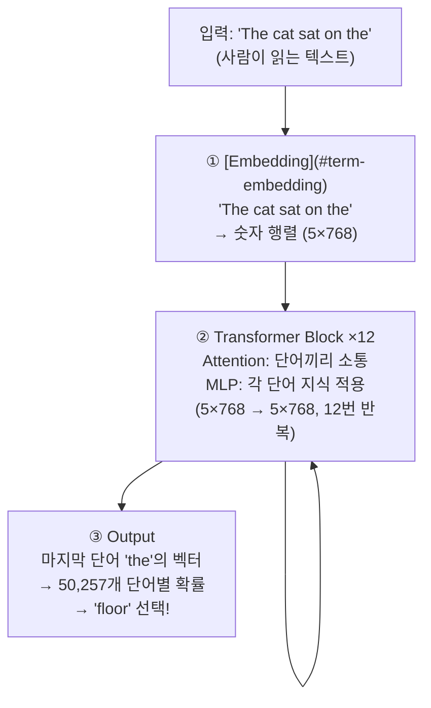

각 단계가 하는 일을 한 줄로 정리하면:

- **① Embedding**: 텍스트를 모델이 연산할 수 있는 숫자 행렬로 변환한다. "The"라는 문자열을 768개의 실수로 이루어진 벡터로 바꾸고, 여기에 "몇 번째 위치인지" 정보까지 더한다.
- **② Transformer Block (×12)**: 이 숫자 행렬을 12번 반복해서 다듬는다. 매 블록마다 두 가지 연산이 일어나는데, Self-Attention이 "다른 단어들을 참고해서 맥락을 모으고", MLP가 "모은 맥락에 학습된 지식을 적용"한다. 입력과 출력의 크기(5×768)는 바뀌지 않지만, 내용은 블록을 거칠수록 더 깊은 의미를 담게 된다.
- **③ Output**: 12번 처리된 마지막 토큰("the")의 768차원 벡터를 50,257개 어휘 각각에 대한 점수로 변환하고, 그 점수를 확률로 바꿔서 다음 단어를 선택한다.

여기서 핵심적인 설계 원리 하나: **모든 단계에서 행렬의 크기가 일정하다** (5×768 → 5×768 → ... → 5×768). 블록을 12번 반복해도 구조가 같으니 쌓기 쉽고, 깊이를 조절하는 것만으로 모델의 능력을 키울 수 있다. GPT-2 small은 12블록, GPT-3는 96블록이다.

**우리 문장의 여정 요약:**

```
"The cat sat on the"     ← 사람이 쓴 텍스트 (문자열)
    ↓ [Embedding]
[5 × 768] 숫자 행렬     ← 5개 토큰, 각각 768개 숫자로 표현
    ↓ [Block 1]
[5 × 768]               ← 같은 크기, 내용만 더 정교해짐
    ↓ [Block 2~11]
[5 × 768]               ← 12번 반복하면서 점점 깊은 이해
    ↓ [Block 12]
[5 × 768]               ← 최종 표현
    ↓ [Output]
"floor" (확률 0.076)       ← 다음 단어 예측 완료!
```

한 마디로: **텍스트 → 숫자 행렬 → 12번 다듬기 → 다음 단어 확률**. 이것이 전부다.

그리고 이 과정은 **한 토큰을 예측할 때마다 처음부터 끝까지 반복**된다. "floor"를 예측한 뒤에는 "The cat sat on the floor"를 다시 입력으로 넣어서 그 다음 토큰("." 등)을 예측한다. 이걸 Auto-Regressive 생성이라 부르고, Part 2에서 이 반복이 서빙 성능에 어떤 영향을 미치는지 다룬다.

---

## 3. [Embedding](#term-embedding) — "The cat sat on the"를 숫자로 바꾸기

**하는 일**: 텍스트 문자열을 모델이 처리할 수 있는 숫자 행렬로 변환.

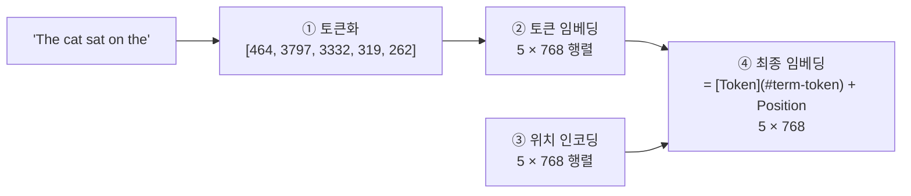

### 우리 문장 추적:

```
"The cat sat on the"

① 토큰화: 각 단어를 사전(50,257개)에서 찾아서 번호 매기기
   "The" → 464
   " cat" → 3797
   " sat" → 3332
   " on"  → 319
   " the" → 262
   결과: [464, 3797, 3332, 319, 262]  (5개 토큰)

② 토큰 임베딩: 각 번호로 768차원 벡터를 룩업 테이블에서 꺼냄
   464  → [0.12, -0.34, 0.56, ..., 0.78]  (768개 숫자)
   3797 → [-0.21, 0.67, 0.03, ..., -0.45]
   ...
   결과: 5 × 768 행렬

③ 위치 인코딩: 각 위치(0,1,2,3,4)에도 고유한 768차원 벡터가 있다.
   위치 0 → [0.01, 0.23, -0.05, ..., 0.11]
   위치 1 → [0.15, -0.07, 0.33, ..., 0.02]
   ...

④ 최종: Token벡터 + Position벡터 (같은 위치끼리 더하기)
   결과: 5 × 768 행렬 (의미 + 순서 정보가 합쳐진 형태)
```

### 왜 필요한가:

- 컴퓨터는 "The"라는 글자를 이해하지 못한다. 768개의 숫자로 표현해야 연산 가능.
- **위치 인코딩 없으면**: "The cat ate fish"와 "fish ate the cat"을 구분하지 못한다. 둘 다 같은 단어 집합이므로. 순서 정보가 있어야 어순의 의미를 파악함.

> 768개 숫자가 뭘 의미하냐면 — 그 단어의 "특성"을 768개 축으로 표현한 좌표라고 생각하면 된다. 비슷한 의미의 단어는 이 768차원 공간에서 가까이 위치함.


> **실제 확인 (GPT-2)**: "The" (ID=464)의 임베딩 벡터 처음 5개 값은 `[-0.069, -0.020, 0.064, -0.062, -0.114]`이고, 벡터 전체의 크기(norm)는 2.720이다. [Token](#term-token) [Embedding](#term-embedding) 행렬은 (50,257 × 768), Position [Embedding](#term-embedding) 행렬은 (1,024 × 768) 크기이다.

### "5 × 768" — 직관적으로 이해하기

컴퓨터는 "cat"이라는 글자를 이해하지 못한다. 그래서 각 단어를 **숫자 목록으로** 바꿔야 하는데, 숫자 1개로는 단어의 의미를 충분히 담을 수 없으므로 **768개를 한 세트로** 써서 하나의 단어를 표현하는 것이다.

```
"The"  → [0.12, -0.34, 0.56, 0.78, ..., 0.23]   ← 768개 숫자 한 세트
"cat"  → [0.45, 0.67, -0.89, 0.11, ..., -0.56]   ← 768개 숫자 한 세트
"sat"  → [-0.23, 0.91, 0.04, -0.67, ..., 0.34]   ← 768개 숫자 한 세트
"on"   → [0.78, -0.12, 0.33, 0.55, ..., 0.01]    ← 768개 숫자 한 세트
"the"  → [0.12, -0.34, 0.56, 0.78, ..., 0.23]    ← 768개 숫자 한 세트
```

**5개 단어 × 768개 숫자 = 3,840개 숫자**가 이 문장 전체를 표현함.

768개 숫자 각각이 "1번 = 명사 여부, 2번 = 긍정 여부" 같이 명확하게 정해진 것은 아니다. 학습 과정에서 자동으로 정해진 추상적인 특성이다. 비유하면 사람을 설명할 때 "키, 몸무게, 나이, 성격 점수..." 같은 수백 개 항목으로 프로필을 만드는 것과 비슷하다. 항목이 768개나 되므로 단어의 미묘한 의미 차이까지 구분할 수 있는 것이다.

핵심: **같은 의미의 단어는 768개 숫자 패턴이 비슷하고, 다른 의미면 패턴이 다르다.** "king"과 "queen"은 숫자 패턴이 비슷하고, "king"과 "banana"는 완전히 다르다.

---

## 4. Transformer Block — 이해력을 높이는 반복 구조

**하는 일**: [Embedding](#term-embedding) 결과(5×768)를 입력받아서, 같은 크기(5×768)의 더 정교한 표현을 출력. 이걸 12번 반복.

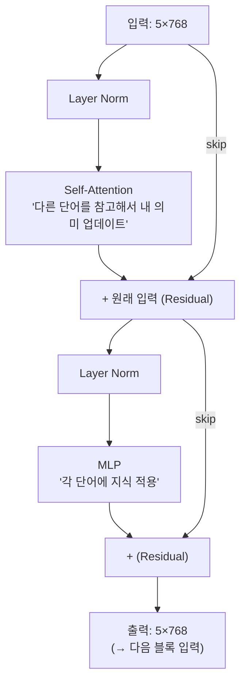

### 우리 문장 추적:

```
Block 1 입력: 5×768 (Embedding 결과)
  → Self-Attention: "the"(마지막)가 "cat"과 "sat"을 참고해서 자기 벡터 업데이트
  → MLP: 업데이트된 각 토큰에 저장된 지식 적용
Block 1 출력: 5×768 (같은 크기, 더 풍부한 의미)

Block 2 입력: Block 1 출력
  → 더 복잡한 관계 파악...
Block 2 출력: 5×768

... (반복) ...

Block 12 출력: 5×768 (12번의 처리를 거친 최종 표현)
```

### 왜 12번 반복하나:

- Block 1-4: "The는 관사", "cat은 명사", "sat은 동사" 같은 표면적 관계
- Block 5-8: "cat이 sat의 주어", "on the 뒤에 장소 관련 단어 올 확률 높음"
- Block 9-12: "The cat sat on the ___" → 문맥상 "floor, chair, bed" 같은 단어가 와야 함

한 번으로는 부족하다. 마치 책을 12번 정독하면 이해가 깊어지는 것처럼, 블록을 반복할수록 더 깊은 맥락을 포착.

---

## 5. [Self-Attention](#term-self-attention) — "다른 단어를 얼마나 참고할까?"

**하는 일**: 각 토큰이 다른 토큰들을 "참고"해서, 맥락 정보를 자기 벡터에 반영. Transformer의 핵심 메커니즘.

### 전체 흐름

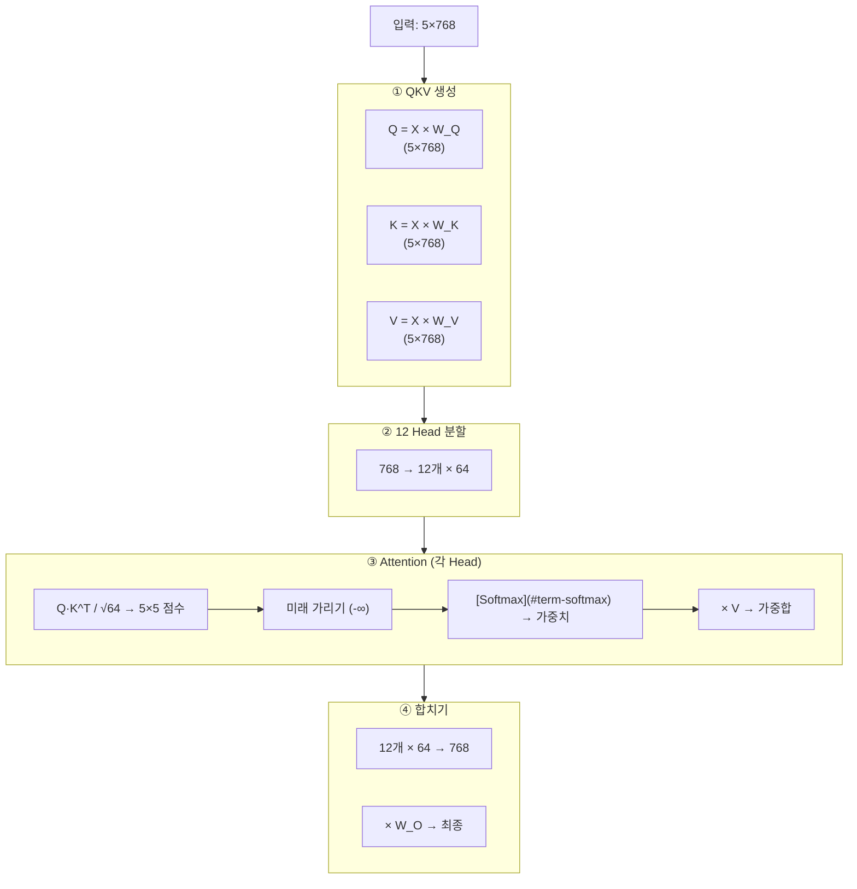

### 우리 문장 추적 (자세히):

**① QKV 생성** — 각 토큰을 3가지 역할로 변환

```
입력: 5×768 (5개 토큰의 벡터)

각 토큰에 대해:
  Q (Query) = "나는 어떤 정보가 필요해?" 
  K (Key)   = "나는 어떤 정보를 갖고 있어?"
  V (Value) = "내가 줄 수 있는 실제 내용"

Q = 입력 × W_Q (768×768 가중치) = 5×768
K = 입력 × W_K = 5×768
V = 입력 × W_V = 5×768
```

Q와 K를 비교해서 "누가 누구와 관련있나" 판단하고, 관련있는 놈의 V를 가져오는 구조다.

**② 12 Head 분할** — 다양한 관점으로 동시에 보기

```
Q (5×768) → 12개로 나눔 → 각 Head: Q (5×64)
K (5×768) → 12개로 나눔 → 각 Head: K (5×64)
V (5×768) → 12개로 나눔 → 각 Head: V (5×64)
```

왜 나누냐? 한 덩어리(768d)로 한 가지 관계만 포착하는 것보다, 12개로 나눠서 **12가지 다른 관계**를 동시에 포착하는 게 훨씬 강력. 
- Head 1: 주어-동사 관계 ("cat" ↔ "sat")
- Head 2: 위치 근접성 (바로 옆 단어)
- Head 3: 관사-명사 ("The" ↔ "cat")
- ...

**③ Attention 계산** (Head 하나 기준, 64d)

```
Q·K^T: 각 토큰 쌍의 "관련도" 점수 → 5×5 행렬

           The   cat   sat   on   the
    The  [ 1.2   -     -     -    -  ]
    cat  [ 0.8   1.5   -     -    -  ]
    sat  [ 0.3   0.9   1.1   -    -  ]
    on   [ 0.2   0.4   0.8   0.7  -  ]
    the  [ 0.4   1.3   0.9   0.5  0.6]  ← 마지막 "the"
           ↑      ↑
        이전 토큰들을 얼마나 볼지

÷ √64 (= 8): 값을 안정적인 범위로 조절

Mask: 미래 위치 → -∞ (빈 칸이 -∞임. 각 토큰은 자기보다 앞에 있는 것만 볼 수 있다)

Softmax: 각 행을 확률(합=1)로 변환
    the(마지막): [0.10, 0.35, 0.25, 0.12, 0.18]
                   The   cat   sat   on   the
    → "the"는 "cat"에 35%, "sat"에 25% 주목!

× V: 주목 비율에 따라 V를 가중합
    Output_the = 0.10×V_The + 0.35×V_cat + 0.25×V_sat + 0.12×V_on + 0.18×V_the
    → "the"의 새 벡터 = 문맥("cat sat on")이 섞인 표현
```

**핵심 직관**: 마지막 "the"는 "cat"에 가장 많이 주목함. 왜? "The cat sat on the ___"에서 빈칸에 올 단어를 예측하려면 **뭐가 앉아있었는지(cat)**가 가장 중요한 단서니까.

**④ 합치기**

```
12개 Head의 64d 출력 → 이어붙이기 → 768d
× W_O (768×768) → 최종 Attention 출력: 5×768
```

### 없으면 어떻게 되나:

[Self-Attention](#term-self-attention) 없이는 각 단어가 **다른 단어를 전혀 못 본채** 독립적으로 처리된다. "The cat sat on the ___"에서 "the" 혼자만의 정보로는 다음 단어를 예측할 수 없어. "sat"과 "cat"이라는 맥락을 가져와야 "floor"를 예측할 수 있다.

---

## 6. MLP — "수집된 맥락에 지식 적용"

**하는 일**: [Self-Attention](#term-self-attention)이 맥락을 모아줬으면, MLP는 그 맥락을 바탕으로 각 토큰의 표현을 변환. 모델의 "지식"이 저장된 곳.

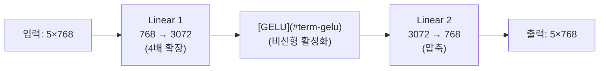

### 우리 문장 추적:

```
Attention 출력에서 마지막 "the"의 벡터: 768d
  (이미 "cat sat on" 맥락이 반영된 상태)

① Linear 1: 768d → 3072d (4배 확장)
   → 더 넓은 공간에서 다양한 패턴 검사
   → "앞에 'sat on the'가 있으면 장소 관련 단어 패턴 활성화"

② GELU: 유용한 패턴은 살리고, 관련 없는 건 약화
   → "장소 관련 뉴런: 활성화!"
   → "감정 관련 뉴런: 억제"

③ Linear 2: 3072d → 768d (압축)
   → 활성화된 "장소" 정보만 768d에 농축

결과: "the"의 벡터가 "다음에 장소 단어(floor, bed, rug...)가 올 것"이라는 정보를 갖게 된다.
```

### 왜 4배로 확장했다 줄이나:

768d 공간은 좁아. 거기선 복잡한 패턴 분리가 어려움. 3072d로 넓히면 "이건 장소", "이건 감정", "이건 시간" 같은 다양한 패턴을 명확히 분리할 수 있다. 분리한 다음에 유용한 것만 768d로 다시 압축.

### MLP에 "지식"이 저장됨:

- 전체 파라미터의 **46%**가 MLP에 있음 (Attention은 23%)
- "에펠탑은 파리에 있다", "cat은 floor 위에 앉는다" 같은 팩트가 MLP 가중치에 인코딩
- 연구에서 MLP의 특정 뉴런을 끄면 특정 사실을 잊어버린다는 걸 확인함

---

## 7. Output — "floor"를 골라내기

**하는 일**: 12개 Block을 거친 마지막 토큰("the")의 768d 벡터 → 50,257개 어휘에 대한 확률 → 다음 단어 결정.

```mermaid
graph LR
    Last["'the'의 최종 벡터<br/>(768d)"] --> Linear["Linear<br/>768 → 50,257"]
    Linear --> [Logits](#term-logits)["Logits<br/>(원시 점수)"]
    Logits --> Temp["÷ [Temperature](#term-temperature)"]
    Temp --> Soft["Softmax<br/>(확률로 변환)"]
    Soft --> Sample["Sampling<br/>(Top-k / [Top-p](#term-top-p))"]
    Sample --> Token["'floor' "]
```

### 우리 문장 추적:

```
Block 12 출력 중 마지막 토큰 "the"의 벡터: 768d
  (12번 처리되면서 "다음에 장소 단어가 온다"는 정보가 농축된 상태)

① Linear (768 → 50,257):
   768d 벡터를 50,257개 점수(logits)로 변환
   각 점수 = "이 단어가 다음에 올 가능성"
   
   "floor": 3.1
   "bed":   2.7
   "table": 2.2
   "cat":   0.5
   "happy": -1.2
   ...

② ÷ Temperature (T=1.0이면 변화 없음):
   T=0.5: 점수 차이 증폭 → 거의 "floor"만 선택
   T=2.0: 점수 차이 축소 → "floor", "table" 등도 가능

③ Softmax (점수 → 확률, 합=1):
   " floor":  0.076 (7.6%)   ← 1위
   " bed":    0.065 (6.5%)
   " couch":  0.054 (5.4%)
   " ground": 0.052 (5.2%)
   " edge":   0.048 (4.8%)
   ... 나머지 50,252개가 나머지 확률을 나눠가짐

④ Sampling:
   Top-k (k=50): 상위 50개만 남기고 나머지 제거
   Top-p (p=0.9): 누적 90%까지만 후보로
   → 최종 선택: " floor" (greedy라면 확률 1위 선택)
   
   실제 GPT-2 결과: "floor"가 1위다.
      모두 장소/표면 관련 단어라는 점이 핵심이다.
```

### [Temperature](#term-temperature)의 효과:

| T | "floor" 확률 | "bed" 확률 | 결과 |
|---|---|---|---|
| 0.3 | 0.89 | 0.07 | 거의 항상 "floor" |
| 1.0 | 0.23 | 0.15 | 적당히 다양 |
| 2.0 | 0.14 | 0.12 | 뭐가 나올지 모름 |

낮은 T = 확신에 찬 답변 (코드 생성에 좋음)  
높은 T = 다양한 시도 (창작에 좋음)

### 예측 후:

```
"The cat sat on the" + "floor" → "The cat sat on the floor"
→ 이 새 문장으로 다시 처음부터 (Embedding → Block ×12 → Output)
→ 다음 토큰 예측: "." (마침표)
→ 이런 식으로 반복 (Auto-Regressive Generation)
```

---

## 8. 보조 구성 요소

### [Layer Normalization](#term-layer-normalization)

```
각 토큰의 768d 벡터를 평균=0, 분산=1로 정규화
→ 12개 블록을 거치면서 값이 폭발/소실되는 걸 방지
```

Block이 12개나 쌓여있으면 값이 기하급수적으로 커지거나 0에 수렴할 수 있다. 매 단계마다 범위를 리셋해주는 역할.

### [Residual Connection](#term-residual-connection)

```
출력 = x + F(x)    (F = Attention 또는 MLP)
```

원래 입력을 변환 결과에 더함. 효과:
- 기울기가 "고속도로"를 타고 직통 전파 → 12블록이어도 학습 가능
- 변환이 별 도움 안 되면 F(x)≈0 학습 → 입력 그대로 통과 가능 (해를 끼치지 않음)

### [Dropout](#term-dropout) (학습 시만)

- 뉴런의 10%를 랜덤으로 비활성화 → 특정 뉴런에 과의존하는 것 방지
- 추론(우리가 모델 쓸 때)에는 꺼져있다.

---

## 9. Python 코드 실습

### 실습 1: 우리 문장 토큰화 확인

```python
from transformers import GPT2Tokenizer

tokenizer = GPT2Tokenizer.from_pretrained('gpt2')
text = "The cat sat on the"
tokens = tokenizer.encode(text)

print(f"입력: '{text}'")
print(f"토큰 수: {len(tokens)}")
for i, tid in enumerate(tokens):
    print(f"  위치{i}: ID {tid:>5} → '{tokenizer.decode([tid])}'")
# 출력:
# 위치0: ID   464 → 'The'
# 위치1: ID  3797 → ' cat'
# 위치2: ID  3332 → ' sat'
# 위치3: ID   319 → ' on'
# 위치4: ID   262 → ' the'
```

**실제 실행 결과:**
```
입력: The cat sat on the
토큰 수: 5
  ID    464 -> "The"
  ID   3797 -> " cat"
  ID   3332 -> " sat"
  ID    319 -> " on"
  ID    262 -> " the"
```

### 실습 2: [Embedding](#term-embedding) 벡터 확인

```python
from transformers import GPT2Model
import torch

model = GPT2Model.from_pretrained('gpt2')

print(f"Token Embedding 행렬: {model.wte.weight.shape}")  # (50257, 768)
print(f"Position Embedding 행렬: {model.wpe.weight.shape}")  # (1024, 768)

# "The" (ID=464)의 임베딩 벡터
the_vec = model.wte.weight[464]
print(f"'The'의 벡터 크기: {the_vec.shape}")  # (768,)
print(f"처음 5개 값: {the_vec[:5].tolist()}")
```

**실제 실행 결과:**
```
Token Embedding: torch.Size([50257, 768])
Position Embedding: torch.Size([1024, 768])
"The" (ID=464) 벡터 처음 5개: [-0.069, -0.020, 0.064, -0.062, -0.114]
벡터 norm: 2.720
```

### 실습 3: [Self-Attention](#term-self-attention) 직접 구현

```python
import torch, torch.nn.functional as F, math

# 우리 문장: 5개 토큰, 768차원, 12 Head
seq_len, d_model, n_heads = 5, 768, 12
d_head = d_model // n_heads  # 64

torch.manual_seed(42)
x = torch.randn(seq_len, d_model)  # 가상의 5×768 입력

# QKV 생성
W_Q = torch.randn(d_model, d_model) * 0.02
W_K = torch.randn(d_model, d_model) * 0.02
W_V = torch.randn(d_model, d_model) * 0.02
Q, K, V = x @ W_Q, x @ W_K, x @ W_V

# Multi-Head Split: (5, 768) → (12, 5, 64)
Q_h = Q.view(seq_len, n_heads, d_head).transpose(0, 1)
K_h = K.view(seq_len, n_heads, d_head).transpose(0, 1)
V_h = V.view(seq_len, n_heads, d_head).transpose(0, 1)

# Attention 계산
scores = Q_h @ K_h.transpose(-2, -1) / math.sqrt(d_head)
mask = torch.triu(torch.ones(seq_len, seq_len), diagonal=1).bool()
scores = scores.masked_fill(mask, float('-inf'))
weights = F.softmax(scores, dim=-1)
head_out = weights @ V_h

# Concat + Project
concat = head_out.transpose(0, 1).contiguous().view(seq_len, d_model)
W_O = torch.randn(d_model, d_model) * 0.02
output = concat @ W_O

print(f"입력: {x.shape} → 출력: {output.shape}")  # (5,768) → (5,768)
print(f"\nHead 0에서 'the'(마지막)의 Attention 가중치:")
print(f"  The:{weights[0,4,0]:.3f}  cat:{weights[0,4,1]:.3f}  "
      f"sat:{weights[0,4,2]:.3f}  on:{weights[0,4,3]:.3f}  the:{weights[0,4,4]:.3f}")
```

**실제 실행 결과:**
```
Head 0, 마지막 토큰(the)의 attention weights:
  [0.120 0.202 0.121 0.312 0.245]
  -> 합계: 1.000
```
"the"(마지막 토큰)가 "on"에 가장 주목(0.312), 다음 자기 자신(0.245), "cat"(0.202) 순이다.

### 실습 4: GPT-2로 실제 다음 단어 예측

```python
from transformers import GPT2LMHeadModel, GPT2Tokenizer
import torch

tokenizer = GPT2Tokenizer.from_pretrained('gpt2')
model = GPT2LMHeadModel.from_pretrained('gpt2').eval()

prompt = "The cat sat on the"
input_ids = tokenizer.encode(prompt, return_tensors='pt')

with torch.no_grad():
    logits = model(input_ids).logits[0, -1, :]  # 마지막 토큰의 50257 logits

probs = torch.softmax(logits, dim=0)
top5 = torch.topk(probs, 5)

print(f"'{prompt}' 다음 단어 Top-5:")
for p, tid in zip(top5.values, top5.indices):
    print(f"  '{tokenizer.decode([tid])}' → {p:.4f} ({p*100:.1f}%)")
```

**실제 실행 결과 (GPT-2):**
```
입력: "The cat sat on the"
다음 토큰 Top-5:
  1. " floor"  → 7.6%
  2. " bed"    → 6.5%
  3. " couch"  → 5.4%
  4. " ground" → 5.2%
  5. " edge"   → 4.8%
```
모두 장소/표면 관련 단어다. 모델이 "on the ___" 다음에 장소가 올 것이라는 패턴을 학습한 것이다.

### 실습 5: [Temperature](#term-temperature) 실험

```python
logits = torch.tensor([3.1, 2.7, 2.2, 0.5, -1.2])  # floor, bed, table, cat, happy
names = ["floor", "bed", "table", "cat", "happy"]

print("Temperature에 따른 확률 변화:")
for t in [0.3, 0.7, 1.0, 1.5, 2.0]:
    p = F.softmax(logits/t, dim=0)
    print(f"  T={t}: ", end="")
    for n, v in zip(names, p):
        bar = "█" * int(v*30)
        print(f"{n}={v:.3f}{bar}", end="  ")
    print()
```

**실제 실행 결과:**
```
T=0.3: the=0.987 | a=0.009 | my=0.003 | every=0.000 | our=0.000
T=1.0: the=0.644 | a=0.159 | my=0.118 | every=0.048 | our=0.032
T=2.0: the=0.413 | a=0.205 | my=0.177 | every=0.113 | our=0.092
```
T=0.3이면 "the" 98.7%로 거의 확정. T=2.0이면 "the" 41%까지 내려가고 나머지도 선택 가능해진다.

---

## 10. GPT-2 (small) 스펙 요약

| 항목 | 값 | 우리 문장에서 |
|------|-----|-------------|
| 어휘 크기 | 50,257 | "The"=464번, "cat"=3797번... |
| 임베딩 차원 | 768 | 각 토큰 = 768개 숫자 |
| Block 수 | 12 | 12번 처리 반복 |
| Head 수 | 12 / block | 12가지 관점으로 동시에 관계 파악 |
| Head 차원 | 64 | 768 ÷ 12 = 64 |
| MLP 확장 | 3072 | 768 × 4 = 3072 |
| 최대 길이 | 1024 | 한번에 최대 1024 토큰 처리 |
| 파라미터 | 124M | 1억 2400만 개의 학습된 숫자 |

### 우리 문장의 전체 여정 (최종 요약)

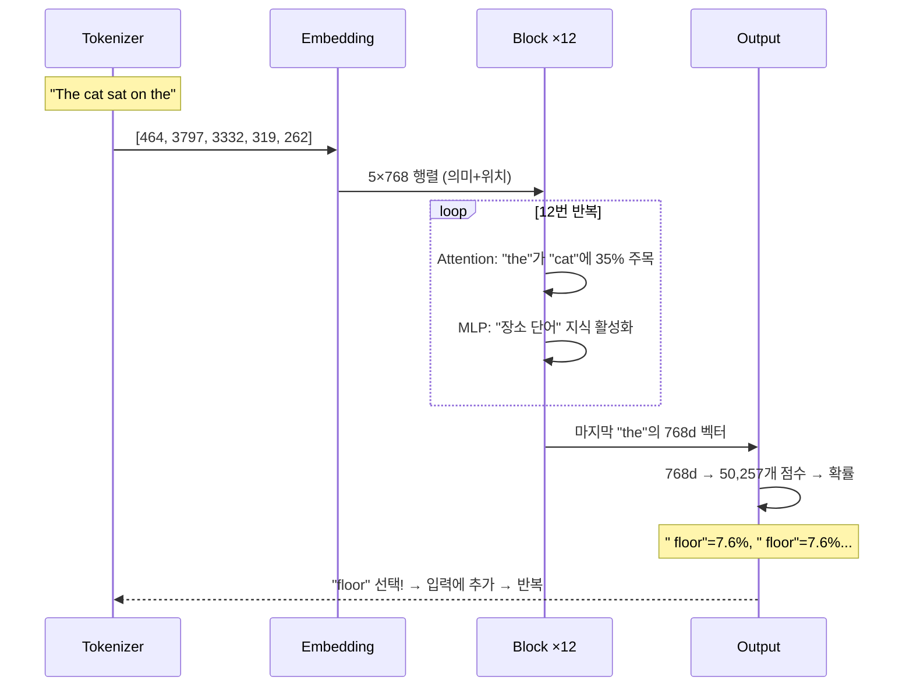

핵심 한 줄: **텍스트 → 768d 벡터들 → 12번 "참고+변환" 반복 → 확률 → 다음 단어 선택. 끝!**


---

# Part 2: LLM Serving & Optimization

> *Hands-On LLM Serving and Optimization* (O'Reilly 2026, Ch.1~2) 기반 정리

---

## 11. 모델 서빙 개요 (Ch.1)

### 모델의 구성 3요소

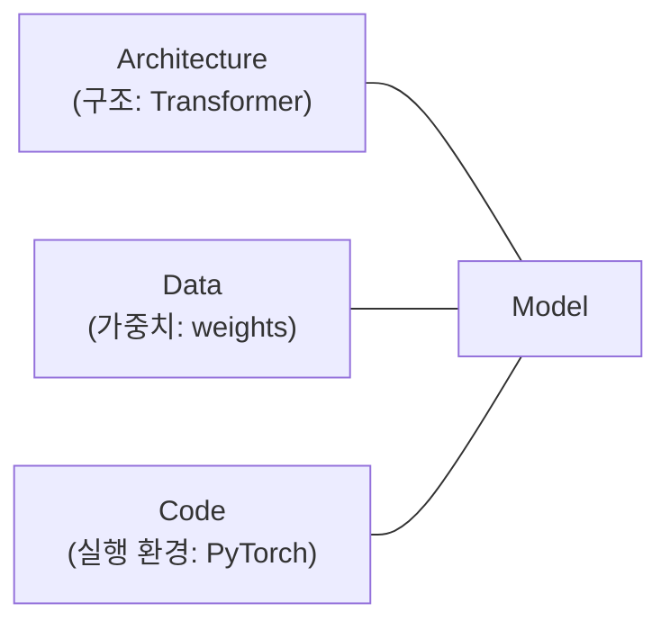

### Training vs Serving — 핵심 차이

| | Training | Serving |
|---|---|---|
| 목적 | 가중치 학습 (loss 최소화) | **예측 결과 반환** |
| 연산 | Forward + Backward | **Forward만** |
| 배치 | 큼 (처리량↑) | 작음 (지연↓) |
| GPU | 수백~수천 개 | 1~수 개 |
| 최적화 대상 | 학습 속도, 수렴 | **지연시간, 처리량, 비용** |
| 프레임워크 | PyTorch, DeepSpeed | **[vLLM](#term-vllm), [TensorRT-LLM](#term-tensorrt-llm), Triton** |

핵심: Training 프레임워크(HuggingFace Transformers 등)로 그냥 서빙하면 **Backward 코드, 배치 미최적화, [KV Cache](#term-kv-cache) 미활용** 때문에 느리고 비효율적이다.

### Model Lifecycle

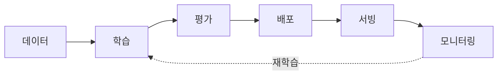

### 서빙 패러다임 3가지

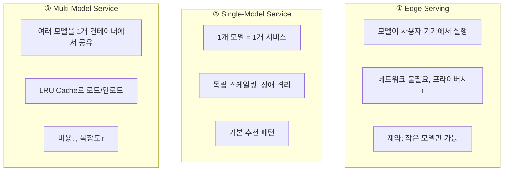

#### Single-Model이 기본인 이유

- 리소스 경합 없음 → 최고 성능
- 모델별 독립 스케일링
- 격리된 로그/메트릭 → 디버깅 쉬움
- 하나 죽어도 나머지 영향 없다.
- 모델별 맞춤 하드웨어 선택 가능

#### Multi-Model이 필요한 경우

- 모델이 수백~수천 개 (예: 고객별 커스텀 모델)
- 대부분 비활성 → 항상 로드해두면 낭비
- LRU 기반 on-demand 로드/언로드로 해결

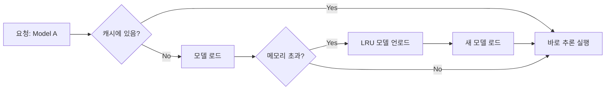

---

## 12. LLM 서빙의 특수성 (Ch.2)

### 전통 ML vs LLM — 구조적 차이

| | 전통 ML | LLM |
|---|---|---|
| 상태 | Stateless | **Stateful** ([KV Cache](#term-kv-cache)) |
| 연산량 | 고정 | **가변** (출력 길이 모름) |
| 메모리 | 고정 | **동적 증가** |
| 위치 | 백그라운드 | **사용자 직접 대면** |
| 비용 | 저렴 (CPU 가능) | **GPU 필수, 10배+ 비용** |
| 패턴 | 단일 Forward | **[Auto-Regressive](#term-auto-regressive) (반복 Forward)** |

### [Auto-Regressive](#term-auto-regressive) 생성 구조

LLM은 한 번에 답을 내놓는 게 아니라, **토큰을 하나씩 순차 생성**한다. 이게 이미지 분류(입력 넣으면 답 한 방에 나옴)나 전통 ML과 근본적으로 다른 점이다. 100토큰짜리 답변을 만들려면 모델을 100번 호출해야 한다. 매번 전체 모델을 Forward Pass 하는 셈이라, 연산 비용이 출력 길이에 비례해 쌓인다.

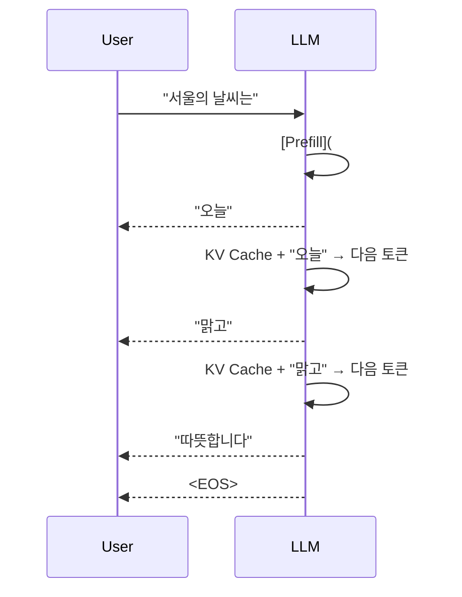

매 스텝마다 모델을 [Forward Pass](#term-forward-pass) 한다는 뜻이다.  
→ 이게 서빙에서 왜 문제가 되냐?

| 특성 | 서빙 영향 |
|------|-----------|
| 순차 생성 | GPU가 대부분 idle (한 토큰씩만 처리) |
| 가변 출력 | 리소스 예약 어려움 (언제 끝날지 모름) |
| [KV Cache](#term-kv-cache) 누적 | 메모리가 시간에 따라 계속 증가 |
| 실시간 스트리밍 | [TTFT](#term-time-to-first-token)(첫 토큰)가 UX 좌우 |

### [Decoder](#term-decoder)-Only 구조 (현대 LLM 표준)

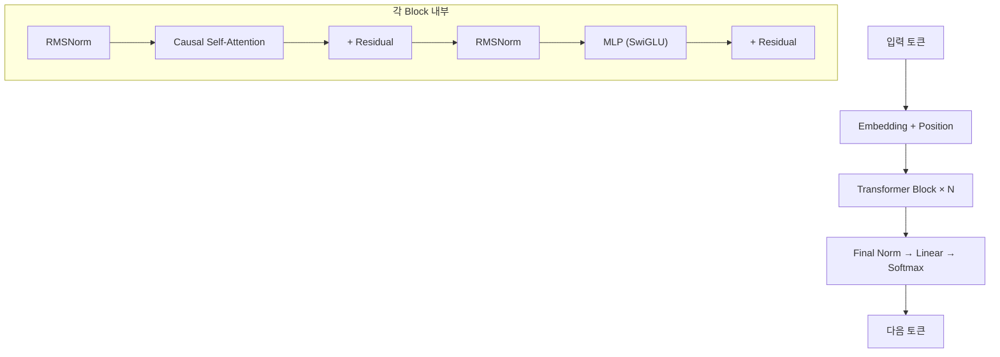

### GPT-2 vs 최신 모델 구조 비교

| 요소 | GPT-2 (2019) | Llama 3 / Qwen 2.5 |
|------|-------------|---------------------|
| Norm | LayerNorm | **[RMSNorm](#term-rmsnorm)** |
| 위치 인코딩 | Learned | **[RoPE](#term-rotary-position-embedding)** |
| 활성화 | [GELU](#term-gelu) | **[SwiGLU](#term-swiglu)** |
| Attention | MHA | **[GQA](#term-grouped-query-attention)** (Grouped Query) |
| 맥락 길이 | 1024 | **128K+** |
| [KV Cache](#term-kv-cache) 최적화 | 없음 | **[GQA](#term-grouped-query-attention)로 KV 크기 축소** |

[GQA](#term-gqa) (Grouped Query Attention) 도식:

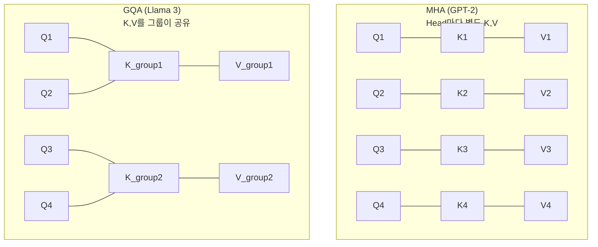

→ [GQA](#term-grouped-query-attention)는 K,V의 수를 줄여서 **[KV Cache](#term-kv-cache) 크기를 절감**하는 것이다.

### [KV Cache](#term-kv-cache)가 왜 핵심인가

Auto-Regressive 생성에서 매 토큰마다 Attention을 계산하려면, 이전 토큰들의 Key와 Value가 필요하다. KV Cache가 없으면 새 토큰 하나를 생성할 때마다 이전 토큰 전체를 처음부터 다시 계산해야 한다. 5번째 토큰을 만들 때 1~4번째를 다시 계산하고, 6번째를 만들 때 1~5번째를 다시 계산하는 식이다. 이러면 출력 길이 n에 대해 총 연산량이 O(n²)이 된다.

KV Cache는 이전 토큰들의 K, V 벡터를 메모리에 저장해두고, 새 토큰은 자기 Q만 계산해서 저장된 K, V와 Attention을 수행한다. 재계산이 없으니 각 스텝이 O(1)이고, 전체는 O(n)이 된다. 대신 그 대가로 **메모리를 계속 먹는다**. 토큰이 생성될수록 Cache가 커지고, 동시 요청이 많으면 수십~수백 GB의 GPU 메모리를 KV Cache가 잡아먹는다. 이 메모리 관리 문제를 해결하는 게 뒤에 나올 PagedAttention이다.

[KV Cache](#term-kv-cache) 없이 → 매 토큰 생성 시 **이전 토큰 전부 다시 계산** → O(n²)  
[KV Cache](#term-kv-cache) 있으면 → 이전 결과 재활용 → **O(n)**

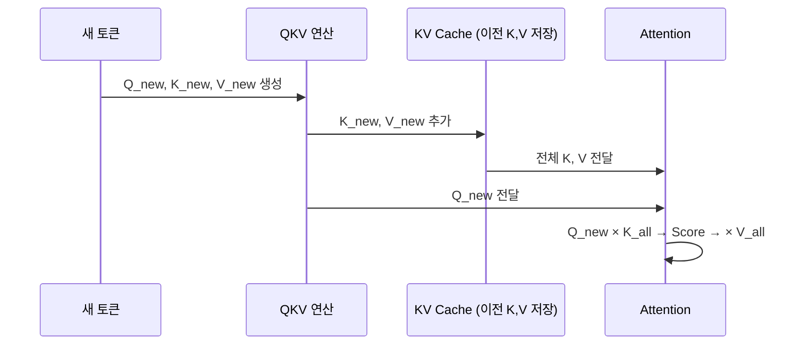

### [Prefill](#term-prefill) & [Decode](#term-decode) 2단계

LLM 추론은 두 개의 명확히 다른 단계로 나뉜다. 이 구분이 중요한 이유는 **두 단계의 하드웨어 병목이 정반대**이기 때문이다.

**Prefill**: 사용자가 보낸 프롬프트(입력 전체)를 한 번에 처리하는 단계다. 입력 토큰 수백~수천 개를 병렬로 처리하니 행렬곱이 크고, GPU 연산 유닛을 꽉 채운다(Compute-bound). 이 단계에서 KV Cache가 한 번에 생성된다. 이 단계의 소요 시간이 곧 TTFT(첫 토큰까지 걸리는 시간)다.

**Decode**: 첫 토큰이 나온 이후, 한 번에 한 토큰씩 순차 생성하는 단계다. 매 스텝마다 토큰 1개에 대해서만 연산하니 행렬곱 자체는 작다. 대신 KV Cache 전체를 GPU 메모리에서 읽어와야 하므로, 메모리 대역폭이 병목이 된다(Memory-bound). GPU 연산 유닛은 대부분 놀고, 데이터가 메모리에서 올라오길 기다리는 상태다. 이게 LLM 서빙에서 GPU 활용률이 낮은 근본 원인이다.

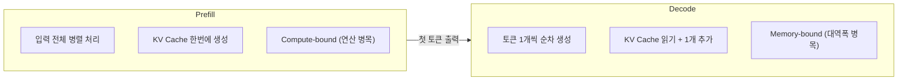

| | [Prefill](#term-prefill) | [Decode](#term-decode) |
|---|---|---|
| 처리 | 입력 전체 병렬 | 토큰 1개 순차 |
| 병목 | GPU 연산력 | GPU 메모리 대역폭 |
| 시간 | 입력 길이 비례 | 출력 길이 비례 |
| GPU 활용 | 높음 | 낮음 |
| [KV Cache](#term-kv-cache) | 생성 | 읽기 + append |

### 왜 최적화가 필수인가

> "LLM 요청 1건 = 키워드 검색의 10배 비용" — Alphabet 회장, 2023

| 지표 | 최적화 전 (HF baseline) | 최적화 후 ([vLLM](#term-vllm)) |
|------|----------------------|-----------------|
| [Throughput](#term-throughput-처리량) | ~30 tok/s | **~150 tok/s (5배↑)** |
| GPU 메모리 낭비 | 40-60% | **<5%** ([PagedAttention](#term-pagedattention)) |
| 동시 요청 | 1-4개 | **수십~수백 개** |
| [TTFT](#term-time-to-first-token) | 수 초 | **수백 ms** |

### 코드: [KV Cache](#term-kv-cache) 수동 구현

```python
# LLM Auto-Regressive 생성 — KV Cache 직접 사용
from transformers import AutoModelForCausalLM, AutoTokenizer
import torch

model_name = "Qwen/Qwen2.5-0.5B"
tokenizer = AutoTokenizer.from_pretrained(model_name)
model = AutoModelForCausalLM.from_pretrained(model_name).eval()

prompt = "Write a short introduction about the US capital city."
input_ids = tokenizer(prompt, return_tensors="pt").input_ids

# Auto-Regressive 루프
generated = input_ids.clone()
past_key_values = None  # ← 이게 KV Cache

for step in range(20):
    with torch.no_grad():
        outputs = model(
            # Prefill: 전체 입력 / Decode: 마지막 1토큰만
            input_ids=generated[:, -1:] if past_key_values else generated,
            past_key_values=past_key_values,
            use_cache=True,
        )
    
    past_key_values = outputs.past_key_values  # Cache 업데이트
    next_token = outputs.logits[:, -1, :].argmax(dim=-1, keepdim=True)
    generated = torch.cat([generated, next_token], dim=-1)
    
    if next_token.item() == tokenizer.eos_token_id:
        break

print(tokenizer.decode(generated[0]))
```

핵심 포인트:
- `past_key_values` = [KV Cache](#term-kv-cache). 이전 토큰의 K,V가 저장돼 있어서 재계산 안 함
- [Prefill](#term-prefill) 시: `input_ids` 전체 → Cache 초기 생성
- [Decode](#term-decode) 시: 마지막 1토큰만 입력 → Cache에서 이전 K,V 참조

### 코드: [vLLM](#term-vllm) vs HuggingFace 성능 비교

```python
# vLLM은 위 최적화를 자동으로 적용해줌
# 설치: pip install vllm

from vllm import LLM, SamplingParams

# vLLM: PagedAttention + [Continuous Batching](#term-continuous-batching) 자동 적용
llm = LLM(model="Qwen/Qwen2.5-7B-Instruct", gpu_memory_utilization=0.9)
params = SamplingParams(temperature=0.8, top_p=0.95, max_tokens=256)

# 여러 요청 동시 처리 (자동 배치!)
prompts = [
    "Explain quantum computing:",
    "Write a haiku about AI:",
    "What is transformers architecture?",
]
outputs = llm.generate(prompts, params)

for out in outputs:
    print(f"{out.prompt[:30]}... → {len(out.outputs[0].token_ids)} tokens")
```

---

*이후 §13~§22 ([Batch](#term-batch)ing, [Quantization](#term-quantization), [FlashAttention](#term-flashattention), [PagedAttention](#term-pagedattention) 등)은 기존 내용 유지*

---
## 13. [Batch](#term-batch)ing — 요청을 묶어서 처리하기

Decode 단계에서 GPU가 놀고 있다면, 그 빈 연산 자원에 다른 요청을 끼워 넣으면 된다. 이게 Batching의 핵심 동기다. 하나의 요청만 처리하면 GPU 활용률이 10~20%에 머무는데, 여러 요청을 묶으면 같은 GPU로 더 많은 토큰을 처리할 수 있다. 문제는 LLM 요청마다 출력 길이가 다르다는 점이다.

### [Batch](#term-batch)ing 종류

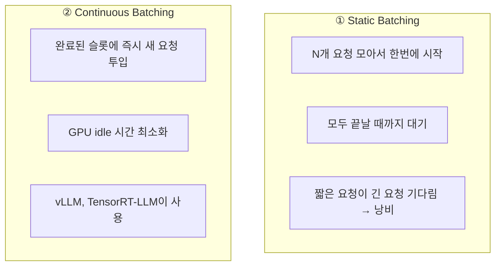

Continuous [Batch](#term-batch)ing 동작:

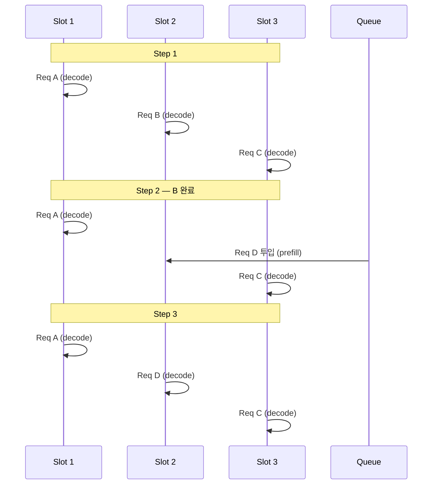

비교:

| | Static | Continuous |
|---|---|---|
| GPU 활용률 | 50-70% | **90%+** |
| [Throughput](#term-throughput-처리량) | 기준 | **2-5배↑** |
| [Latency](#term-latency-지연) | 가장 긴 요청에 맞춰짐 | 각자 독립 |
| 구현 복잡도 | 낮음 | 높음 (스케줄러 필요) |

---

## 14. 핵심 최적화 기법들

### 기법 전체 맵

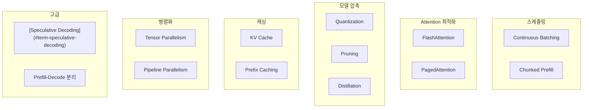

### 14-1. [Quantization](#term-quantization-양자화) (양자화)

모델 가중치의 정밀도(bit)를 줄여서 크기↓, 속도↑. 원리는 간단하다. FP16(16비트)으로 저장된 가중치를 INT8(8비트)이나 INT4(4비트)로 변환하면, 같은 GPU 메모리에 더 큰 모델을 올릴 수 있고, 메모리에서 데이터를 읽는 양이 줄어 대역폭 병목(Decode 단계)이 완화된다. 대신 정밀도가 떨어지니 출력 품질이 약간 저하될 수 있다. 실무에서는 INT4로 내려도 대부분의 태스크에서 품질 차이를 체감하기 어려운 수준이다.

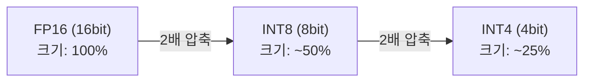

| 정밀도 | 모델 크기 (7B 기준) | 속도 | 품질 손실 |
|--------|-------------------|------|-----------|
| FP16 | 14 GB | 기준 | 없음 |
| INT8 | 7 GB | 1.5-2x↑ | 거의 없음 |
| INT4 | 3.5 GB | 2-3x↑ | 약간 |

실무에서는 **INT4 (W4A16)**가 가성비 최고. GPTQ, AWQ, GGUF 등 방식 있다.

### 14-2. [FlashAttention](#term-flashattention)

Attention의 근본 문제는 메모리다. 시퀀스 길이 N인 입력에 대해 Q×K^T를 계산하면 N×N 크기의 중간 행렬이 생긴다. N=4096이면 이 행렬만 64MB(FP16 기준)를 차지하고, N=128K이면 물리적으로 GPU 메모리에 올라가지 않는다. 

FlashAttention은 이 N×N 행렬을 **통째로 만들지 않는다**. 대신 Q, K, V를 작은 블록으로 쪼개서, GPU의 빠른 온칩 메모리(SRAM)에 올릴 수 있는 크기만큼만 처리하고, 부분 결과를 점진적으로 합산한다. 결과는 수학적으로 동일하지만 메모리 사용량이 O(N²)에서 O(N)으로 떨어지고, SRAM 접근이 DRAM보다 수십 배 빠르니 속도도 2~4배 향상된다.

표준 Attention: Q×K^T 계산 시 **(N×N) 행렬을 통째로 메모리에 생성** → O(N²) 메모리.

[FlashAttention](#term-flashattention): **블록 단위로 나눠서 GPU SRAM에서 처리** → O(N) 메모리 + 2-4배 속도↑.

```mermaid
graph LR
    subgraph Standard["표준 Attention"]
        S1["Q×K^T → N×N 행렬 전체 생성"]
        S2["O(N²) 메모리"]
    end

    subgraph Flash["FlashAttention"]
        F1["Q,K,V를 블록으로 분할"]
        F2["블록 단위로 SRAM에서 계산"]
        F3["O(N) 메모리 + 빠름"]
    end
```

### 14-3. [PagedAttention](#term-pagedattention) ([vLLM](#term-vllm))

KV Cache의 메모리 관리 문제를 해결하는 기법이다. 문제의 핵심은 이렇다: 요청마다 출력 길이가 다르므로 KV Cache 크기를 미리 알 수 없다. 기존 방식은 최대 출력 길이만큼 연속 메모리를 미리 잡아두는데, 실제로 짧게 끝나면 나머지가 낭비된다. 여러 요청이 동시에 들어오면 이 낭비가 쌓여 GPU 메모리의 40~60%가 사용 불가 상태가 된다.

PagedAttention은 OS의 가상 메모리처럼 KV Cache를 작은 고정 크기 **페이지** 단위로 나눈다. 페이지는 물리적으로 연속일 필요가 없고, 필요할 때마다 빈 페이지를 할당한다. 요청이 끝나면 그 페이지를 해제해서 다른 요청이 쓴다. 이러면 단편화(fragmentation)가 사라지고, KV Cache 메모리 낭비가 거의 0%가 된다.

[KV Cache](#term-kv-cache)를 **고정 크기 페이지(page)** 단위로 관리. OS의 가상 메모리와 같은 원리.

```mermaid
graph LR
    subgraph Old["기존: 연속 메모리 할당"]
        O1["Req A: 연속 2GB"]
        O2["Req B: 연속 1.5GB"]
        O3["빈 조각 0.5GB 사용 불가 (단편화)"]
    end

    subgraph Paged["PagedAttention: 페이지 단위"]
        P1["Req A: page [1,3,5,7]"]
        P2["Req B: page [2,4,6]"]
        P3["빈 페이지 어디서든 활용 가능"]
    end
```

효과: [KV Cache](#term-kv-cache) 메모리 낭비를 **거의 0%**로 줄임.

### 14-4. [Speculative Decoding](#term-speculative-decoding)

Decode 단계가 느린 이유는 큰 모델이 토큰 하나를 만들기 위해 전체 레이어를 다 통과해야 하기 때문이다. 그런데 생성되는 토큰의 상당수는 사실 "뻔한" 토큰이다("The capital of France is" 뒤에 "Paris"가 올 확률이 압도적이듯). Speculative Decoding은 이 점을 이용한다.

작은 모델(draft model, 1~2B 수준)이 빠르게 여러 토큰(예: 5개)을 연속으로 추측한다. 그 뒤 큰 모델(target model, 70B 등)이 이 5개를 **한 번의 Forward Pass**로 동시에 검증한다. 큰 모델 입장에서는 5개를 병렬로 확인하는 거라 1개 생성하는 것과 시간이 비슷하다. 검증 결과 앞의 3~4개가 맞으면 그대로 채택하고, 틀린 지점부터 다시 시작한다. 핵심은 **최종 출력 품질이 큰 모델 단독 생성과 수학적으로 동일**하다는 점이다. 속도만 2~3배 빨라진다.

작은 모델(draft)이 빠르게 여러 토큰을 추측 → 큰 모델(target)이 한 번에 검증.

```mermaid
graph LR
    subgraph Normal["일반 디코딩"]
        N["큰 모델이 1토큰/step<br/>3 step = 3 tokens"]
    end

    subgraph Spec["Speculative Decoding"]
        S1["작은 모델: 5토큰 추측"]
        S2["큰 모델: 1번에 검증"]
        S3["3-4개 맞음 → 1 step = 3-4 tokens"]
    end
```

| | Draft Model | Target Model |
|---|---|---|
| 크기 | 작음 (1B) | 큼 (70B) |
| 속도 | 빠름 | 느림 |
| 역할 | 추측 | 검증 |
| 최종 품질 | Target과 **동일** (수학적 보장) |

### 14-5. [Prefill](#term-prefill)-[Decode](#term-decode) 분리

앞에서 봤듯 Prefill은 Compute-bound이고 Decode는 Memory-bound다. 하드웨어 요구사항이 정반대라는 뜻이다. 같은 GPU에서 두 단계를 번갈아 처리하면 어느 쪽이든 비효율이 생긴다. Prefill을 할 때는 메모리 대역폭이 남고, Decode를 할 때는 연산 유닛이 논다.

해법은 물리적으로 분리하는 것이다. Prefill 전용 GPU(연산 최적화된 구성)에서 입력을 처리하고 KV Cache를 생성한 뒤, 그 Cache를 Decode 전용 GPU(대역폭 최적화된 구성)로 넘겨서 토큰 생성을 이어간다. 이렇게 하면 각 GPU가 자기에게 맞는 일만 하니 전체 시스템 효율이 올라간다. 아직 연구/초기 단계에 있는 기법이지만, Mooncake(Moonshot AI)나 Splitwise(Microsoft) 등에서 실용화가 진행되고 있다.

[Prefill](#term-prefill)(연산 집약)과 [Decode](#term-decode)(메모리 집약)는 하드웨어 요구사항이 다름 → 별도 GPU에 배치.

```mermaid
graph LR
    PG["Prefill GPU<br/>(Compute 최적화)"] -->|"KV Cache 전송"| DG["Decode GPU<br/>(Bandwidth 최적화)"]
```

---

## 15. 성능 지표

```mermaid
graph LR
    Start["요청 도착"] -->|"TTFT"| First["첫 토큰"]
    First -->|"TPOT"| T2["토큰 2"]
    T2 -->|"TPOT"| T3["토큰 3"]
    T3 -->|"..."| Last["마지막 토큰"]
```

| 지표 | 정의 | 좋은 값 (채팅) |
|------|------|---------------|
| **[TTFT](#term-time-to-first-token)** | 요청 → 첫 토큰 시간 | < 500ms |
| **[TPOT](#term-time-per-output-token)** | 토큰 간 생성 시간 | < 50ms |
| **[Throughput](#term-throughput-처리량)** | 시스템 전체 초당 토큰 수 | 높을수록 좋음 |
| **E2E [Latency](#term-latency-지연)** | [TTFT](#term-time-to-first-token) + (출력 토큰 × [TPOT](#term-time-per-output-token)) | 용도에 따라 |

- [TTFT](#term-time-to-first-token) → 사용자 체감 (빨리 시작해야 "빠르다"고 느낌)
- [Throughput](#term-throughput-처리량) → 비용 효율 (같은 GPU로 더 많이 처리)

---

## 16. LLM Serving 프레임워크 비교

```mermaid
graph TD
    Q1{"GPU 있음?"}
    Q1 -->|"No"| Llama["llama.cpp"]
    Q1 -->|"Yes"| Q2{"우선순위?"}
    Q2 -->|"범용성"| VLLM["vLLM "]
    Q2 -->|"NVIDIA 최적 성능"| TRT["TensorRT-LLM"]
    Q2 -->|"프로그래밍 유연"| SG["SGLang"]
```

| | [vLLM](#term-vllm) | [TensorRT-LLM](#term-tensorrt-llm) | SGLang | llama.cpp |
|---|---|---|---|---|
| 핵심 | 범용, 쉬움 | NVIDIA 최적 | 유연한 프로그래밍 | CPU/Mac |
| [PagedAttention](#term-pagedattention) | O | O | O | X |
| Continuous [Batch](#term-batch) | O | O | O | X |
| 양자화 | AWQ, GPTQ | FP8, INT4 | AWQ, GPTQ | GGUF |
| Multi-GPU | TP, PP | TP, PP | TP | X |
| 대상 | 대부분 팀 | 최대 성능 | 연구/커스텀 | 개인/Edge |

---

## 17. GPU 하드웨어 기본

| GPU | 메모리 | 대역폭 | FP16 연산 | 용도 |
|-----|--------|--------|-----------|------|
| A100 80GB | 80 GB | 2 TB/s | 312 TFLOPS | 프로덕션 표준 |
| H100 80GB | 80 GB | 3.35 TB/s | 990 TFLOPS | 차세대 표준 |
| A10G 24GB | 24 GB | 600 GB/s | 125 TFLOPS | 가성비 추론 |
| RTX 4090 | 24 GB | 1 TB/s | 165 TFLOPS | 개인/소규모 |

[Compute-bound](#term-compute-bound) vs [Memory-bound](#term-memory-bound):

| | [Compute-bound](#term-compute-bound) ([Prefill](#term-prefill)) | [Memory-bound](#term-memory-bound) ([Decode](#term-decode)) |
|---|---|---|
| 병목 | GPU 연산 유닛 | GPU 메모리 대역폭 |
| 특징 | 큰 행렬곱, 데이터는 충분 | 작은 연산, 데이터 읽기가 느림 |
| 판별 | Arithmetic Intensity 높음 | Arithmetic Intensity 낮음 |

---

## 18. 코드 실습 (Serving)

### 실습 8: [KV Cache](#term-kv-cache) 크기 계산

```python
def calc_kv_cache_gb(n_layers, n_heads, d_head, seq_len, batch=1, dtype_bytes=2):
    """KV Cache 크기 (GB)"""
    return 2 * n_layers * n_heads * d_head * seq_len * batch * dtype_bytes / (1024**3)

models = {
    "GPT-2 (124M)":  (12, 12, 64, 1024),
    "Llama-2-7B":    (32, 32, 128, 4096),
    "Llama-2-70B":   (80, 64, 128, 4096),
}

print(f"{'모델':<18} {'1 req':<10} {'32 req':<10} {'128 req'}")
for name, (nl, nh, dh, sl) in models.items():
    s1 = calc_kv_cache_gb(nl, nh, dh, sl, 1)
    s32 = calc_kv_cache_gb(nl, nh, dh, sl, 32)
    s128 = calc_kv_cache_gb(nl, nh, dh, sl, 128)
    print(f"{name:<18} {s1:.2f} GB   {s32:.1f} GB   {s128:.1f} GB")
```

### 실습 9: [vLLM](#term-vllm) 서빙

```python
from vllm import LLM, SamplingParams

llm = LLM(model="Qwen/Qwen2.5-7B-Instruct", gpu_memory_utilization=0.9)
params = SamplingParams(temperature=0.8, top_p=0.95, max_tokens=256)

prompts = ["Explain transformers:", "Write a haiku:", "What is KV cache?"]
outputs = llm.generate(prompts, params)

for out in outputs:
    print(f"{out.prompt[:25]}... → {len(out.outputs[0].token_ids)} tok")
```

### 실습 10: [Throughput](#term-throughput-처리량) 벤치마크

```python
import time, torch
from transformers import GPT2LMHeadModel, GPT2Tokenizer

tokenizer = GPT2Tokenizer.from_pretrained('gpt2')
model = GPT2LMHeadModel.from_pretrained('gpt2').eval()
device = "cuda" if torch.cuda.is_available() else "cpu"
model = model.to(device)

prompt = "The future of AI is"
input_ids = tokenizer.encode(prompt, return_tensors='pt').to(device)

# Warmup
with torch.no_grad():
    model.generate(input_ids, max_new_tokens=10)

# Benchmark
start = time.time()
with torch.no_grad():
    out = model.generate(input_ids, max_new_tokens=100, do_sample=False)
elapsed = time.time() - start

n_tokens = out.shape[1] - input_ids.shape[1]
print(f"생성: {n_tokens} tokens in {elapsed:.2f}s")
print(f"속도: {n_tokens/elapsed:.1f} tok/s")
print(f"토큰당: {elapsed/n_tokens*1000:.1f} ms")
```

---

## 19. 전체 로드맵

```mermaid
graph TD
    subgraph Part1["Part 1: 이론"]
        T1["Transformer 구조"]
        T2["Embedding → Attention → MLP → Output"]
    end

    subgraph Part2["Part 2: 실무"]
        S1["모델 서빙 개념 (Ch.1)"]
        S2["LLM 서빙 특수성 (Ch.2)"]
        S3["KV Cache, Prefill/Decode"]
        S4["Batching, 최적화 기법들"]
        S5["프레임워크 선택, GPU 이해"]
    end

    Part1 --> Part2
```

### 체크리스트

| # | 질문 | 답 |
|---|------|-----|
| 1 | Training vs Serving 차이? | Forward만, 지연/비용 최적화 |
| 2 | Single vs Multi-Model 선택 기준? | 기본은 Single, 모델 수백+ 이면 Multi |
| 3 | LLM이 전통 ML과 다른 점? | Stateful, 가변 출력, 메모리 증가 |
| 4 | [Prefill](#term-prefill) vs [Decode](#term-decode)? | [Compute-bound](#term-compute-bound) vs [Memory-bound](#term-memory-bound) |
| 5 | [KV Cache](#term-kv-cache) 역할? | 이전 K,V 재계산 방지 |
| 6 | Continuous [Batch](#term-batch)ing? | 완료 슬롯에 즉시 새 요청 투입 |
| 7 | [Quantization](#term-quantization-양자화) 효과? | 크기 ½~¼, 속도 2-3배↑ |
| 8 | [FlashAttention](#term-flashattention)? | O(N²)→O(N) 메모리 |
| 9 | [PagedAttention](#term-pagedattention)? | [KV Cache](#term-kv-cache) 단편화 해결 |
| 10 | [TTFT](#term-time-to-first-token) vs [TPOT](#term-time-per-output-token)? | 첫 토큰 시간 vs 이후 토큰 간격 |

---

## 마무리

Part 1에서는 "The cat sat on the" 한 문장이 토큰화되고, 768차원 벡터로 변환되고, 12개 블록을 거치며 Self-Attention과 MLP를 반복한 끝에 다음 단어 확률을 내놓는 과정을 처음부터 끝까지 따라갔다. Transformer의 핵심은 결국 "모든 토큰이 다른 토큰을 동시에 참조할 수 있다"는 Self-Attention 하나로 요약된다. 이전 세대(RNN/LSTM)가 순차 처리의 한계로 풀지 못했던 장거리 의존성과 병렬화 문제를 이 메커니즘 하나가 해결한 것이다.

Part 2에서는 이 구조를 실제로 서빙할 때 부딪히는 현실적 문제를 다뤘다. Auto-Regressive 생성의 순차 특성, KV Cache의 메모리 증가, Prefill과 Decode의 서로 다른 병목 — 이런 것들이 "학습된 모델을 어떻게 빠르고 싸게 서빙하느냐"라는 엔지니어링 문제를 만든다. Continuous Batching, PagedAttention, Quantization, Speculative Decoding 같은 최적화 기법들은 모두 이 문제에 대한 답이다.

구조를 이해하고 나면 다음 질문은 자연스럽게 "그래서 실제로 어떻게 최적화하는데?"가 된다. vLLM이나 TensorRT-LLM을 직접 띄워서 Throughput과 Latency를 측정해보는 것, 그리고 Quantization 적용 전후의 품질 차이를 확인해보는 것이 다음 단계가 될 것이다.

## 참고 자료

- [Transformer Explainer (Georgia Tech)](https://poloclub.github.io/transformer-explainer/) — 인터랙티브 시각화
- *Hands-On LLM Serving and Optimization* (O'Reilly 2026) — Part 2 기반 서적
- [Attention Is All You Need (Vaswani et al., 2017)](https://arxiv.org/abs/1706.03762) — Transformer 원 논문
- [vLLM: Easy, Fast, and Cheap LLM Serving](https://github.com/vllm-project/vllm)
- [FlashAttention (Dao et al., 2022)](https://arxiv.org/abs/2205.14135)
- [PagedAttention (Kwon et al., 2023)](https://arxiv.org/abs/2309.06180)
