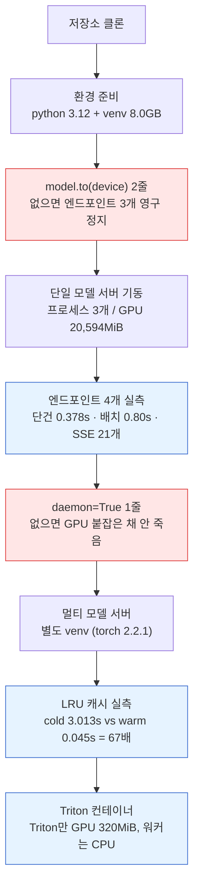
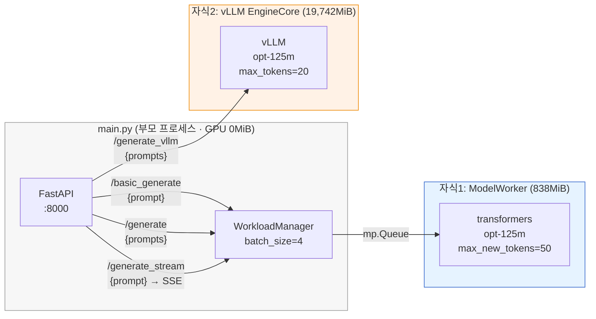
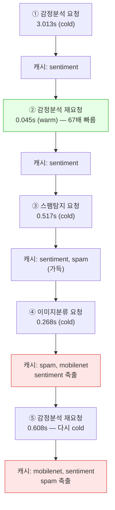
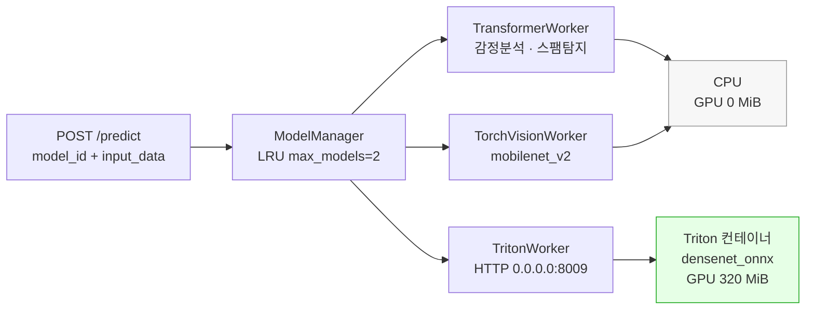
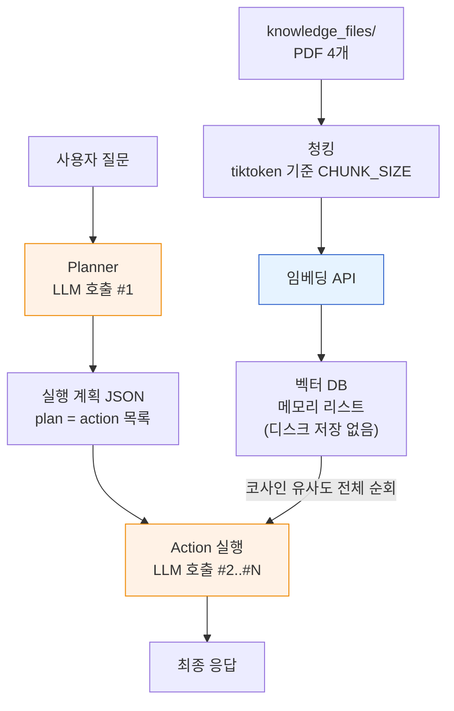
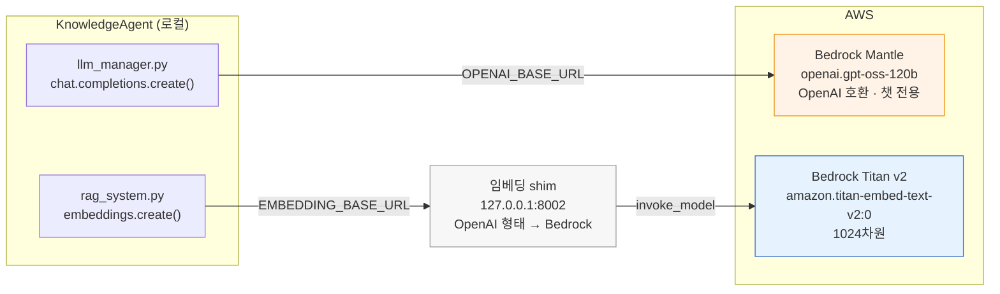
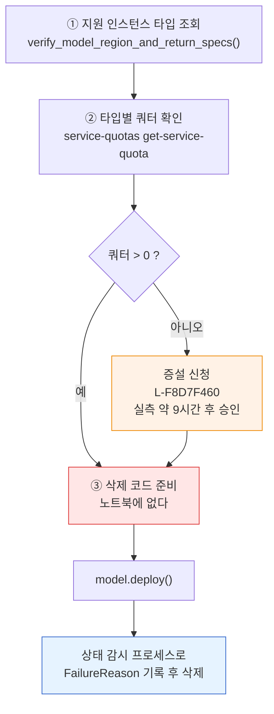

> 해당 포스팅은 현재 재직중인 회사에 관련이 없고, 개인 역량 개발을 위한 스터디 자료로 활용할 예정입니다.

# LLM 서빙 실습 가이드 — 저장소 코드를 AWS GPU에서 끝까지 돌려보기

> 실습 저장소: [llm-model-inference](https://github.com/orca3/llm-model-inference) (검증 커밋 `80dcd9f`)
>
> 참고: *Hands-On LLM Serving and Optimization* (O'Reilly 2026) Ch.3~4
>
> 검증 환경: AWS EC2 `g5.xlarge` / `g5.2xlarge` (NVIDIA A10G 24GB), us-east-1

이 글은 세 파트로 구성된다. Part 1에서는 Ch.3의 서빙 코드를 GPU 인스턴스에 올려서
단일 모델 서버의 4개 엔드포인트가 각각 어떤 경로로 동작하는지, 배치와 vLLM이 지연에 어떤
차이를 만드는지, 프로세스와 GPU 메모리가 실제로 어떻게 갈라지는지를 따라간다. Part 2에서는
Ch.4의 RAG 에이전트를 돌려 질문 하나에 LLM이 몇 번 호출되는지 계측하고, AWS 관리형 서빙
(Bedrock, JumpStart, DLC)을 차례로 다룬다. Part 3에서는 저장소가 들고 있는 테스트 32개를 전부
실행하고, 트러블슈팅과 리소스 정리로 마무리한다.

이 문서를 관통하는 하나의 질문은 이것이다 — **저장소를 그대로 클론해서 GPU에서 돌리면 어디까지
되는가.** Ch.3의 서빙 코드는 두 줄만 고치면 전부 동작하고, 문서가 말한 배치 효과·프로세스
격리·LRU 축출이 실측으로 확인된다. Ch.4의 에이전트도 돌아간다. AWS 관리형 배포 중 JumpStart
경로는 이 계정·시점에서 완료하지 못했는데, 그 지점은 **실행 로그에 남은 원인만 짧게 적고**
대신 같은 모델을 EC2에 직접 올리는 경로로 마무리했다.

모든 수치·응답·오류 메시지는 실제 실행 로그에서 가져왔다. 추정한 값은 "추정"이라고 따로 적었다.

<!--truncate-->

---

## 용어 사전 (Glossary)

이 문서에 나오는 용어를 먼저 정리해둠. 모르는 게 나올 때마다 여기로 돌아와서 확인하면 된다.

### 서빙 구조 용어

| 용어 | 설명 |
|------|------|
| **Serving (서빙)** | 학습이 끝난 모델을 배포해서 실시간 요청에 예측을 돌려주는 것. Forward Pass만 수행한다. |
| **엔드포인트 (Endpoint)** | 요청을 받는 HTTP 주소 하나. 이 실습에서는 `/basic_generate`, `/generate` 처럼 경로 단위로 나뉜다. |
| **Auto-Regressive** | 이전 출력을 다음 입력으로 다시 넣는 생성 방식. 토큰 하나 만들 때마다 모델을 통째로 한 번 통과한다. |
| **KV Cache** | 이전 토큰의 Key·Value 벡터를 저장해둔 캐시. 매 스텝 재계산을 막아 O(n²)를 O(n)으로 낮추지만, 그 대가로 메모리를 계속 먹는다. |
| **Continuous Batching** | 끝난 요청의 슬롯에 즉시 새 요청을 밀어넣는 배치 전략. GPU가 노는 시간을 줄인다. |
| **PagedAttention** | KV Cache를 OS 가상 메모리처럼 고정 크기 페이지로 관리해 단편화를 없애는 기법. vLLM의 핵심. |
| **TTFT (Time To First Token)** | 요청 후 첫 토큰이 나오기까지의 시간. 사용자 체감 속도를 좌우한다. |
| **Prefill / Decode** | 입력 전체를 한 번에 처리하는 단계(연산 병목) / 토큰을 하나씩 뽑는 단계(메모리 대역폭 병목). |
| **LRU 캐시** | 가장 오래 안 쓴 항목을 먼저 버리는 캐시 정책. 멀티모델 서빙에서 어떤 모델을 메모리에 둘지 결정한다. |
| **Cold start / Warm** | 모델을 처음 올려서 응답하는 경우 / 이미 올라와 있어 바로 응답하는 경우. 이 차이가 멀티모델 서빙의 핵심 문제다. |
| **백엔드 위임** | 추론을 별도 프로세스·컨테이너(예: Triton)에 넘기는 구조. 서비스 코드가 추론 하드웨어를 몰라도 된다. |

### 이 실습에 등장하는 도구

| 용어 | 설명 |
|------|------|
| **vLLM** | UC Berkeley에서 나온 LLM 서빙 프레임워크. PagedAttention + Continuous Batching이 기본 적용된다. **CUDA 전용이라 맥에서는 못 돌린다.** |
| **transformers** | HuggingFace의 모델 라이브러리. 이 저장소는 vLLM 경로와 transformers 경로를 나란히 두고 비교한다. |
| **Triton Inference Server** | NVIDIA의 추론 서버. ONNX·TensorRT·PyTorch 등 여러 백엔드를 한 프로세스에서 서빙한다. 이미지 크기가 27.4GB다. |
| **ONNX** | 프레임워크 중립 모델 포맷. 이 실습에서는 `densenet_onnx` 모델을 Triton으로 서빙한다. |
| **FastAPI / uvicorn** | 파이썬 웹 프레임워크와 ASGI 서버. 두 실습 서버 모두 이 조합이다. |
| **pytest** | 파이썬 테스트 러너. Part 3에서 저장소 테스트를 돌릴 때 쓴다. |
| **py-spy** | 실행 중인 파이썬 프로세스의 스택을 밖에서 떠오는 도구. 데드락 원인을 잡을 때 결정적이었다. |

### AWS 관리형 서비스 용어

| 용어 | 설명 |
|------|------|
| **SageMaker Endpoint** | 모델을 올려 HTTPS로 서빙해주는 관리형 추론 엔드포인트. 인스턴스 수명·오토스케일링을 AWS가 관리한다. |
| **JumpStart** | SageMaker가 미리 준비해둔 모델·컨테이너·스크립트 묶음. 모델 ID만 주면 배포되는 게 목표지만, 지원 인스턴스 타입이 버전마다 바뀐다. |
| **Bedrock** | 여러 벤더의 파운데이션 모델을 API로 쓰는 관리형 서비스. `converse()` / `invoke_model()` 로 호출한다. |
| **Bedrock Mantle** | Bedrock의 **OpenAI 호환** 엔드포인트. `https://bedrock-mantle.<region>.api.aws/v1` 로 OpenAI SDK를 그대로 쓸 수 있다. 챗 전용이고 임베딩 모델은 없다. |
| **Inference Profile** | 크로스리전 추론용 모델 ID. `us.` 접두사가 붙는다. 최신 Bedrock 모델은 대부분 이쪽만 지원한다. |
| **DLC (Deep Learning Container)** | AWS가 관리하는 학습·추론용 컨테이너 이미지. 이 실습의 `dlc` 노트북이 다루는 대상이다. |
| **LMI (Large Model Inference)** | DJL 기반 대형 모델 추론 컨테이너. JumpStart가 내부적으로 쓴다. |
| **Service Quotas** | 계정·리전별 리소스 상한. `ml.g6e.2xlarge for endpoint usage` 처럼 인스턴스 타입 단위로 걸린다. |
| **DLAMI** | Deep Learning AMI. NVIDIA 드라이버·CUDA가 미리 깔린 EC2 이미지. |
| **SSM Session Manager** | 인바운드 포트를 열지 않고 인스턴스에 접속하는 방법. 이 실습은 SSH 키 없이 진행했다. |

### 트러블슈팅에서 나오는 용어

| 용어 | 설명 |
|------|------|
| **daemon 프로세스** | 부모가 죽을 때 함께 정리되는 자식 프로세스. `mp.Process(daemon=True)`. 이 한 줄이 §7의 핵심이다. |
| **atexit** | 파이썬 인터프리터가 종료될 때 실행되는 훅. `multiprocessing`이 여기에 자식 join을 걸어둔다. |
| **좀비 프로세스** | 종료됐지만 부모가 회수하지 않아 프로세스 표에 남은 상태. `ps`에 `<defunct>`로 보인다. |
| **InsufficientInstanceCapacity** | AWS 쪽에 해당 타입 재고가 없다는 뜻. 내 설정 문제가 아니다. |
| **tiktoken** | OpenAI의 토크나이저 라이브러리. 모르는 모델명을 주면 `KeyError`를 던진다. |
| **fs.protected_regular** | sticky 디렉토리(`/tmp`)에서 남의 파일을 O_CREAT로 여는 것을 막는 커널 설정. root도 막힌다. |

---

# Part 1: 단일 모델 · 멀티 모델 서빙 (Ch.3)

> **이 파트의 방식**: 저장소를 클론한 상태에서 시작해서, 서버가 정상적으로 4개 엔드포인트를
> 돌려줄 때까지 마주치는 문제를 순서대로 해결한다. 각 단계에서 **프로세스와 GPU 메모리가
> 어떻게 변하는지**를 같이 추적한다.

## 1. 실습 개요 — 무엇을 확인하려는가

Ch.3은 두 개의 서버를 다룬다. 하나는 **단일 모델 LLM 서버**로, 같은 모델(`facebook/opt-125m`)을
transformers 경로와 vLLM 경로로 나란히 서빙해서 둘을 비교할 수 있게 해둔 것이다. 다른 하나는
**멀티 모델 서버**로, 모델 4개를 등록해두고 LRU 캐시로 2개만 메모리에 유지한다.

확인하려는 것을 질문 형태로 정리하면:

1. 배치로 묶으면 정말 빨라지나 — 단건 5회 vs 배치 1회
2. vLLM이 transformers보다 빠른가 — 그리고 그 비교가 공정한가
3. API 서버 프로세스와 추론 프로세스가 실제로 분리돼 있나 — GPU 메모리로 확인 가능한가
4. LRU 캐시에서 cold start와 warm의 차이는 얼마나 되나
5. 백엔드를 Triton에 위임하면 서비스 코드는 정말 하드웨어를 몰라도 되나

**우리 실습의 여정 요약:**



표시가 실습을 진행하려면 먼저 고쳐야 하는 두 곳이다. 각각 §4와 §7에서 다룬다.

## 2. 환경 준비 — 왜 GPU 리눅스여야 하나

### 왜 맥에서는 안 되나:

Ch.3의 `/generate_vllm` 경로는 vLLM을 쓰는데, **vLLM은 CUDA 전용**이다. 맥에서는 이 엔드포인트를
쓸 수 없다. 그럼 vLLM만 빼고 나머지를 쓰면 되지 않나 싶은데, 그게 안 된다. `llm/llm.py`가
모듈 최상단에서 vLLM을 import하고, `LLMEngine.__init__`이 엔드포인트 호출과 무관하게 vLLM
인스턴스를 만든다.

```python
# llm/llm.py
from vllm import LLM as VLLM          # ← 모듈 임포트 시점에 필요
from vllm import SamplingParams

class LLMEngine:
    def __init__(self):
        ...
        self.vllm_model = VLLM(model="facebook/opt-125m")   # ← 기동 시 항상 실행
```

즉 vLLM이 없으면 `import`부터 실패해서 **서버가 기동조차 못 한다.** 맥에서 굳이 돌리려면
import와 `self.vllm_model` 초기화를 함께 걷어내야 한다. 그래서 이 실습은 NVIDIA GPU 리눅스
환경을 전제로 한다.

### 검증 환경

| 항목 | 값 |
|------|-----|
| 인스턴스 | EC2 `g5.xlarge` (vCPU 4, RAM 16GB, **NVIDIA A10G 24GB** = 23,028MiB) |
| 리전 / AZ | us-east-1 / us-east-1f (Part 2의 EC2 배포는 us-east-1c) |
| AMI | `Deep Learning Base OSS Nvidia Driver GPU AMI (Ubuntu 22.04)` |
| GPU 드라이버 / CUDA | 595.91.07 / 13.2 |
| 루트 볼륨 | 200GB gp3 (**venv 하나가 8.0GB**라 100GB 이하는 빠듯하다) |
| Python | 3.12.13 (deadsnakes PPA. Ubuntu 22.04 기본은 3.10.12) |
| 접속 | SSM Session Manager (인바운드 포트 0개, SSH 키 없음) |
| 비용 | 온디맨드 약 $1.006/hr → 전 실습 약 2.5시간, **$2~3** |

> ⚠️ **AMI ID를 문서에서 베끼면 안 된다.** 아래 `ssm get-parameter`가 가리키는 건 `latest`
> 포인터라 AWS가 새 DLAMI를 내면 값이 바뀐다. 실제로 검증 1일차와 2일차 사이에
> `ami-0326665395a428ccf` → `ami-0864937ee5737c2c2`로 이동했다. 두 AMI 모두 드라이버
> 595.91.07 / CUDA 13.2 / Ubuntu 22.04.5로 같았고 실습 결과에 차이는 없었다.

### 인스턴스 기동

`g5.xlarge`는 A10G(24GB)로 vLLM의 bfloat16을 지원한다. `g4dn.xlarge`(T4)는 더 싸지만 bf16이
없어 `--dtype half`를 강제해야 하므로 g5를 권한다.

```bash
export AWS_PROFILE=<your-profile> AWS_REGION=us-east-1

# 1) SSM 접속용 IAM 역할 (인바운드 포트를 열지 않기 위함)
aws iam create-role --role-name llmso-lab-ssm-role \
  --assume-role-policy-document '{"Version":"2012-10-17","Statement":[{"Effect":"Allow","Principal":{"Service":"ec2.amazonaws.com"},"Action":"sts:AssumeRole"}]}'
aws iam attach-role-policy --role-name llmso-lab-ssm-role \
  --policy-arn arn:aws:iam::aws:policy/AmazonSSMManagedInstanceCore
aws iam create-instance-profile --instance-profile-name llmso-lab-ssm-profile
aws iam add-role-to-instance-profile --instance-profile-name llmso-lab-ssm-profile \
  --role-name llmso-lab-ssm-role

# 2) 인바운드 규칙 없는 보안 그룹 (송신만 허용 = 기본값)
VPC=$(aws ec2 describe-vpcs --filters Name=isDefault,Values=true --query 'Vpcs[0].VpcId' --output text)
SG=$(aws ec2 create-security-group --group-name llmso-lab-sg \
  --description "llmso lab - egress only" --vpc-id $VPC --query GroupId --output text)

# 3) 최신 DLAMI 조회 후 기동
AMI=$(aws ssm get-parameter \
  --name /aws/service/deeplearning/ami/x86_64/base-oss-nvidia-driver-gpu-ubuntu-22.04/latest/ami-id \
  --query Parameter.Value --output text)
SUBNET=$(aws ec2 describe-subnets --filters Name=vpc-id,Values=$VPC \
  --query 'Subnets[?AvailabilityZone==`us-east-1f`].SubnetId' --output text)

aws ec2 run-instances --image-id $AMI --instance-type g5.xlarge \
  --subnet-id $SUBNET --security-group-ids $SG \
  --iam-instance-profile Name=llmso-lab-ssm-profile \
  --block-device-mappings '[{"DeviceName":"/dev/sda1","Ebs":{"VolumeSize":200,"VolumeType":"gp3","DeleteOnTermination":true}}]' \
  --metadata-options 'HttpTokens=required,HttpEndpoint=enabled' \
  --tag-specifications 'ResourceType=instance,Tags=[{Key=Name,Value=llmso-ch34-lab}]'

# 4) 접속 (SSM Agent가 Online이 되기까지 30초쯤 걸린다)
aws ssm start-session --target <instance-id>
```

> ⚠️ **실습이 끝나면 반드시 인스턴스를 종료한다.** GPU 인스턴스는 켜 둔 시간만큼 과금된다.
> 정리 절차는 §18에 정리해뒀다.

### 공통 환경

```bash
# 저장소 클론
sudo mkdir -p /opt/lab && sudo chown ubuntu:ubuntu /opt/lab
cd /opt/lab && git clone https://github.com/orca3/llm-model-inference.git

# Python 3.12 (Ubuntu 22.04 기본은 3.10. vLLM 0.9.x는 3.9~3.12 지원이라 3.10도 되지만
#              책 기준을 맞추기 위해 3.12를 쓴다)
sudo add-apt-repository -y ppa:deadsnakes/ppa
sudo apt-get update -y
sudo apt-get install -y python3.12 python3.12-venv python3.12-dev jq

python3.12 -m venv /opt/lab/venv
/opt/lab/venv/bin/python -m pip install -U pip setuptools wheel

cd /opt/lab/llm-model-inference/ch03/single_model_llm_serving
/opt/lab/venv/bin/pip install -r requirements.txt   # 수정 불필요
```

> **실제 확인**: `requirements.txt`는 리눅스 GPU에서 **수정 없이 그대로 설치된다.** 원본
> 문서는 `torch==2.7.0`이 없다며 `sed`로 버전 핀을 풀라고 안내하는데, 그건 **애플 실리콘
> (arm64) 한정 문제**다. 설치 결과는 다음과 같다.
> ```
> torch-2.7.0  vllm-0.9.0.1  transformers-4.52.4  numpy-1.26.4
> xformers-0.0.30  triton-3.3.0  pytest-8.4.0  pytest-asyncio-1.0.0  httpx-0.27.0
> flashinfer 미포함(경고만 출력)   → venv 크기 8.0GB
> ```

### 실습 순서 · 포트 · GPU 메모리 예산 (중요)

**24GB 카드 하나로 모든 실습을 동시에 돌릴 수는 없다.** 단일모델 서버만으로 이미 20.6GB를
쓴다. 아래 순서대로 **앞 단계를 종료한 뒤** 다음으로 넘어가야 한다.

| 순서 | 실습 | 포트 | GPU 사용량 | venv |
|------|------|------|-----------|------|
| 1 | 단일모델 (`main.py`) | **8000** | 20,594 MiB (89.4%) | `venv` |
| 2 | Ch.4 vLLM 챗 서버 | **8001** | 약 12,500 MiB (`--gpu-memory-utilization 0.55`) | `venv` |
| 2 | Ch.4 vLLM 임베딩 서버 | **8002** | 약 780 MiB (`0.15`) | `venv` |
| 3 | 멀티모델 (`app.server`) | **8001** ⚠️ | 0 MiB (CPU 전용) | `venv2` |
| 3 | Triton 컨테이너 | 8009/8010/8011 | 320 MiB | (docker) |

⚠️ **포트 8001이 겹친다.** Ch.4의 vLLM 챗 서버와 멀티모델 서버가 둘 다 8001을 기본값으로
쓴다. 동시에 띄우려면 한쪽을 옮긴다.

```bash
PORT=8003 /opt/lab/venv2/bin/python -m app.server     # 멀티모델을 8003으로
```

각 단계로 넘어가기 전 GPU를 완전히 비우는 절차는 §7에 있다. §7의 `daemon=True` 수정을 미리
넣어 두면 이 단계 전환이 훨씬 수월하다.

## 3. 저장소 구조 — 문서와 실제가 다르다

원본 문서의 트리는 실제 저장소와 상당히 다르다. 파일명을 그대로 믿고 열면 없는 파일을 찾게
된다. 아래가 커밋 `80dcd9f`의 실제 구조다.

```
ch03/
├── single_model_llm_serving/
│   ├── main.py                  ← FastAPI 서버
│   ├── pytest.ini               ← asyncio_mode=auto, pythonpath=. llm  (§16 중요)
│   ├── llm/
│   │   ├── llm.py               ← LLMEngine  (문서의 engine.py ❌ 그런 파일 없음)
│   │   ├── workload_manager.py  ← WorkloadManager + Sequence
│   │   ├── model_executor.py    ← ModelExecutor (mp.Process 관리)
│   │   ├── model_worker.py      ← ModelWorker
│   │   └── model_manager.py     ← 모델 로딩 (문서에 누락돼 있었음)
│   ├── tests/
│   │   ├── test_api.py          ← 4개 (§16)
│   │   ├── test_vllm.py         ← 4개 (§16)
│   │   └── test_stream.sh
│   └── requirements.txt
│
└── multi_model_serving/
    ├── app/                     ← 문서는 최상단에 파일이 있다고 했으나 실제로는 app/ 패키지
    │   ├── server.py            ← FastAPI 서버 (문서의 main.py ❌)
    │   ├── manager.py           ← LRU 캐시   (문서의 model_manager.py ❌)
    │   ├── engine.py            ← Worker 팩토리 (문서의 model_engine.py ❌)
    │   ├── store.py             ← 메타데이터  (문서의 model_store.py ❌)
    │   └── worker.py            ← Transformer/TorchVision/Triton Worker가 한 파일에 모두
    ├── config/models.json
    ├── model_dir/densenet_onnx/ ← 32MB ONNX 모델 실물 포함
    ├── tests/
    │   ├── test_models.py           ← 7개 (§16)
    │   ├── test_triton_densenet.py  ← 3개 (§16)
    │   └── images/cat1.jpg
    └── requirements.txt
    ※ docker-compose.yml 은 존재하지 않는다 (Triton은 docker run으로 직접 띄운다)
    ※ pytest.ini 가 없다 → 테스트는 `python -m pytest` 로 실행해야 한다 (§16)

ch04/
└── KnowledgeAgent/
    ├── agent.py, planner.py, actions.py, rag_system.py, llm_manager.py
    ├── config.py                ← 문서에 누락
    ├── test_agent.py            ← 스모크 6개 (§16)
    ├── test_rag_system.py       ← unittest 11개 (§16)
    ├── test_api_key.py          ← 실제 OpenAI 키 전용 (§16)
    ├── knowledge_files/         ← PDF 4개 (문서의 knowledge_base/ ❌)
    └── requirements.txt         ← 전부 `>=` (§10 경고)
```

## 4. GPU에서 반드시 먼저 고쳐야 하는 버그

**이 저장소를 GPU 환경에서 그대로 실행하면 `/basic_generate`, `/generate`,
`/generate_stream` 세 엔드포인트가 응답 없이 영구 정지한다.** 맥(CPU)에서는 재현되지 않기
때문에 원본 문서에 언급이 없다.

### 원인:

```python
# llm/model_worker.py
self.device = "cuda" if torch.cuda.is_available() else "cpu"
self.model, self.tokenizer = ModelManager().load_model(model_name)
# ↑ load_model()은 CPU 모델을 반환하고, 어디에서도 .to(device)를 하지 않는다

inputs = self.tokenizer(...).to(self.device)   # 입력만 cuda로 이동
outputs = self.model.generate(inputs.input_ids, ...)  # 가중치는 cpu → 💥
```

실제 발생한 오류:

```
UserWarning: You are calling .generate() with the `input_ids` being on a device type
different than your model's device. `input_ids` is on cuda, whereas the model is on cpu.

RuntimeError: Expected all tensors to be on the same device, but found at least two
devices, cpu and cuda:0! (when checking argument for argument index in method
wrapper_CUDA__index_select)
```

### 왜 "에러 응답"이 아니라 "무한 대기"인가:

`ModelWorker.run()`의 루프에 예외 처리가 없다. 예외가 나면 워커 프로세스가 그대로 죽고,
부모 프로세스는 `model_executor.py`에서 결과를 기다린다.

```python
results = self.result_queue.get()   # 워커가 죽었으므로 영원히 반환되지 않음
```

타임아웃도 없어서 **curl은 에러도 못 받고 그냥 매달린다.** GPU에서 실습하다 "서버가 먹통"이
되면 대부분 이 문제다.

### 수정:

`llm/model_worker.py`의 `ModelWorker.__init__`에 두 줄을 추가한다.

```python
self.model, self.tokenizer = ModelManager().load_model(model_name)
self.model.to(self.device)   # ★ 추가
self.model.eval()            # ★ 추가 (추론 전용이므로 권장)
```

`ModelManager.load_model()`을 고쳐 `device`를 받게 하는 편이 설계상 더 깔끔하지만, 위 2줄이
가장 작은 변경이다. **아래 모든 실측치는 이 수정을 적용한 상태에서 측정했다.**

### 실측: 저장소의 테스트도 같은 이유로 멈춘다

수정 전 상태로 저장소 테스트를 돌려 이 버그를 다시 재현했다.

```bash
timeout 420 /opt/lab/venv/bin/python -m pytest tests/test_api.py::test_generate -v -s
```

```
2026-08-13T15:47:57+00:00   ← 시작
...
RuntimeError: Expected all tensors to be on the same device, but found at least two
devices, cpu and cuda:0!
2026-08-13T15:55:00+00:00   ← timeout 420s 에 걸려 강제 종료
```

**정확히 423초 동안 아무 결과도 내지 않고 매달렸다.** 워커의 traceback은 stdout에 찍히지만
(`-s` 없이 실행하면 pytest가 캡처해 보이지도 않는다) 테스트는 끝나지 않는다. `timeout`으로
감싸지 않으면 pytest가 영원히 돌아간다. 두 줄을 넣은 뒤 같은 테스트는 **4개 전부
통과(45.42s)** 했다(§16).

## 5. 단일 모델 서버 — 4개 엔드포인트 추적

**하는 일**: `facebook/opt-125m`을 두 경로(transformers / vLLM)로 동시에 서빙하고, 4개
엔드포인트로 노출한다.

```bash
cd /opt/lab/llm-model-inference/ch03/single_model_llm_serving
/opt/lab/venv/bin/python main.py
```

`0.0.0.0:8000`에서 대기한다. 기동 로그의 핵심 수치:

```
torch.compile 11.27s → CUDA Graph capture 17s → init engine 총 31.57s
GPU KV cache size: 547,744 tokens
Maximum concurrency for 2,048 tokens per request: 267.45x
```

기동 시간은 HuggingFace 캐시 상태에 따라 **40초~100초**다. 캐시가 비어 있으면 모델 다운로드가
포함돼 100초쯤, 이미 차 있으면 41초에 첫 요청이 200을 돌려줬다.

기동 시 **모델이 두 번 로드된다**는 점에 유의한다. `ModelExecutor`가 띄우는 ModelWorker
프로세스(transformers)와 `LLMEngine`이 직접 만드는 vLLM 인스턴스가 각각 opt-125m을 올린다.

### 엔드포인트별 스키마 — 문서의 요청 형식이 틀렸다

요청이 들어와서 어느 경로를 타는지 먼저 정리하면 이렇다.



같은 모델을 두 번 올리는 구조라서, 같은 서버에서 transformers 경로와 vLLM 경로를 나란히
비교할 수 있다. 대신 GPU 메모리를 두 몫 쓴다.

| 엔드포인트 | 요청 | 응답 | 경로 |
|-----------|------|------|------|
| `/basic_generate` | `{"prompt": "..."}` | `{"generated_text": "..."}` | transformers, 단건 |
| `/generate` | `{"prompts": [...]}` | `{"generated_texts": [...]}` | transformers, 배치 |
| `/generate_vllm` | `{"prompts": [...]}` | `{"generated_texts": [...]}` | vLLM |
| `/generate_stream` | `{"prompt": "..."}` | SSE 스트림 | transformers, 토큰 단위 |

`/generate_stream`이 함정이다. 원본 문서는 `{"prompts": [...]}`를 보내라고 하는데, 이
엔드포인트는 `GenerateRequest`(단수 `prompt`)를 받는다. 복수형을 보내면 **HTTP 422**다.

```json
{"detail":[{"type":"missing","loc":["body","prompt"],"msg":"Field required",
            "input":{"prompts":["The future of AI is"]}}]}
```

### 실측 추적: 단건 → 배치 → 스트리밍 → vLLM

**① 단건 생성** (`/basic_generate`)

```bash
curl -s -X POST http://localhost:8000/basic_generate \
  -H "Content-Type: application/json" -d '{"prompt": "Hello, I am"}' | jq
```

```json
{
  "generated_text": "Hello, I am a student at the University of California, Berkeley. I am a graduate student in the Department of Psychology. I am a graduate student in the Department of Psychology. I am a graduate student in the Department of Psychology. I am a graduate student in the"
}
```

**실측 0.378s** (3회 반복 모두 0.378~0.379s로 매우 안정적. 재검증 인스턴스에서도
0.37/0.37/0.38s). `model_worker.py`에 `max_new_tokens=50`이 하드코딩돼 있어 50토큰을 생성한다.
같은 문장이 반복되는 건 opt-125m(125M 파라미터)의 한계이고 정상이다.

**② 배치 생성** (`/generate`, 프롬프트 5개)

**실측 0.79~0.81s.** `batch_size=4`로 쪼개진다는 설명은 워커 로그로 정확히 확인됐다.

```
Batch input shape: torch.Size([4, 5])   ← 첫 배치 4개
Batch input shape: torch.Size([1, 6])   ← 두 번째 배치 1개
```

`workload_manager.py`의 `self.batch_size = 4`가 그대로 반영된 결과다.

| 비교 | 실측 |
|------|------|
| 단건 5회 순차 처리 (0.378 × 5) | 약 1.89s (추정) |
| 배치 처리 (4+1) | **0.80s** |

→ 배치로 묶어 GPU에 한 번에 태우는 것만으로 약 2.4배 빨라진다.

**③ 스트리밍** (`/generate_stream`)

```bash
curl -N -X POST http://localhost:8000/generate_stream \
  -H "Content-Type: application/json" -d '{"prompt": "The future of AI is"}'
```

```
data: {"token": " just", "sequence_id": "f4e29b4a-8528-4802-83bb-932e1eb11f67"}
data: {"token": " like", "sequence_id": "f4e29b4a-8528-4802-83bb-932e1eb11f67"}
data: {"token": " the", "sequence_id": "f4e29b4a-8528-4802-83bb-932e1eb11f67"}
...
```

**SSE 이벤트 21개** (`LLMEngine.max_tokens = 20`이 상한). 재검증에서도 21개였다.
재구성된 문장 예: `" in the business of making AI obsolete. The AI companies (Google, Amazon, Facebook, etc"`

**④ vLLM 경로** (`/generate_vllm`)

| 요청 | 1회차 | 2회차 | 3회차 |
|------|-------|-------|-------|
| 프롬프트 1개 | 0.104s | 0.066s | 0.066s |
| 프롬프트 5개 | **0.087s** | — | — |

프롬프트가 1개든 5개든 시간이 거의 같다. Continuous Batching이 5개를 한 스텝에 처리하기
때문이다.

### 단순 비교는 함정이다

| 경로 | 프롬프트 5개 | 생성 토큰 수 |
|------|-------------|-------------|
| `/generate` (수동 배치) | 0.79s | **50** (`max_new_tokens=50`) |
| `/generate_vllm` | 0.087s | **20** (`SamplingParams(max_tokens=20)`) |

수치상 9배지만 **생성 토큰 수가 2.5배 다르다.** 토큰당으로 정규화하면 약 3.6배 차이다.
그래도 vLLM이 빠른 건 사실이고, 이유는 PagedAttention + KV 캐시 재사용 + CUDA Graph다.
공정하게 비교하려면 `llm.py`의 `max_tokens`와 `model_worker.py`의 `max_new_tokens`를 같은
값으로 맞춰야 한다.

## 6. 프로세스와 GPU — 격리가 실제로 되는가

**확인하려는 것**: "API 서버는 CPU 작업만 하고 추론은 별도 프로세스가 담당한다"는 설계가
말뿐인지, 아니면 실제로 관측되는지.

```bash
ps -eo pid,ppid,rss,cmd | grep venv/bin/python
nvidia-smi --query-compute-apps=pid,used_memory --format=csv
```

### 실측 추적:

```
  PID   PPID     RSS  CMD
16927      1  809272  /opt/lab/venv/bin/python main.py   ← 부모: FastAPI
16936  16927 1311300  /opt/lab/venv/bin/python main.py   ← 자식1: ModelWorker
16959  16927 1499532  /opt/lab/venv/bin/python main.py   ← 자식2: vLLM EngineCore

PID     GPU Memory
16936       856 MiB    ← ModelWorker (transformers, opt-125m)
16959     19746 MiB    ← vLLM EngineCore (KV Cache 선점)
─────────────────────
합계     20616 MiB / 23028 MiB  (89.5%)
```

새 인스턴스에서 다시 재도 값이 그대로 재현됐다.

| 항목 | 1차 | 재검증 |
|------|-----|--------|
| ModelWorker GPU | 856 MiB | 838 MiB |
| vLLM EngineCore GPU | 19,746 MiB | 19,742 MiB |
| 합계 | 20,616 MiB | 20,594 MiB |
| 부모 프로세스 GPU | 없음 | 없음 |

### 여기서 확인되는 것:

1. **부모 프로세스(16927)는 GPU 목록에 아예 없다.** GPU 메모리 0. API 서버는 순수 CPU 작업만
   하고 추론은 전부 자식 프로세스가 담당한다 — CPU/GPU 프로세스 격리의 실제 증거다.
2. vLLM이 `gpu_memory_utilization` 기본값 0.9에 맞춰 **19.7GB를 미리 선점**한다. 실제 모델
   가중치는 0.24GB뿐이고 나머지는 전부 KV Cache다.
3. ModelWorker의 856MiB는 **§4의 버그를 수정한 뒤에야 나타난다.** 수정 전에는 모델이 CPU에
   남아 GPU 점유가 0이었고, 첫 요청에서 프로세스가 죽었다.

> ⚠️ `nvidia-smi --query-compute-apps`를 **기동 직후 곧바로** 찍으면 vLLM EngineCore가 아직
> 목록에 안 나올 수 있다. 첫 요청이 200을 돌려준 시점과 KV Cache 할당이 끝나는 시점이 조금
> 어긋난다. 10초쯤 뒤에 다시 찍어야 위 세 줄이 온전히 보인다.

## 7. 서버가 안 죽는다 — 원인과 1줄 수정

`main.py`는 `signal_handler`에서 `cleanup()` 후 `exit(0)`을 부른다. 그런데 **실측상 SIGTERM으로는
죽지 않았다.** `pkill -f main.py`를 보낸 뒤에도 부모 프로세스가 살아남아 포트를 계속 점유했고,
다음 기동에서 이렇게 실패했다.

```
ERROR: [Errno 98] error while attempting to bind on address ('0.0.0.0', 8000):
       address already in use
```

더 성가신 건 **자식 프로세스가 GPU 메모리를 따로 붙잡고 있다는 점**이다. 부모만 정리한 직후
측정값:

```
$ nvidia-smi --query-gpu=memory.used --format=csv
13284 MiB        ← 서버를 죽였는데도 남아 있다

$ nvidia-smi --query-compute-apps=pid,used_memory --format=csv
17468, 12496 MiB   ← vLLM EngineCore (좀비)
17739,   774 MiB   ← ModelWorker (좀비)
```

### 근본 원인: ModelWorker가 비-daemon 프로세스다

`py-spy`로 스택을 떠서 정확한 지점을 잡았다. 테스트/서버가 **할 일을 다 끝낸 뒤 종료
단계에서** 멈춘다.

```
# 부모 (pytest / main.py)
Thread MainThread (idle):
    poll (multiprocessing/popen_fork.py:27)
    wait (multiprocessing/popen_fork.py:43)
    join (multiprocessing/process.py:149)
    _exit_function (multiprocessing/util.py:360)   ← multiprocessing 의 atexit 핸들러

# 자식 (ModelWorker)
Thread (idle):
    get (multiprocessing/queues.py:103)
    run (llm/model_worker.py:128)                  ← task_queue.get() 에서 영원히 대기
```

연결하면 이렇다.

1. `ModelExecutor.setup_worker()`가 `mp.Process(...)`를 **daemon 지정 없이** 만든다 → 비-daemon.
2. `ModelWorker.run()`은 `task_queue.get()`을 무한 반복한다. 종료 신호(sentinel)가 없어 스스로
   끝나지 않는다.
3. `LLMEngine._cleanup()`은 **본문이 `pass`다.** 주석은 "데몬 스레드라 자동 종료된다"고 하지만
   문제는 스레드가 아니라 **프로세스**다.
4. `ModelExecutor.__del__`은 `terminate()`를 호출하지만, `requests_processing_loop` 스레드가
   `self`를 계속 참조하고 있어 인터프리터 종료 시점에 GC되지 않는다 → `__del__`이 안 불린다.
5. 결국 파이썬 종료 시 `multiprocessing.util._exit_function`이 **살아 있는 비-daemon 자식을
   `join()`** 하는데, 그 자식은 영원히 큐를 기다린다. → 영구 정지.

### 수정: `daemon=True` 한 줄

`multiprocessing`의 atexit 핸들러는 **daemon 자식은 join하지 않고 terminate**한다. 따라서
`llm/model_executor.py`의 `setup_worker()` 한 곳만 고치면 된다.

```python
self.worker_process = mp.Process(
    target=ModelWorker.run,
    args=(model_name, self.task_queue, self.result_queue),
    daemon=True                                    # ★ 추가
)
```

**수정 전후 실측 비교:**

| 대상 | 수정 전 | 수정 후 |
|------|---------|---------|
| `pytest tests/test_vllm.py` | 테스트는 55.08s에 통과하고, 그 뒤 **19분간 정지**(timeout 강제 종료) | **43.5s에 스스로 종료**, 종료 코드 0 |
| `pkill -f main.py` (SIGTERM) | 부모가 살아남아 포트 8000 점유 | **3초 만에 전부 종료** |
| 종료 후 GPU | 13,284 MiB 잔존 (좀비 2개) | **0 MiB**, 잔존 프로세스 없음 |
| 종료 후 포트 8000 | 점유 상태 | `port 8000 free` |

> 위 "0 MiB"는 Triton 컨테이너를 내린 상태에서 `nvidia-smi --query-gpu=memory.used`로 잰
> 값이다. Triton을 띄워 둔 채로 재면 컨테이너 몫 314 MiB가 남아 총 323 MiB로 보인다 —
> 단일모델 서버가 잡고 있던 20.6GB가 전부 반납됐다는 뜻으로 같다.

### 수정 없이 진행한다면:

```bash
# 1) 부모·자식 모두 SIGKILL
pkill -9 -f "venv/bin/python main.py"

# 2) 그래도 GPU에 남아 있으면 점유 PID를 직접 정리
for p in $(nvidia-smi --query-compute-apps=pid --format=csv,noheader); do kill -9 $p; done

# 3) 확인 — 0 MiB, 포트 미점유가 정상
nvidia-smi --query-gpu=memory.used --format=csv
ss -ltn | grep 8000 || echo "port free"
```

`ps` 출력에 `[python] <defunct>`(좀비)가 보이면 부모가 자식을 회수하지 못한 상태다. 부모를
`-9`로 정리하면 함께 사라진다.

> `daemon=True`를 넣으면 종료 시 다음 경고가 새로 뜬다. vLLM이 NCCL 프로세스 그룹을 명시적으로
> 정리하지 않아서 나는 것이고, 동작에는 영향이 없다.
> ```
> [rank0] Warning: destroy_process_group() was not called before program exit,
>         which can leak resources.
> ```

## 8. 멀티 모델 서빙 — LRU 캐시 동작

**하는 일**: 모델 4개를 등록해두고, 요청이 올 때 필요한 모델만 메모리에 올린다. 캐시는 2개까지.

### 별도 venv가 필요하다

`multi_model_serving/requirements.txt`는 `torch==2.2.1`, `torchvision==0.17.1`을 핀한다.
단일모델 venv(torch 2.7.0)에 그대로 설치하면 **torch가 다운그레이드되면서 vLLM이 깨진다.**

```bash
python3.12 -m venv /opt/lab/venv2
/opt/lab/venv2/bin/python -m pip install -U pip setuptools wheel
cd /opt/lab/llm-model-inference/ch03/multi_model_serving
/opt/lab/venv2/bin/pip install -r requirements.txt
```

> **실제 확인**: `torch 2.2.1+cu121`, `torchvision 0.17.1+cu121`, `transformers 4.35.2`,
> `tritonclient 2.41.0`, `sympy 1.14.0`. CUDA 13.2 드라이버에서 cu121 휠은 하위 호환으로
> 정상 동작한다 (`torch.cuda.is_available() == True`).

### 서버 기동 — 진입점과 포트가 문서와 다르다

원본 문서의 `docker-compose up -d` + `python main.py`는 **둘 다 틀렸다.**
`docker-compose.yml`은 존재하지 않고, 진입점은 `app.server` 모듈이며 **기본 포트는 8001**이다.
`config/models.json`을 상대경로로 읽으므로 반드시 `multi_model_serving` 디렉토리에서 실행한다.

```bash
cd /opt/lab/llm-model-inference/ch03/multi_model_serving
/opt/lab/venv2/bin/python -m app.server        # 기본 8001
curl -s http://localhost:8001/models | jq
```

등록 모델 4개, 로드된 모델 0개로 시작한다.

| model_id | 모델 | framework |
|----------|------|-----------|
| `550e8400-e29b-41d4-a716-446655440000` | distilbert-base-uncased-finetuned-sst-2-english | transformers |
| `6ba7b810-9dad-11d1-80b4-00c04fd430c8` | mrm8488/bert-tiny-finetuned-sms-spam-detection | transformers |
| `7c9e6679-7425-40de-944b-e07fc1f90ae7` | pytorch/vision:mobilenet_v2 | torchvision |
| `8ba7b810-9dad-11d1-80b4-00c04fd430c9` | densenet_onnx | triton |

> 원본 문서가 이미지 모델 ID로 쓴 `660e8400-e29b-41d4-a716-446655440001`은 **존재하지 않는
> ID**다. 올바른 값은 위 표의 `7c9e6679-...`다.

### 입력 형식 — 워커 종류마다 다르다

원본 문서는 이미지 모델에 `{"shape":[1,3,224,224],"data":[...]}`를 보내라고 하는데, 그 형식은
**Triton 워커용**이다. `TorchVisionWorker`는 `Image.open(input_data)`를 호출하므로 **이미지 파일
경로 문자열**을 받는다.

```bash
# 텍스트(감정 분석)
curl -s -X POST http://localhost:8001/predict -H "Content-Type: application/json" \
  -d '{"model_id": "550e8400-e29b-41d4-a716-446655440000", "input_data": "This movie was great!"}'

# 이미지(분류) — 파일 경로 문자열
curl -s -X POST http://localhost:8001/predict -H "Content-Type: application/json" \
  -d '{"model_id": "7c9e6679-7425-40de-944b-e07fc1f90ae7", "input_data": "tests/images/cat1.jpg"}'
```

### 실측 추적: LRU가 정말 축출하나

`ModelManager(model_store, max_models=2)` — **캐시는 2개까지만** 보유한다. 세 번째 모델을
요청하면 `OrderedDict.popitem(last=False)`로 가장 오래 안 쓴 모델을 버린다.



| 단계 | 요청 | 실측 시간 | 요청 후 `loaded_models` |
|------|------|----------|------------------------|
| 1 | 감정분석 (최초) | **3.013s** | sentiment |
| 2 | 감정분석 (재요청) | **0.045s** | sentiment |
| 3 | 스팸탐지 (최초) | 0.517s | sentiment, spam |
| 4 | 이미지분류 (최초) | 0.268s | **spam, mobilenet** ← sentiment 축출 |
| 5 | 감정분석 (재요청) | 0.608s | **mobilenet, sentiment** ← spam 축출 |

확인되는 것:

- **Cold start 3.013s vs Warm 0.045s → 약 67배 차이.** 모델 로딩이 추론 자체보다 압도적으로
  비싸다는 게 멀티모델 서빙의 핵심 문제다.
- 4단계에서 캐시가 꽉 차자 가장 오래된 sentiment가 정확히 축출됐다. 5단계에서 다시 부르니
  cold(0.608s)로 되돌아갔다 — LRU가 의도대로 동작한다.
- 1단계가 3초인데 3~5단계가 0.2~0.6초인 이유: 1단계에서 HuggingFace 다운로드가 함께 일어났고,
  이후는 로컬 캐시에서 읽기 때문이다.

응답 예시:

```json
// 감정분석: [negative, positive] → 99.99% positive
{"predictions":[[0.0001321966847172007,0.9998677968978882]]}
// 스팸탐지: [ham, spam] → 93.2% ham
{"predictions":[[0.9324164986610413,0.06758352369070053]]}
```

이미지 분류 (mobilenet_v2, ImageNet 1000 클래스) 상위 5개:

```
idx=281 prob=0.0456  (tabby cat)
idx=285 prob=0.0364  (Egyptian cat)
idx=282 prob=0.0258  (tiger cat)
idx=283 prob=0.0190  (Persian cat)
idx=728 prob=0.0166
```

상위 4개가 모두 고양이 품종으로 나와 `cat1.jpg`를 제대로 분류했다. 다만 최고 확률이 4.6%로
낮은데, 전처리 정규화 값이 가중치 학습 설정과 완전히 일치하지 않아 분포가 평탄해진 것으로
보인다. 순위는 맞으므로 실습 목적에는 문제없다.

### 이 실습은 GPU를 전혀 쓰지 않는다

실습 도중 `nvidia-smi --query-compute-apps=pid,used_memory --format=csv`를 찍으면 **결과가
비어 있다.**

```
pid, used_gpu_memory [MiB]
(빈 결과)
```

`worker.py`의 어느 워커에도 `.to("cuda")`나 `device` 처리가 없어 전부 CPU에서 실행된다. GPU
인스턴스에서 돌려도 마찬가지다. 이 실습의 목적은 GPU 가속이 아니라 **모델 캐시 수명주기
관리**이므로 설계상 문제는 아니지만, "GPU 실습"으로 오해하면 안 된다.

## 9. Triton 백엔드 — 백엔드 위임의 실제

**확인하려는 것**: 추론을 별도 컨테이너에 위임하면 서비스 코드가 정말 하드웨어를 몰라도
되는지.

`docker-compose.yml`은 없다. README에 있는 `docker run`을 그대로 쓴다. 포트 매핑이 중요한데,
`worker.py`의 `TritonWorker`가 **`0.0.0.0:8009`를 하드코딩**하고 있어 호스트 8009 → 컨테이너
8000으로 반드시 맞춰야 한다.

```bash
cd /opt/lab/llm-model-inference/ch03/multi_model_serving
docker run -d --name triton --gpus all \
  -p8009:8000 -p8010:8001 -p8011:8002 \
  -v $(pwd)/model_dir:/models \
  nvcr.io/nvidia/tritonserver:24.12-py3 \
  tritonserver --model-repository=/models --model-control-mode=explicit
```

- 이미지 크기 **27.4GB** — 다운로드에 시간이 오래 걸린다(실측 약 20분). 200GB 볼륨을 잡은
  이유 중 하나다.
- 모델 파일(`model_dir/densenet_onnx/1/model.onnx`, **32MB**)은 저장소에 실물이 포함돼 있다.
  Git LFS 포인터가 아니므로 README의 `fetch_models.sh` 단계는 건너뛰어도 된다.
- `--model-control-mode=explicit`이라 기동 시 모델을 올리지 않는다. `TritonWorker._load_model`이
  `POST /v2/repository/models/densenet_onnx/load`로 필요할 때 올린다.

기동 확인:

```bash
curl -s -o /dev/null -w "%{http_code}\n" http://localhost:8009/v2/health/ready   # → 200
curl -s -X POST http://localhost:8009/v2/repository/index | jq
# → [{"name": "densenet_onnx"}]      state 없음 = 아직 미로드 (explicit 모드 정상)
```

### 추론 요청 형식

`config.pbtxt`가 `max_batch_size: 0`이고 입력 이름은 `data_0`, dims는 `[3,224,224]`다.
따라서 배치 차원 없이 `(3,224,224)`를 보낸다.

```python
body = {
    "model_id": "8ba7b810-9dad-11d1-80b4-00c04fd430c9",
    "input_data": {"data_0": {"shape": [3, 224, 224], "data": [...]}},   # 150,528 floats
}
```

실측 결과 (`cat1.jpg`, 소요 4.53s — 모델 로드 포함):

```
triton predict OK in 4.53s, output len=1000
  idx=285 score=9.5596  EGYPTIAN CAT
  idx=284 score=8.8803  SIAMESE CAT
  idx=287 score=8.0743  LYNX
  idx=282 score=7.7792  TIGER CAT
  idx=281 score=7.7761  TABBY
```

DenseNet이 mobilenet보다 훨씬 선명하게 고양이로 분류했다. 출력은 softmax를 거치지 않은
**raw logit**이라 값이 1을 넘는다(`TritonWorker`는 확률 변환을 하지 않는다).

### 같은 서비스인데 백엔드에 따라 실행 위치가 다르다



```
pid, process_name, used_gpu_memory [MiB]
18915, tritonserver, 400 MiB      ← Triton만 GPU 사용 (재검증 320 MiB)
```

`TransformerWorker` / `TorchVisionWorker`는 CPU, `TritonWorker`는 GPU(Triton 컨테이너 내부)다.
Triton은 별도 프로세스이자 별도 컨테이너이므로, 파이썬 서비스 코드는 추론 하드웨어를 전혀
신경 쓰지 않는다 — **백엔드 위임의 장점이 드러나는 지점이다.**

요청 후 캐시 상태 (LRU는 백엔드 종류와 무관하게 동일하게 적용):

```json
{"7c9e6679-...": "pytorch/vision:mobilenet_v2", "8ba7b810-...": "densenet_onnx"}
```

### Part 1 정리

| 확인할 것 | 실측 결과 |
|-----------|----------|
| 단건 생성 지연 | **0.378s** (50 토큰, 편차 ±0.001s) |
| 배치 효과 | 순차 추정 1.89s → 배치 **0.80s** (약 2.4배) |
| batch_size=4 분할 | 워커 텐서 `[4,5]` → `[1,6]` 로그 확인 ✅ |
| 토큰 단위 스트리밍 | SSE **21개** 이벤트 (max_tokens=20) |
| vLLM vs 수동 배치 | 0.087s vs 0.79s — 단, **토큰 수 20 vs 50** 보정 필요 |
| CPU/GPU 프로세스 분리 | 부모 GPU **0MiB**, 워커 856MiB, vLLM 19,746MiB ✅ |
| cold vs warm | **3.013s vs 0.045s (약 67배)** ✅ |
| LRU 축출 | 3번째 모델 요청 시 최고참 축출 확인 ✅ |
| 백엔드 위임 | Triton만 GPU, 파이썬 워커는 CPU ✅ |
| 종료 정지의 원인 | 비-daemon `mp.Process`를 atexit이 join → **`daemon=True` 1줄로 해결** ✅ |

---

# Part 2: 에이전트와 관리형 서빙 (Ch.4)

> **이 파트의 방식**: Ch.4는 코드 실습(KnowledgeAgent)과 AWS 관리형 서빙 실습(Bedrock,
> JumpStart, DLC)이 섞여 있다. 실습을 순서대로 진행하고, 진행이 막힌 지점은 **실행 로그에 남은
> 원인만 기록**한다.

## 10. Knowledge Agent — 1질문에 LLM이 몇 번 호출되나

**하는 일**: PDF 4개를 읽어 벡터 DB를 만들고, 질문이 오면 Planner가 실행 계획을 세우고
Action들이 그 계획을 수행한다. RAG + 에이전트 패턴의 최소 구현이다.



인덱싱 경로는 임베딩 API만 쓰고 **LLM 호출이 0회**다. 질의 경로에서만 LLM이 불린다.

### 원본 코드는 OpenAI API 키가 필수다

`llm_manager.py`와 `rag_system.py` 둘 다 생성자에서 키를 검사하고 예외를 던진다.

```python
if not self.config.OPENAI_API_KEY:
    raise ValueError("OpenAI API key not found. ...")
```

키가 있으면 아래처럼 그냥 실행하면 된다.

```bash
cd /opt/lab/llm-model-inference/ch04/KnowledgeAgent
/opt/lab/venv/bin/pip install -r requirements.txt
export OPENAI_API_KEY="sk-..."
/opt/lab/venv/bin/python agent.py
```

> ⚠️ **`ch04` requirements는 전부 `>=`라 단일모델 venv를 조용히 갈아엎는다.** `ch03`은 `==`로
> 핀하지만 `ch04/KnowledgeAgent/requirements.txt`는 `openai>=1.3.7`, `pandas>=2.1.4`,
> `tiktoken>=0.5.2` 식이다. 같은 venv에 설치했을 때 실제로 올라간 버전:
>
> | 패키지 | requirements 표기 | 실제 설치 |
> |--------|-------------------|-----------|
> | openai | `>=1.3.7` | **3.0.0** (메이저 2번 건너뜀) |
> | pandas | `>=2.1.4` | **3.0.5** |
> | tiktoken | `>=0.5.2` | **0.13.0** |
> | requests | `>=2.31.0` | 2.34.2 |
>
> openai 3.0.0으로도 `OpenAI(...)` / `client.embeddings.create(...)` /
> `client.chat.completions.create(...)` 경로가 모두 정상 동작했다. 다만 Ch.3 실습을 다시
> 돌려야 한다면 **Ch.4는 별도 venv를 쓰는 편이 안전하다.**

### 키가 없을 때 — GPU에 vLLM으로 OpenAI API를 흉내내기

1차 검증에는 OpenAI 키를 쓰지 않고, **같은 GPU 인스턴스에 vLLM의 OpenAI 호환 서버 2개를
띄워** 외부 API 호출 없이 전 과정을 돌렸다. 챗과 임베딩 모델이 다르므로 서버도 2개가 필요하다.

```bash
# 챗 컴플리션 서버 (8001)
/opt/lab/venv/bin/vllm serve Qwen/Qwen2.5-1.5B-Instruct \
  --served-model-name gpt-4.1-nano \
  --port 8001 --max-model-len 16384 --gpu-memory-utilization 0.55 &

# 임베딩 서버 (8002)
/opt/lab/venv/bin/vllm serve BAAI/bge-small-en-v1.5 \
  --served-model-name text-embedding-3-small \
  --task embed --port 8002 --gpu-memory-utilization 0.15 &
```

`--served-model-name`을 OpenAI 모델명으로 위장시킨 게 핵심이다. 이유는 두 가지다.

1. `rag_system.py`가 `tiktoken.encoding_for_model(LLM_MODEL)`을 호출한다. 모델명이 tiktoken이
   모르는 이름이면 예외가 난다. `gpt-4.1-nano`는 실측상 `o200k_base`로 정상 해석된다.
2. OpenAI SDK는 요청 body의 `model` 값을 그대로 보내므로, 서버가 그 이름으로 서빙해야 한다.

### 필요한 코드 수정 2곳

**(1) 임베딩 엔드포인트 분리.** OpenAI SDK는 환경변수 `OPENAI_BASE_URL`을 자동으로 읽지만,
그러면 챗과 임베딩이 같은 서버(8001)로 가버린다. `rag_system.py`만 별도 URL을 쓰게 한다.

```python
# 수정 전
self.client = OpenAI(api_key=self.config.OPENAI_API_KEY)

# 수정 후
self.client = OpenAI(api_key=self.config.OPENAI_API_KEY,
                     base_url=os.getenv("EMBEDDING_BASE_URL") or os.getenv("OPENAI_BASE_URL") or None)
```

**(2) 임베딩 입력 길이 초과 방어.** `bge-small-en-v1.5`의 최대 입력은 **512 토큰**인데,
`CHUNK_SIZE` 기본값은 1000이다 (OpenAI `text-embedding-3-small`은 8191까지 받으므로 원본
설정에서는 문제가 없다). 그대로 돌리면:

```
BadRequestError: Error code: 400 - This model's maximum context length is 512 tokens.
However, you requested 1020 tokens in the input for embedding generation.
```

`CHUNK_SIZE`만 줄여도 안전하지 않다. **청킹은 tiktoken으로 세는데 bge는 WordPiece를 쓰기
때문에 토큰 수가 일치하지 않는다.** 실측한 확장 비율:

| `CHUNK_SIZE` (tiktoken) | 실제 bge 토큰 수 | 결과 |
|------------------------|-----------------|------|
| 1000 | 1020 | 400 에러 |
| 300 | 542 | 400 에러 |
| 200 | **1041** | 400 에러 (수식·표가 많은 PDF에서 폭증) |

수식이 많은 PDF에서는 200토큰 청크가 1041토큰으로 5배 넘게 불어났다. 청크 크기 조절로는
막을 수 없으므로 **서버 측 절단**을 요청하는 게 확실하다. vLLM은 `truncate_prompt_tokens`를
지원한다.

```python
response = self.client.embeddings.create(
    model=self.config.EMBEDDING_MODEL, input=texts,
    extra_body={"truncate_prompt_tokens": 512},
)
```

### 실행

```bash
export OPENAI_API_KEY=dummy-local-vllm         # 존재만 확인하므로 아무 값
export OPENAI_BASE_URL=http://localhost:8001/v1
export EMBEDDING_BASE_URL=http://localhost:8002/v1
export LLM_MODEL=gpt-4.1-nano
export EMBEDDING_MODEL=text-embedding-3-small
export CHUNK_SIZE=400 CHUNK_OVERLAP=80 EMBEDDING_TRUNCATE=1 MAX_TOKENS=1024

/opt/lab/venv/bin/python agent.py
```

`agent.py`의 `main()`은 지식베이스를 만든 뒤 `interactive_mode()`로 들어간다. 즉 **한 번
실행하고 끝나는 스크립트가 아니라 질문을 계속 받는 REPL**이다.

> ⚠️ **`.env` 파일이 있으면 `export`가 무시된다.** `main()`은 `load_dotenv(override=True)`를
> 호출하므로, `env_example.txt`를 복사해 `.env`를 만들어 두면 그 파일의 값이 셸에서 export한
> 값을 **덮어쓴다.** (`config.py`의 `load_dotenv()`는 override가 없어 export가 이기지만,
> `agent.py`의 `main()`은 `override=True`라 결과가 정반대다.)

### 실측 추적: 지식베이스 구축

```
Found 4 PDF files in ./knowledge_files
  Patricia Tries (2015).pdf                      → 13 chunks
  Standard Annotation Language (SAL) - 2006.pdf   →  5 chunks
  5-Level Paging and 5-Level EPT - Intel.pdf      → 18 chunks
  Database Queries, Data Mining, and OLAP.pdf     →  6 chunks

build_knowledge_base took 1.8s
chunks indexed: 102          (CHUNK_SIZE=400 기준)
embedding dim: 384           (bge-small. OpenAI text-embedding-3-small은 1536)
LLM calls during indexing: 0
```

인덱싱 단계에서는 **LLM 호출이 0회**다. 임베딩 API만 쓴다. 벡터 DB는 디스크에 저장되지 않고
`self.embeddings` 리스트로 메모리에만 있으며(`save_vector_db`는 주석 처리 상태), 검색은
FAISS 없이 전체 순회 코사인 유사도다. 102개 청크 규모에서는 충분하다.

### 실측 추적: 질문 1개 → LLM 몇 회?

질문: `Create a detailed comparison between database query optimization and data structure optimization.`

`LLMManager.generate_response`를 래핑해 호출을 계측했다.

```
>>> LLM CALL #1  (prompt 796 chars)     ← Planner: 실행 계획 수립
<<< LLM CALL #1 done in 0.77s -> 312 chars
>>> LLM CALL #2  (prompt 10464 chars)   ← Action 1
<<< LLM CALL #2 done in 3.12s -> 1669 chars
>>> LLM CALL #3  (prompt 2293 chars)    ← Action 2 (RAG 컨텍스트 포함)
<<< LLM CALL #3 done in 4.47s -> 3015 chars
>>> LLM CALL #4  (prompt 3137 chars)    ← Action 3
<<< LLM CALL #4 done in 1.82s -> 1288 chars

success: True / sections: 3 / wall 10.2s / LLM calls: 4
```

원본 문서의 핵심 주장 "1개 질문에 LLM이 4회 호출된다"는 **이 구성에서만 맞았다.**
`Planner 1회 + Action 3회` = 4회가 나왔지만, §11에서 실제 OpenAI 모델로 다시 돌리면 3회다.
즉 4는 고정값이 아니다.

### Action 조합은 고정이 아니다

원본 문서는 계획이 `query_rag → analyze → summarize`로 정해져 있다고 썼지만, 계획은 **LLM이
매번 생성**하므로 비결정적이다. Qwen2.5-1.5B가 뽑은 계획은 이랬다.

```json
{
  "plan": ["generate_summary", "query_rag_with_context", "generate_summary"],
  "reasoning": "First, we need to create a summary of both topics for context. Then, we'll use RAG ... Finally, we'll compare the results.",
  "estimated_steps": 3
}
```

`reasoning`에서 RAG를 "Revised Attention-based GPT"라고 잘못 풀어 쓴 것도 보인다 — 1.5B 모델의
한계다. **변하지 않는 것은 "Planner 1회 + Action N회" 구조**이고, N과 Action 종류는 모델·질문에
따라 달라진다.

## 11. 실제 OpenAI 모델로 재검증 — Bedrock Mantle

로컬 vLLM 대체는 코드 경로만 확인해준다. 임베딩 차원이 384(OpenAI는 1536)이고, Planner 계획이
문서와 다르게 나왔고, 답변 품질이 1.5B 수준이라는 물음표가 남았다. **Amazon Bedrock Mantle**을
쓰면 실제 OpenAI 모델로 같은 코드를 돌릴 수 있다.

```
https://bedrock-mantle.<region>.api.aws/v1
```

`llm_manager.py`가 이미 OpenAI SDK를 쓰므로 `OPENAI_BASE_URL`만 갈아끼우면 된다. GPU 인스턴스가
필요 없어 **비용은 토큰 요금뿐**이고, 실측 시점 us-east-1에 모델 55종이 있었다.



Mantle은 챗 전용이라 임베딩은 별도로 조달해야 한다. 그래서 shim 하나가 끼어든다.

### 함정 1: GPT-5.x는 `chat.completions`를 지원하지 않는다

Mantle 모델은 API 표면이 갈린다. `llm_manager.py`는 `client.chat.completions.create()`를 쓰는데,
**최신 모델은 Responses API 전용**이다.

| 모델 | `/v1/chat/completions` |
|------|------------------------|
| `openai.gpt-oss-120b` | ✅ |
| `openai.gpt-oss-20b` | ✅ |
| `qwen.qwen3-235b-a22b-2507` | ✅ |
| `mistral.mistral-large-3-675b-instruct` | ✅ |
| `openai.gpt-5.5`, `openai.gpt-5.6-sol` | ❌ `does not support the '/v1/chat/completions' API` |
| `anthropic.claude-sonnet-5`, `claude-haiku-4-5` | ❌ 동일 |

따라서 **코드를 고치지 않고 쓸 수 있는 OpenAI 모델은 `gpt-oss` 계열**이다. GPT-5.x를 쓰려면
`llm_manager.py`를 Responses API로 바꿔야 한다. 이 검증은 `openai.gpt-oss-120b`(120B)로 했다.
호출 형태는 **원본 코드 그대로 통한다**(`max_tokens` + `temperature`).

### 함정 2: Mantle에는 임베딩 모델이 없다

모델 55종을 조회해도 임베딩 계열은 **하나도 없다**(챗 전용). `rag_system.py`는
`client.embeddings.create()`를 부르므로 별도 조달이 필요하다. **Bedrock Titan v2**
(`amazon.titan-embed-text-v2:0`, 1024차원)를 OpenAI 형태로 중계하는 약 80줄짜리 로컬 shim을
띄웠다. 그러면 `rag_system.py`는 `base_url`만 바꾸면 되고 임베딩 호출 코드는 손대지 않는다.

```python
# shim 이 하는 일의 핵심
bedrock.invoke_model(modelId="amazon.titan-embed-text-v2:0",
                     body=json.dumps({"inputText": text, "dimensions": 1024,
                                      "normalize": True}))
```

### 필요한 코드 수정 — 하나는 늘고 하나는 없어졌다

**(1) 임베딩 base_url 분리** — §10과 동일하다.

**(2) `tiktoken` 폴백** — §10에서는 `--served-model-name`을 `gpt-4.1-nano`로 위장해 피했지만,
Mantle에서는 모델 ID를 바꿀 수 없다. `tiktoken`은 `openai.gpt-oss-120b`를 모른다.

```
tiktoken.encoding_for_model("openai.gpt-oss-120b")  → KeyError
tiktoken.encoding_for_model("gpt-4.1-nano")         → o200k_base
```

```python
try:
    self.encoding = tiktoken.encoding_for_model(self.config.LLM_MODEL)
except KeyError:
    self.encoding = tiktoken.get_encoding("o200k_base")   # ★ 추가
```

**반대로 §10에 필요했던 수정 하나는 없어졌다.** Titan v2는 입력 8,192토큰까지 받으므로
`truncate_prompt_tokens`도, `CHUNK_SIZE` 축소도 필요 없다. **원본 기본값 `CHUNK_SIZE=1000` /
`CHUNK_OVERLAP=200`이 그대로 동작한다.**

### 실행

```bash
export OPENAI_API_KEY=$(python -c "from aws_bedrock_token_generator import provide_token; \
                                   print(provide_token(region='us-east-1'))")
export OPENAI_BASE_URL=https://bedrock-mantle.us-east-1.api.aws/v1
export EMBEDDING_BASE_URL=http://127.0.0.1:8002/v1     # Titan 중계 shim
export LLM_MODEL=openai.gpt-oss-120b
export EMBEDDING_MODEL=amazon.titan-embed-text-v2:0
export CHUNK_SIZE=1000 CHUNK_OVERLAP=200 MAX_TOKENS=4096
python agent.py
```

### 실측 결과 — 로컬 vLLM 대비

| 항목 | Qwen2.5-1.5B + bge-small | gpt-oss-120b + Titan v2 |
|------|--------------------------|-------------------------|
| `CHUNK_SIZE` | **400** (줄여야 했다) | **1000** (원본 기본값) |
| 서버 측 절단 | 필요 | 불필요 |
| 인덱싱된 청크 | 102 | **42** |
| 임베딩 차원 | 384 | **1024** |
| `build_vector_db` | 1.8s | 16.5s |
| 인덱싱 중 LLM 호출 | **0회** | **0회** (동일) |
| 1질문당 LLM 호출 | **4회** (Planner 1 + Action 3) | **3회** (Planner 1 + Action 2) |
| 총 소요 | 10.2s | 19.6s |

### 실측: 1질문당 LLM 호출은 3회다

```json
// gpt-oss-120b 가 만든 계획
{
  "plan": ["query_rag_with_context", "generate_analysis"],
  "reasoning": "First we need to retrieve relevant information on both database query
                optimization and data structure optimization using RAG, then synthesize
                that information into a detailed comparative analysis.",
  "estimated_steps": 2
}
```

```
>>> LLM CALL #1  (prompt   796 chars)  → 2.04s / 306 chars    ← Planner
>>> LLM CALL #2  (prompt 23372 chars)  → 7.84s / 1,395 chars   ← query_rag_with_context
>>> LLM CALL #3  (prompt  1814 chars)  → 9.41s / 17,094 chars  ← generate_analysis
success: True   sections: 2   wall 19.6s   LLM calls: 3
```

§10의 1.5B 모델은 4회(Planner 1 + Action 3), 여기서는 3회(Planner 1 + Action 2)다. 즉 원본
문서가 말한 "1질문 → 4회"는 고정값이 아니고 **불변인 것은 "Planner 1회 + Action N회" 구조**다.
계획 내용도 다르다 — 1.5B는 `generate_summary → query_rag → generate_summary`라는 어색한
3단계를 만들었지만, 120B는 `query_rag → analyze` 2단계로 곧장 갔고 reasoning도 정확하다.
원본 문서가 말한 `query_rag → analyze → summarize`에 더 가깝지만 여전히 같지는 않다.

답변 품질 차이는 확연하다. 120B는 요청한 비교를 마크다운 표로 구조화해 냈다.

```
## Executive Summary

| Aspect | Database Query Optimization | Data-Structure Optimization |
|--------|-----------------------------|------------------------------|
| Primary Goal | Reduce the cost (CPU, I/O, memory, network) of executing a SQL /
                 analytical query on a persistent store. | Reduce the cost of in-memory
                 operations (search, insert, delete, update) ... |
```

### 검색 점수는 임베딩 모델에 따라 절대값이 크게 다르다

같은 질의·같은 문서인데 점수 스케일이 다르다.

| 질의 | bge-small (384d) | Titan v2 (1024d) |
|------|------------------|------------------|
| `artificial intelligence` | 0.6314 | 0.0953 |
| `machine learning` | 0.6536 | 0.1655 |
| `database queries` | 0.7457 | 0.5461 |
| `5-level paging` | 0.7468 | 0.6367 |

두 모델 모두 **순위는 같다** — 지식베이스에 실제로 있는 주제(`database queries`,
`5-level paging`)가 없는 주제보다 높게 나온다. Titan 쪽이 관련 없는 질의를 훨씬 낮게 눌러
분리도는 오히려 더 좋다. 여기서 얻을 실무 교훈은 하나다 — **절대값으로 임계값(threshold)을
하드코딩하면 임베딩 모델을 바꿀 때 조용히 깨진다.**

## 12. Bedrock 노트북 — 모델 ID는 언젠가 퇴역한다

`ch04/bedrock/` 노트북 내용은 매우 단순하다. `bedrock-runtime` 클라이언트를 만들고
`converse()`를 한 번 호출하는 게 전부다. 별도 인프라를 띄우지 않으므로 **비용은 토큰
요금뿐**(수 원 이하)이다.

```python
import boto3
client = boto3.client(service_name="bedrock-runtime", region_name="us-west-2")
messages = [{"role": "user", "content": [{"text": "Hello! Can you tell me about Amazon Bedrock?"}]}]
response = client.converse(modelId=model_id, messages=messages)
print(response['output']['message']['content'][0]['text'])
```

> 노트북은 `os.environ['AWS_BEARER_TOKEN_BEDROCK']`에 API 키를 넣는 방식을 쓰지만 **필수가
> 아니다.** SSO나 IAM 자격증명이 설정돼 있으면 boto3가 SigV4로 서명하므로 그 줄은 지워도 된다.
> 이번 검증은 SSO 자격증명으로 진행했다.

### 노트북의 모델 ID는 이미 퇴역했다

하드코딩된 `us.anthropic.claude-3-5-sonnet-20240620-v1:0`은 더 이상 호출되지 않는다.

| modelId | 결과 |
|---------|------|
| `us.anthropic.claude-3-5-sonnet-20240620-v1:0` (노트북 원본) | ❌ `ResourceNotFoundException: This model version has reached the end of its life.` |
| `anthropic.claude-3-haiku-20240307-v1:0` | ❌ `Access denied. This Model is marked by provider as Legacy and you have not been actively using the model in the last 30 days.` |
| `us.anthropic.claude-sonnet-4-5-20250929-v1:0` | ✅ **6.96s, in=19 / out=308 토큰** |

### 쓸 수 있는 모델을 직접 확인하는 방법

Bedrock 모델 목록은 계정·리전마다 다르고 수시로 바뀐다. 노트북의 ID를 그대로 믿지 말고 먼저
조회한다.

```bash
aws bedrock list-foundation-models --region us-west-2 --output json > models.json
python3 -c "
import json
for m in json.load(open('models.json'))['modelSummaries']:
    if m.get('providerName','').lower()=='anthropic':
        print(m['modelId'], m.get('inferenceTypesSupported'), m.get('modelLifecycle',{}).get('status'))
"
```

실측 시점(2026-08) 이 계정의 us-west-2 상황:

- `ON_DEMAND`를 지원하는 Anthropic 모델은 `claude-3-haiku-20240307-v1:0` **하나뿐**이고, 그마저
  `LEGACY` 상태여서 최근 미사용 계정은 거부된다.
- 최신 모델들은 전부 `INFERENCE_PROFILE` 전용이다. 이 경우 **`us.` 접두사가 붙은 크로스리전
  추론 프로파일 ID**를 써야 한다.
- `modelId`에 프로파일 전용 모델의 맨 ID(`anthropic.claude-sonnet-4-5-...`)를 그대로 넣으면
  호출이 실패한다.

즉 **`inferenceTypesSupported`가 `INFERENCE_PROFILE`이면 `us.` 접두사를 붙인다**가 실무 규칙이다.

## 13. JumpStart — 배포 전에 확인해야 하는 것들

`ch04/jumpstart/` 노트북은 `huggingface-llm-mistral-7b-instruct`를 `ml.g5.2xlarge`로 배포한다.
그런데 **현재 모델 버전(3.28.0)의 지원 인스턴스 목록에 `ml.g5.2xlarge`가 없다.** 노트북이
작성된 시점의 구버전 기준이고, 그 사이 JumpStart가 지원 타입을 갈아치웠다.

그래서 이 실습은 배포를 누르기 전에 세 가지를 순서대로 확인하는 게 본론이다.



### ① 지원 목록을 직접 조회한다

추측하지 말고 이걸 먼저 확인한다.

```python
import boto3, sagemaker
from sagemaker.jumpstart.utils import verify_model_region_and_return_specs
from sagemaker.jumpstart.enums import JumpStartScriptScope

sess = sagemaker.Session(boto_session=boto3.Session(region_name="us-west-2"))
specs = verify_model_region_and_return_specs(
    model_id="huggingface-llm-mistral-7b-instruct", version="*",
    scope=JumpStartScriptScope.INFERENCE, region="us-west-2", sagemaker_session=sess)
print(specs.version, specs.default_inference_instance_type)
print(specs.supported_inference_instance_types)
```

```
version 3.28.0
default: ml.g6e.2xlarge
supported: ['ml.g6e.2xlarge', 'ml.g5.12xlarge', 'ml.p4d.24xlarge',
            'ml.p5.48xlarge', 'ml.g6.24xlarge', 'ml.p3.16xlarge']
```

`instance_type`을 지원 목록 밖의 값으로 강제하면 SDK는 `Overriding instance type to ...`라고만
찍고 그대로 진행한다. 검증은 SageMaker가 한참 뒤에 하므로, 여기서 걸러야 시간을 아낀다.

### ② 쿼터를 확인하고 필요하면 증설한다

| 인스턴스 | 쿼터 (us-east-1 / us-west-2) | 단가 |
|---------|------------------------------|------|
| `ml.g6e.2xlarge` (기본값) | **0 / 0** | $2.803/hr |
| `ml.g5.12xlarge` | 1 / 1 | $7.090/hr |
| `ml.g6.24xlarge` | 0 / 0 | $8.344/hr |
| `ml.p3.16xlarge` | 0 / 0 | — |
| `ml.p4d.24xlarge` | 0 / 0 | $25.251/hr |
| `ml.p5.48xlarge` | 0 / 0 | $63.296/hr |

기본값 `ml.g6e.2xlarge`는 **신규 계정에서 쿼터가 0이라 바로 못 쓴다.** Service Quotas에서
증설을 신청한다(쿼터 코드 `L-F8D7F460`).

```bash
aws service-quotas request-service-quota-increase --service-code sagemaker \
  --region us-east-1 --quota-code L-F8D7F460 --desired-value 1
```

두 리전에 신청해 **약 9시간 뒤 둘 다 `APPROVED`(값 1)** 되었다. 즉시 승인은 아니므로 실습
일정에 대기 시간을 감안해야 한다.

### ③ 삭제 코드를 미리 붙여둔다

노트북은 `model.deploy(...)`로 끝난다. **추론 호출도, 삭제도 없다.** 그대로 실행하면
엔드포인트가 계속 살아 있고 $1.515/hr이 무한히 청구된다. 하루 방치하면 약 $36, 한 달이면
약 $1,090이다.

```python
# 배포 후: 추론 확인
out = predictor.predict({"inputs": "Hello, I am", "parameters": {"max_new_tokens": 32}})
print(out)

# 확인 끝나면 즉시 삭제 (필수)
predictor.delete_endpoint(delete_endpoint_config=True)
```

### 실행 결과 — 이 계정·시점에서는 배포가 완료되지 않았다

지원 타입과 쿼터를 모두 맞춘 뒤 리전·타입을 바꿔 여러 조합으로 시도했지만 엔드포인트가
`InService`에 도달하지 못했다. 실행 로그에 남은 원인은 두 종류다.

```
# 타입별로 나뉘지 않고, 같은 타입에서도 둘 중 하나가 나온다
FailureReason: Unable to provision requested ML compute capacity due to
               InsufficientInstanceCapacity error.
FailureReason: Request to service failed. If failure persists after retry,
               contact customer support.
```

- **`InsufficientInstanceCapacity`** — AWS 쪽 재고 문제다. 설정으로 해결되지 않는다.
- **`Request to service failed`** — 원인을 알려주지 않는 일반 오류다. 지원 목록에 있는 기본
  타입에 쿼터까지 확보한 상태에서도 나왔고, 메시지가 안내하는 대로 이 지점부터는 계정 단위
  문제라 문서 수정으로 해결되지 않는다.

소요시간은 4.6분에서 38분까지 편차가 컸고 **원인과 상관관계가 없었다.** 따라서 진단에 쓸 수
있는 신호는 소요시간이 아니라 다음 두 가지다.

- **`FailureReason` 문자열** — `InsufficientInstanceCapacity`가 명시되면 용량 문제로 확정할 수
  있다. 단 엔드포인트를 삭제하면 회수할 수 없으니 **삭제 전에 먼저 찍어야 한다.**
- **`LastModifiedTime`과 CloudWatch 로그 그룹** — 인스턴스 확보에 실패하면 `LastModifiedTime`이
  `CreationTime`에서 한 번도 안 움직이고, `/aws/sagemaker/Endpoints/<name>` 로그 그룹도 생기지
  않는다.
  ```
  Creating  CreationTime 2026-08-14T09:54:39.258  LastModifiedTime 2026-08-14T09:54:39.674
  (19.7분 경과 후 재조회 — 두 값 모두 동일, 로그 그룹 없음)
  ```
  컨테이너가 아예 뜨지 않았다는 뜻이고, **그래서 과금도 없다.** $7.09/hr, $2.803/hr 타입을
  포함해 모든 시도에서 청구된 금액은 없었다.

> 💡 **대기 시간을 날리지 않는 방법.** 배포 스크립트와 별도로 상태 감시 프로세스를 띄워
> `describe-endpoint`를 폴링하다가 `Failed`가 보이면 `FailureReason`을 기록한 뒤 즉시
> `delete-endpoint`하는 편이 안전하다. SDK의 `model.deploy()`는 실패 확정까지 블로킹하므로,
> 그 사이 프로세스가 죽으면 엔드포인트가 그대로 남아 과금될 수 있다.

이 경로가 막혀서 §14에서 같은 모델을 EC2에 직접 올리는 방식으로 이어간다.

### 그 외 사전 확인 사항

| 항목 | 값 |
|------|-----|
| 필요한 실행 역할 | 노트북엔 `arn:aws:iam::....` 플레이스홀더 |
| 컨테이너 이미지 | `763104351884.dkr.ecr.<region>.amazonaws.com/djl-inference:0.36.0-lmi20.0.0-cu128` |
| 모델 아티팩트 | `s3://jumpstart-cache-prod-<region>/huggingface-llm/.../inference-prepack/v3.0.0/` |

> ⚠️ **기존 SageMaker 실행 역할을 그냥 재사용하면 안 될 수 있다.** 이 계정의
> `AmazonSageMaker-ExecutionRole-*`은 신뢰 정책이 `bedrock.amazonaws.com`만 허용하고 있어
> SageMaker가 assume할 수 없었다. 역할을 새로 만들거나 신뢰 정책에 `sagemaker.amazonaws.com`을
> 추가해야 한다.

## 14. 대안 — 같은 모델을 EC2에 직접 올리기

§13의 JumpStart 엔드포인트는 이 계정·시점에서 완료되지 않았지만, **같은 Mistral-7B-Instruct
가중치를 EC2에 직접 올려 서빙하는 경로는 동작했다.** 관리형 배포에서 걸렸던 세 가지를 모두
우회한다.

| SageMaker에서 막힌 것 | EC2 직접 배포에서는 |
|----------------------|--------------------|
| 엔드포인트 프로비저닝이 `Request to service failed` | EC2 `RunInstances`는 정상 기동 |
| `ml.g6e.2xlarge` 쿼터 0 (증설 신청 필요) | `Running On-Demand G and VT instances` 쿼터가 **768 vCPU**로 이미 충분 |
| 용량 부족 시 어느 AZ가 되는지 알려주지 않음 | 에러 메시지가 **가능한 AZ를 직접 알려준다** |

### 가중치를 HuggingFace 게이팅 없이 받는다

`mistralai/*` HF 저장소는 약관 동의가 필요한 게이트 저장소라 토큰이 있어야 한다. 그런데
**JumpStart가 쓰는 S3 캐시는 인증 없이 읽힌다**(`--no-sign-request`). 노트북이 배포하려던 것과
같은 아티팩트다.

```bash
S3=s3://jumpstart-cache-prod-us-east-1/huggingface-llm/huggingface-llm-mistral-7b-instruct/artifacts/inference-prepack/v3.0.0
aws s3 sync "$S3/" /opt/models/mistral-7b-instruct/ --no-sign-request
```

실측: **13.5 GiB / 17개 파일 / 125초** (같은 리전 EC2에서 sync). 내용 확인:

```
model-00001-of-00003.safetensors   4.6 GiB
model-00002-of-00003.safetensors   4.7 GiB
model-00003-of-00003.safetensors   4.2 GiB
config.json  → MistralForCausalLM, 32 layers, num_key_value_heads 8 (GQA),
                max_position_embeddings 32768, rope_theta 1e6
tokenizer_config.json → chat_template 포함 (그래서 /v1/chat/completions 를 바로 쓸 수 있다)
```

### 인스턴스 확보 — g5 계열은 EC2에서도 빡빡했다

`g5.2xlarge`(노트북의 `ml.g5.2xlarge`와 같은 스펙)를 노렸으나 **us-east-1 전 AZ에서 용량
부족**이었다. 타입·AZ를 훑어 `g5.xlarge @ us-east-1c`에서 잡았다.

```
❌ g5.2xlarge @ us-east-1a/1b/1c/1d/1f : InsufficientInstanceCapacity
❌ g5.xlarge  @ us-east-1a/1b          : InsufficientInstanceCapacity
✅ g5.xlarge  @ us-east-1c             → i-028652648f30c1823
```

`RunInstances` 실패는 즉시 반환되고 과금이 없어서 이 탐색은 비용이 0이다. SageMaker
엔드포인트가 38분을 기다려 실패하는 것과 대비된다. AWS가 에러 메시지에 대안 AZ를 적어 주는
것도 EC2 쪽 장점이다.

```
We currently do not have sufficient g5.2xlarge capacity in the Availability Zone you
requested (us-east-1f). ... You can currently get g5.2xlarge capacity by not specifying
an Availability Zone in your request or choosing us-east-1a, us-east-1b, us-east-1c,
us-east-1d.
```

### `pip install vllm==0.9.0.1` 만 하면 깨진다

저장소 requirements 없이 vLLM만 설치하면 **transformers 5.15.0**이 함께 올라오고, 서버가 기동
중 죽는다.

```
ValueError: 'aimv2' is already used by a Transformers config, pick another name.
  File ".../transformers/models/auto/configuration_auto.py", line 140, in register
```

`transformers==4.52.4`(저장소가 핀한 값)로 내리면 정상 기동한다. **`ch03` requirements의
transformers 핀은 장식이 아니라 vLLM 0.9.x 동작에 필요한 값이다.**

```bash
/opt/lab/venv/bin/pip install "vllm==0.9.0.1" "transformers==4.52.4"
```

### 서버 기동

```bash
/opt/lab/venv/bin/vllm serve /opt/models/mistral-7b-instruct \
  --served-model-name mistral-7b-instruct \
  --port 8000 --max-model-len 8192 --gpu-memory-utilization 0.92
```

```
Using Flash Attention backend on V1 engine
Model loading took 13.4967 GiB and 736.469833 seconds
GPU KV cache size: 50,496 tokens
Maximum concurrency for 8,192 tokens per request: 6.16x
Graph capturing finished in 26 secs, took 0.47 GiB
→ 첫 요청이 200을 돌려주기까지 851초 (14.2분)

GPU: 21,291 MiB / 23,028 MiB
   = 가중치 13.50 GiB + KV 캐시 약 6.2 GiB + CUDA 그래프 0.47 GiB
```

> ⚠️ **g5.xlarge(RAM 16GB)에서는 가중치 로딩이 12분 걸린다.** 13.5GiB 모델을 읽는데 램이
> 16GB뿐이라 페이지 캐시가 계속 밀린다(실측 샤드당 190~208초, 약 22MB/s). 로딩 중 `free`는
> `available 12GB / buff-cache 13GB`로 포화 상태였다. **RAM 32GB인 `g5.2xlarge`를 쓰면 이
> 구간이 크게 줄어든다** — GPU는 같은 A10G이므로 추론 성능 차이는 없고 기동 시간만 문제다.

### 추론 실측

응답이 실제로 지시를 따른다(`finish_reason: stop`, 프롬프트 21토큰 → 생성 66토큰).

```
Q: What is Amazon SageMaker? Answer in two sentences.
A: Amazon SageMaker is a fully managed platform provided by Amazon Web Services (AWS)
   that enables developers and data scientists to build, train, and deploy machine
   learning models at scale. It provides pre-built machine learning algorithms, deep
   learning frameworks, and integrated tools to prepare, build, and deploy models quickly.
```

| 항목 | 실측 |
|------|------|
| `/v1/chat/completions` 지연 (128토큰, 3회) | 3.13s / 2.30s / 2.14s |
| TTFT (첫 토큰까지) | **0.144s** |
| 총 소요 (200토큰 상한, 110토큰 생성) | 3.695s |
| 단일 스트림 디코딩 속도 | **30.7 tok/s** |

### Continuous Batching 효과 — 동시 요청을 늘려도 벽시계가 거의 그대로다

각 요청 128토큰 고정, 동시 요청 수만 바꿔 측정했다.

| 동시 요청 | 벽시계 | 총 생성 토큰 | 처리량 | 1회차 대비 |
|----------|--------|-------------|--------|-----------|
| 1 | 4.14s | 128 | 30.9 tok/s | 1.0x |
| 4 | 4.41s | 512 | 116.0 tok/s | **3.8x** |
| 8 | 4.46s | 1,024 | 229.4 tok/s | **7.4x** |
| 16 | 4.68s | 2,048 | 438.0 tok/s | **14.2x** |

요청을 16배로 늘렸는데 벽시계는 4.14s → 4.68s(13% 증가)에 그쳤고 처리량은 14.2배가 됐다.
§5의 `/generate_vllm`에서 "프롬프트가 1개든 5개든 시간이 거의 같다"고 관찰한 것과 같은 현상을
7B 모델·16 동시 요청 규모에서 재확인한 셈이다. 측정 시점 GPU 사용률은 97%였다.

> KV 캐시가 50,496 토큰이므로 8,192 토큰 요청 기준 동시성 상한은 6.16배다. 위 측정은 요청당
> 컨텍스트가 훨씬 짧아(프롬프트 21 + 생성 128) 16개가 동시에 들어갔다. **실제 동시성 한계는
> `--max-model-len`이 아니라 요청당 실제 토큰 수로 결정된다.**

### 이 경로의 한계

EC2 직접 배포는 **SageMaker 엔드포인트의 대체재가 아니다.** 관리형 오토스케일링, 멀티 AZ
이중화, 모델 레지스트리, 엔드포인트 버전 관리가 전부 없고 인스턴스·드라이버·서버 프로세스를
직접 관리해야 한다. 이 절의 목적은 "Ch.4가 보여주려던 7B 모델 서빙을 관리형 배포 없이도
실습할 수 있다"는 것이고, 프로덕션 아키텍처 선택의 근거로 읽으면 안 된다.

| 항목 | 실측 비용 |
|------|----------|
| `g5.xlarge` 온디맨드 | $1.006/hr |
| 이번 실습 (셋업 + 로딩 + 측정) | 약 50분 → **$1 미만** |

## 15. DLC 노트북 — 실행 대상이 아니다

`ch04/dlc/`와 `ch04/dlc_customization/` 두 노트북은 돌리는 게 아니라 읽는 것이다. 첫 마크다운
셀이 직접 그렇게 밝힌다.

> "The sample code are compiled from AWS tutorial, to show the concept clearly, we trim lots
> of setup code and only keep the key sudo code in this notebook"

그래도 "어디까지가 의사코드인가"를 확인해두면 읽을 때 편하다. 두 노트북의 코드 셀을 정적으로
검사한 결과:

| 노트북 | 코드 셀 | 그대로 실행하면 깨지는 셀 |
|--------|---------|--------------------------|
| `dlc/aws_dlc_serving.ipynb` | 6 | **1** (셸 명령에 `!`가 없다) |
| `dlc_customization/aws_dlc_serving_customization.ipynb` | 8 | **4** (셀 매직이 첫 줄이 아니다) |

두 번째 유형이 더 성가시다. `%%writefile`은 **셀의 첫 줄일 때만** 셀 매직이라, 아래처럼 배치하면
IPython이 매직으로 해석하지 않는다.

```python
!rm -rf my-own-llm
!mkdir -p  my-own-llm

# create model configuration
%%writefile my-own-llm/serving.properties     # ← 4번째 줄. 매직이 아니다
engine=Python
```

이 패턴이 4개 셀(`%%writefile` ×3, `%%sh` ×1)에 모두 있어, 노트북이 만들려는
`serving.properties`·`requirements.txt`·`model.py`가 **하나도 생성되지 않는다.** 그 밖에
`region="<region>"`, `s3://...<your account>` 같은 플레이스홀더와 `sagemaker`·`Model`·
`bucket_name` 미정의, `model.py`의 import 누락이 남아 있다.

내용상 다루는 대상도 무겁다. `dlc`의 두 번째 예시는 Llama 3.1 8B를 `ml.g5.12xlarge`(게이트
모델이라 HF 토큰 필요)에 올리고, `dlc_customization`은 `ml.g5.2xlarge`에 커스텀 DJL 컨테이너를
배포한다. 개념 학습용으로 읽고, 실제로 돌리려면 노트북이 링크한 AWS 공식 예제(LMI starting
guide, TorchServe/DJL Serving 배포 가이드)를 따르는 게 맞다.

---

# Part 3: 테스트 · 트러블슈팅 · 정리

## 16. 저장소 테스트 32개 — 30개 통과, 2개 실패

커밋 `80dcd9f`에는 테스트 파일이 7개 있다. 전부 돌린 결과 **32개 중 30개 통과, 2개 실패**이며
**두 실패 모두 환경 문제가 아니라 코드·테스트 자체의 문제**다.

| 파일 | 러너 | 결과 | 소요 |
|------|------|------|------|
| `ch03/single_model_llm_serving/tests/test_vllm.py` | pytest | **4 passed** | 55.08s |
| `ch03/single_model_llm_serving/tests/test_api.py` | pytest | **4 passed** | 45.42s |
| `ch03/multi_model_serving/tests/test_models.py` | pytest(unittest) | **7 passed** | 6.34s |
| `ch03/multi_model_serving/tests/test_triton_densenet.py` | pytest(unittest) | **3 passed** | 0.77s |
| `ch04/KnowledgeAgent/test_agent.py` | 평문 스크립트 | **6/6 passed** | 약 2s |
| `ch04/KnowledgeAgent/test_rag_system.py` | unittest | **10 passed / 1 실패** | 12s |
| `ch04/KnowledgeAgent/test_api_key.py` | 평문 스크립트 | **실패 (실제 OpenAI 키 필수)** | 즉시 |

### 실행 전 알아야 할 것 — `pytest.ini`가 한쪽에만 있다

```
ch03/single_model_llm_serving/pytest.ini   ← 있다
ch03/multi_model_serving/pytest.ini        ← 없다
```

```ini
[pytest]
asyncio_mode = auto
pythonpath = . llm
```

이 차이가 실행 방법을 갈라놓는다.

| 대상 | 명령 | 이유 |
|------|------|------|
| 단일모델 | `pytest tests/` 로도 된다 | `pythonpath = . llm` 덕에 `from main import app`이 해결된다 |
| 멀티모델 | **`python -m pytest tests/` 를 써야 한다** | `pytest.ini`가 없어 `from app.server import app`이 `ModuleNotFoundError`가 된다. `python -m`은 CWD를 `sys.path`에 넣어 준다 |

`asyncio_mode = auto`도 중요하다. `test_api.py`는 async 픽스처(`async_client`)를 평범한
`@pytest.fixture`로 선언하는데, pytest-asyncio 1.0의 기본값인 strict 모드라면 이게 async
제너레이터 객체로 그대로 주입돼 실패한다. `auto` 모드라서 통과한다. **`pytest.ini`를 지우거나
다른 디렉토리에서 돌리면 통과하던 테스트가 깨진다.**

### 단일모델 — 8개 전부 통과 (§4 수정 필수)

```
tests/test_vllm.py::test_generate_vllm_single_prompt      PASSED
tests/test_vllm.py::test_generate_vllm_multiple_prompts   PASSED
tests/test_vllm.py::test_generate_vllm_empty_prompts      PASSED
tests/test_vllm.py::test_generate_vllm_invalid_request    PASSED
======================== 4 passed, 1 warning in 55.08s =========================

tests/test_api.py::test_generate                     PASSED
tests/test_api.py::test_generate_batch               PASSED
tests/test_api.py::test_generate_stream              PASSED
tests/test_api.py::test_generate_stream_concurrent   PASSED
======================== 4 passed, 3 warnings in 45.42s ========================
```

두 파일은 **각각 독립적으로 vLLM을 초기화**한다(`TestClient(app)` → `get_llm()`). 그래서 파일당
40~60초가 걸리고, 두 파일을 동시에 돌릴 수는 없다(24GB로는 부족).

**세 가지 함정:**

1. **§4 수정 없이는 `test_api.py`가 영구 정지한다.** 4개 중 첫 테스트에서 멈춘다.
2. **테스트가 통과한 뒤에도 pytest가 끝나지 않는다.** `4 passed in 55.08s`를 찍고 나서 종료
   단계에서 멈춘다(§7). `daemon=True` 수정을 넣으면 43.5초에 스스로 끝난다. 수정 없이 돌릴
   거라면 `timeout`으로 감싸야 한다.
   ```bash
   timeout 600 /opt/lab/venv/bin/python -m pytest tests/test_api.py -v
   ```
3. **경고 2건은 무시해도 된다.**
   ```
   DeprecationWarning: This process (pid=…) is multi-threaded, use of fork() may lead to
   deadlocks in the child.                      ← ModelWorker를 fork로 띄우는 구조 때문
   DeprecationWarning: The 'app' shortcut is now deprecated.
   Use 'transport=ASGITransport(app=...)'        ← test_api.py 의 httpx 사용법
   ```
   두 번째 경고는 시한폭탄이다. `app=` 단축 표기는 **httpx 0.28에서 제거됐다.** requirements가
   `httpx==0.27.0`으로 핀돼 있어 지금은 통과하지만, 핀을 풀면 async 테스트 2개가 `TypeError`로
   깨진다.

### 멀티모델 — 10개 전부 통과 (Triton이 떠 있어야 한다)

```
======================= 10 passed, 8 warnings in 36.51s ========================
```

첫 실행 36.51s 중 대부분은 HuggingFace 모델 다운로드다. 캐시가 찬 뒤 재실행하면
`test_models.py` 7개가 **6.34s**, `test_triton_densenet.py` 3개가 **0.77s**로 떨어진다.

**Triton 컨테이너를 먼저 띄워야 한다.** 4개 테스트가 `0.0.0.0:8009`를 직접 찾는다. 안 띄우고
돌리면:

```
======================== 4 failed, 6 passed, 6 warnings in 5.95s ===============
FAILED tests/test_models.py::TestModelServing::test_image2_triton_model
FAILED tests/test_triton_densenet.py::…::test_model_inference
FAILED tests/test_triton_densenet.py::…::test_model_loading
FAILED tests/test_triton_densenet.py::…::test_model_unloading

NewConnectionError("HTTPConnection(host='0.0.0.0', port=8009):
    Failed to establish a new connection: [Errno 111] Connection refused")
```

즉 **Triton 없이 돌릴 수 있는 건 6개**다. 순수 파이썬 워커 테스트만 통과한다.

`test_models.py`는 `from sympy import Array`로 시작하는데, **`sympy`는
`multi_model_serving/requirements.txt`에 없다.** 그래도 통과하는 이유는 `torch==2.2.1`이
`sympy`를 의존성으로 끌고 오기 때문이다(실측 `sympy 1.14.0`). 정확히는 requirements 누락이지만
torch 덕에 우연히 동작한다. 참고로 이 import는 파일 어디에서도 쓰이지 않는다.

멀티모델 pytest는 **종료 정지가 없다.** `mp.Process`를 쓰지 않아서 §7의 문제와 무관하다.

### Ch.4 — 테스트 버그와 실행 불가 스크립트를 가려내기

**`test_agent.py` — 6/6 통과.** 임포트·설정·PDF 존재만 확인하는 스모크 테스트다. LLM을 호출하지
않으므로 OpenAI 키 없이도 통과한다.

**`test_rag_system.py` — 11개 중 10개 통과.** 실측 로그:

```
✅ Generated embeddings with 384 dimensions
✅ Loaded 102 document chunks
✅ Vector database built with 102 documents / 102 embeddings
✅ Search for 'artificial intelligence'  top score 0.6314
✅ Full RAG workflow completed successfully!

📊 Test Results: 11 tests run   ✅ Passed: 10   ❌ Failed: 0   ⚠️ Errors: 1
```

실패한 1개는 **테스트 자체의 버그**다. 실행 로그의 원인:

```
ValueError: Vector database not built. Call build_vector_db() first.
  test_rag_system.py:271  context = self.rag_system.get_context_for_query("test query")
  rag_system.py:134       raise ValueError(...)
```

테스트는 `documents`를 비운 뒤 `get_context_for_query()`가 `"No relevant information found."`를
돌려주기를 기대한다. 그런데 그 함수는 곧바로 `search()`를 부르고, `search()`는 `documents`가
비어 있으면 예외를 던진다. 즉 기대한 분기가 **도달 불가능한 죽은 코드**다.

```python
# rag_system.py :: get_context_for_query  — 이렇게 고치면 테스트 의도와 맞는다
try:
    results = self.search(query, k)
except ValueError:
    return "No relevant information found."
```

Bedrock Mantle + Titan 임베딩(§11)으로 다시 돌려도 결과는 같다(`1 failed, 10 passed in 95.60s`).
임베딩 모델이나 LLM 공급자와 무관한 코드·테스트 불일치라는 뜻이다.

### Python 3.13+ 에서는 `test_rag_system.py`가 아예 실행되지 않는다

파일 하단의 실행부가 `unittest.makeSuite`를 쓰는데, 이 API는 **Python 3.13에서 제거됐다**
(3.12에서는 deprecated).

```
File "test_rag_system.py", line 290, in run_real_rag_tests
    test_suite.addTest(unittest.makeSuite(TestRAGSystemReal))
AttributeError: module 'unittest' has no attribute 'makeSuite'
```

**3.13+ 라면 `python test_rag_system.py` 대신 `python -m pytest test_rag_system.py`로
실행한다** — pytest는 `unittest.TestCase`를 직접 수집하므로 `__main__` 블록을 타지 않는다.

### `test_api_key.py` — OpenAI 직결 키 전용이다

진짜 OpenAI 엔드포인트를 전제로 세 가지를 확인하는 스크립트다. 호환 엔드포인트로는 첫 관문부터
막힌다.

```
📋 API Key found: bedrock-api-key-YmVk...Npb249MQ==
❌ Unknown API key format
💡 Valid OpenAI API keys should start with 'sk-'
```

| 검사 | 하드코딩 값 | 호환 엔드포인트에서는 |
|------|-------------|----------------------|
| 키 형식 | `api_key.startswith('sk-')` | Mantle 키는 `bedrock-api-key-...`로 시작 → 막힘 |
| 챗 | `model="gpt-3.5-turbo"` **고정** | 404. `LLM_MODEL` 환경변수를 보지 않는다 |
| 모델 목록 | `client.models.list()`에서 `gpt-4` 문자열 검색 | 서빙 중인 이름만 반환 |

이 스크립트가 실패하는 것과 나머지 코드가 동작하는 것은 별개다 — 같은 키로 `test_agent.py`
6/6과 `test_rag_system.py` 10/11이 통과한다.

### 테스트를 돌리기 위한 최소 준비

| 대상 | 필요 조건 |
|------|-----------|
| `test_vllm.py`, `test_api.py` | GPU + venv(torch 2.7/vLLM) + **§4 수정** + (권장) §7 `daemon=True` 또는 `timeout` |
| `test_models.py` (7개 중 6개) | venv2(torch 2.2.1) + `python -m pytest` |
| `test_models.py::test_image2_triton_model`, `test_triton_densenet.py` | 위 + **Triton 컨테이너 8009** |
| `test_agent.py` | ch04 의존성만 |
| `test_rag_system.py` | 임베딩 API. 단 `test_error_handling`은 코드 수정 없이는 실패 |
| `test_api_key.py` | **실제 OpenAI 키** |

## 17. 트러블슈팅

실습 중 실제로 마주친 것만 모았다.

### 서버가 응답하지 않거나 안 죽을 때

| 문제 | 원인 / 해결 |
|------|------------|
| **`/basic_generate`가 응답 없이 멈춤** | §4. `model_worker.py`에 `self.model.to(self.device)` 추가. 워커가 죽어도 부모가 `result_queue.get()`에서 무한 대기하므로 에러가 안 보인다. **서버 로그에서 `Expected all tensors to be on the same device`를 찾아라.** |
| **할 일을 다 끝낸 뒤 안 죽음** | 비-daemon `mp.Process`를 `multiprocessing`의 atexit 핸들러가 `join()`한다. `model_executor.py`에 **`daemon=True`** 추가. §7 |
| `pytest`가 `N passed`를 찍고도 안 끝남 | 위와 같은 원인. 수정 전이라면 `timeout 600 python -m pytest ...`로 감싼다. §16 |
| 재기동 시 `[Errno 98] address already in use` | SIGTERM으로는 안 죽는다. `pkill -9 -f "venv/bin/python main.py"`. §7 |
| 서버를 죽였는데 GPU 메모리가 남음 | vLLM EngineCore·ModelWorker 자식이 따로 붙잡고 있다. 점유 PID를 직접 `kill -9`. §7 |
| `nvidia-smi`에 vLLM EngineCore가 안 보임 | 기동 직후에 찍으면 KV Cache 할당 전이라 목록에 없다. 10초 뒤 다시 찍는다. §6 |
| vLLM 초기화 중 GPU 메모리 부족 | 이전 실습 서버가 아직 GPU를 잡고 있을 가능성이 가장 높다. 24GB로는 단일모델 서버(20.6GB)와 Ch.4 vLLM 서버를 **동시에 못 돌린다.** §2의 예산 표 참고 |

### 요청 형식·모델 ID

| 문제 | 원인 / 해결 |
|------|------------|
| `/generate_stream`이 HTTP 422 | 요청 필드는 `prompt`(단수)다. `prompts`가 아니다. §5 |
| 멀티모델에서 모델 ID 404 | 이미지 모델 ID는 `7c9e6679-7425-40de-944b-e07fc1f90ae7`다. `660e8400-...`은 존재하지 않는다. §8 |
| 이미지 모델에 `{"shape":...,"data":...}`를 보내면 실패 | torchvision 워커는 **파일 경로 문자열**을 받는다. 텐서 dict 형식은 Triton 워커용이다. §8 |
| 멀티모델 서버 `config/models.json` not found | 상대경로로 읽는다. `multi_model_serving` 디렉토리에서 `python -m app.server` 실행. §8 |
| 멀티모델 서버가 포트 8001에서 기동 실패 | Ch.4의 vLLM 챗 서버와 기본 포트가 겹친다. `PORT=8003 python -m app.server` |
| Triton 연결 실패 | `TritonWorker`가 `0.0.0.0:8009`를 하드코딩한다. `-p8009:8000` 매핑 필수. §9 |

### 설치·환경

| 문제 | 원인 / 해결 |
|------|------------|
| `torch==2.7.0` 설치 실패 | **애플 실리콘 한정 문제.** Linux x86_64에서는 핀 그대로 설치된다. 맥이면 `sed -i '' 's/torch==2.7.0/torch/' requirements.txt`. |
| vLLM 줄을 지웠는데 서버가 안 뜸 | 정상이다. `llm.py`가 최상단에서 vLLM을 import하고 `__init__`에서 인스턴스를 만든다. 둘을 함께 제거해야 한다. §2 |
| `pydantic-core` / vLLM 빌드 실패 | Python 3.13/3.14 미지원. **3.12를 쓴다.** |
| 멀티모델 설치 후 vLLM이 깨짐 | `multi_model_serving`은 `torch==2.2.1`을 핀한다. **별도 venv를 쓴다.** §8 |
| Ch.4 설치 후 openai/pandas 버전이 바뀜 | `ch04` requirements는 전부 `>=`다. openai가 3.0.0까지 올라간다. Ch.4도 별도 venv 권장. §10 |
| `vllm serve`가 `'aimv2' is already used by a Transformers config` | `pip install vllm==0.9.0.1`만 하면 transformers 5.x가 올라온다. **`transformers==4.52.4`로 내린다.** §14 |
| 7B 모델 로딩이 12분 걸림 | RAM 부족이다. g5.xlarge(16GB)에서 13.5GiB 가중치를 읽으면 페이지 캐시가 밀려 약 22MB/s가 된다. RAM 32GB인 g5.2xlarge를 쓰면 개선된다. §14 |
| 멀티모델 테스트가 `ModuleNotFoundError: app` | `pytest.ini`가 없다. **`python -m pytest tests/`** 로 실행한다. §16 |
| 단일모델 테스트를 다른 디렉토리에서 돌리면 깨짐 | `pytest.ini`의 `pythonpath = . llm` + `asyncio_mode = auto`에 의존한다. §16 |
| 디스크 부족 | 단일모델 venv 8.0GB + 멀티모델 venv + Triton 이미지 27.4GB. **200GB 권장.** |

### apt / 셸 관련 (SSM으로 자동화할 때)

| 문제 | 원인 / 해결 |
|------|------------|
| `add-apt-repository` 직후 `Unable to locate package python3.12` | cloud-init의 unattended-upgrades가 apt 락을 잡고 있다. |
| `Could not get lock /var/lib/apt/lists/lock` | `dpkg/lock-frontend`만 보면 안 된다. `/var/lib/dpkg/lock`, `/var/lib/apt/lists/lock`, `/var/cache/apt/archives/lock`을 모두 확인하고 재시도한다. 단 `pgrep unattended-upgr`로 판정하면 **상시 실행되는 `unattended-upgrade-shutdown`에 걸려 영구 대기**한다 — 락 파일만 봐야 한다. |
| SSM으로 띄운 백그라운드 작업이 `exit 143`으로 사라짐 | `runuser -l`이 만든 PAM 로그인 세션이 끝날 때 systemd-logind가 그 사용자의 다른 프로세스까지 SIGTERM으로 죽인다. 로그인 세션을 만들지 않는 `sudo -u`를 쓰고, 긴 작업은 `setsid nohup`으로 띄운다. |
| root인데 `/tmp/x: Permission denied` | Ubuntu 22.04의 `fs.protected_regular=1` 때문이다. sticky·world-writable 디렉토리에서 다른 사용자 소유 파일을 O_CREAT로 여는 것이 root에게도 거부된다. 매번 고유한 경로를 쓴다. |

### Ch.4 / AWS 관리형

| 문제 | 원인 / 해결 |
|------|------------|
| 임베딩 400 `maximum context length is 512` | 로컬 임베딩 모델(bge-small) 한계. `CHUNK_SIZE` 축소만으로는 불충분하다(토크나이저 불일치). `truncate_prompt_tokens`로 서버 절단을 요청한다. §10 |
| `tiktoken` KeyError로 RAG 초기화 실패 | `tiktoken.encoding_for_model(LLM_MODEL)`이 모르는 모델명이면 예외. 로컬 서버면 `--served-model-name`을 맞추고, Mantle이면 `except KeyError: get_encoding("o200k_base")` 폴백을 넣는다. §11 |
| Mantle에서 `does not support the '/v1/chat/completions' API` | GPT-5.x·Claude는 Responses API 전용이다. `chat.completions`를 쓰는 코드에는 `openai.gpt-oss-120b`/`-20b`를 쓴다. §11 |
| Mantle에 임베딩 모델이 없다 | 챗 전용이다. Bedrock Titan v2를 OpenAI 형태로 중계하는 shim을 띄우고 `EMBEDDING_BASE_URL`로 분리한다. §11 |
| `AttributeError: module 'unittest' has no attribute 'makeSuite'` | Python 3.13에서 제거된 API다. `python -m pytest test_rag_system.py`로 실행한다. §16 |
| `test_api_key.py`가 `Unknown API key format` | Mantle 키는 `bedrock-api-key-...`로 시작한다. `sk-` 직결 키 전용 스크립트다. §16 |
| Bedrock `converse()`가 `end of its life` | 노트북의 모델 ID가 퇴역했다. `list-foundation-models`로 먼저 조회한다. §12 |
| JumpStart 배포가 `Failed`로 끝남 | 지원 타입 + 쿼터를 다 맞춰도 발생할 수 있다. `Request to service failed`는 원인을 알려주지 않는 일반 오류이고 소요시간도 원인과 무관하다. **`FailureReason`을 먼저 기록한 뒤** 삭제한다. §13 |
| `ml.g6e.2xlarge` 쿼터가 0 | `L-F8D7F460` 증설 신청. 실측 약 9시간 뒤 두 리전 `APPROVED`. 단 **쿼터를 받아도 배포는 안 됐다.** §13 |
| EC2 `RunInstances`가 `InsufficientInstanceCapacity` | 에러 메시지가 가능한 AZ를 알려준다. 타입·AZ를 훑는 편이 빠르다(실패는 즉시 반환·과금 없음). §14 |
| 문서의 AMI ID로 기동 실패 | `latest` 포인터가 이동한다. 매번 `ssm get-parameter`로 조회한다. §2 |

## 18. 리소스 정리

GPU 인스턴스는 시간당 과금되므로 반드시 정리한다.

```bash
export AWS_PROFILE=<your-profile> AWS_REGION=us-east-1

# 인스턴스 종료 (루트 EBS는 DeleteOnTermination=true로 함께 삭제됨)
aws ec2 terminate-instances --instance-ids <instance-id>
aws ec2 wait instance-terminated --instance-ids <instance-id>

# 부수 리소스
aws ec2 delete-security-group --group-id <sg-id>
aws iam remove-role-from-instance-profile \
  --instance-profile-name llmso-lab-ssm-profile --role-name llmso-lab-ssm-role
aws iam delete-instance-profile --instance-profile-name llmso-lab-ssm-profile
```

### `delete-role`은 그냥은 실패한다

SSM이 인스턴스 수명 동안 역할에 정책을 **자동으로 추가**하기 때문이다. 실측한 오류:

```
DeleteConflict: Cannot delete entity, must detach all policies first.
  → AmazonSSMPatchAssociation (관리형, SSM 이 자동 연결)
DeleteConflict: Cannot delete entity, must delete policies first.
  → pr1c-patchpolicy-s3 (인라인, SSM Patch Manager 가 자동 생성)
```

즉 `AmazonSSMManagedInstanceCore` 하나만 떼면 부족하다. **연결된 것을 열거해서 전부 지워야
한다.**

```bash
# 관리형 정책 전부 분리
for P in $(aws iam list-attached-role-policies --role-name llmso-lab-ssm-role \
             --query 'AttachedPolicies[].PolicyArn' --output text); do
  aws iam detach-role-policy --role-name llmso-lab-ssm-role --policy-arn "$P"
done
# 인라인 정책 전부 삭제
for N in $(aws iam list-role-policies --role-name llmso-lab-ssm-role \
             --query 'PolicyNames' --output text); do
  aws iam delete-role-policy --role-name llmso-lab-ssm-role --policy-name "$N"
done
aws iam delete-role --role-name llmso-lab-ssm-role
```

역할이 남아 있어도 과금은 없지만, 정리를 "끝났다"고 착각하기 쉬운 지점이다.

### 확인

```bash
for R in us-east-1 us-west-2; do
  aws ec2 describe-instances --region $R --filters Name=tag:Name,Values=llmso-* \
    --query 'Reservations[].Instances[].[InstanceId,State.Name]' --output text
  aws sagemaker list-endpoints --region $R --query 'Endpoints[].EndpointName' --output text
  aws ec2 describe-volumes --region $R --filters Name=status,Values=available \
    --query 'Volumes[].VolumeId' --output text
done
```

SageMaker 실습을 했다면 엔드포인트·엔드포인트 컨피그·모델 세 종류를 모두 확인한다.
엔드포인트만 지우고 컨피그와 모델을 남기는 실수가 잦다(과금은 없지만 다음 실습에서 이름이
충돌한다).

---

## 마무리

Part 1에서는 저장소를 클론한 상태에서 시작해 단일 모델 서버가 4개 엔드포인트를 제대로 돌려줄
때까지를 따라갔다. 배치로 묶으면 2.4배 빨라지고(1.89s 추정 → 0.80s), vLLM 경로는 프롬프트가
1개든 5개든 시간이 거의 같고, API 서버 프로세스는 GPU 메모리를 0MiB 쓰면서 추론은 전부 자식
프로세스가 담당한다. 멀티모델 쪽에서는 cold start와 warm의 차이가 67배(3.013s vs 0.045s)로
벌어지고, 세 번째 모델을 부르면 LRU가 가장 오래된 것을 정확히 축출했다. Ch.3이 보여주려던
것들은 전부 관측된다.

거기 도달하려면 두 줄을 고쳐야 했다. 하나는 모델을 GPU로 옮기지 않아 엔드포인트 3개가 응답
없이 멈추는 것(`model.to(device)`), 다른 하나는 비-daemon 자식 프로세스 때문에 서버가 종료되지
않고 GPU를 붙잡는 것(`daemon=True`)이다. 둘 다 로그만 보고는 원인이 안 보였고, 앞의 것은 워커
프로세스의 traceback을, 뒤의 것은 `py-spy` 스택을 봐야 잡혔다. 서빙 코드를 다룰 때 **프로세스
경계를 넘어가는 실패는 표준 로그에 안 남는다**는 걸 두 번 확인한 셈이다.

Part 2의 KnowledgeAgent에서는 질문 하나에 LLM이 몇 번 불리는지를 직접 계측했다. 1.5B 모델에서는
4회(Planner 1 + Action 3), Bedrock Mantle로 실제 OpenAI 120B 모델을 붙이면 3회(Planner 1 +
Action 2)였다. 고정된 건 호출 횟수가 아니라 "Planner 1회 + Action N회"라는 구조이고, N과 Action
조합은 모델이 정한다. 임베딩 모델을 바꿨을 때 검색 점수의 절대값이 크게 달라진 것(0.6314 →
0.0953)도 같은 종류의 교훈이다 — 순위는 유지되지만 threshold를 하드코딩하면 조용히 깨진다.

AWS 관리형 배포 중 JumpStart는 이 계정·시점에서 완료하지 못했다. 지원 인스턴스 타입 조회,
쿼터 확인, 증설 신청까지 실습의 본론은 다 해봤고, 마지막 프로비저닝 단계에서
`InsufficientInstanceCapacity`와 `Request to service failed`가 나왔다. 대신 같은 가중치를
JumpStart의 S3 캐시(인증 없이 읽힌다)에서 받아 EC2에 vLLM으로 올려 마무리했다. TTFT 0.144초,
단일 스트림 30.7 tok/s, 16 동시 요청에서 438 tok/s가 나왔는데, 동시 요청을 16배로 늘렸는데
벽시계가 13%만 늘어난 것이 Continuous Batching을 가장 잘 보여주는 지점이었다.

Part 3의 테스트 32개는 30개가 통과했다. 실패한 2개는 환경 문제가 아니라 도달 불가능한 분기를
검증하는 테스트와 OpenAI 직결 키를 전제한 스크립트였다.

전체를 통과하고 남는 감각은 이렇다. **서빙에서 까다로운 부분은 모델을 불러오는 게 아니라
프로세스와 메모리의 수명주기를 관리하는 것이다.** 이 실습에서 고친 두 줄, 관측한 좀비
프로세스, LRU 축출, vLLM의 KV 캐시 선점, 램 부족으로 12분 걸린 가중치 로딩이 전부 그
이야기였다. 다음 단계로는 Quantization을 적용해 같은 GPU에 더 큰 모델을 올려보거나,
Prefill/Decode를 분리해 병목이 실제로 갈라지는지 재보는 것이 자연스러울 것 같다.

## 참고 자료

- [llm-model-inference](https://github.com/orca3/llm-model-inference) — 이 실습의 저장소 (검증 커밋 `80dcd9f`)
- *Hands-On LLM Serving and Optimization* (O'Reilly 2026) — Ch.3~4의 원본 서적
- [vLLM](https://github.com/vllm-project/vllm) — PagedAttention + Continuous Batching 서빙 프레임워크
- [PagedAttention (Kwon et al., 2023)](https://arxiv.org/abs/2309.06180) — vLLM 논문
- [Triton Inference Server](https://github.com/triton-inference-server/server) — 백엔드 위임 실습에 사용
- [SageMaker JumpStart 문서](https://docs.aws.amazon.com/sagemaker/latest/dg/studio-jumpstart.html)
- [Amazon Bedrock 문서](https://docs.aws.amazon.com/bedrock/)
- [Transformer 완벽 이해 가이드 — 구조부터 LLM Serving까지](https://ddii.dev/deep-learning/transformer-explainer/) — 이 글이 전제하는 구조·용어 설명

---

*검증 이력*

- *EC2 `g5.xlarge` (NVIDIA A10G 24GB), us-east-1 — Ch.3-4 전 실습, 저장소 테스트 32개*
- *EC2 `g5.xlarge` @ us-east-1c — Mistral-7B-Instruct 직접 서빙 (§14)*
- *로컬 + Bedrock Mantle `openai.gpt-oss-120b` + Titan v2 — Ch.4 실제 모델 재실행 (§11)*
- *JumpStart 엔드포인트는 이 계정·시점에서 프로비저닝 단계를 통과하지 못했다 (§13)*

**Tags:** `LLM Serving` `vLLM` `KV Cache` `Continuous Batching` `Triton` `SageMaker` `JumpStart` `Bedrock` `RAG` `AWS GPU`
