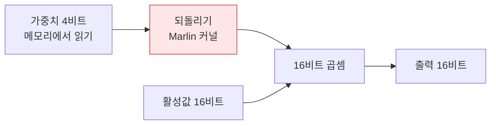
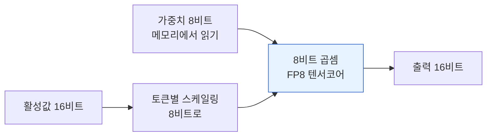
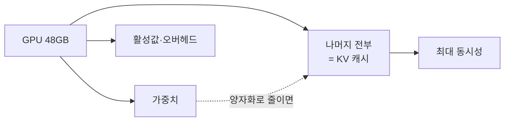

> 해당 포스팅은 현재 재직중인 회사에 관련이 없고, 개인 역량 개발을 위한 스터디 자료로 활용할 예정입니다.

# 양자화 3종 벤치마크 — BF16 · FP8 · GPTQ-Int4

> 원본 실습: O'Reilly *Hands-On LLM Serving and Optimization* (Chi Wang, Peiheng Hu) `ch06/quantization_3way_300.ipynb`
>
> 검증 환경: AWS EC2 g6e.xlarge (NVIDIA L40S 48GB, compute capability 8.9) · vLLM 0.8.5.post1 · transformers 4.51.3 · CUDA 12.4 · Qwen2.5-7B-Instruct

양자화 설명은 보통 "가중치 정밀도를 낮추면 메모리가 줄고 속도가 빨라진다"에서 멈춘다. 틀린 말은 아닌데, 막상 서비스에 넣을지 결정하려고 하면 이 문장만으로는 아무것도 고를 수 없다. 얼마나 빨라지는지, 어떤 상황에서 빨라지는지, 그 대가로 무엇을 내주는지까지 알아야 판단이 선다.

그래서 Qwen2.5-7B 한 모델을 세 가지 정밀도로 준비해 같은 GPU에 번갈아 올리고, 동시성을 1에서 300까지 올려가며 직접 재봤다. 비교 대상은 BF16 원본, FP8-dynamic(W8A8), GPTQ-Int4(W4A16) 세 가지다.

결론부터 적으면, 모든 지표를 다 가져가는 변형은 없었다. 처리량은 GPTQ-Int4가 전 구간에서 1위였지만, 동시성이 높을 때의 지연과 원본 대비 출력 충실도는 둘 다 FP8이 가장 좋았다. 함정도 하나 있는데, 인스턴스 타입을 잘못 고르면 FP8이 에러 하나 없이 W8A16으로 격하돼서 비교 자체가 무의미해진다.

<!--truncate-->

---

## 용어 사전

### 양자화 표기

| 용어 | 의미 |
|---|---|
| W4A16 | 가중치 4비트, 활성값 16비트. 가중치만 압축하고 연산은 16비트로 되돌려 수행한다 |
| W8A8 | 가중치와 활성값 모두 8비트. 연산도 8비트로 하므로 GPU가 그 정밀도를 지원해야 한다 |
| GPTQ | 학습 후 양자화 기법. 레이어별로 오차를 보정하며 가중치를 4비트로 내린다 |
| FP8 | 8비트 부동소수점. INT8과 달리 지수부가 있어 동적 범위가 넓다 |
| dynamic / static | 활성값 스케일을 요청마다 계산(dynamic)하거나 미리 고정(static)한다 |
| group_size | 양자화 스케일을 공유하는 가중치 묶음 크기. 작을수록 정확하고 메타데이터가 늘어난다 |

### 서빙 지표

| 용어 | 의미 |
|---|---|
| TTFT | Time To First Token. 요청부터 첫 토큰까지. 체감 응답성 |
| TPOT | Time Per Output Token. 첫 토큰 이후 토큰당 생성 시간. 스트리밍 속도 |
| ITL | Inter-Token Latency. 토큰 간 간격. TPOT과 거의 같은 것을 다른 방식으로 본다 |
| 총 처리량 | 입력과 출력 토큰을 합친 초당 처리량. 하드웨어 활용도를 본다 |
| 동시성 | 동시에 처리 중인 요청 수. `--max-concurrency` 로 상한을 건다 |
| p99 | 99번째 백분위. 요청 100건을 느린 순으로 줄 세웠을 때 가장 느린 1건 쪽의 값 |
| 꼬리 지연 (tail latency) | 지연 분포의 느린 쪽 끝. 평균이 아니라 p99 로 본다. 사용자가 체감하는 최악값이고 SLO 도 대개 여기에 걸린다 |

### GPU와 vLLM

| 용어 | 의미 |
|---|---|
| compute capability | NVIDIA GPU 세대 번호. FP8 연산은 8.9 이상에서만 네이티브다 |
| KV 캐시 | 이미 계산한 어텐션 키·값 저장 공간. 남은 GPU 메모리를 전부 쓴다 |
| 최대 동시성 | KV 캐시가 감당할 수 있는 최대 요청 수. vLLM이 기동 시 계산해 로그로 알려준다 |
| Marlin | 4비트 가중치를 GPU에서 빠르게 되돌리는 커널. GPTQ 서빙에 쓰인다 |
| compressed-tensors | FP8·INT8 양자화 모델의 표준 저장 형식 |

---

## 1. 인스턴스 선택에 따른 실험 결과

준비 단계에서 가장 먼저 걸린 것이 GPU 선택이었다. FP8 때문인데, vLLM 문서에 이런 조건이 붙어 있다.

> FP8 computation is supported on NVIDIA GPUs with compute capability >= 8.9 (Ada Lovelace, Hopper). FP8 models **will run** on compute capability >= 8.0 (Ampere) as **weight-only W8A16**, utilizing FP8 Marlin.

문제가 되는 표현이 "will run"이다. compute capability가 8.9에 못 미치는 GPU에서도 FP8 모델은 에러 없이 잘 돌아간다. 다만 가중치와 활성값을 모두 8비트로 쓰는 W8A8 대신, 가중치만 8비트로 두고 계산은 16비트로 하는 W8A16으로 조용히 바뀐다. 벤치마크는 아무 불평 없이 숫자를 뱉어주는데, 정작 그 숫자는 내가 재려던 것과 다른 실험의 결과다.

us-west-2에서 쓸 수 있는 후보를 모아보면 세대 차이가 바로 드러난다.

| 인스턴스 | GPU | 메모리 | compute capability | FP8 | 온디맨드 (us-west-2) |
|---|---|---|---|---|---|
| g5.xlarge | A10G | 24GB | 8.6 | **격하됨** | $1.006 |
| g6.xlarge | L4 | 24GB | 8.9 | 네이티브 | $0.805 |
| g6e.xlarge | L40S | 48GB | 8.9 | 네이티브 | $1.861 |

g5는 g6보다 시간당 요금이 비싼데 FP8도 제대로 돌리지 못한다. 구세대를 골라야 할 이유가 딱히 없었다.

남은 선택은 24GB와 48GB였고 48GB를 골랐다. Qwen2.5-7B의 BF16 가중치가 약 14GB인데, 24GB짜리에 올리면 KV 캐시로 쓸 자리가 몇 GB밖에 남지 않는다. 그러면 BF16만 유독 좁은 데서 실행되게 되고, 양자화가 더 좋아 보이는 결과가 나온다. 세 변형을 공정하게 비교하려면 셋 모두 KV 캐시에 같은 여유를 두고 출발해야 했다.

인스턴스를 띄운 뒤 조건을 만족하는지부터 확인했다.

```
$ nvidia-smi --query-gpu=name,memory.total,driver_version,compute_cap --format=csv,noheader
NVIDIA L40S, 46068 MiB, 595.91.07, 8.9
```

> **실제 확인**: compute capability 8.9, 48GB 중 46068 MiB 가용. FP8 네이티브 경로가 열렸다. 이 값이 8.6으로 찍혔다면 아래 나오는 FP8 숫자는 전부 다른 실험의 결과가 된다.

---

## 2. 세 가지 정밀도의 차이

노트북이 쓰는 모델 세 개는 뿌리가 같다. 모두 Qwen2.5-7B-Instruct에서 파생됐고, 다른 것은 가중치를 어떤 정밀도로 저장했는지뿐이다.

```
Qwen/Qwen2.5-7B-Instruct                     BF16 원본
Qwen/Qwen2.5-7B-Instruct-GPTQ-Int4           W4A16
RedHatAI/Qwen2.5-7B-Instruct-FP8-dynamic     W8A8
```

이름만 보고는 실제로 어떤 스킴인지 알 수 없으니 각 모델의 `config.json`을 열어봤다.

```
GPTQ-Int4:  bits=4  group_size=128  quant_method=gptq  sym=True  desc_act=False

FP8-dynamic: format=float-quantized
             weights     num_bits=8  type=float  strategy=channel  dynamic=False
             activations num_bits=8  type=float  strategy=token    dynamic=True
```

FP8 쪽 설정을 보면 이름에 붙은 "dynamic"이 무엇을 가리키는 말인지 알 수 있다. 가중치는 채널별로 스케일을 미리 고정해두지만(`dynamic=False`), 활성값은 요청이 들어올 때마다 토큰별로 스케일을 다시 계산한다(`dynamic=True`). 활성값까지 8비트로 다루기 때문에 W8A8이고, 그래서 GPU가 FP8 연산을 지원해야 한다.

이 두 방식이 GPU 안에서 실제로 어떻게 계산되는지가 뒤에 나올 성능 차이를 거의 다 설명해준다.

**W4A16 (GPTQ-Int4)** — 가중치만 4비트로 저장하고 곱셈 전에 16비트로 되돌린다.



**W8A8 (FP8-dynamic)** — 가중치와 활성값을 모두 8비트로 두고 곱셈도 8비트로 한다.



차이는 두 군데다. W4A16은 메모리에서 읽어오는 양이 가장 적은 대신, 곱셈을 하기 전에 4비트를 16비트로 되돌리는 작업을 매번 해야 한다(빨간 상자). W8A8은 읽는 양이 그 중간이지만 8비트끼리 바로 곱하니 되돌리기가 아예 없다(파란 상자). 그 대신 8비트 곱셈을 할 수 있는 GPU가 필요하다.

그래서 어느 쪽이 유리한지는 그때그때 무엇이 병목인지에 달려 있다. 메모리를 많이 읽어야 하는 상황이면 W4A16이 이기고, 곱셈을 많이 해야 하는 상황이면 W8A8이 이긴다. 4절 결과가 정확히 이 모양으로 나온다.

GPTQ 설정의 `group_size=128`은 가중치 128개가 스케일 하나를 나눠 쓴다는 뜻이다. `desc_act=False`는 활성값 크기 순으로 가중치를 재배열하지 않는다는 것으로, 정확도를 약간 내주고 커널 효율을 챙기는 쪽을 택한 설정이다.

서빙을 올리면 vLLM이 어떤 커널 경로를 골랐는지 로그에 남는다.

```
[bf16]        quantization=None
[gptq_int4]   quantization=gptq_marlin        ← Marlin 커널
[fp8_dynamic] quantization=compressed-tensors
```

> **실제 확인**: FP8 로그에는 Marlin이 없다. compute capability가 8.9에 못 미쳤다면 이 자리에 FP8 Marlin 폴백이 찍혔을 것이다. GPTQ는 Marlin을 쓰고 FP8은 쓰지 않았다는 이 대조가 FP8이 네이티브 W8A8로 돌았다는 증거다.

---

## 3. 가중치와 KV 캐시 연관성

양자화의 효과는 모델 파일이 작아지는 데서 끝나지 않는다. vLLM은 가중치를 GPU에 올린 다음 남은 메모리를 전부 KV 캐시로 잡아버린다. 그래서 가중치가 줄면 그만큼 캐시가 늘고, 캐시가 늘면 한 번에 받을 수 있는 요청 수가 늘어난다. 메모리를 아꼈다는 말이 곧 처리량 여유가 생겼다는 말이 되는 구조다.



세 변형을 각각 띄워보면 기동 로그에 이 값이 그대로 찍힌다.

```
[bf16]        Model loading took 14.2488 GiB
              GPU KV cache size: 444,592 tokens
              Maximum concurrency for 32,768 tokens per request: 13.57x

[fp8_dynamic] Model loading took 8.1426 GiB
              GPU KV cache size: 553,216 tokens
              Maximum concurrency for 32,768 tokens per request: 16.88x

[gptq_int4]   Model loading took 5.1811 GiB
              GPU KV cache size: 611,248 tokens
              Maximum concurrency for 32,768 tokens per request: 18.65x
```

정리하면 이렇게 갈린다.

| 변형 | 가중치 | BF16 대비 | KV 캐시 | BF16 대비 | 최대 동시성 |
|---|---|---|---|---|---|
| BF16 | 14.25 GiB | — | 444,592 tok | — | 13.57x |
| FP8-dynamic | 8.14 GiB | −43% | 553,216 tok | +24% | 16.88x |
| GPTQ-Int4 | 5.18 GiB | −64% | 611,248 tok | +37% | 18.65x |

눈에 걸리는 건 가중치 감소분과 KV 캐시 증가분이 비례하지 않는다는 점이다. GPTQ는 가중치를 64% 줄였는데 KV 캐시는 37%밖에 늘지 않았다. 줄어든 9GB가 전부 캐시로 넘어가지는 않기 때문인데, 활성값 버퍼나 CUDA 그래프 캡처 같은 다른 몫도 같이 늘어나고, 무엇보다 캐시는 이미 44만 토큰이라는 큰 값에서 출발하기 때문에 같은 양이 붙어도 증가율은 작게 보인다.

이 표는 다음 절 결과를 미리 알려주기도 한다. 동시성이 낮을 때는 캐시가 남아돌아서 이 차이가 아무 의미가 없다. 요청이 몰려 캐시 한계에 가까워질수록 비로소 처리량 차이로 드러난다.

---

## 4. 처리량과 지연, 그리고 동시성

벤치마크는 vLLM이 같이 제공하는 `benchmark_serving.py`에 ShareGPT 실제 대화 데이터를 넣어 돌렸다. 원본 노트북과 같은 조건이다.

```bash
python3 vllm/benchmarks/benchmark_serving.py \
  --backend vllm \
  --model "$MODEL" \
  --endpoint /v1/completions \
  --dataset-name sharegpt \
  --dataset-path ShareGPT_V3_unfiltered_cleaned_split.json \
  --num-prompts "$NP" \
  --max-concurrency "$CC" \
  --seed 42 \
  --save-result --append-result --result-filename bench.json
```

동시성 1에서는 요청 10건을 하나씩 순서대로 보내 순수한 지연만 재고, 10·100·300에서는 그 수만큼을 한꺼번에 밀어 넣어 포화 상태의 처리량을 본다.


이 실습에서 가장 흥미로웠던 게 오른쪽 패널이다. GPTQ의 선은 오른쪽으로 갈수록 내려가고, FP8의 선은 거의 평평하다.

### 총 처리량

| 동시성 | BF16 | FP8-dynamic | GPTQ-Int4 |
|---|---|---|---|
| 1 | 77.3 | 116.8 (1.51x) | **189.1 (2.44x)** |
| 10 | 312.3 | 480.5 (1.54x) | **760.9 (2.44x)** |
| 100 | 2,015.3 | 3,133.8 (1.55x) | **4,135.2 (2.05x)** |
| 300 | 3,955.3 | 5,407.6 (1.37x) | **6,444.5 (1.63x)** |

단위는 초당 총 토큰이고, 절대값만 보면 GPTQ-Int4가 전 구간 1위다.

그런데 BF16 대비 배수로 바꿔 보면 방향이 반대다. GPTQ의 우위는 동시성이 오를수록 계속 깎인다. 2.44x에서 시작해 2.44x, 2.05x, 1.63x로 내려간다. 반면 FP8은 1.37~1.55x 사이에서 거의 움직이지 않는다.

병목이 옮겨가서 그렇다. 동시성이 낮을 때 GPU는 사실 한가하다. 토큰 하나를 만들려면 모델 가중치 전체를 메모리에서 읽어와야 하는데, 그렇게 읽어온 가중치로 하는 곱셈은 요청 하나 분량밖에 안 된다. 시간의 대부분이 읽는 데 쓰이는 셈이다. 이 구간에서는 읽어야 하는 양이 곧 속도라서, 가중치가 4비트뿐인 GPTQ가 압도적으로 유리하다.

동시성이 올라가면 그림이 바뀐다. 가중치를 한 번 읽어와서 300개 요청의 곱셈을 한꺼번에 처리하니, 읽는 비용은 300개가 나눠 갖고 곱셈 비용만 고스란히 남는다. 이제 병목은 연산 쪽이다. 그런데 GPTQ는 곱셈을 하려면 4비트를 16비트로 되돌리는 단계를 거쳐야 하고, FP8은 8비트 그대로 곱하면 된다. 저동시성에서 GPTQ가 벌어둔 격차를 고동시성에서는 이 되돌리기 비용이 깎아먹는다.


### 토큰당 생성 시간

| 동시성 | BF16 | FP8-dynamic | GPTQ-Int4 |
|---|---|---|---|
| 1 | 21.12 | 13.97 (−34%) | **8.61 (−59%)** |
| 10 | 22.58 | 14.74 (−35%) | **9.37 (−59%)** |
| 100 | 42.47 | **29.45 (−31%)** | 29.52 (−31%) |
| 300 | 74.63 | **59.92 (−20%)** | 69.27 (−7%) |

단위는 밀리초다. 여기서 순위가 뒤집힌다. 동시성 100에서 두 변형이 사실상 같아지고, 300에서는 FP8이 GPTQ보다 빨라진다. 방금 이야기한 되돌리기 비용이 그대로 지연으로 나타난 것이다.

평균 대신 가장 느린 1%를 보면 격차가 더 벌어진다. 동시성 300의 TTFT p99는 FP8이 3,625ms, BF16이 4,228ms, GPTQ가 4,444ms다. **GPTQ가 원본인 BF16보다도 나쁘다.** 전체 처리량을 63% 끌어올린 설정이 가장 운 없는 요청은 216ms 더 기다리게 만든 것이다.

이 꼬리를 봐야 하는 이유는 SLO를 보통 평균이 아니라 p99로 걸기 때문이다. "처리량 63% 개선"만 보고 GPTQ를 골랐다가 "응답 4초 이내" 같은 약속을 깨는 상황이 나올 수 있다.

> **실제 확인**: 동시성 300에서 요청 300개를 모두 끝내는 데 걸린 시간은 GPTQ 19.7초, FP8 23.6초, BF16 32.3초였다. 전체를 밀어내는 속도는 GPTQ가 확실히 빠른데, 개별 사용자가 체감하는 토큰 간격은 FP8이 더 짧다. **배치 작업이라면 GPTQ, 스트리밍 응답이라면 FP8**이라는 갈림이 여기서 생긴다.

---

## 5. 양자화로 잃는 것

처리량 숫자만 보면 양자화는 거의 공짜처럼 보인다. 그럴 리는 없고, 정밀도를 깎았으니 어딘가에서는 값을 치르고 있을 것이다. 같은 프롬프트 6종을 `temperature=0`, `seed=42`로 고정해 세 변형에 넣고 출력을 나란히 놓고 비교했다.

프롬프트는 양자화 손상이 먼저 드러난다고 알려진 축을 골랐다. 다단계 산술, 사실 회상, JSON 형식 준수, 코드 생성, 한국어 생성, 논리 추론이다.

### 정답이 정해진 항목

| 항목 | 기대 | BF16 | FP8 | GPTQ-Int4 |
|---|---|---|---|---|
| 산술 (1,847 × 23 − 156) | 42,325 | 41,939 | 41,939 | 41,905 |
| 사실 (Transformer 논문 연도) | 2017 | 2017 | 2017 | 2017 |
| 추론 (두 번째 연장자) | Bob | Bob | Bob | Bob |

정답률은 세 변형 모두 2/3으로 같다. 그런데 이 표를 보다가 순위보다 먼저 눈에 걸린 게 있었다.

**BF16도 산술을 틀렸다.** 정답은 42,325인데 양자화를 전혀 하지 않은 원본이 41,939를 냈다. 7B 모델이 애초에 이 곱셈을 못 하는 것이다. GPTQ가 41,905로 조금 더 어긋나긴 했지만, 원본부터 틀린 문제였다.

> **실제 확인**: 이 한 줄이 실습에서 제일 값진 결과였다. 양자화한 모델이 오답을 내면 자연스럽게 양자화를 의심하게 된다. **베이스라인을 같은 조건에서 같이 돌려보지 않으면 원래 못 했던 것까지 양자화 탓으로 돌리게 된다.** 품질 회귀를 판단할 때 기준선은 정답이 아니라 원본 출력이다.

### 원본과 얼마나 벌어졌는가

BF16 출력을 기준으로 삼고 문자 단위 유사도를 재보면 어느 쪽이 먼저 흔들리는지 드러난다.

| 항목 | FP8-dynamic | GPTQ-Int4 |
|---|---|---|
| 사실 | 100% | 100% |
| 형식 (JSON) | 100% | 100% |
| 추론 | 100% | 100% |
| 코드 | 100% | 92.4% |
| 산술 | 100% | 66.7% |
| 한국어 | 75.0% | **54.5%** |

**FP8은 여섯 항목 중 다섯에서 BF16과 글자 하나까지 같은 출력을 냈다.** 유일하게 갈린 한국어도 내용은 같고 표현만 조금 달랐다. GPTQ는 한국어에서 가장 크게 벌어졌다.

한국어가 먼저 흔들리는 건 알려진 이야기와 맞아떨어진다. 학습 데이터에 적게 나온 토큰은 확률 분포가 원래 평평해서, 정밀도가 조금만 흔들려도 1등과 2등이 바뀌기 쉽다. 다만 실제 출력을 읽어보면 어느 쪽도 틀린 말을 하지는 않았다.

```
[bf16]  양자화는 모델의 정밀도를 낮추면서도 성능을 유지할 수 있도록 해서 메모리 사용량을
        줄이고 연산 속도를 높일 수 있습니다. …
[fp8]   양자화는 모델의 정밀도를 낮추면서도 성능을 유지할 수 있도록 해서 메모리 사용량을
        줄이고 연산 속도를 향상시킵니다. …
[gptq]  양자화는 모델의 가중치와 입력 데이터를 낮은 비트 수로 표현하여 메모리 사용량과
        연산량을 줄일 수 있으며, 이로 인해 LLM의 추론 속도가 향상됩니다.
```

코드도 셋 다 제대로 동작하는 구현을 냈고, GPTQ만 표현이 달랐다.

```python
# bf16 / fp8
cleaned = ''.join(c.lower() for c in s if c.isalnum())
return cleaned == cleaned[::-1]

# gptq_int4 — join 없이 리스트로 두었다. 리스트끼리 비교하므로 결과는 같다
cleaned = [char.lower() for char in s if char.isalnum()]
return cleaned == cleaned[::-1]
```

JSON 형식 준수는 세 변형이 완전히 같았다. 출력 형식을 딱 정해주는 과제는 양자화에 비교적 강한 편이다.

> **주의**: 프롬프트 6개는 경향을 보려고 만든 표본이지 제대로 된 벤치마크가 아니다. 실제로 도입하기 전에는 자기 워크로드에 맞는 평가셋으로 다시 재야 한다. 그래도 이 정도 표본에서도 **FP8이 원본에 가깝고 GPTQ가 더 멀다**는 것과 **저빈도 언어가 먼저 흔들린다**는 방향은 일관되게 나왔다.

---

## 6. 모델 선택

세 변형을 한 표에 모아놓으면 무엇을 기준으로 골라야 하는지가 보인다.

| 기준 | BF16 | FP8-dynamic | GPTQ-Int4 |
|---|---|---|---|
| 가중치 | 14.25 GiB | 8.14 GiB | **5.18 GiB** |
| KV 캐시 여유 | 444K tok | 553K tok | **611K tok** |
| 처리량 (동시성 300) | 3,955 | 5,408 | **6,445** |
| 토큰당 지연 (동시성 1) | 21.12ms | 13.97ms | **8.61ms** |
| 토큰당 지연 (동시성 300) | 74.63ms | **59.92ms** | 69.27ms |
| TTFT p99 (동시성 300) | 4,228ms | **3,625ms** | 4,444ms |
| 원본 대비 출력 일치 | — | **6항목 중 5항목 완전 일치** | 3항목 일치 |
| GPU 요구 | 없음 | **compute capability 8.9+** | 없음 |

**처리량과 비용이 목표라면 GPTQ-Int4다.** 같은 GPU에서 63% 더 많은 토큰을 밀어내고, 가중치가 5.18GiB까지 줄어드니 더 작은 GPU로 내려갈 여지도 가장 크다. 대신 출력이 원본에서 가장 멀고, 동시성이 높아지면 꼬리 지연이 BF16보다도 나빠진다.

**응답 지연에 목표치가 있다면 FP8-dynamic이다.** 동시성이 높을 때의 TPOT과 TTFT p99가 셋 중 가장 좋고, 출력도 원본과 거의 같다. 단 GPU 조건이 붙는다. compute capability 8.9에 못 미치면 W8A16으로 격하돼서 이 장점이 통째로 사라진다.

**BF16을 그대로 쓸 이유**는 이 실습에서 찾기 어려웠다. 모든 지표에서 뒤지면서 메모리도 가장 많이 쓴다. 그래도 양자화 버전이 아직 안 나온 신규 모델이거나 품질 회귀를 조금도 감당할 수 없는 경우라면, 기준점으로 여전히 필요하다.

---

## 7. 실습시 유의사항

실습을 그대로 따라가면 두 번 멈춘다. 원본 노트북에는 없는 문제인데, Colab 이미지에 이미 깔려 있는 것들이 빈 EC2에는 없어서 생긴다.

**vLLM이 최신 transformers를 끌어온다.** vLLM 0.8.5.post1이 요구하는 버전은 `transformers>=4.51.1`인데 상한이 없다. 그래서 5.x가 설치되고, 5.x에서 사라진 API를 vLLM이 그대로 호출하면서 서빙이 죽는다.

```
AttributeError: Qwen2Tokenizer has no attribute all_special_tokens_extended.
Did you mean: 'num_special_tokens_to_add'?
```

릴리스 당시 버전으로 고정하면 해결된다.

```bash
pip install vllm==0.8.5.post1
pip install "transformers==4.51.3"     # 상한이 없어 5.x 가 올라오는 것을 막는다
```

**벤치마크 스크립트가 vLLM 의존성 밖의 패키지를 쓴다.** `benchmark_serving.py`는 `benchmark_dataset.py`를 임포트하는데, 그쪽에서 `pandas`와 `datasets`를 가져다 쓴다. 둘 다 vLLM 패키지 의존성에는 들어 있지 않다.

```
ModuleNotFoundError: No module named 'pandas'
```

이 실패가 유독 아프다. **서버는 멀쩡하게 뜬다.** 모델을 다 올리고 KV 캐시까지 잡아놓은 다음, 벤치마크만 시작하자마자 죽는다.

```
══ [bf16] 준비 완료 (760초) ══
GPU KV cache size: 444,592 tokens
══ [bf16] 벤치 num-prompts=10 concurrency=1 ══
ModuleNotFoundError: No module named 'pandas'
```

760초를 기다려 띄운 서버를 아무것도 못 재고 버렸다. 모델 로딩처럼 오래 걸리는 단계 앞에는 임포트가 되는지만이라도 먼저 확인해두는 게 좋다.

```bash
python -c "import sys; sys.path.insert(0,'vllm/benchmarks'); import benchmark_serving; print('OK')"
```

**모델 로딩 시간은 비교 지표로 쓰지 말 것.** 로그에 남은 로딩 시간은 변형별로 크게 달랐다.

| 변형 | 로딩 시간 | 비고 |
|---|---|---|
| BF16 (첫 실행) | 600초 | gp3 볼륨 콜드 리드 |
| BF16 (재실행) | 2.8초 | 페이지 캐시 적중 |
| GPTQ-Int4 | 246초 | 첫 읽기 |
| FP8-dynamic | 43.7초 | 첫 읽기 |

같은 BF16이 600초와 2.8초로 갈린다. 이 숫자가 재고 있는 건 모델 크기가 아니라 **디스크 캐시가 따뜻한지 여부다.** 로딩 시간을 굳이 비교하려면 매번 캐시를 비우고 같은 조건에서 재야 한다.

---

## 8. 실습 코드와 비용

### 인스턴스

```bash
# Deep Learning Base OSS Nvidia Driver GPU AMI (Ubuntu 22.04)
# g6e.xlarge = L40S 48GB, compute capability 8.9
# 디스크는 모델 3종 약 29GB + pip 캐시를 고려해 넉넉히 잡는다
aws ec2 run-instances --region us-west-2 \
  --image-id ami-07d2ef80ad2989bdb \
  --instance-type g6e.xlarge \
  --iam-instance-profile Name=<SSM 접속용 프로파일> \
  --block-device-mappings '[{"DeviceName":"/dev/sda1","Ebs":{"VolumeSize":300,"VolumeType":"gp3","DeleteOnTermination":true}}]' \
  --metadata-options 'HttpTokens=required,HttpEndpoint=enabled'
```

SSH 키 없이 SSM Session Manager로만 접속했다. 인바운드 규칙이 하나도 없는 보안 그룹으로 충분하다.

### 환경

```bash
python3 -m venv ~/vllm-env && source ~/vllm-env/bin/activate
pip install vllm==0.8.5.post1
pip install "transformers==4.51.3"        # 5.x 회피 (§7)
pip install pandas datasets                # benchmark_dataset.py 의존 (§7)

# 벤치마크 스크립트는 vllm 리포에 있다. 서빙 버전과 태그를 맞춘다
git clone --depth 1 --branch v0.8.5.post1 https://github.com/vllm-project/vllm.git

wget https://huggingface.co/datasets/anon8231489123/ShareGPT_Vicuna_unfiltered/resolve/main/ShareGPT_V3_unfiltered_cleaned_split.json

# 서빙 전환 시간을 줄이려고 3종을 미리 내려받는다 (약 29GB)
export HF_HUB_ENABLE_HF_TRANSFER=1
for M in Qwen/Qwen2.5-7B-Instruct \
         Qwen/Qwen2.5-7B-Instruct-GPTQ-Int4 \
         RedHatAI/Qwen2.5-7B-Instruct-FP8-dynamic ; do
  hf download "$M"
done
```

### 변형별 실행

```bash
# 서빙. 양자화 방식은 모델 config 에서 자동 판별되므로 플래그가 필요 없다
nohup vllm serve "$MODEL" --disable-log-requests > vllm.log 2>&1 &

# /v1/models 가 200 이면 준비 완료. BF16 은 콜드 리드 시 10분 이상 걸린다
until curl -sf -o /dev/null http://127.0.0.1:8000/v1/models; do sleep 10; done

# 기동 시점의 KV 캐시와 최대 동시성을 남긴다. 4절 표의 근거다
grep -E "Model loading took|GPU KV cache size|Maximum concurrency|quantization=" vllm.log

# 동시성 스윕
for pair in "10 1" "10 10" "100 100" "300 300"; do
  set -- $pair
  python3 vllm/benchmarks/benchmark_serving.py \
    --backend vllm --model "$MODEL" --endpoint /v1/completions \
    --dataset-name sharegpt --dataset-path ShareGPT_V3_unfiltered_cleaned_split.json \
    --num-prompts "$1" --max-concurrency "$2" --seed 42 \
    --save-result --append-result --result-filename bench.json
done

pkill -f "vllm serve"
```

### 품질 비교

`temperature=0`, `seed=42`로 고정해야 변형 간 비교가 성립한다.

```python
body = {
    "model": model,
    "messages": [{"role": "user", "content": prompt}],
    "temperature": 0.0, "top_p": 1.0, "seed": 42, "max_tokens": 200,
}
# POST http://127.0.0.1:8000/v1/chat/completions
```

### 비용

| 항목 | 값 |
|---|---|
| 인스턴스 | g6e.xlarge $1.861/hr (us-west-2 온디맨드) |
| 실사용 | 2.83시간 |
| 합계 | 약 $5.27 |

쓴 시간의 절반 이상이 모델 다운로드와 첫 로딩에 들어갔다. 벤치마크 자체는 변형당 5~8분이면 끝난다. 다 끝나면 인스턴스와 보안 그룹, IAM 역할을 지우고 미부착 볼륨이 남지 않았는지도 확인해두면 좋다.

---

## 마무리

실습을 시작할 때는 "양자화하면 얼마나 빨라지나"를 재려고 했는데, 끝내고 나니 질문이 바뀌어 있었다. 어느 지표를 목표로 삼을지 먼저 정해야 비로소 고를 수 있다. GPTQ-Int4는 처리량 1위였는데 동시성이 높을 때 꼬리 지연은 BF16보다 나빴고, FP8은 처리량 2위였지만 지연과 출력 충실도에서 가장 좋았다.

특히 유용했던 건 절대값보다 배수의 추이였다. GPTQ의 처리량 우위는 동시성이 오르면서 2.44배에서 1.63배로 줄었고, FP8은 1.4배 안팎에서 평평했다. 저동시성에서는 메모리 대역폭이, 고동시성에서는 연산이 병목이라는 설명이 숫자로 그대로 드러난 셈이다. 그래서 동시성 1에서 고른 답과 300에서 고른 답이 달라진다. 자기 서비스가 실제로 어느 구간에서 도는지 알고 재야 한다.

품질 쪽에서는 생각하지 못한 걸 배웠다. BF16 원본이 산술을 틀렸다. 양자화 변형만 놓고 봤다면 정밀도 손실 탓이라고 결론 냈을 것이다. 양자화를 의심하기 전에 원본을 같은 조건에서 한 번 더 돌려봐야 한다.

인프라 쪽에서는 인스턴스 선택이 실험의 유효성 자체를 좌우했다. FP8은 compute capability 8.9에 못 미쳐도 에러 없이 돌아가면서 W8A16으로 내려앉으니, 엉뚱한 것을 재놓고도 모른 채 결론을 낼 수 있다. g5가 g6보다 비싸기까지 하니 GPU 세대 확인은 성능을 챙기는 일이라기보다 실험이 성립하는지 확인하는 일에 가깝다.

다음으로는 AWQ를 넣어 4비트끼리 비교해보고, `--kv-cache-dtype fp8`로 KV 캐시 자체를 양자화해 3절에서 본 캐시 여유를 더 밀어볼 생각이다. 24GB인 g6.xlarge에서 같은 실험을 돌려 베이스라인이 굶을 때 결과가 얼마나 왜곡되는지 확인해보는 것도 남았다.

## 참고 자료

- [Hands-On LLM Serving and Optimization](https://www.oreilly.com/library/view/hands-on-llm-serving/9798341621480/) — 원본 실습 `ch06/quantization_3way_300.ipynb`
- [orca3/llm-model-inference](https://github.com/orca3/llm-model-inference) — 책 소스 코드 저장소
- [vLLM: FP8 W8A8](https://docs.vllm.ai/en/latest/features/quantization/fp8.html) — compute capability 요구사항과 Marlin 폴백
- [vLLM: GPTQ](https://docs.vllm.ai/en/latest/features/quantization/gptq.html)
- [vLLM benchmark_serving.py](https://github.com/vllm-project/vllm/blob/main/benchmarks/benchmark_serving.py)
- [RedHatAI/Qwen2.5-7B-Instruct-FP8-dynamic](https://huggingface.co/RedHatAI/Qwen2.5-7B-Instruct-FP8-dynamic)
- [Amazon EC2 G6e 인스턴스](https://aws.amazon.com/ec2/instance-types/g6e/)

**Tags:** `LLM` `Quantization` `vLLM` `GPTQ` `FP8` `Benchmark` `AWS EC2` `L40S` `Qwen2.5`
