> 해당 포스팅은 현재 재직중인 회사에 관련이 없고, 개인 역량 개발을 위한 스터디 자료로 활용할 예정입니다.

# 고급 LLM 최적화 — 추측 디코딩 · 병렬화 · PD 분리 · KV 캐시 계층

> 원본 학습 자료: O'Reilly *Hands-On LLM Serving and Optimization* (Chi Wang, Peiheng Hu) 7장
>
> 측정 환경: AWS EC2 g6.xlarge (NVIDIA L4 24GB, compute capability 8.9) · g5.12xlarge (A10G 24GB x4, NVLink 없음) · g6.12xlarge (L4 24GB x4, NVLink 없음, 5절 재현) · Qwen2.5-7B-Instruct 타깃 + Qwen2.5-0.5B-Instruct 드래프트

양자화까지 적용하고 나면 단일 GPU에서 짜낼 수 있는 것은 대체로 다 짜낸 상태가 된다. 그다음에 남는 선택지가 이 글에서 다루는 네 가지다. 작은 모델로 토큰을 미리 찍어보는 추측 디코딩, 모델을 여러 GPU에 쪼개는 병렬화, 입력 처리와 출력 생성을 물리적으로 분리하는 PD 분리, 그리고 KV 캐시를 GPU 밖까지 계층으로 관리하는 방법이다. 마지막으로 이 기법들을 실제로 구현해 주는 서빙 프레임워크를 비교한다.

네 기법의 성격이 꽤 다르다. 추측 디코딩과 KV 캐싱은 GPU 한 장에서도 효과를 볼 수 있고 병렬화와 PD 분리는 애초에 GPU가 여러 장 있어야 성립한다. 측정한 것과 개념 정리에서 멈춘 것을 절마다 표시해 두었다.

한 가지만 미리 적어둔다. 추측 디코딩은 흔히 "지연을 2~3배 줄인다"고 소개되는데 이 숫자에는 **동시성이 낮을 때**라는 조건이 빠져 있다. GPU가 한가할 때 남는 연산으로 미리 토큰을 찍어보는 기법이라서 GPU가 이미 배치로 꽉 차 있으면 이득이 사라지고 오히려 손해가 될 수 있다.

<!--truncate-->

---

## 용어 사전

### 추측 디코딩

| 용어 | 의미 |
|---|---|
| target model | 실제로 서빙하려는 큰 모델. 최종 출력의 품질을 결정한다 |
| draft model | 토큰을 미리 찍어보는 작은 모델. 보통 타깃과 같은 계열의 소형 버전을 쓴다 |
| K (num_speculative_tokens) | 한 번에 몇 개를 미리 찍어볼지. 추측 길이 |
| acceptance rate | 미리 찍은 토큰 중 타깃이 승인한 비율. 이 기법의 효율을 결정하는 값 |
| rejection sampling | 승인 여부를 확률적으로 결정하는 절차. 최종 분포가 타깃과 같아지도록 보장한다 |
| ngram 방식 | 드래프트 모델 없이 프롬프트에서 반복 패턴을 찾아 추측한다. 추가 메모리가 들지 않는다 |
| EAGLE / MTP | 타깃 모델의 내부 표현을 재활용해 추측하는 방식. 별도 모델을 덜 필요로 한다 |

### 병렬화

| 용어 | 의미 |
|---|---|
| DP (Data Parallelism) | 모델 전체를 GPU마다 복제하고 요청을 나눈다. 처리량은 늘지만 지연은 그대로다 |
| TP (Tensor Parallelism) | 하나의 행렬곱을 여러 GPU가 나눠 계산한다. 레이어마다 통신이 필요하다 |
| PP (Pipeline Parallelism) | 레이어를 그룹으로 묶어 GPU에 순차 배치한다. 통신이 드물다 |
| EP (Expert Parallelism) | MoE 모델의 Expert를 GPU별로 나눈다 |
| All-Reduce | 여러 GPU의 부분 결과를 합산해 전부에 되돌리는 통신 연산 |
| NVLink | GPU 간 고속 직결 링크. PCIe보다 대역폭이 훨씬 크다 |
| 파이프라인 버블 | PP에서 앞 단계를 기다리며 GPU가 노는 시간 |

### KV 캐시와 서빙

| 용어 | 의미 |
|---|---|
| Prefill | 입력 프롬프트 전체를 한 번에 처리해 KV 캐시를 만드는 단계. 연산이 병목이다 |
| Decode | 토큰을 하나씩 생성하는 단계. 메모리 대역폭이 병목이다 |
| TTFT | Time To First Token. 요청부터 첫 토큰까지. Prefill 시간이 대부분을 차지한다 |
| TPOT / ITL | 첫 토큰 이후 토큰당 생성 시간 및 토큰 간 간격. Decode 속도를 본다 |
| PD 분리 | Prefill과 Decode를 서로 다른 GPU 그룹에 맡기는 구조 |
| Chunked Prefill | 같은 GPU에서 Prefill을 잘게 쪼개 Decode와 번갈아 실행하는 경량 대안 |
| APC (Automatic Prefix Caching) | 요청들이 공유하는 앞부분의 KV를 재사용해 Prefill을 건너뛴다 |
| KV offloading | 당장 안 쓰는 KV를 CPU RAM이나 SSD로 내려두고 필요할 때 되돌린다 |
| KV connector | vLLM이 KV를 인스턴스 밖으로 내보내거나 받아오는 플러그인 지점 |

---

## 1. 측정 범위와 인스턴스 선택

네 기법이 요구하는 GPU 수가 달라서 측정을 두 번에 나눠 돌렸다.

| 절 | 기법 | 최소 GPU | 이 글에서 |
|---|---|---|---|
| 2, 3 | 추측 디코딩 | 1장 | 측정함 |
| 5 | TP, PP | 2장 이상 | 측정함 |
| 5 | EP | 여러 장 + MoE 모델 | 개념만 |
| 6 | PD 분리 | 2장 이상 (Prefill용 + Decode용) | 개념 + 실습 코드 |
| 7 | prefix caching | 1장 | 측정함 |
| 7 | KV offloading | 1장 | 개념 + 실습 코드 |
| 8 | 프레임워크 비교 | 1장 | 개념 + 실습 코드 |

| 인스턴스 | GPU | 총 메모리 | 쓴 곳 |
|---|---|---|---|
| g6.xlarge | L4 x 1 | 24GB | 2·3·7절 |
| g5.12xlarge | A10G x 4 | 96GB | 5절 |
| g6.12xlarge | L4 x 4 | 96GB | 5절 재현 |

단일 GPU 쪽은 g6.xlarge로 충분했다. 추측 디코딩을 켜고 끄며 같은 모델을 비교하는 구조라서 KV 캐시 절대량이 양쪽 arm에 똑같이 작용하고 양자화 실습처럼 베이스라인만 메모리에 굶어 결과가 왜곡될 여지가 없다. 24GB에 타깃 7B(14.2GiB)와 드래프트 0.5B(약 1GiB)를 함께 올리고도 KV 캐시가 4GiB 넘게 남는다.

5절은 GPU 네 장이 필요해서 g5.12xlarge(A10G x4)로 돌렸다. compute capability가 8.9에서 8.6으로 내려가지만 이 실습에는 FP8이 필요 없어서 영향이 없다.

이 인스턴스에 실험상 유리한 조건이 붙어 있다. A10G에도 NVLink가 없다. 5절에서 정리할 "TP는 고속 인터커넥트가 전제"라는 이야기가 NVLink 없이 어떤 모양으로 나타나는지 볼 수 있다.

뒤에 L4 네 장(g6.12xlarge)으로도 같은 arm을 돌려 두 GPU 세대를 맞대어 봤다. 5절 측정 결과에 둘을 나란히 놓았다.

> **실제 확인**: GPU 쌍이 전부 `PHB`로 나온다. NVLink를 뜻하는 `NV#` 항목이 한 곳도 없다. 모든 GPU 간 통신이 PCIe 호스트 브리지, 즉 CPU를 거친다.

```
        GPU0  GPU1  GPU2  GPU3
GPU0     X    PHB   PHB   PHB
GPU1    PHB    X    PHB   PHB
GPU2    PHB   PHB    X    PHB
GPU3    PHB   PHB   PHB    X

PHB = Connection traversing PCIe as well as a PCIe Host Bridge (typically the CPU)
NV# = Connection traversing a bonded set of # NVLinks
```

같은 GPU 수라도 인스턴스 계열에 따라 표기가 갈린다. 재현용으로 쓴 g6.12xlarge(L4 x4)는 전부 `PHB`가 아니라 `NODE`로 나왔다. `NODE`는 PCIe 호스트 브리지 사이의 인터커넥트까지 거친다는 뜻이라 `PHB`보다 한 단계 먼 경로다. 둘 다 NVLink가 없으니 이 절의 결론은 바뀌지 않는다. 다만 인스턴스 계열만 보고 연결 구조를 짐작하면 틀릴 수 있다.

```
        GPU0  GPU1  GPU2  GPU3          # g6.12xlarge (L4 x4)
GPU0     X    NODE  NODE  NODE
GPU1    NODE   X    NODE  NODE
GPU2    NODE  NODE   X    NODE
GPU3    NODE  NODE  NODE   X

NODE = Connection traversing PCIe as well as the interconnect between PCIe Host Bridges within a NUMA node
```

### 접속과 자체 종료

SSH 키를 만들지 않았다. 인바운드 규칙이 하나도 없는 보안 그룹에 SSM Session Manager로만 붙었다. GPU 인스턴스는 살아 있는 동안 계속 과금되므로, 로컬 감시 프로세스에 의존하지 않고 인스턴스가 스스로 죽게 만든다.

```bash
# Deep Learning Base OSS Nvidia Driver GPU AMI (Ubuntu 22.04) 최신 버전을 조회한다
AMI=$(aws ec2 describe-images --region us-west-2 --owners amazon \
  --filters "Name=name,Values=Deep Learning Base OSS Nvidia Driver GPU AMI (Ubuntu 22.04)*" \
            "Name=state,Values=available" \
  --query 'sort_by(Images,&CreationDate)[-1].ImageId' --output text)

# 종료 동작을 terminate 로 두고 user-data 로 halt 타이머를 예약한다.
# 자격 증명이 만료되거나 세션이 끊겨도 예약 시간에 인스턴스가 사라진다.
printf '#!/bin/bash\nshutdown -h +150\n' > /tmp/ud.sh

aws ec2 run-instances --region us-west-2 \
  --image-id "$AMI" --instance-type g6.xlarge \
  --iam-instance-profile Name=<SSM 접속용 프로파일> \
  --security-group-ids <인바운드 없는 SG> --subnet-id <서브넷> \
  --instance-initiated-shutdown-behavior terminate \
  --user-data file:///tmp/ud.sh \
  --block-device-mappings '[{"DeviceName":"/dev/sda1","Ebs":{"VolumeSize":250,"VolumeType":"gp3","DeleteOnTermination":true}}]' \
  --metadata-options 'HttpTokens=required,HttpEndpoint=enabled'
```

AWS CLI가 `--user-data`를 자동으로 base64 인코딩한다. 미리 인코딩해서 넘기면 이중 인코딩되어 스크립트가 실행되지 않는다.

---

## 2. 추측 디코딩의 원리

Decode 단계가 느린 이유는 구조적이다. 토큰 하나를 만들려면 모델 가중치 전체를 메모리에서 읽어와야 하는데 그렇게 읽어온 가중치로 하는 계산은 토큰 한 개 분량뿐이다. GPU의 연산 유닛은 대부분 놀고 시간은 읽는 데 다 쓴다.

추측 디코딩은 이 남는 연산 능력을 쓴다. 작은 드래프트 모델이 다음 토큰 K개를 빠르게 찍어보고 큰 타깃 모델이 그 K개를 한 번의 forward pass로 동시에 검증한다. 검증은 생성과 달리 병렬로 되니, 토큰 하나를 만드는 비용으로 여러 개를 확인한다.

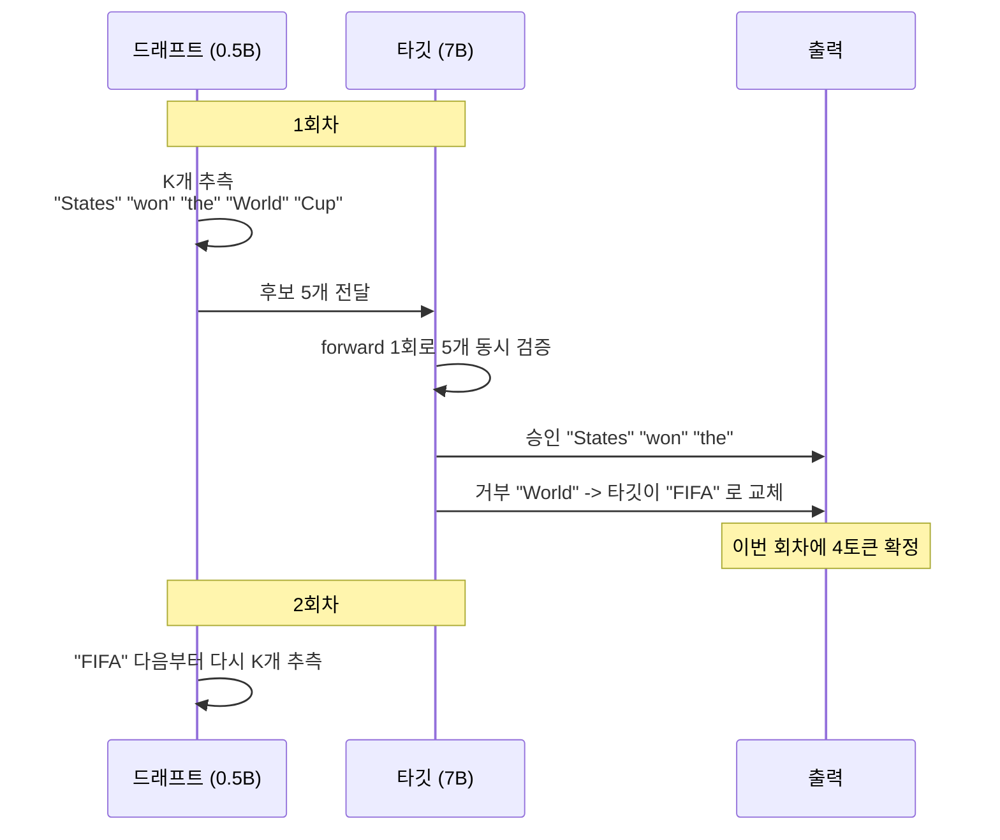

거부가 나온 지점 이후의 추측은 전부 버린다. 그래서 한 회차에 확정되는 토큰 수는 1개에서 K+1개 사이가 된다.

### 품질이 보장되는 이유

추측 디코딩의 핵심 성질은 출력 분포가 타깃 모델 단독 실행과 수학적으로 같다는 점이다. 승인 규칙이 이를 보장한다.

```
토큰 t 에 대해
  p_target(t) >= p_draft(t)  ->  무조건 승인
  p_target(t) <  p_draft(t)  ->  확률 p_target(t)/p_draft(t) 로 승인
거부 시 조정된 분포에서 타깃이 다시 뽑는다
```

드래프트가 과하게 확신한 토큰을 그 비율만큼 깎아 승인하고 거부했을 때는 남은 확률 질량에서 다시 뽑는다. 그래서 드래프트 모델의 품질이 낮아도 최종 출력이 나빠지지 않는다. 드래프트가 나쁠 때 잃는 것은 품질이 아니라 속도다. 승인율이 떨어지면 버리는 토큰이 많아져 헛일이 늘어난다.

| 단계 | 동작 | 비용 |
|---|---|---|
| 추측 | 드래프트가 K개 생성 | 작은 모델이므로 저렴하지만 K회 순차 실행 |
| 검증 | 타깃이 K개를 forward 1회로 확인 | 타깃 토큰 1개 생성과 비슷한 비용 |
| 승인·거부 | 확률 비교로 각 토큰 판정 | 무시할 수준 |
| 교정 | 첫 거부 위치를 타깃이 채움 | 무시할 수준 |

드래프트의 K회 순차 실행은 공짜가 아니다. K를 키우면 한 회차에 확정할 수 있는 최대 토큰이 늘지만 드래프트를 돌리는 시간도 K에 비례해 늘고 뒤쪽 토큰의 승인 확률은 떨어진다. 어디가 최적인지는 재봐야 안다.

### 드래프트 모델을 고르는 기준

| 기준 | 내용 |
|---|---|
| 계열 | 타깃과 같은 계열의 소형 버전. Llama-70B 타깃이면 Llama-8B 드래프트 |
| 크기 | 너무 작으면 승인율이 떨어지고, 너무 크면 속도 이점이 사라진다 |
| vocab_size | **타깃과 같아야 한다.** 계열 이름만 보면 안 된다 (3절 참고) |
| 승인율 목표 | 60% 이상이면 효과적이다 |

### 드래프트 모델 없이 하는 방법

드래프트 모델을 따로 올리는 대신 프롬프트 안에서 반복 패턴을 찾아 추측하는 방식도 있다. vLLM에서는 `ngram`이라고 부른다. 추가 GPU 메모리가 들지 않고 설정도 단순하지만 효과를 보려면 출력이 입력을 상당히 베끼는 작업이어야 한다. 문서 요약, 코드 리팩터링, RAG 응답처럼 원문을 그대로 옮기는 구간이 많으면 잘 맞고 자유로운 대화에서는 승인율이 낮다.

### 효과가 크고 작은 상황

| 효과가 큰 상황 | 효과가 작은 상황 |
|---|---|
| 긴 출력 생성 (200 토큰 이상) | 짧은 응답 (10~20 토큰) |
| 추론·코드 생성처럼 패턴이 예측 가능할 때 | 동시성이 높아 GPU가 이미 배치로 바쁠 때 |
| 단일 사용자, 낮은 동시성 | 드래프트와 타깃의 분포가 많이 다를 때 |

---

## 3. 추측 길이와 수용률

동시성 1·4·16·64에서 다섯 arm을 같은 조건으로 돌렸다. baseline은 추측 디코딩을 끈 상태, ngram은 드래프트 모델 없이 프롬프트에서 반복 패턴을 찾는 방식, 나머지 셋은 Qwen2.5-0.5B를 드래프트로 붙이고 K만 1·3·5로 바꾼 것이다. 데이터는 ShareGPT 실제 대화를 썼다.

### 기동 시 메모리 배분

| arm | 가중치 (GiB) | KV 캐시 (tok) | 최대 동시성 |
|---|---|---|---|
| baseline | 14.29 | 62,512 | 15.26x |
| ngram k=3 | 14.29 | 55,344 | 13.51x |
| draft k=1 | 15.22 | 30,848 | 7.53x |
| draft k=3 | 15.22 | 51,552 | 12.59x |
| draft k=5 | 15.22 | 51,728 | 12.63x |

드래프트 모델을 붙이면 가중치가 14.29GiB에서 15.22GiB로 늘고 그만큼 KV 캐시가 줄어든다. 정작 눈에 걸린 쪽은 ngram이었다. 드래프트 모델이 없는데도 KV가 62,512에서 55,344 토큰으로 줄었다. 추측한 토큰을 검증할 버퍼를 따로 잡기 때문이다. 추측 디코딩을 켜는 것만으로 동시 처리 여력이 깎인다.

`draft k=1`의 KV 캐시가 30,848 토큰으로 유독 낮다. 같은 드래프트 모델을 쓰는 k=3과 k=5가 51,552와 51,728인 것과 맞지 않아 메모리 프로파일링 편차에 가깝다. 이 arm의 고동시성 수치를 해석할 때는 그 편차를 함께 놓고 본다.


### 총 처리량 (tokens/s)

| 동시성 | baseline | ngram k=3 | draft k=1 | draft k=3 | draft k=5 |
|---|---|---|---|---|---|
| 1 | 28.9 | 34.0 (+18%) | 42.2 (+46%) | 52.4 (+82%) | 52.9 (+83%) |
| 4 | 122.9 | 137.9 (+12%) | 179.4 (+46%) | 220.2 (+79%) | 216.1 (+76%) |
| 16 | 376.1 | 415.9 (+11%) | 465.6 (+24%) | 605.8 (+61%) | 649.8 (+73%) |
| 64 | 743.6 | 976.5 (+31%) | 1,248.4 (+68%) | 1,294.1 (+74%) | 1,219.1 (+64%) |

배수로 보면 이렇다.

| arm | 동시성 1 | 동시성 4 | 동시성 16 | 동시성 64 |
|---|---|---|---|---|
| ngram k=3 | 1.18x | 1.12x | 1.11x | 1.31x |
| draft k=1 | 1.46x | 1.46x | 1.24x | 1.68x |
| draft k=3 | 1.82x | 1.79x | 1.61x | 1.74x |
| draft k=5 | 1.83x | 1.76x | 1.73x | 1.64x |

### 책 주장과 어긋난 지점

원본 학습 자료에는 동시성이 오르면 추측 디코딩의 이득이 사라지고 오히려 손해가 된다고 적혀 있다. 이 측정에서는 그렇게 되지 않았다. 동시성 64에서도 draft k=3이 baseline의 1.74배이고 ngram조차 1.31배다.

추세 자체는 분명히 있다. TPOT 감소폭이 동시성 1에서 -45%였다가 64에서 -16%로 줄어든다. 드래프트를 돌리는 비용은 그대로인데 배치가 커지면서 GPU가 점점 바빠지기 때문이다. 다만 이 조합에서는 손익이 뒤집히는 지점이 동시성 64를 넘어간다.

원본 자료는 A100 80GB에 Qwen3-32B를 올려 실험했고 동시성 16에서 ngram이 역전됐다. L4 24GB에 7B를 올린 이 실습은 같은 동시성에서도 아직 메모리 대역폭 병목 구간에 있다. "고동시성에서 손해"는 고정된 기준선이 아니라 GPU와 모델 조합에 따라 위치가 옮겨가는 경계다. 자기 조합에서 그 경계가 어디인지는 재봐야 안다.

> **실제 확인**: 같은 7B를 A10G에서 돌렸을 때 동시성 1 처리량이 43.7 tokens/s였고 L4에서는 28.9였다. 비율 1.51배가 두 GPU의 메모리 대역폭 차이(약 600 GB/s 대 300 GB/s)와 맞아떨어진다. 디코딩이 대역폭에 묶여 있다는 것을 다른 각도에서 확인한 셈이다.


### 토큰당 생성 시간 TPOT 중위 (ms)

| 동시성 | baseline | ngram k=3 | draft k=1 | draft k=3 | draft k=5 |
|---|---|---|---|---|---|
| 1 | 56.54 | 56.54 (-0%) | 38.76 (-31%) | 31.37 (-45%) | 31.35 (-45%) |
| 4 | 58.31 | 55.95 (-4%) | 40.71 (-30%) | 32.48 (-44%) | 33.27 (-43%) |
| 16 | 61.47 | 62.12 (+1%) | 49.23 (-20%) | 40.09 (-35%) | 40.52 (-34%) |
| 64 | 80.17 | 83.65 (+4%) | 69.74 (-13%) | 67.28 (-16%) | 76.20 (-5%) |

### 추측 토큰 수용률

| arm | 동시성 1 | 동시성 4 | 동시성 16 | 동시성 64 |
|---|---|---|---|---|
| ngram k=3 | 35.6% | 36.4% | 36.6% | 34.6% |
| draft k=1 | 71.4% | 71.6% | 72.6% | 73.2% |
| draft k=3 | 53.2% | 52.9% | 53.4% | 54.5% |
| draft k=5 | 41.4% | 41.3% | 42.1% | 42.6% |

수용률은 K가 커질수록 떨어진다. k=1이 약 72%, k=3이 53%, k=5가 42%다. 뒤쪽 토큰일수록 맞히기 어렵다는 성질이 숫자로 나온다. 그런데 처리량은 k=3과 k=5가 거의 같다. 수용률이 낮아져도 한 회차에 확정할 수 있는 최대 토큰 수가 늘어 상쇄되기 때문이다. 원본 자료가 권한 K 4~8 구간과 대략 겹친다.

| K | 특성 | 적합한 상황 |
|---|---|---|
| 3~5 | 안정적, 수용률이 높다 | 일반 텍스트 생성 |
| 5~8 | 더 공격적, 추론 문제에서 효과적 | 코드 생성, 수학 풀이 |
| 8 이상 | 수용률이 크게 떨어질 수 있다 | 반복 텍스트처럼 예측이 매우 쉬운 패턴 |

ngram은 수용률이 35% 안팎으로 가장 낮은데도 전 구간에서 이득을 냈다. 오버헤드가 거의 없어서 낮은 수용률도 감당한다는 설명이 여기서 들어맞았다.

### TTFT 중위 (ms)

| 동시성 | baseline | ngram k=3 | draft k=1 | draft k=3 | draft k=5 |
|---|---|---|---|---|---|
| 1 | 71.1 | 69.7 (-2%) | 146.6 (+106%) | 97.1 (+37%) | 109.4 (+54%) |
| 4 | 179.6 | 132.0 (-27%) | 168.8 (-6%) | 184.1 (+3%) | 227.7 (+27%) |
| 16 | 208.6 | 158.2 (-24%) | 207.3 (-1%) | 243.5 (+17%) | 251.2 (+20%) |
| 64 | 273.8 | 235.3 (-14%) | 286.4 (+5%) | 362.3 (+32%) | 403.1 (+47%) |

TTFT는 두 방식이 반대로 움직인다. 드래프트 모델을 붙이면 나빠진다. 동시성 1에서 k=1이 +106%다. Prefill 시점에 드래프트 모델도 프롬프트를 처리해야 하기 때문이다. 원본 자료가 EAGLE-3에서 관측한 TTFT 악화와 같은 성질이다.

반면 ngram은 TTFT를 개선했다. 동시성 4에서 -27%다. 별도 모델을 올리지 않으니 Prefill 경로에 부담이 붙지 않고 처리량이 올라간 만큼 큐 대기가 줄어든 효과다. TTFT에 SLO가 걸린 서비스라면 드래프트 모델보다 ngram을 먼저 보는 게 낫다.

### [실습] 서버 실행과 수용률 측정

vLLM의 플래그가 바뀌었다. 예전 자료에 나오는 `--speculative-model`과 `--num-speculative-tokens`는 폐기됐다. 지금은 설정 전체를 `--speculative-config` JSON 하나로 넘긴다.

```bash
# 동작하지 않는다
vllm serve Qwen/Qwen2.5-7B-Instruct \
  --speculative-model Qwen/Qwen2.5-0.5B-Instruct --num-speculative-tokens 5

# 드래프트 모델 방식 (현재 형태)
vllm serve Qwen/Qwen2.5-7B-Instruct \
  --port 8000 --seed 42 \
  --max-model-len 4096 --gpu-memory-utilization 0.90 --max-num-seqs 128 \
  --speculative-config '{"method":"draft_model",
    "model":"Qwen/Qwen2.5-0.5B-Instruct",
    "num_speculative_tokens":3,
    "use_heterogeneous_vocab":true}'

# ngram 방식 (드래프트 모델 없음)
vllm serve Qwen/Qwen2.5-7B-Instruct \
  --port 8000 --seed 42 \
  --max-model-len 4096 --gpu-memory-utilization 0.90 --max-num-seqs 128 \
  --speculative-config '{"method":"ngram","num_speculative_tokens":3,"prompt_lookup_max":4,"prompt_lookup_min":2}'
```

`use_heterogeneous_vocab`를 켠 이유가 있다. "드래프트는 같은 계열의 작은 모델을 쓰면 된다"는 조언이 Qwen2.5에서 그대로 깨진다.

```
Value error, Target and draft model should have the same vocabulary size.
Target model vocab_size=152064. Draft model vocab_size=151936.
```

Qwen2.5는 7B 이상이 152064이고 0.5B·1.5B·3B가 151936이다. 같은 계열, 같은 토크나이저인데 임베딩 패딩이 달라 기본 검증에 막힌다. 드래프트 후보를 고를 때 계열 이름만 보지 말고 `config.json`의 `vocab_size`를 먼저 맞춰 보는 편이 빠르다.

드래프트 모델 방식은 vLLM 버전 구간에 따라 지원 여부가 갈렸다. 한동안 제거됐다가 이후 복구된 이력이 있어서 쓰려는 버전에서 실제로 뜨는지 먼저 띄워 본다. 실습 스크립트는 arm 하나가 실패해도 전체를 중단하지 않고 그 arm만 건너뛰도록 만들었다.

동시성 스윕은 전 arm 같은 조건으로 돈다.

```bash
for pair in "10 1" "20 4" "64 16" "128 64"; do
  set -- $pair
  # 카운터는 누적값이다. 벤치마크 전후로 찍어 차이를 내야 구간별 값이 나온다
  curl -s http://127.0.0.1:8000/metrics | grep spec_decode > "pre_cc$2.txt"
  vllm bench serve --backend vllm --model Qwen/Qwen2.5-7B-Instruct \
    --endpoint /v1/completions --dataset-name sharegpt \
    --dataset-path ShareGPT_V3_unfiltered_cleaned_split.json \
    --num-prompts "$1" --max-concurrency "$2" --seed 42 \
    --percentile-metrics ttft,tpot,itl,e2el --metric-percentiles 50,95,99 \
    --save-result --append-result --result-filename bench.json
  curl -s http://127.0.0.1:8000/metrics | grep spec_decode > "post_cc$2.txt"
done
```

`/metrics` 엔드포인트에 누적 카운터가 올라온다.

```bash
curl -s http://127.0.0.1:8000/metrics | grep spec_decode
# vllm:spec_decode_num_accepted_tokens_total   승인된 토큰 누적
# vllm:spec_decode_num_draft_tokens_total      추측한 토큰 누적
# vllm:spec_decode_num_drafts_total            추측 회차 누적
```

수용률은 `accepted / drafted`다. 누적값이므로 구간별 값을 보려면 벤치마크 전후를 각각 찍어 차이를 낸다. 마지막 값만 보면 전 구간 평균이 나와 동시성별 차이가 묻힌다.

또 하나, 드래프트 모델이 GPU를 약 1GiB 먹으므로 baseline과 드래프트 arm의 KV 캐시 크기가 달라진다. 처리량 비교에서 교란 변수가 되니 `--max-model-len`과 `--max-num-seqs`를 전 arm 고정하고 arm별 실측 KV 크기를 기록해 둔다.

```bash
grep -E "Model loading took|GPU KV cache size|Maximum concurrency" vllm.log
```

---

## 4. 추측 디코딩의 여러 방식

드래프트 모델과 ngram 외에도 방식이 여러 가지 있다. 공통점은 "타깃보다 싼 무언가로 후보를 만들고 타깃이 검증한다"이고 후보를 만드는 주체가 다르다.

| 방식 | 후보를 만드는 주체 | 장점 |
|---|---|---|
| Draft Model | 별도의 작은 모델 | 범용적이고 대부분의 프레임워크가 지원한다 |
| EAGLE | 타깃의 hidden state를 재활용하는 경량 헤드 | 드래프트 모델을 따로 올리지 않는다 |
| MTP (Multi-Token Prediction) | 모델 자체. 여러 토큰을 동시에 예측하도록 학습된 경우 | 추가 구성이 없다 |
| n-gram | 입력 텍스트의 n-gram 패턴 매칭 | GPU 자원이 들지 않고 반복 패턴에 강하다 |
| Suffix | 입력의 접미사 | 코드 자동완성에 맞는다 |
| MLP Speculator | hidden state를 받는 작은 MLP | 메모리를 거의 쓰지 않는다 |
| Dynamic | 상황에 따라 K를 조절 | 수용률 변화에 적응한다 |

```bash
# EAGLE 방식 — 타깃에 맞는 헤드 체크포인트가 필요하다
vllm serve <target> --speculative-config '{"method":"eagle","model":"<eagle head>","num_speculative_tokens":3}'

# n-gram 방식 — GPU 추가 자원이 필요하지 않다
vllm serve <target> --speculative-config '{"method":"ngram","num_speculative_tokens":4,"prompt_lookup_max":4}'
```

EAGLE과 MTP는 드래프트 모델이 KV 캐시를 잡아먹는 문제를 피한다. 3절 표에서 드래프트 arm의 KV가 baseline보다 줄어든 게 그 문제인데 별도 모델을 올리지 않는 방식은 그만큼 여유를 남긴다. 대신 EAGLE은 타깃에 맞게 학습된 헤드 체크포인트가 있어야 하고 MTP는 모델이 애초에 그렇게 학습돼 있어야 한다. 아무 모델에나 붙일 수 있는 쪽은 드래프트 모델과 n-gram이다.

---

## 5. 여러 GPU로 모델을 나누는 방법

GPU 네 장(A10G 24GB x 4, NVLink 없음)에서 TP와 PP를 재봤다. Expert Parallelism은 MoE 모델과 더 많은 GPU가 필요해 개념 설명까지만 다룬다.

모델이 GPU 한 장에 안 들어가면 나눠야 한다. 나누는 방향에 따라 성격이 완전히 달라진다.

### 모델을 복제하는 방식

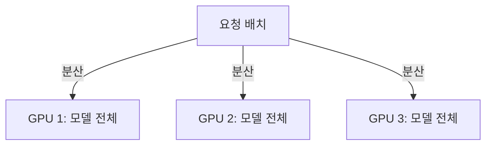

Data Parallelism은 모델 전체를 GPU마다 복제하고 요청을 나눠 준다. 구현이 단순하고 처리량이 GPU 수에 비례해 늘어난다. 다만 요청 하나는 여전히 GPU 하나에서만 처리되니 지연은 전혀 개선되지 않고 무엇보다 모델이 GPU 한 장에 들어가야 쓸 수 있다. 70B급 모델에는 애초에 선택지가 아니다.

### 행렬을 쪼개는 방식 (TP)

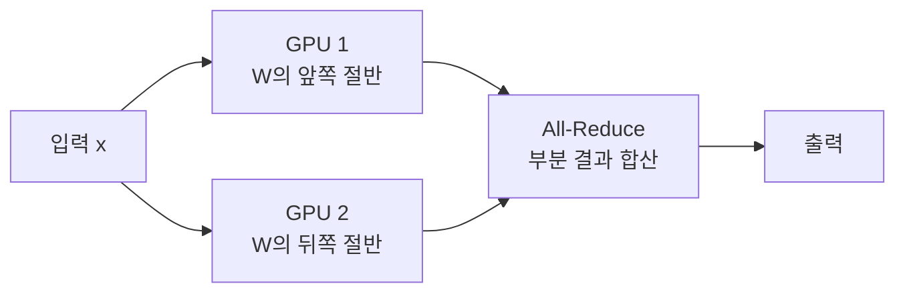

Tensor Parallelism은 하나의 행렬곱 `y = x x W`에서 W를 열 방향으로 잘라 GPU들이 나눠 계산한다. 각 GPU가 결과의 일부만 만들므로 매번 All-Reduce로 합쳐야 한다. 행렬곱 자체가 빨라지니 지연이 GPU 수에 따라 줄어드는 것이 장점이다.

대가는 통신이다. 모든 레이어의 매 연산마다 GPU 간 통신이 일어난다. 그래서 NVLink처럼 대역폭이 큰 직결 링크가 사실상 전제 조건이고 노드를 넘어가면 네트워크 지연 때문에 효율이 급격히 떨어진다.

### 레이어를 나누는 방식 (PP)

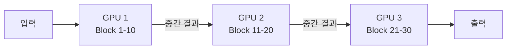

Pipeline Parallelism은 레이어를 깊이 방향으로 잘라 GPU에 순서대로 배치한다. 통신은 레이어 그룹 경계에서만 일어나므로 TP보다 훨씬 드물고 대역폭이 낮은 네트워크로도 감당할 수 있다. 그래서 노드 간 확장에 쓴다.

대신 지연은 잘 줄지 않는다. GPU 2는 GPU 1이 끝나기를 기다려야 하니, 요청 하나가 통과하는 시간은 오히려 통신 오버헤드만큼 늘어난다. 여러 요청을 흘려 넣어 파이프라인을 채워야 GPU 활용률이 올라가고 채우지 못한 구간에서는 버블이 생긴다.

### MoE 모델의 Expert 분산

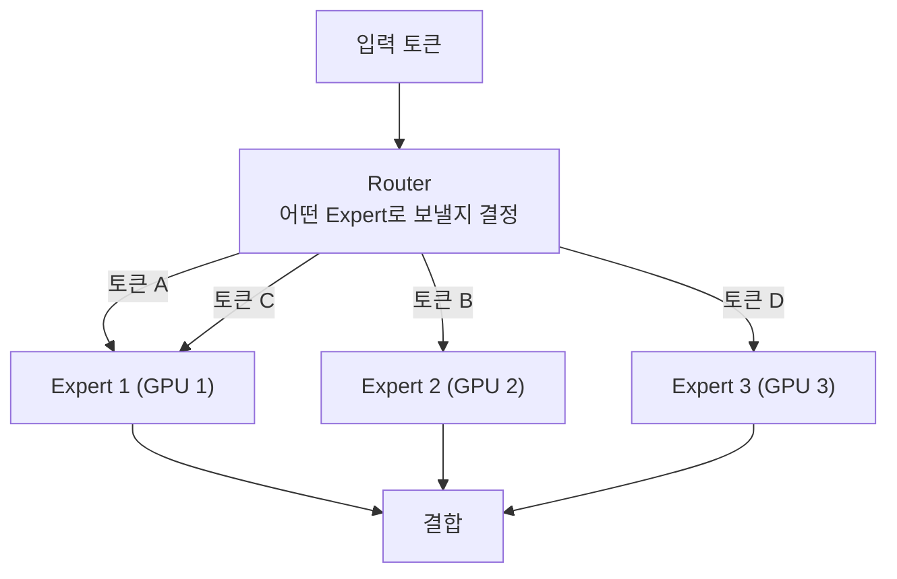

Mixtral이나 DeepSeek-V3 같은 MoE 모델은 MLP가 여러 Expert로 나뉘어 있고 토큰마다 일부만 활성화된다. Expert Parallelism은 Expert를 GPU별로 배치하고 Router가 토큰을 해당 GPU로 보낸다. 토큰이 어느 Expert로 갈지 미리 알 수 없으니 All-to-All 통신이 필요하고 Expert 간 부하가 치우치면 특정 GPU만 바빠지는 문제가 따라온다.

### 무엇을 언제 쓰는가

| 기준 | TP | PP |
|---|---|---|
| 나누는 방향 | 레이어 내부 (너비) | 레이어 사이 (깊이) |
| 통신 빈도 | 매 레이어. 매우 잦다 | 그룹 경계만. 드물다 |
| 필요한 대역폭 | 매우 큼. NVLink 전제 | 상대적으로 작음 |
| 지연 개선 | 된다. 행렬곱이 빨라진다 | 잘 안 된다. 파이프라인 대기가 있다 |
| 적합한 범위 | 노드 안 | 노드 사이 |
| GPU 수 제약 | 어텐션 헤드 수의 약수 | 레이어 수의 약수 |

실무에서는 둘을 겹쳐 쓴다. 노드 안에서는 NVLink로 묶인 GPU끼리 TP를 걸고 노드 사이는 네트워크가 느리니 통신이 드문 PP로 잇는다.

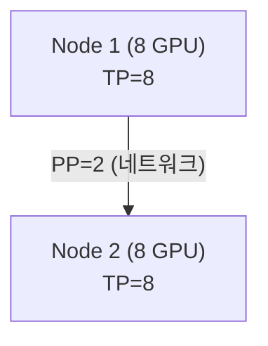

```bash
# 2노드 x 4GPU = 8GPU 구성
vllm serve Qwen/Qwen2.5-72B-Instruct \
  --tensor-parallel-size 4 \
  --pipeline-parallel-size 2
```

### GPU 연결 구조를 먼저 확인한다

위 표의 "NVLink 전제"는 하드웨어 사양 이야기다. 지금 쓰는 인스턴스가 어디에 해당하는지는 직접 봐야 안다.

| 연결 | 대역폭 | 용도 |
|---|---|---|
| NVLink (4세대) | 방향당 약 450 GB/s | GPU 간, 동일 노드 |
| NVSwitch | 노드 내 전체 GPU 전대역 연결 | DGX·p4d·p5 내부 |
| PCIe Gen4 x16 | 약 25 GB/s | GPU 간(NVLink 없을 때), GPU-CPU |
| EFA (AWS) | 400 Gbps (p4d) ~ 3,200 Gbps (p5) | 노드 간 |
| InfiniBand | 400 Gbps 급 | 노드 간 |

AWS에서 실습에 흔히 쓰는 인스턴스별로 정리하면 이렇다.

| 인스턴스 | GPU 간 | 노드 간 |
|---|---|---|
| g5.12xlarge | PCIe (PHB) | EFA 없음 |
| g6.12xlarge | PCIe (NODE) | EFA 없음 |
| g6e.12xlarge | PCIe (PHB) | EFA 지원 |
| p4d.24xlarge | NVLink3 + NVSwitch | EFA 400 Gbps |
| p5.48xlarge | NVLink4 + NVSwitch | EFA 3,200 Gbps |

```bash
nvidia-smi topo -m                       # NV# 표기가 있으면 NVLink
fi_info -p efa 2>/dev/null | head -20    # EFA 디바이스 확인
```

대역폭을 직접 재 두면 TP 결과가 통신에 막혔는지 가릴 수 있다.

```python
import torch, time
size = 256 * 1024 * 1024 // 2                       # 256 MiB of fp16
a = torch.empty(size, dtype=torch.float16, device="cuda:0")
b = torch.empty(size, dtype=torch.float16, device="cuda:1")
for _ in range(3): b.copy_(a)
torch.cuda.synchronize()
t0 = time.perf_counter()
for _ in range(20): b.copy_(a)
torch.cuda.synchronize()
print(f"{size*2/1e9/((time.perf_counter()-t0)/20):.1f} GB/s")
```

노드 간 실습은 인스턴스 두 대와 클러스터 배치 그룹이 필요하다. EFA는 같은 서브넷에 있고 자기 참조 규칙이 있는 보안 그룹이어야 동작한다. 여기까지 가면 시간당 비용이 크게 오르므로, "노드 간 TP를 피한다"는 결론을 확인하려면 먼저 단일 노드에서 PCIe 경유 TP의 성능 저하 폭부터 재 보는 것이 순서다.

### 측정 결과

네 가지를 확인하려고 arm을 짰다. 한 장에 들어가는 7B를 굳이 쪼갰을 때 어떻게 되는가. 한 장에 안 들어가는 14B는 정말 실패하는가, PCIe만으로 연결된 GPU에서 TP 확장 효율이 얼마나 깎이는가, 같은 GPU 수에서 TP와 PP의 지연 특성이 어떻게 다른가.

| arm | GPU | 상태 | 랭크당 가중치 (GiB) | KV 캐시 (tok) | 최대 동시성 |
|---|---|---|---|---|---|
| 7B TP=1 | 1 | OK | 14.29 | 62,688 | 15.30x |
| 7B TP=2 | 2 | OK | 7.16 | 431,344 | 105.31x |
| 7B TP=4 | 4 | OK | 3.63 | 1,175,168 | 286.91x |
| 14B TP=1 | 1 | **FAILED (OOM)** | — | — | — |
| 14B TP=2 | 2 | OK | 13.93 | 47,504 | 11.60x |
| 14B PP=2 | 2 | OK | 13.79 | 49,744 | 12.14x |
| 14B TP=4 | 4 | OK | 6.95 | 261,856 | 63.93x |

같은 arm 구성을 L4 네 장(g6.12xlarge, vLLM 0.28.0)에서 한 번 더 돌렸다. 아키텍처가 A10G에서 L4로 바뀌고 compute capability가 8.6에서 8.9로 올라가는데도 메모리 쪽 숫자는 거의 움직이지 않는다.

| arm | GPU | 상태 | 랭크당 가중치 (GiB) | KV 캐시 (tok) | 최대 동시성 |
|---|---|---|---|---|---|
| 7B TP=1 | 1 | OK | 14.29 | 62,512 | 15.26x |
| 7B TP=2 | 2 | OK | 7.16 | 446,192 | 108.93x |
| 7B TP=4 | 4 | OK | 3.63 | 1,170,336 | 285.73x |
| 14B TP=1 | 1 | **FAILED (OOM)** | — | — | — |
| 14B TP=2 | 2 | OK | 13.93 | 54,224 | 13.24x |
| 14B PP=2 | 2 | OK | 13.79 | 49,488 | 12.08x |
| 14B TP=4 | 4 | OK | 6.95 | 267,360 | 65.27x |

랭크당 가중치는 일곱 arm 전부 소수점까지 같다. 가중치 분할은 GPU 종류와 무관한 산술이니 그래야 맞다. KV 토큰 수와 최대 동시성은 1~4% 안에서 흔들린다. 이 정도는 vLLM 버전과 메모리 프로파일링 편차에서 온다.

> **재현 못 한 부분**: 이번 L4 회차에서 arm별 지연·처리량 수치는 회수하지 못했다. 측정 자체는 일곱 arm 전부 성공했는데 결과 파일을 인스턴스에서 내리는 단계가 깨졌다(11절). 따라서 아래 처리량·TPOT 표와 TP/PP 대조는 모두 A10G 회차 숫자다. L4에서 교차 확인된 것은 메모리 쪽(가중치·KV·최대 동시성)과 OOM 재현까지다.

#### 14B 를 한 장에 올리려는 시도

가장 먼저 나온 결과는 실패였다. Qwen2.5-14B의 BF16 가중치는 약 27.5GiB인데 A10G 한 장의 가용 메모리는 22.06GiB다.

```
torch.OutOfMemoryError: CUDA out of memory. Tried to allocate 270.00 MiB.
GPU 0 has a total capacity of 22.06 GiB of which 127.44 MiB is free.
Including non-PyTorch memory, this process has 21.93 GiB memory in use.
```

기동 35초 만에 죽었다. "모델이 GPU 한 장에 안 들어가면 나눠야 한다"가 최적화 선택이 아니라 전제 조건이었다.

L4 한 장에서도 같은 자리에서 같은 크기로 막힌다. 가용 메모리가 22.06GiB에서 22.04GiB로 바뀌는 것 말고는 메시지가 같다.

```
torch.OutOfMemoryError: CUDA out of memory. Tried to allocate 270.00 MiB.
GPU 0 has a total capacity of 22.04 GiB of which 179.12 MiB is free.
Including non-PyTorch memory, this process has 21.85 GiB memory in use.
```

#### 한 장에 들어가는 모델을 쪼갰을 때


여기서 예상이 틀렸다. 한 장에 들어가는 모델을 쪼개면 통신 비용만 붙어 손해일 것으로 봤는데 반대였다.

**7B 총 처리량 (tokens/s)**

| 동시성 | 7B TP=1 | 7B TP=2 | 7B TP=4 |
|---|---|---|---|
| 1 | 43.7 | 80.3 (+84%) | 130.6 (+199%) |
| 8 | 367.2 | 633.6 (+73%) | 937.0 (+155%) |
| 32 | 793.1 | 1,167.5 (+47%) | 1,658.8 (+109%) |

**7B TPOT 중위 (ms)**

| 동시성 | 7B TP=1 | 7B TP=2 | 7B TP=4 |
|---|---|---|---|
| 1 | 32.70 | 17.55 (-46%) | 10.73 (-67%) |
| 8 | 34.75 | 21.09 (-39%) | 13.94 (-60%) |
| 32 | 38.94 | 30.45 (-22%) | 24.64 (-37%) |

동시성 1에서 TP=2가 1.84배, TP=4가 2.99배다. TPOT는 32.70ms에서 17.55ms, 10.73ms로 거의 GPU 수에 반비례한다.

2절에서 정리한 원리가 그대로 작동한 결과다. 저동시성 디코딩은 메모리 대역폭에 묶인다. TP는 가중치를 N등분하니 GPU 하나가 토큰당 읽어야 하는 양이 1/N로 줄고 합산 대역폭이 N배가 된다. PCIe를 타는 All-Reduce 비용은 이 이득에 비하면 작다.

그렇다고 "TP는 고속 인터커넥트가 전제"라는 이야기가 틀린 것은 아니다. 다른 모양으로 나타난다. TP=2의 이득이 동시성 1에서 1.84배였다가 32에서 1.47배로 깎이고 TP=4는 2.99배에서 2.09배로 떨어진다. 배치가 커지면 All-Reduce로 주고받을 활성값이 늘어나 PCIe 대역폭이 병목으로 올라온다. 인터커넥트의 대가는 고정된 페널티로 오지 않고 배치가 커질수록 벌어지는 효율 저하로 온다.

#### 예상하지 못한 소득

KV 캐시가 함께 늘어난 폭이 처리량 이득보다 컸다. 7B TP=1이 62,688 토큰인데 TP=4는 1,175,168 토큰으로 **18.7배**다.

두 가지가 겹쳐서 초선형이 됐다. 총 GPU 메모리가 24GB에서 96GB로 늘어나는데 가중치 총량은 14.3GiB로 그대로라, KV로 쓸 여유가 약 7.7GiB에서 73.5GiB로 9.5배 커진다. 여기에 KV 자체도 랭크별로 쪼개져 담긴다. 최대 동시성 표기가 15.30x에서 286.91x로 올라간 것이 그 결과다.

L4 쪽 숫자가 이 대목을 받쳐 준다. 62,512 토큰에서 1,170,336 토큰으로 18.7배, 최대 동시성은 15.26x에서 285.73x다. 배수가 소수점 첫째 자리까지 A10G와 같다. GPU 아키텍처가 아니라 메모리 산술에서 나오는 소득이라 그렇다.

TP를 "큰 모델을 올리는 수단"이나 "행렬곱을 빠르게 하는 수단"으로만 보면 이 부분을 놓친다. 저동시성 환경에서 TP의 실질적 최대 수확은 FLOPs가 아니라 KV 캐시 여유일 수 있다.

#### TP 와 PP 를 같은 GPU 수로 비교하면

14B를 GPU 두 장에 올리는 방법이 두 가지다. TP=2로 행렬을 쪼개거나 PP=2로 레이어를 나눈다.

**14B 총 처리량 (tokens/s)**

| 동시성 | 14B TP=2 | 14B PP=2 | 14B TP=4 |
|---|---|---|---|
| 1 | 41.8 | 24.0 (-42%) | 70.8 (+69%) |
| 8 | 311.6 | 187.9 (-40%) | 470.6 (+51%) |
| 32 | 592.2 | 389.1 (-34%) | 821.3 (+39%) |

**14B TPOT 중위 (ms)**

| 동시성 | 14B TP=2 | 14B PP=2 | 14B TP=4 |
|---|---|---|---|
| 1 | 33.70 | 59.47 (+76%) | 19.79 (-41%) |
| 8 | 41.65 | 69.06 (+66%) | 27.80 (-33%) |
| 32 | 60.51 | 80.75 (+33%) | 47.13 (-22%) |

**14B TTFT p99 (ms)**

| 동시성 | 14B TP=2 | 14B PP=2 | 14B TP=4 |
|---|---|---|---|
| 1 | 447.5 | 373.5 (-17%) | 467.4 (+4%) |
| 8 | 533.4 | 443.1 (-17%) | 518.6 (-3%) |
| 32 | 1,713.8 | 1,227.8 (-28%) | 1,842.9 (+8%) |

"TP는 지연을 줄이고 PP는 못 줄인다"가 그대로 확인된다. PP=2의 TPOT가 TP=2보다 동시성 1에서 76%, 32에서 33% 나쁘다. PP에서 토큰 하나는 GPU 1을 통과한 뒤 GPU 2를 순차로 지나야 하는데 TP는 두 GPU가 같은 토큰의 행렬곱을 동시에 나눠 계산한다.

> **실제 확인**: 원본 자료에 없는 것이 하나 나왔다. PP=2의 TTFT p99가 오히려 17~28% 좋다. PP는 레이어 그룹 경계에서만 통신하니, 활성값이 큰 Prefill 구간에서 통신 부담이 덜하다. 기동 시간도 4.42초 대 7.28초로 PP가 빨랐다. NCCL 초기화가 가볍기 때문이다. TTFT가 중요하고 TPOT는 여유가 있는 워크로드라면 PP도 선택지가 된다.

한 가지 주의할 이상치가 있다. 7B TP=2의 동시성 32 TTFT 중위가 504.4ms로 TP=1(194.6ms)과 TP=4(149.3ms)보다 튄다. 같은 arm의 다른 지표는 정상 범위이므로 단일 배치 지연일 뿐이니 발견이 아니라 노이즈로 읽는 게 맞다.

### [실습] TP / PP 스윕

```bash
for cfg in "7B 1 1" "7B 2 1" "7B 4 1" "14B 1 1" "14B 2 1" "14B 1 2" "14B 4 1"; do
  set -- $cfg
  case "$1" in 7B) M=Qwen/Qwen2.5-7B-Instruct;; 14B) M=Qwen/Qwen2.5-14B-Instruct;; esac
  vllm serve "$M" --port 8000 --seed 42 \
    --max-model-len 4096 --gpu-memory-utilization 0.90 --max-num-seqs 128 \
    --tensor-parallel-size "$2" --pipeline-parallel-size "$3" > vllm.log 2>&1 &
  until curl -sf -o /dev/null http://127.0.0.1:8000/v1/models; do sleep 5; done
  grep -E "Model loading took|GPU KV cache size|Maximum concurrency" vllm.log
  for pair in "8 1" "24 8" "48 32"; do
    set -- $pair
    vllm bench serve --backend vllm --model "$M" --endpoint /v1/completions \
      --dataset-name sharegpt --dataset-path ShareGPT_V3_unfiltered_cleaned_split.json \
      --num-prompts "$1" --max-concurrency "$2" --seed 42 \
      --percentile-metrics ttft,tpot,itl,e2el --metric-percentiles 50,95,99 \
      --save-result --append-result --result-filename bench.json
  done
  pkill -f "vllm serve"; sleep 15    # 다중 GPU 는 메모리 반환이 느리다
done
```

`14B TP=1`은 실패를 확인하려고 넣었다. `TP=2`와 `PP=2`는 같은 GPU 두 장을 쓰고 통신 빈도만 다르므로, 두 arm의 TPOT 차이가 위 표 서술을 받쳐 준다. 기동 로그의 `GPU KV cache size`를 함께 기록해야 TP가 KV 여유까지 늘린다는 부분을 볼 수 있다.

---

## 6. Prefill 과 Decode 의 분리

> 최소 2 GPU가 필요해 이 글에서는 재지 않았다. 개념과 실습 코드만 정리한다.

Prefill과 Decode는 같은 모델을 쓰지만 하드웨어에 요구하는 것이 정반대다.

| | Prefill | Decode |
|---|---|---|
| 병목 | 연산 (compute-bound) | 메모리 대역폭 (memory-bound) |
| GPU 활용률 | 높다. 큰 행렬곱을 돌린다 | 낮다. 작은 연산을 반복한다 |
| 처리 단위 | 입력 시퀀스 전체 | 토큰 1개 |
| 원하는 하드웨어 | 높은 FLOPS | 넓은 메모리 대역폭 |

한 GPU에서 둘을 같이 돌리면 서로를 방해한다. 긴 프롬프트의 Prefill이 GPU를 오래 붙잡으면 그동안 Decode 중이던 요청들의 토큰 간격이 벌어진다. 반대로 Decode가 대역폭을 계속 먹으면 새로 들어온 요청의 첫 토큰이 늦어진다. 사용자 입장에서는 스트리밍이 끊기거나 응답 시작이 지연되는 형태로 나타난다.

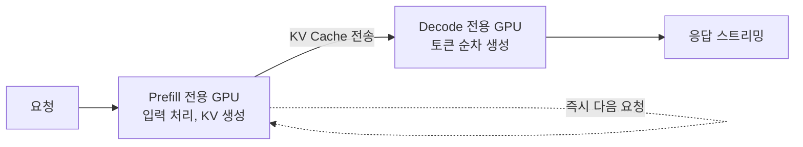

동작 순서는 네 단계다. 요청이 들어오면 Prefill GPU가 입력 전체를 처리해 KV 캐시를 만들고 그 KV를 고속 경로로 Decode GPU에 넘긴다. Decode GPU가 토큰을 하나씩 생성해 스트리밍하는 동안 Prefill GPU는 곧바로 다음 요청을 받는다.

분리하면 각각을 따로 최적화할 수 있다. Prefill 쪽은 연산이 빠른 GPU로, Decode 쪽은 대역폭이 넓고 KV 캐시를 많이 담을 수 있는 GPU로 구성한다.

문제는 KV 캐시를 넘기는 비용이다. KV 크기는 모델과 시퀀스 길이에 따라 수 MB에서 수 GB까지 나오고 그 전송 시간이 TTFT에 그대로 더해진다. 전송이 Prefill보다 오래 걸리면 분리한 의미가 없어지므로 InfiniBand나 NVLink급 연결이 필요하다.

| 상황 | PD 분리 |
|---|---|
| 입력이 길어 Prefill 시간이 Decode를 압도한다 | 적합. 방해 효과가 크다 |
| TTFT와 토큰 간격에 각각 SLO가 걸려 있다 | 적합. 독립 최적화가 가능하다 |
| 동시 요청이 매우 많다 | 적합. Prefill 폭증에도 Decode가 안정적이다 |
| 입력이 짧고 동시성이 낮다 | 부적합. 분리 오버헤드가 이득보다 크다 |
| 노드 간 대역폭이 제한적이다 | 부적합. KV 전송이 새 병목이 된다 |

더 가벼운 대안으로 Chunked Prefill이 있다. GPU를 분리하지 않고 같은 GPU에서 Prefill을 작은 청크로 쪼개 Decode와 번갈아 실행한다. 긴 Prefill이 Decode를 오래 막는 문제를 상당히 완화해 주고 추가 하드웨어가 필요하지 않다. vLLM은 이쪽을 기본으로 켜 둔다. PD 분리는 그걸로 부족할 때 꺼내는 무거운 수단이다.

### [실습] GPU 두 장으로 분리해 보기

vLLM은 이 기능을 experimental로 표시하고 처리량이 개선되지 않는다고 명시한다. 목적은 TTFT와 ITL을 따로 조절하고 꼬리 ITL을 잡는 데 있다. 실습에서 처리량이 떨어져도 실패가 아니다.

통제군은 TP=2로 띄운 한 인스턴스이고 여기서는 Prefill과 Decode가 같은 GPU에서 섞인다. 실험군은 GPU0을 Prefill 전용, GPU1을 Decode 전용으로 두고 KV를 넘긴다.

```bash
# 등록된 커넥터 이름을 먼저 확인한다. 버전마다 바뀐다
python -c "
from vllm.distributed.kv_transfer.kv_connector.factory import KVConnectorFactory as F
reg = getattr(F,'_registry',None) or getattr(F,'_connector_registry',{})
print(sorted(reg.keys()))"

KVDIR=/mnt/nvme/kv_transfer && mkdir -p $KVDIR
KVCFG='{"kv_connector":"ExampleConnector","kv_role":"kv_both",
        "kv_connector_extra_config":{"shared_storage_path":"'$KVDIR'"}}'

# Prefill 전용 (GPU 0)
CUDA_VISIBLE_DEVICES=0 vllm serve Qwen/Qwen2.5-7B-Instruct --port 8100 \
  --max-model-len 8192 --gpu-memory-utilization 0.85 \
  --kv-transfer-config "$KVCFG" > prefill.log 2>&1 &

# Decode 전용 (GPU 1)
CUDA_VISIBLE_DEVICES=1 vllm serve Qwen/Qwen2.5-7B-Instruct --port 8200 \
  --max-model-len 8192 --gpu-memory-utilization 0.85 \
  --kv-transfer-config "$KVCFG" > decode.log 2>&1 &

# 프록시가 요청을 Prefill 에 먼저 보내고 그 다음 Decode 로 넘긴다
python3 pd_proxy.py --port 8000 --prefill 8100 --decode 8200 &
```

프록시가 하는 일은 두 단계다. 먼저 `max_tokens=1`로 Prefill 인스턴스에 보내 입력 전체를 처리하게 하고 그 다음 원래 요청을 Decode 인스턴스로 보낸다. Decode는 커넥터로 KV를 받아 Prefill을 건너뛴다.

프록시를 직접 만들 때 주의할 것이 하나 있다. `vllm bench serve`는 TTFT와 ITL을 재려고 스트리밍을 쓴다. 프록시가 응답을 다 모은 뒤 한 번에 내보내면 TTFT가 전부 같게 나오고 ITL 측정이 무의미해진다. 청크를 받는 즉시 흘려보내야 한다.

측정 뒤에 KV가 실제로 전달됐는지 확인한다. 전송 경로에 파일이 하나도 없으면 Decode가 자체 Prefill로 처리했다는 뜻이고 그러면 비교 자체가 성립하지 않는다.

```bash
find $KVDIR -type f | wc -l && du -sh $KVDIR
```

이 구성의 KV 전송은 같은 호스트의 파일시스템을 지난다. 실제 배포에서는 NIXL이나 RDMA를 쓰고 그때 전송 지연이 크게 줄어든다. 여기서 나오는 전송 비용은 상한에 가깝게 봐야 한다. 프로덕션에서 프록시 역할을 하는 것은 9절의 Orchestration Tier이고 라우팅과 오토스케일링, 장애 처리까지 함께 담당한다.

---

## 7. 긴 컨텍스트와 KV 캐시 계층

컨텍스트가 128K, 1M까지 늘어나면 KV 캐시가 가장 먼저 한계에 부딪힌다. 크기를 직접 계산해 보면 왜 그런지 바로 보인다.

```
토큰당 KV = 2(K와 V) x 레이어 수 x KV 헤드 수 x head_dim x dtype 바이트
```

BF16(2바이트) 기준으로 대표 모델을 넣어 보면 이렇게 나온다.

| 모델 | 레이어 | KV 헤드 | head_dim | 토큰당 KV | 8K 요청 1건 | 128K 요청 1건 |
|---|---|---|---|---|---|---|
| Qwen2.5-7B | 28 | 4 | 128 | 56 KiB | 0.44 GiB | 7.0 GiB |
| Llama-3-8B | 32 | 8 | 128 | 128 KiB | 1.0 GiB | 16.0 GiB |
| Llama-3-70B | 80 | 8 | 128 | 320 KiB | 2.5 GiB | 40.0 GiB |

> **주의**: 이 값들은 GQA(Grouped Query Attention)를 쓰는 최신 모델 기준이다. KV 헤드 수가 어텐션 헤드 수보다 훨씬 적어서 캐시가 그만큼 작아진다. GQA가 없는 구형 MHA 모델은 같은 크기에서도 KV가 몇 배 커진다. 자기 모델의 `config.json`에서 `num_key_value_heads`를 확인해야 한다.

128K 컨텍스트에서는 요청 **한 건**의 KV가 GPU 메모리의 상당 부분을 차지한다. Llama-3-70B라면 40GiB인데, 이건 A100 80GB 한 장의 절반이다. 가중치까지 올려야 하니 한 장으로는 요청 한 건도 온전히 감당하기 어렵다.

이 공식에는 모든 레이어가 컨텍스트 길이에 비례해 KV를 늘린다는 전제가 깔려 있다. 최근 나오는 하이브리드 어텐션 모델은 그 전제를 깬다. 예를 들어 Qwen3.8-27B는 64개 레이어 중 48개가 GDN(Gated Delta Network) 선형 어텐션이고 16개만 전체 어텐션이다. 선형 어텐션 레이어는 고정 크기 상태를 갱신하며 진행하므로 컨텍스트가 길어져도 상태 크기가 그대로다. 이런 모델에 위 공식을 쓸 때 `레이어 수` 자리에 64를 넣으면 실제보다 크게 나온다. 컨텍스트에 비례해 늘어나는 것은 전체 어텐션 레이어 16개 몫뿐이다.

다만 이 보정을 계산으로 끝내려 하면 어긋난다. 같은 모델의 AWQ 4비트판을 L4 24GB 한 장, L40S 45 GiB 한 장, L4 두 장, L4 네 장에서 열 가지 설정으로 재봤는데, KV 메모리를 vLLM 이 찍어주는 토큰 수로 나눈 값이 토큰당 9.3 KiB 에서 119.7 KiB 까지 움직였다(모두 `--kv-cache-dtype fp8`). 움직이는 변수는 `--max-num-seqs`, `--max-model-len`, MTP 사용 여부 셋이다. 선형 어텐션 레이어는 시퀀스마다 고정 크기 상태를 잡으므로, 동시 시퀀스 수를 늘리면 그만큼 토큰에 쓸 자리가 줄고 토큰당 값이 커진다.

그 셋을 고정하면 재현된다. `--max-num-seqs 16`, `--max-model-len 8192`, MTP 끔 조건에서 네 번의 독립 측정이 토큰당 55.1~55.4 KiB 로 모였다. 텐서 병렬은 이 값을 정확히 나눈다. TP=2 에서 27.6 KiB, TP=4 에서 9.3 KiB 로 나왔고 TP 를 곱하면 원래 값으로 돌아온다.

모델 카드가 262,144 토큰에 4.6 GiB 라고 적어둔 값은 KV 캐시 전체가 아니라 262,144 토큰 시퀀스 **한 건**이 차지하는 몫이다. 카드와 같은 설정(TP=2, `--max-num-seqs 4`, MTP 켬)을 재현해 재보니 4.65 GiB 로 1.1% 차이였다. 카드가 함께 적어둔 KV 토큰 560,900개와 262,144 토큰당 최대 동시성 2.14x 도 자리까지 같게 나왔다. 메모리 회계는 GPU 모델이 아니라 모델 구조와 설정으로 결정되므로 VRAM 이 같은 카드라면 같은 숫자가 나온다.

> **실제 확인**: 하이브리드 어텐션 모델에서 토큰당 KV 를 한 번 재서 다른 설정으로 외삽하면 어긋난다. 같은 모델 같은 GPU 에서 `--max-num-seqs` 와 `--max-model-len` 과 MTP 만 바꿔도 토큰당 값이 9.3 KiB 에서 119.7 KiB 까지 벌어졌다. 반면 설정을 고정하면 서로 다른 GPU 에서도 같은 값이 나오고 TP 는 그 값을 정확히 나눈다. 컨텍스트 예산은 공식으로 어림한 뒤 쓰려는 설정 그대로 서버를 한 번 띄워 `Available KV cache memory` 와 `GPU KV cache size` 두 줄을 읽어 확정하는 편이 안전하다.

### 계층으로 내리는 방법

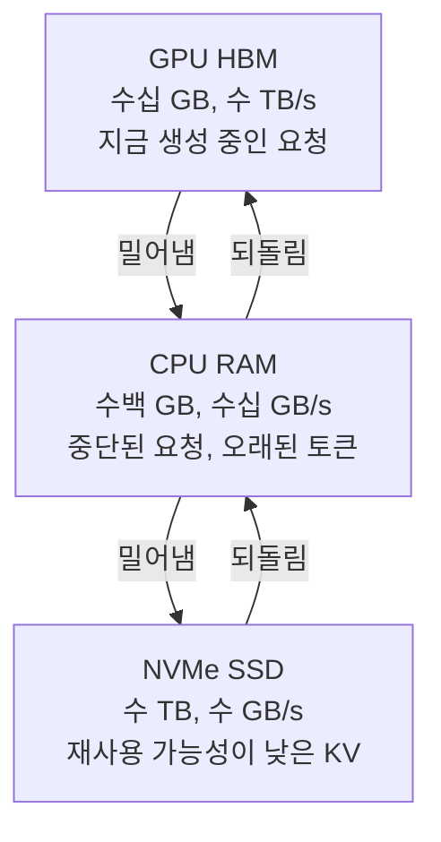

지금 토큰을 만들고 있는 요청의 KV만 GPU에 두고 대기 중이거나 중단된 요청은 CPU RAM으로 내린다. 더 오래된 것은 SSD까지 보낸다. 계층을 내려갈수록 용량은 커지고 속도는 느려지니, 되돌리는 시간이 다시 계산하는 시간보다 짧을 때만 이득이다. 짧은 프롬프트를 SSD에서 되돌리는 것은 그냥 다시 Prefill하는 게 빠르다.

### 자체 호스팅 비용을 계산할 때

```
요청당 비용 = 시간당 인스턴스 비용 / (실측 처리량 req/s x 3600)
```

분모가 되는 처리량은 자기 조합에서 재야 한다. 양자화 수준, 입출력 길이 분포, 동시성이 모두 처리량을 바꾸므로 다른 조합의 숫자를 옮겨 쓰면 계산이 어긋난다. 실측 처리량은 3절과 5절의 `vllm bench serve` 출력에서 나온다.

인스턴스를 고를 때 흔히 인용되는 "A100 80GB 한 장"에 대응하는 AWS 타입을 확인해 둘 필요가 있다. `p4d.xlarge`는 존재하지 않는다. p4d 계열은 `p4d.24xlarge` 하나뿐이고 A100 40GB 여덟 장이며 A100 80GB는 `p4de.24xlarge`다. 8 GPU 인스턴스는 시간당 단가가 한 자리 수 배 높아서 "한 장에 8B 서빙"이라는 전제와 맞지 않는다.

| 목적 | 인스턴스 | GPU |
|---|---|---|
| 8B급 1장 서빙 | g6.xlarge | L4 24GB x1 |
| 8B~14B 여유 | g6e.xlarge | L40S 48GB x1 |
| 70B TP 서빙 | p4d.24xlarge | A100 40GB x8 (NVLink + NVSwitch) |
| 70B+ 긴 컨텍스트 | p5.48xlarge | H100 80GB x8 (NVLink4, EFA 3,200 Gbps) |

단가는 리전과 시점마다 바뀐다. Pricing API로 조회하거나 [Pricing Calculator](https://calculator.aws)에서 확인한다.

```bash
aws pricing get-products --region us-east-1 --service-code AmazonEC2 \
  --filters "Type=TERM_MATCH,Field=instanceType,Value=g6.xlarge" \
            "Type=TERM_MATCH,Field=regionCode,Value=us-west-2" \
            "Type=TERM_MATCH,Field=operatingSystem,Value=Linux" \
            "Type=TERM_MATCH,Field=tenancy,Value=Shared" \
            "Type=TERM_MATCH,Field=preInstalledSw,Value=NA" \
            "Type=TERM_MATCH,Field=capacitystatus,Value=Used" \
  --max-results 1
```

자체 호스팅이 API 호출보다 유리해지는 조건은 일일 요청 수가 충분히 많거나, 프라이빗 네트워크 안에 데이터를 두어야 하거나, 파인튜닝한 커스텀 모델을 쓰거나, GPU를 이미 보유한 경우다.

### 공유 프리픽스 재사용

실무에서 가장 자주 쓰이는 형태는 계층 이동이 아니라 재사용이다. 같은 시스템 프롬프트를 쓰는 요청이 반복되거나, 멀티턴 대화에서 앞 턴이 계속 앞부분에 붙거나, RAG에서 같은 문서가 자주 검색되면, 그 앞부분의 KV는 매번 똑같이 계산된다. 한 번 만들어 두고 다시 쓰면 Prefill을 통째로 건너뛸 수 있다.

vLLM은 이 기능을 Automatic Prefix Caching이라는 이름으로 내장하고 있고 V1 엔진에서는 기본으로 켜져 있다. LMCache 같은 외부 라이브러리는 여기에 CPU와 SSD 계층까지 붙여 캐시 보관 범위를 넓힌다.

토크나이저로 정확히 재서 3001 토큰짜리 공유 프리픽스를 만들고 뒤에만 다른 질문을 붙여 5회 순차 요청을 보냈다. `max_tokens=1`로 두어 Prefill 비용만 재도록 했다. 통제군으로 `--no-enable-prefix-caching`을 건 경우를 나란히 돌렸다.

| 설정 | 1회차 (cold) | 2-5회차 평균 (warm) | 개선 |
|---|---|---|---|
| prefix caching 켬 (기본값) | 763.3 ms | 76.2 ms | **10.01x** |
| prefix caching 끔 | 761.1 ms | 768.8 ms | **0.99x** |

회차별 실측값은 이렇다.

```
prefix caching 켬 : 763.3, 77.3, 75.9, 76.1, 75.6 (ms)
prefix caching 끔 : 761.1, 775.1, 768.1, 764.9, 767.2 (ms)
```

> **실제 확인**: 통제군이 이 측정의 값을 만든다. prefix caching을 끈 쪽은 761.1ms에서 768.8ms로 개선이 전혀 없다. 5회를 반복해도 매번 처음부터 Prefill한다. 켠 쪽만 763.3ms에서 76.2ms로 떨어졌다. 10.01배라는 개선이 캐시 때문이라는 것이 이렇게 확인된다. 통제군이 없으면 GPU 워밍업이나 페이지 캐시 효과와 구분할 수 없다.

`vllm:gpu_prefix_cache_hit_rate` 는 이 버전에서 값이 비어 있었다. 적중률 자체는 확인하지 못했고 지연 감소로 간접 확인했다.

```bash
# prefix caching 끈 상태로 서빙 (V1 은 기본이 켜짐)
vllm serve Qwen/Qwen2.5-7B-Instruct --port 8000 --seed 42 \
  --max-model-len 8192 --gpu-memory-utilization 0.90 \
  --no-enable-prefix-caching

# 적중률 확인
curl -s http://127.0.0.1:8000/metrics | grep prefix_cache
```

### [실습] KV 오프로딩

LMCache 설정 파일의 키가 바뀌었다. 예전 예제의 `local_device`와 `max_local_cache_size`는 현재 `local_cpu`와 `max_local_cpu_size`이고 값의 의미도 청크 개수가 아니라 GB다. 잘못된 키를 주면 오류 없이 조용히 무시되고 캐시가 동작하지 않는다.

```yaml
# lmcache_cpu.yaml — 현재 형태
chunk_size: 256
local_cpu: true
max_local_cpu_size: 8        # GB
```

```bash
LMCACHE_CONFIG_FILE=lmcache_cpu.yaml \
vllm serve Qwen/Qwen2.5-7B-Instruct \
  --kv-transfer-config '{"kv_connector":"LMCacheConnectorV1","kv_role":"kv_both"}'
```

LMCache 없이 vLLM만으로도 CPU 오프로딩을 쓸 수 있다. 내장 `OffloadingConnector`는 CPU 블록의 토큰 수와 확보할 CPU 메모리를 직접 받는다.

```bash
vllm serve Qwen/Qwen2.5-7B-Instruct --kv-transfer-config \
  '{"kv_connector":"OffloadingConnector","kv_role":"kv_both",
    "kv_connector_extra_config":{"block_size":64,"cpu_bytes_to_use":8000000000}}'
```

오프로딩은 GPU를 넘길 때만 일한다. 프리픽스 하나를 반복 요청하면 GPU KV 캐시 안에서 다 해결되고 아래 계층은 아무 일도 하지 않는다. 계층을 내려가는 동작을 보려면 GPU KV 캐시보다 큰 작업집합이 필요하다.

서로 다른 긴 프리픽스 여러 개를 한 번 돌고 같은 순서로 다시 돈다. GPU만 쓰면 앞쪽 프리픽스가 밀려나 2라운드도 cold지만 CPU나 디스크에 남아 있으면 되살아난다. `--gpu-memory-utilization`을 0.72 정도로 좁혀 두면 밀려나는 상황을 만들기 쉽다.

프리픽스를 서로 다르게 만들 때는 구분자를 **앞**에 붙인다. 뒤에 붙이면 앞부분 블록이 공유되어 서로 다른 프리픽스가 아니게 된다.

```python
prefix = f"[dataset {i:02d}] " + unit * n     # 앞에 붙인다
```

g5·g6 계열은 인스턴스 스토어 NVMe를 준다. EBS보다 훨씬 빠르므로 디스크 계층에 쓰기 좋은데, 인스턴스가 사라지면 데이터도 함께 사라진다.

```bash
NVME=$(lsblk -dno NAME,TYPE | awk '$2=="disk" && $1 ~ /^nvme/ {print $1}' | tail -n +2 | head -1)
mkfs.ext4 -qF "/dev/$NVME" && mkdir -p /mnt/nvme && mount "/dev/$NVME" /mnt/nvme
```

---

## 8. LLM 서빙 프레임워크

지금까지 다룬 기법들을 직접 구현하는 일은 거의 없다. 프레임워크가 제공하는 것을 켜고 조정한다. 그래서 어떤 프레임워크가 무엇을 제공하는지가 실무 선택의 상당 부분을 차지한다.

### 일반 ML 서빙 프레임워크로 안 되는 이유

TensorFlow Serving이나 TorchServe 같은 도구는 입력 하나에 출력 하나가 나오는 모델을 전제로 만들어졌다. LLM 서빙에 필요한 것들이 빠져 있다.

| 빠진 기능 | 왜 필요한가 |
|---|---|
| 토큰 레벨 스케줄링 | 요청 단위가 아니라 토큰 단위로 배치를 결정해야 한다 |
| KV 캐시 관리 | 생성이 진행되며 캐시가 늘어난다. 할당·해제·페이징이 필요하다 |
| Long-Context 메모리 처리 | 수십만 토큰 길이의 KV를 다뤄야 한다 |
| Streaming-first 실행 | 토큰이 나오는 즉시 내보내야 한다 |
| Continuous Batching | 끝난 슬롯에 곧바로 새 요청을 넣어야 GPU가 안 논다 |
| 추측 디코딩 | 드래프트 추측과 타깃 검증이 스케줄러와 맞물려야 한다 |

### vLLM 아키텍처

vLLM은 UC Berkeley Sky Lab에서 시작한 오픈소스 프레임워크다. PagedAttention을 처음 도입했고 커뮤니티가 가장 크다.

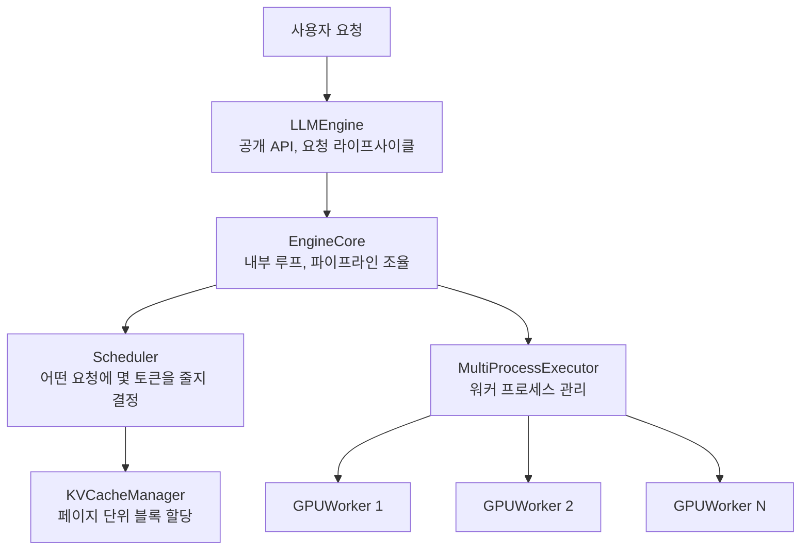

| 컴포넌트 | 역할 |
|---|---|
| LLMEngine | 공개 API. 동기·비동기 서빙과 요청 큐를 관리한다 |
| EngineCore | Scheduler, Executor, OutputProcessor를 조율하는 내부 루프 |
| Scheduler | 어떤 요청에 몇 개 토큰을 처리할지 결정한다. WAITING/RUNNING 큐를 관리한다 |
| MultiProcessExecutor | 워커 프로세스를 만들고 메시지 큐로 통신한다 |
| GPUWorker | CUDA 디바이스에서 실제 forward pass를 실행한다 |
| KVCacheManager | PagedAttention 기반으로 KV 블록을 할당·해제한다 |

#### 기동 흐름

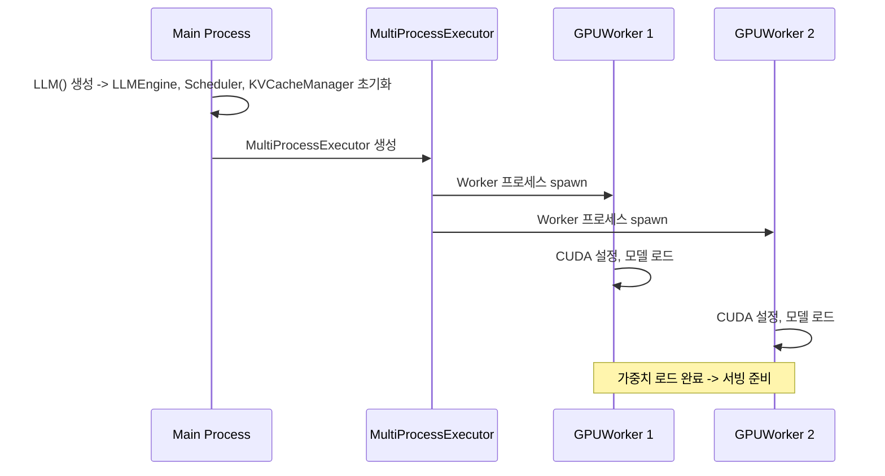

```python
llm = LLM(
    model="Qwen/Qwen2.5-7B-Instruct",
    tensor_parallel_size=4,                # GPUWorker 4개가 생성된다
    distributed_executor_backend="mp",     # 단일 노드 멀티GPU. 멀티노드는 "ray"
)
```

5절에서 본 TP 실습이 여기에 대응한다. `tensor_parallel_size=4`가 워커 프로세스 네 개를 띄우고 각 워커가 랭크당 가중치만 들고 있다. 기동 로그에 찍히는 `Model loading took`이 랭크당 값인 이유가 이것이다.

#### 요청 처리 흐름

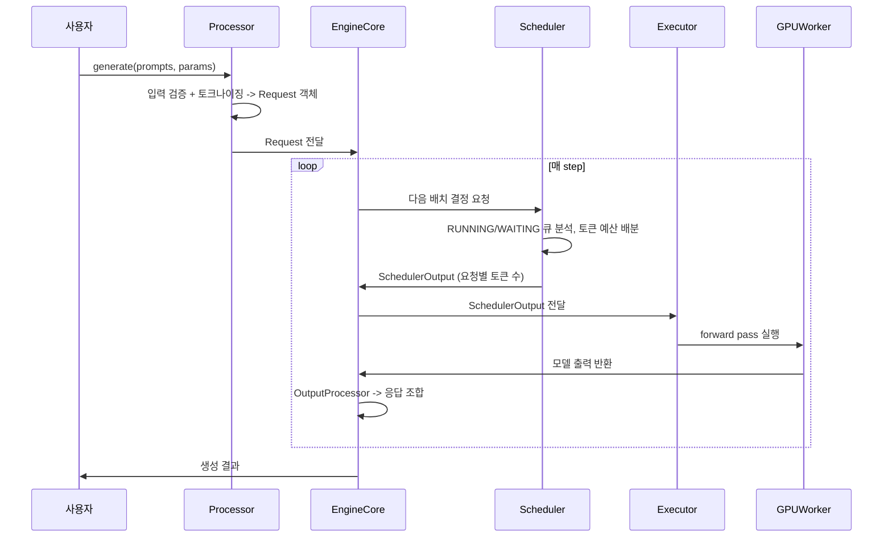

#### Scheduler 가 하는 일

Scheduler는 배치를 만드는 것이 아니라 토큰 레벨에서 자원을 배분한다.

| 책임 | 내용 |
|---|---|
| 요청 자원 배분 | WAITING에서 RUNNING으로의 전환, GPU 메모리·KV 블록·토큰 예산 관리 |
| 토큰 레벨 스케줄링 | "이 요청에 몇 토큰" 단위로 결정한다 |
| 최적화 통합 지점 | Prefix Caching, 추측 디코딩, Chunked Prefill을 스케줄링 단계에서 적용한다 |
| 동적 부하 조절 | 자원 상태와 요청 특성에 따라 실시간으로 결정을 바꾼다 |
| 라이프사이클 관리 | WAITING → RUNNING → COMPLETE 전환, 우선순위, preemption |

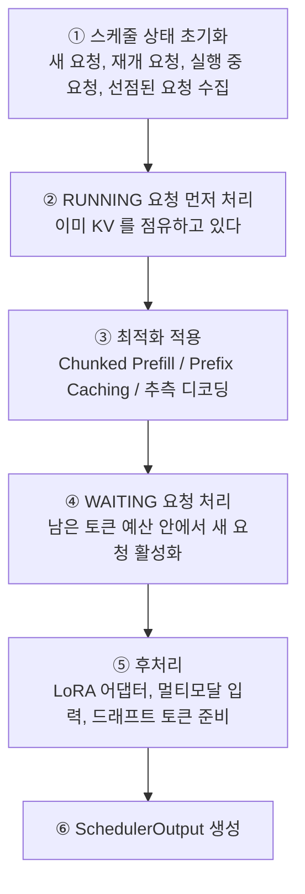

핵심 계산은 각 RUNNING 요청의 "아직 처리 안 된 토큰 수"다.

```python
while req_index < len(self.running) and token_budget > 0:
    request = self.running[req_index]
    num_new_tokens = (request.num_tokens_with_spec       # 처리해야 할 총 토큰
                      + request.num_output_placeholders
                      - request.num_computed_tokens)     # 이미 처리된 토큰
```

`num_tokens_with_spec`에 추측 토큰이 포함된다는 점이 3절 결과와 이어진다. 추측 디코딩을 켜면 스케줄러가 배분해야 하는 토큰 수가 늘고 그만큼 토큰 예산과 KV 블록을 더 잡는다. ngram에 드래프트 모델이 없는데도 KV가 줄어든 것이 이 경로다.

#### 계층으로 나눈 최적화

vLLM은 최적화를 네 계층으로 분리해 각 계층이 따로 발전할 수 있게 만들었다.

| 계층 | 범위 | 변경 빈도 | 예 |
|---|---|---|---|
| Scheduler | 시스템 전체, 모델과 무관 | 낮음 | Continuous Batching, Fairness, Prefix Caching |
| ModelExecutor | 모델 아키텍처별 | 중간 | Transformer용 Fused Attention, 멀티모달 인코더 |
| Model Layer | 특정 레이어·컴포넌트 | 높음 | FlashAttention, KV 재사용, Operator Fusion |
| CustomOp | 하드웨어별 | 높음 | CUDA 커널, Tensor Core 가속, 양자화 연산자 |

새 모델이나 새 하드웨어가 나와도 해당 계층만 손보면 된다.

### TensorRT-LLM

NVIDIA의 고성능 추론 라이브러리다. 모델 체크포인트를 최적화된 TensorRT 엔진으로 빌드한 뒤 Python 또는 C++ 런타임으로 서빙한다.

| 기능 | 내용 |
|---|---|
| In-flight Batching | Continuous Batching의 TRT-LLM 구현 |
| Paged KV Cache | PagedAttention 지원 |
| 다중 정밀도 | FP8, FP4, INT4, INT8 |
| TP / PP | 둘 다 지원 |
| Dynamo + Triton 통합 | NVIDIA 서빙 생태계와 붙는다 |

```python
from tensorrt_llm import LLM, SamplingParams

llm = LLM(model="Qwen/Qwen3-7B")
sampling_params = SamplingParams(temperature=0.8, top_p=0.95)
for output in llm.generate(["Hello, my name is"], sampling_params):
    print(output.outputs[0].text)
```

NVIDIA GPU 전용 환경에서 달러당 처리량을 최대로 뽑아야 할 때 선택지가 된다. 엔진 빌드 단계가 있어서 운영 복잡도가 가장 높다.

### SGLang

구조화된 출력과 에이전트 워크플로에 특화된 프레임워크다.

| 기능 | 내용 |
|---|---|
| RadixAttention | 프리픽스·KV 재사용. 에이전트의 멀티스텝 호출에 맞는다 |
| 구조화된 출력 | JSON/Regex/EBNF 문법 제약 디코딩 |
| Multi-LoRA Batching | 여러 LoRA 어댑터를 동시에 서빙한다 |
| 다중 하드웨어 | NVIDIA, AMD, CPU, TPU, Jetson, Ascend |
| Scale-out Router | 여러 인스턴스로 라우팅한다 |

```python
import sglang as sgl

llm = sgl.Engine(model_path="Qwen/Qwen3-7B")
outputs = llm.generate(["Hello, my name is"], {"temperature": 0.8, "top_p": 0.95})
```

에이전트 파이프라인처럼 같은 앞부분을 여러 번 다시 보내는 호출 패턴에서 RadixAttention이 7절의 prefix caching과 같은 이득을 낸다. 멀티 벤더 하드웨어를 쓰는 환경에도 맞는다.

### llama.cpp

C/C++로 쓰인 경량 추론 엔진이다. 의존성이 거의 없어 대부분의 하드웨어에서 돌아간다.

| 기능 | 내용 |
|---|---|
| GGUF 포맷 | 2~8비트 공격적 양자화 |
| 포터블 백엔드 | CPU(SIMD), Metal, CUDA, ROCm, Vulkan |
| OpenAI 호환 서버 | HTTP 서버가 내장돼 있다 |
| 최소 의존성 | Docker 없이 단일 바이너리로 실행된다 |

```python
from llama_cpp import Llama

llm = Llama.from_pretrained(repo_id="Qwen/Qwen3-8B-GGUF", filename="*Q8_0.gguf")
output = llm("Q: Name the planets? A: ", max_tokens=32)
```

로컬 개발, 온프레미스, Apple Silicon 같은 Edge 디바이스, 클라우드 비용을 쓰지 않는 실행에 맞는다. Ollama가 이것을 감싸 `ollama run qwen3` 한 줄로 쓸 수 있게 해 준다.

### 비교

| | vLLM | TensorRT-LLM | SGLang | llama.cpp |
|---|---|---|---|---|
| 강점 | 범용, 큰 커뮤니티 | NVIDIA 최적 성능 | 에이전트·구조화 출력 | 경량, 어디서든 실행 |
| Continuous Batching | 있음 | 있음 (in-flight) | 있음 | 없음 |
| PagedAttention | 있음 (최초 도입) | 있음 | 있음 | 없음 |
| 추측 디코딩 | 있음 | 있음 | 있음 (EAGLE-2/3) | 있음 |
| 양자화 | AWQ, GPTQ, FP8 | FP8, FP4, INT4 | AWQ, GPTQ | GGUF (2~8bit) |
| Multi-GPU | TP, PP | TP, PP | TP, PP, EP | 없음 |
| 구조화 출력 | 기본 | 기본 | RadixAttention 기반 강점 | 기본 |
| 하드웨어 | NVIDIA, AMD | NVIDIA 전용 | NVIDIA, AMD, CPU, TPU | CPU, Metal, CUDA, Vulkan |
| 운영 복잡도 | 중간 | 높음 (엔진 빌드) | 중간 | 매우 낮음 |

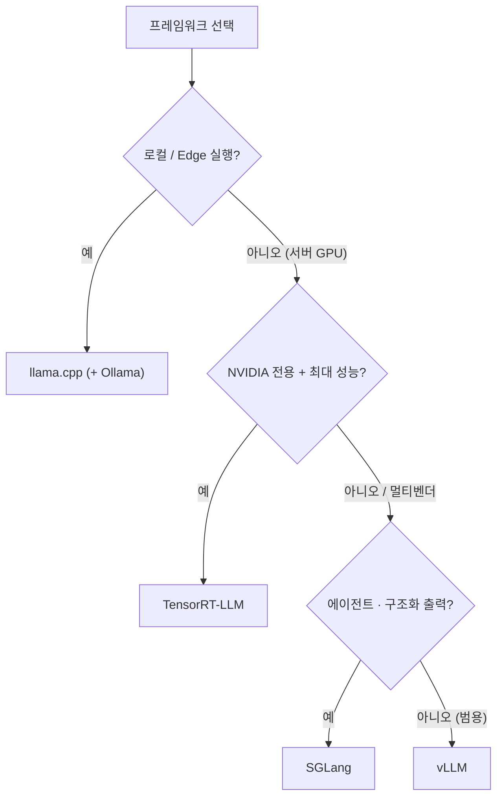

| 환경 | 선택 |
|---|---|
| 프로덕션 온라인 서빙 (범용) | vLLM |
| 로컬 개발과 테스트 | llama.cpp (Ollama) |
| NVIDIA GPU 극한 최적화 | TensorRT-LLM |
| 에이전트 파이프라인 + JSON 출력 | SGLang |
| Edge / On-device | llama.cpp |

### 선택 원칙

1. **SLO부터 정의한다.** 기능 목록이 아니라 목표(TTFT, p99 지연, TPS, 요청당 비용)로 시작한다.
2. **실제 프롬프트로 비교한다.** 같은 모델, 같은 양자화, 같은 설정으로 재야 비교가 성립한다.
3. **운영성도 평가한다.** cold start, 모니터링, 오토스케일링, 장애 모드는 처리량 측정으로 드러나지 않는다.
4. **벤더 종속을 고려한다.** 멀티벤더 하드웨어라면 포터블한 쪽을 먼저 본다.
5. **주기적으로 다시 본다.** 발전 속도가 빨라서 영구적인 선택이 없다.

### [실습] 같은 조건으로 비교하기

원칙 2번을 실제로 지키면 비교 가능한 쌍이 줄어든다. vLLM과 SGLang은 같은 GPU에서 같은 BF16 모델을 서빙하므로 같은 축에 올릴 수 있다. llama.cpp는 GGUF 양자화를 쓰고 Continuous Batching과 PagedAttention이 없으므로, 동시성이 붙는 서버 부하에서 나란히 놓으면 도구의 목적을 벗어난 측정이 된다. 동시성 1의 참조값으로만 둔다.

```bash
# venv 를 갈라 쓴다. vLLM 과 SGLang 이 torch, flashinfer, transformers 를 서로 다르게
# 고정하므로 같은 venv 에 넣으면 나중에 설치한 쪽이 앞의 것을 덮어써서 둘 다 깨진다.
python3 -m venv ~/sglang-env && source ~/sglang-env/bin/activate
pip install "sglang[all]"

python -m sglang.launch_server --model-path Qwen/Qwen2.5-7B-Instruct \
  --port 8300 --host 127.0.0.1 --context-length 4096 --mem-fraction-static 0.90
```

SGLang의 `--mem-fraction-static`이 vLLM의 `--gpu-memory-utilization`에 대응한다. 양쪽 다 OpenAI 호환 엔드포인트를 내주므로 벤치마크 도구는 하나만 써도 된다.

```bash
vllm bench serve --backend openai --model Qwen/Qwen2.5-7B-Instruct \
  --base-url http://127.0.0.1:8300 --endpoint /v1/completions \
  --dataset-name sharegpt --dataset-path ShareGPT_V3_unfiltered_cleaned_split.json \
  --num-prompts 48 --max-concurrency 8 --seed 42 \
  --percentile-metrics ttft,tpot,itl,e2el --metric-percentiles 50,95,99 \
  --save-result --result-filename sglang.json
```

llama.cpp는 CUDA 지원 빌드에 10~20분이 걸린다. GPU 시간을 쓰는 동안 컴파일을 돌리게 되므로, 프레임워크 비교가 목적이 아니면 건너뛰는 편이 낫다.

```bash
git clone --depth 1 https://github.com/ggml-org/llama.cpp
cmake -B build -DGGML_CUDA=ON -DCMAKE_BUILD_TYPE=Release
cmake --build build --config Release -j$(nproc) --target llama-server
./build/bin/llama-server -m model-q4_k_m.gguf --port 8300 -ngl 99 -c 4096 --parallel 1
```

---

## 9. Orchestration Tier

프로덕션에서는 vLLM 같은 엔진 위에 한 계층이 더 있다.

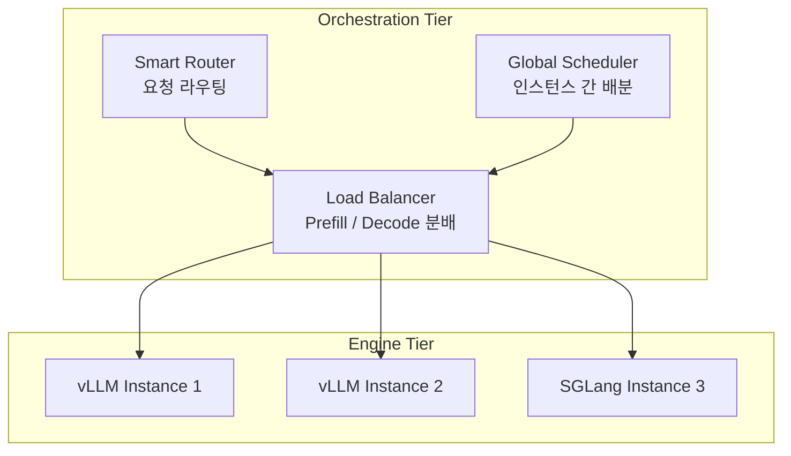

| 계층 | 역할 | 대표 프로젝트 |
|---|---|---|
| Orchestration | 인스턴스 간 라우팅, PD 분리, KV 전달, 오토스케일링 | NVIDIA Dynamo, llm-d (Kubernetes 네이티브) |
| Engine | 인스턴스 안에서 토큰 생성 (스케줄링, KV 관리, 추론) | vLLM, SGLang, TensorRT-LLM |

Orchestration Tier는 토큰을 직접 만들지 않는다. 스케줄링과 라우팅만 담당하고 실제 생성은 Engine Tier에서 일어난다. 6절 실습에서 직접 만든 프록시가 이 계층의 최소 형태이고 Dynamo나 llm-d는 여기에 오토스케일링과 장애 처리를 붙였다.

---

## 10. 기법 선택

| 문제 | 먼저 볼 기법 | 이 실습에서 확인한 것 |
|---|---|---|
| 토큰 간격이 느려 사용자가 기다린다 | 추측 디코딩 | TPOT -45%(동시성 1) ~ -16%(64). 이득이 줄지만 64에서도 남았다 |
| TTFT 에 SLO 가 걸려 있다 | ngram 방식 | 드래프트 모델은 TTFT 를 +106% 악화. ngram 은 -27% 개선 |
| 긴 입력의 첫 토큰이 늦다 | prefix caching | 공유 프리픽스 3001 토큰에서 10.01배. 공유가 없으면 0.99배 |
| 모델이 GPU 한 장에 안 들어간다 | TP, 노드를 넘기면 PP | 14B 를 24GB 한 장에 올리면 기동 35초 만에 OOM |
| 동시 요청을 더 받아야 한다 | TP 로 KV 여유 확보 | 7B TP=4 에서 KV 캐시 18.7배, 최대 동시성 15x -> 287x |
| Prefill 이 Decode 를 방해한다 | Chunked Prefill, 그다음 PD 분리 | 측정하지 않음 |
| 처리량이 부족하고 모델은 작다 | DP 복제 | 측정하지 않음. 지연은 개선되지 않는다 |
| GPU 메모리가 부족한데 프리픽스가 반복된다 | KV offloading (CPU/SSD) | 측정하지 않음 |

순서를 정하자면 단일 GPU에서 짜낼 것을 먼저 짜내는 쪽이 낫다. Continuous Batching, PagedAttention, FlashAttention은 vLLM이 이미 기본으로 적용하고 그다음이 양자화다. 양자화는 메모리와 처리량을 동시에 개선하니 효과 대비 노력이 가장 좋다. 추측 디코딩과 prefix caching은 워크로드 성격에 따라 효과가 달라지므로 자기 트래픽에서 재보고 결정할 일이다.

병렬화는 원래 이 순서의 맨 끝에 두려고 했는데 측정 결과를 보고 생각이 바뀌었다. 저동시성 지연이 중요하고 GPU를 더 붙일 수 있다면, TP는 모델이 한 장에 들어가더라도 검토할 값이 있다. 대역폭과 KV 여유를 동시에 사는 셈이기 때문이다. 다만 GPU 수만큼 자원이 들어가므로 처리량 배수만으로 판단할 것은 아니다.

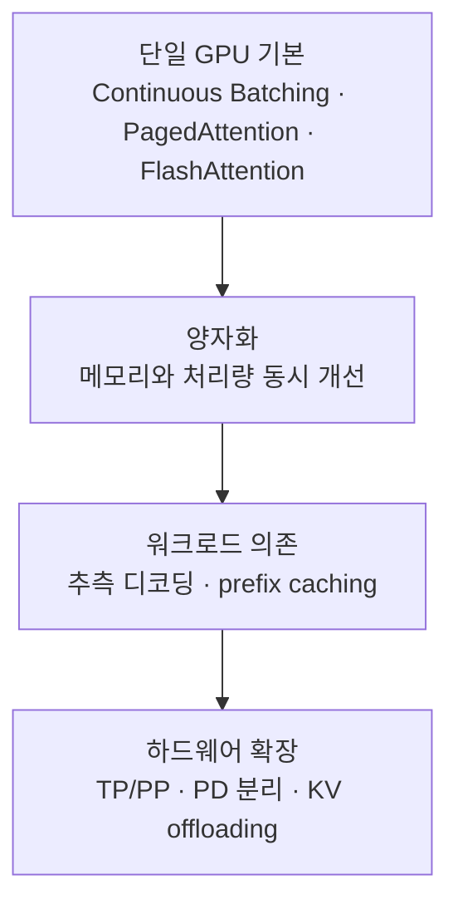

---

## 11. 실습시 유의사항

### 폐기된 플래그

`--speculative-model`과 `--num-speculative-tokens`는 더 이상 쓸 수 없다. 오래된 블로그나 책 예제를 그대로 따라가면 여기서 막힌다. `--speculative-config`에 JSON으로 넘긴다.

```bash
# 동작하지 않는다
--speculative-model Qwen/Qwen2.5-0.5B-Instruct --num-speculative-tokens 5

# 현재 형태
--speculative-config '{"method":"draft_model","model":"Qwen/Qwen2.5-0.5B-Instruct","num_speculative_tokens":5}'
```

### 드래프트 모델 지원이 버전마다 다르다

독립 드래프트 모델 방식은 vLLM이 엔진을 V1으로 재작성하는 과정에서 한동안 빠졌다가 이후 복구됐다. 버전에 따라 같은 설정이 동작하기도, 조용히 무시되기도, 기동 자체가 실패하기도 한다. 그래서 실습 스크립트는 arm 단위로 실패를 흡수하도록 만들었다. arm 하나가 안 뜨면 그것만 건너뛰고 나머지를 계속 돌린다. 다섯 개를 순차로 돌리는 실습에서 세 번째가 죽어 전체가 멈추면 그때까지 쓴 GPU 시간이 날아간다.

ngram 방식은 별도 모델이 없어 버전 간 호환성이 좋다. 드래프트 모델 방식이 막히면 이쪽으로 먼저 확인하는 편이 낫다.

### 모델 로딩 전에 임포트를 확인한다

벤치마크 스크립트가 요구하는 패키지가 vLLM 의존성에 다 들어 있지 않다. 데이터셋 로더는 `pandas`와 `datasets`를 쓴다. 이걸 모르고 시작하면 서버가 멀쩡히 뜬 다음 벤치마크만 즉시 죽는다. 7B 모델을 콜드 리드로 올리는 데 10분이 걸릴 수 있는데 그 10분을 기다린 뒤 아무것도 못 재고 버리게 된다.

비싼 단계 앞에 임포트 확인을 한 줄 넣어 두면 이런 낭비가 없다.

```bash
pip install pandas datasets
python -c "import vllm, pandas, datasets; from vllm.benchmarks import serve; print('OK')"
```

### 드래프트 모델이 KV 캐시를 먹는다

추측 디코딩을 켜면 드래프트 모델도 GPU에 올라간다. Qwen2.5-0.5B는 약 1GiB인데, 그만큼 KV 캐시로 쓸 자리가 줄어든다. baseline과 드래프트 arm의 KV 캐시 크기가 달라지므로, 처리량을 비교할 때 이것이 교란 변수가 된다.

`--max-model-len`과 `--max-num-seqs`를 전 arm 고정하고 arm별 실제 KV 캐시 크기를 기록해 두면 나중에 해석할 때 근거가 된다.

```bash
grep -E "Model loading took|GPU KV cache size|Maximum concurrency" vllm.log
```

### 수용률은 누적값이다

`/metrics`의 spec decode 카운터는 서버 기동 이후 누적이다. 동시성별 수용률을 보려면 각 벤치마크 전후로 값을 찍어 차이를 낸다. 마지막 값만 보면 전 구간 평균이 나온다.

### flashinfer 와 Python 3.10 이 충돌한다

이번 실습에서 가장 오래 잡힌 문제다. vLLM 0.27.1을 설치하면 flashinfer가 함께 들어오는데 그 안의 `fd_exchange.py`가 타입 어노테이션에 `array.array[int]`를 쓴다. `array.array`는 Python 3.10에서 subscript를 지원하지 않아서 임포트 시점에 예외가 난다.

```
File "flashinfer/comm/fd_exchange.py", line 55, in <module>
  def _fd_ancillary(fd: int) -> tuple[tuple[int, int, array.array[int]]]:
TypeError: 'type' object is not subscriptable
```

vLLM은 이 임포트를 `try/except ImportError`로 감싸 두었는데 실제로 나는 예외는 `TypeError`라서 가드를 그냥 통과해 버린다. 그렇다고 flashinfer를 지우면 이번에는 샘플러가 죽는다.

```
File "vllm/v1/sample/ops/topk_topp_sampler.py", line 51, in flashinfer_sampler_supported
  from vllm.v1.attention.backends.flashinfer import FlashInferBackend
ModuleNotFoundError: No module named 'flashinfer'
```

어노테이션 평가를 미루면 양쪽이 해결된다. `from __future__ import annotations`를 넣으면 어노테이션이 문자열로 남아 실행되지 않는다.

```bash
# 임포트로 파일을 찾으면 안 된다. 임포트가 깨지는 것이 바로 이 버그다
FDX=$(find "$VENV" -path '*/flashinfer/comm/fd_exchange.py' | head -1)
sed -i '1i from __future__ import annotations' "$FDX"
```

Python 3.12 환경에서는 이 문제가 없다. 배포 이미지의 Python 버전을 먼저 확인하는 편이 낫다.

### 같은 계열 모델인데 vocab 크기가 다르다

"드래프트는 같은 계열의 작은 모델을 쓰면 된다"는 조언이 Qwen2.5에서 그대로 깨진다.

```
Value error, Target and draft model should have the same vocabulary size.
Target model vocab_size=152064. Draft model vocab_size=151936.
```

Qwen2.5는 7B 이상이 152064이고 0.5B·1.5B·3B가 151936이다. 같은 계열, 같은 토크나이저인데 임베딩 패딩이 달라서 vLLM의 기본 검증에 막힌다. `use_heterogeneous_vocab`를 켜면 Token-Level Intersection 알고리즘으로 우회한다.

```bash
--speculative-config '{"method":"draft_model",
  "model":"Qwen/Qwen2.5-0.5B-Instruct",
  "num_speculative_tokens":3,
  "use_heterogeneous_vocab":true}'
```

드래프트 후보를 고를 때 계열 이름만 보지 말고 `config.json`의 `vocab_size`를 먼저 맞춰 보는 편이 빠르다.

### LMCache 설정 키가 바뀌었다

예전 예제의 `local_device`와 `max_local_cache_size`는 현재 쓰지 않는다. `local_cpu`와 `max_local_cpu_size`이고 값의 단위도 GB다. 잘못된 키를 주면 오류 없이 조용히 무시되고 캐시가 안 도는 것을 모른 채 측정하게 된다.

### KV 커넥터 이름이 버전마다 다르다

PD 분리와 오프로딩에 쓰는 커넥터 이름이 고정돼 있지 않다. 공유 스토리지 커넥터는 `SharedStorageConnector`에서 `ExampleConnector`로 바뀐 이력이 있다. 하드코딩하지 말고 등록된 목록을 먼저 확인한다.

```bash
python -c "
from vllm.distributed.kv_transfer.kv_connector.factory import KVConnectorFactory as F
reg = getattr(F,'_registry',None) or getattr(F,'_connector_registry',{})
print(sorted(reg.keys()))"
```

### 프레임워크를 같은 venv 에 넣으면 안 된다

vLLM과 SGLang이 torch, flashinfer, transformers 버전을 서로 다르게 고정한다. 같은 venv에 넣으면 나중에 설치한 쪽이 앞의 것을 덮어써서 둘 다 깨지거나, 깨진 조합으로 측정돼 비교가 무의미해진다.

### 최신 AMI 에 python3-venv 가 없다

Deep Learning Base OSS Nvidia Driver GPU AMI (Ubuntu 22.04)에 `python3.10-venv`가 빠져 있다. Python 3.10.12와 pip는 있는데 `ensurepip`가 없어서 `python3 -m venv`가 실패한다.

```bash
python3 -c "import ensurepip" 2>/dev/null || apt-get install -y -qq python3.10-venv
```

AMI 구성은 갱신될 때마다 바뀐다. venv 생성을 조건부로 감싸 두면 다음에 또 막히지 않는다.

### SSM 으로 큰 파일을 회수할 수 없다

SSH 없이 SSM Session Manager만 쓰면 결과 회수 경로가 마땅치 않다. `send-command`의 출력은 24,000자로 잘린다. 260KB tarball을 base64로 감싸면 350KB가 되어 한 번에 못 받는다.

작은 JSON 파일을 개별로 받는 편이 확실하다. 큰 파일을 통째로 옮길 일이 많다면 인스턴스 역할에 S3 권한을 붙여 버킷을 경유하는 쪽이 낫다.

L4 재현 회차에서 이 함정에 그대로 걸렸다. 80KB tarball은 24,000자 제한에 걸리지 않는데도 로컬 `base64 -d`가 `Illegal character '-'` 로 죽었다. 전송된 문자열에 base64 알파벳이 아닌 것이 섞였다는 뜻이다. 폴백으로 `status.json` 한 건만 받아 arm별 지연 수치를 잃었고, 그때는 인스턴스가 이미 정리된 뒤였다.

회수 경로는 본 측정 전에 더미 파일로 한 번 검증해 둔다. 회수를 마지막 단계에 몰지 않고 arm 하나가 끝날 때마다 증분으로 당긴다. 측정이 다 성공해도 회수가 깨지면 결과는 없다.

또 하나, AWS CLI의 `--parameters` shorthand는 값 안의 `=`를 키 구분자로 오해한다. base64 패딩이 `=`이라서 전송이 깨진다. `--cli-input-json`으로 넘겨야 한다.

### 인스턴스가 스스로 종료하게 만든다

GPU 인스턴스를 띄운 뒤 세션이 끊기거나 실습이 예상보다 길어지면 인스턴스가 계속 살아 있다. 로컬에서 도는 감시 프로세스는 자격 증명이 만료되면 무력해지므로, 인스턴스가 스스로 죽게 만드는 쪽이 안전하다.

```bash
# 기동 시 종료 동작을 terminate 로 두고, user-data 로 타이머를 예약한다
aws ec2 run-instances ... \
  --instance-initiated-shutdown-behavior terminate \
  --user-data "$(printf '#!/bin/bash\nshutdown -h +120\n')"
```

이렇게 하면 로컬 자격 증명이 끊겨도 예약 시간에 인스턴스가 halt하고 종료 동작이 terminate이므로 그대로 삭제된다. 실제로 이번 실습에서 세션이 끊긴 사이 인스턴스가 살아 있었는데 이 타이머가 정리해 줬다.

AWS CLI는 `--user-data`를 자동으로 base64 인코딩한다. 미리 인코딩해서 넘기면 이중 인코딩되어 스크립트가 실행되지 않는다.

---

## 12. 실습 코드

전체 스크립트는 `aws-lab-ch7/` 에 있다. 절 번호와 실습 번호가 대응한다.

```
00_preflight.sh          자격 증명 / vCPU 쿼터 / AMI / 온디맨드 가격 확인 (읽기 전용)
01_launch.sh             AZ 순회 기동, SSM 등록 대기, 자체 종료 타이머
02_ssm.sh                put | run | bg | tail | get
03_teardown.sh           인스턴스·SG·IAM 정리 + 미부착 볼륨 확인
collect.py               결과 JSON 을 표로 정리

remote/setup.sh          venv, vLLM, 함정 패치, 지원 probe, 모델 다운로드
remote/lab1_spec.sh      3절 — 추측 디코딩 스윕
remote/lab2_parallel.sh  5절 — TP/PP 스윕 + 토폴로지
remote/lab3_pd.sh        6절 — PD 분리
remote/lab4_kvcache.sh   7절 — prefix caching / KV 오프로딩
remote/lab5_frameworks.sh 8절 — vLLM vs SGLang vs llama.cpp
remote/pd_proxy.py       PD 분리용 스트리밍 프록시
remote/prefix_probe.py   공유 프리픽스 TTFT 측정
```

### 인스턴스

```bash
# Deep Learning Base OSS Nvidia Driver GPU AMI (Ubuntu 22.04) 최신 버전을 조회해서 쓴다
AMI=$(aws ec2 describe-images --region us-west-2 --owners amazon \
  --filters "Name=name,Values=Deep Learning Base OSS Nvidia Driver GPU AMI (Ubuntu 22.04)*" \
            "Name=state,Values=available" \
  --query 'sort_by(Images,&CreationDate)[-1].ImageId' --output text)

# g6.xlarge = L4 24GB, compute capability 8.9
aws ec2 run-instances --region us-west-2 \
  --image-id "$AMI" --instance-type g6.xlarge \
  --iam-instance-profile Name=<SSM 접속용 프로파일> \
  --block-device-mappings '[{"DeviceName":"/dev/sda1","Ebs":{"VolumeSize":250,"VolumeType":"gp3","DeleteOnTermination":true}}]' \
  --metadata-options 'HttpTokens=required,HttpEndpoint=enabled'
```

### 환경

```bash
python3 -m venv ~/vllm-env && source ~/vllm-env/bin/activate
pip install vllm
pip install pandas datasets            # 벤치마크 데이터셋 로더가 요구한다
pip install hf_transfer                # 모델 다운로드 가속

# 비싼 단계 앞에서 임포트만 먼저 확인
python -c "import vllm, pandas, datasets; from vllm.benchmarks import serve; print('OK')"

wget https://huggingface.co/datasets/anon8231489123/ShareGPT_Vicuna_unfiltered/resolve/main/ShareGPT_V3_unfiltered_cleaned_split.json

export HF_HUB_ENABLE_HF_TRANSFER=1
for M in Qwen/Qwen2.5-7B-Instruct Qwen/Qwen2.5-0.5B-Instruct; do hf download "$M"; done
```

### 소요 시간

단일 GPU 실습은 처음 예상이 81분이었는데 143분이 걸렸다. 차이의 대부분이 flashinfer 문제를 찾는 데 쓴 시간이다. 다중 GPU 실습은 89분이었다. 실습이 끝나면 인스턴스와 보안 그룹, IAM 역할을 지우고 미부착 볼륨이 남지 않았는지도 확인해 둔다.

---

## 마무리

실습을 시작할 때는 자료에 적힌 배수들을 확인해 볼 생각이었다. 끝내고 나니 확인한 것보다 어긋난 것에서 더 배웠다.

가장 크게 어긋난 것은 두 가지다. 자료는 동시성이 오르면 추측 디코딩이 손해가 된다고 하는데 L4에 7B를 올린 조합에서는 동시성 64에서도 1.74배가 남았다. 그리고 한 장에 들어가는 모델을 TP로 쪼개면 통신 비용만 붙을 것으로 봤는데 7B를 네 장에 쪼갰을 때 처리량이 2.99배가 됐다. 둘 다 같은 이유다. 저동시성 디코딩은 메모리 대역폭에 묶여 있고 그 병목이 풀리기 전까지는 남는 연산을 쓰거나 대역폭을 늘리는 쪽이 계속 이득이다.

그래서 자료의 서술이 틀렸다고 보기는 어렵다. 자료의 실험은 A100 80GB에 Qwen3-32B였고 이 실습은 L4 24GB에 7B였다. 같은 동시성 숫자가 두 조합에서 전혀 다른 지점을 가리킨다. 배수를 외우는 대신 자기 조합에서 병목이 어디에 있는지를 재는 편이 쓸모 있다.

통제군의 값도 다시 확인했다. prefix caching을 끈 쪽은 5회를 반복해도 761ms에서 769ms로 꿈쩍하지 않았다. 켠 쪽만 76ms로 떨어졌다. 통제군 없이 켠 쪽만 봤다면 10배 개선이 캐시 때문인지 GPU 워밍업 때문인지 구분할 수 없었다.

예상하지 못한 소득은 KV 캐시였다. 7B를 TP=4로 쪼개면 KV 캐시가 18.7배가 되고 최대 동시성 표기가 15x에서 287x로 올라간다. TP를 큰 모델을 올리는 수단으로만 보면 이걸 놓친다. GPU를 A10G에서 L4로 바꿔 다시 재 봤을 때도 이 배수는 흔들리지 않았다.

측정하지 못한 것도 남았다. PD 분리는 vLLM이 아직 experimental로 표시하고 있고 커넥터와 프록시 구성이 따로 필요하다. Expert Parallelism은 MoE 모델과 더 많은 GPU가 필요하다. 프레임워크 비교는 같은 조건을 맞추는 것 자체가 별도 작업이었다. 세 가지는 개념 정리와 실습 코드까지만 두고 측정은 다음으로 넘겼다.

시간의 절반 이상은 최적화가 아니라 환경 문제에 썼다. flashinfer가 Python 3.10과 충돌하고 같은 계열 모델의 vocab 크기가 어긋나고 AMI에 venv가 빠져 있고 측정을 마친 결과 파일을 인스턴스에서 내리는 경로가 깨졌다. 11절에 적어 둔 것들이 그 목록이다. 다음 실습에서 같은 곳에서 멈추지 않으려고 남겼다.

## 참고 자료

- [Hands-On LLM Serving and Optimization](https://www.oreilly.com/library/view/hands-on-llm-serving/9798341621480/) — 원본 학습 자료
- [vLLM: Speculative Decoding](https://docs.vllm.ai/en/latest/features/speculative_decoding/) — 방식별 개요
- [vLLM: Draft Models](https://docs.vllm.ai/en/latest/features/speculative_decoding/draft_model/) — `--speculative-config` 스키마와 폐기 안내
- [vLLM: N-Gram Speculation](https://docs.vllm.ai/en/latest/features/speculative_decoding/n_gram/)
- [vLLM: EAGLE Draft Models](https://docs.vllm.ai/en/latest/features/speculative_decoding/eagle/)
- [vLLM: Automatic Prefix Caching](https://docs.vllm.ai/en/latest/features/automatic_prefix_caching/)
- [vLLM: Parallelism and Scaling](https://docs.vllm.ai/en/latest/serving/parallelism_scaling/) — TP/PP 조합
- [vLLM: Disaggregated Prefilling](https://docs.vllm.ai/en/latest/features/disagg_prefill/) — 커넥터 목록과 제약
- [vLLM: KV Offloading Usage Guide](https://docs.vllm.ai/en/latest/features/kv_offloading_usage/)
- [LMCache 문서](https://docs.lmcache.ai) — 현재 설정 키와 백엔드
- [SGLang](https://docs.sglang.io) · [TensorRT-LLM](https://nvidia.github.io/TensorRT-LLM/) · [llama.cpp](https://github.com/ggml-org/llama.cpp)
- [NVIDIA Dynamo](https://github.com/ai-dynamo/dynamo) · [llm-d](https://llm-d.ai) — Orchestration Tier
