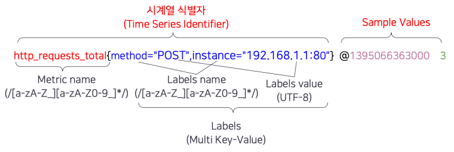
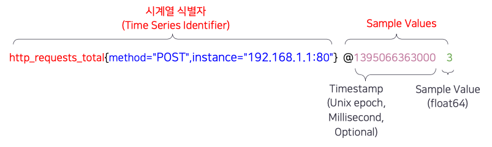

## 시계열 데이터(Time-Series)
시계열 데이터(Time-Series)는 시간별로 구성된 메트릭(Metrics) 값(데이터)의 집합입니다. 게이지(Gauge)또는 카운터(Counter)등의 메트릭 데이터가 시간이 지남에 따라 어떻게 달라지는지를 나타내기 때문에 다양한 분야에서 사용되는 데이터에서 활용되고 있습니다. 현재 미세먼지 수치라던지, 시간별 미세먼지 수치 등의 시계열 데이터를 저장하는 데이터베이스에서는 주로 Update보다는 Insert로 처리하고 하는 것이 일반적입니다. 

## Prometheus 데이터 모델
Prometheus에는 타임스탬프(TimeStamp)된 값의 스트림과 같은 시계열 데이터를 저장합니다. 모든 스트림은     식별자(identifier)와 샘플 값(sample value)을 가집니다. 시간별 값을 나타낼 뿐만 아니라 시간에 대한 변화율을 나타내기도 합니다. 

모든 시계열 데이터는 메트릭 이름과 "라벨"이라는 키/값 쌍 집합으로 고유하게 식별됩니다.

메트릭 이름은 측정 중인 시스템의 전체 측면(예: http_requests_total, 지정된 서버 프로세스에서 처리되는 총 HTTP 요청 수)을 식별합니다.
레이블은 하위 차원을 구별하는 데 도움이 됩니다(예: method="GET" 대 method=").POST"는 각 HTTP 메서드 유형에 대해 처리된 요청 수를 나타냅니다.
영상 시리즈 식별자를 형성하는 메트릭 이름과 레이블은 Prometheus의 TSDB에서 인덱싱되고 데이터를 쿼리할 때 영상 시리즈를 조회하는 데 사용됩니다.

시계열 식별자 (Series Identifiers)는 메트릭 이름(Metrics Name)과 레이블 이름(Lables Name)으로 구성됩니다. 

• Metrics Name(고유한 식별자) - 측정이 되는 시스템 전반의 내용을 설명 (http_requests_total)

레이블 (Lables)
- Key/Values pairs(키-밸류 쌍) - 하위차원(dimention)으로 보통쿼리조건으로사용(method="POST") 시계열 식별자

• Timestamp:밀리초(millisecond)단위의64-bit정수(Integers)

Unix epoch 기반

• SampleValue:64-bit부동소수점(FloatingPointNumbers) 무조건 64-bit 부동소수점으로 표시됨 최대 샘플값은 “2^53