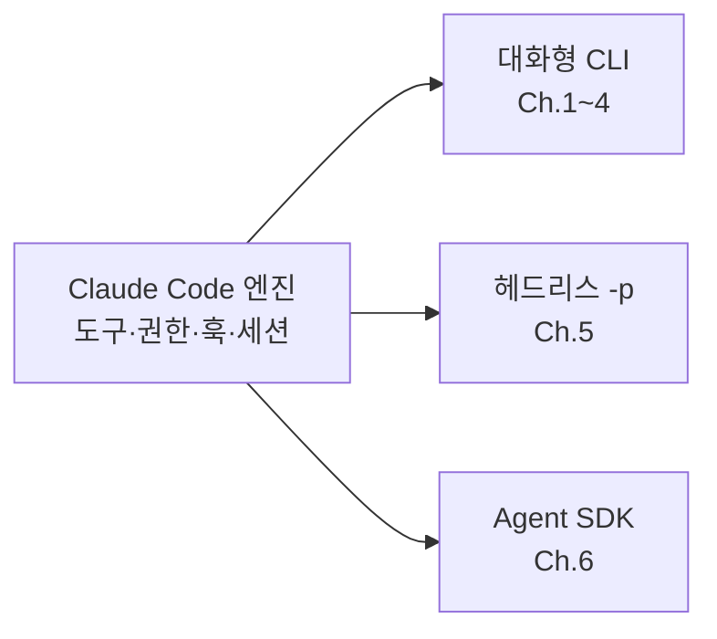
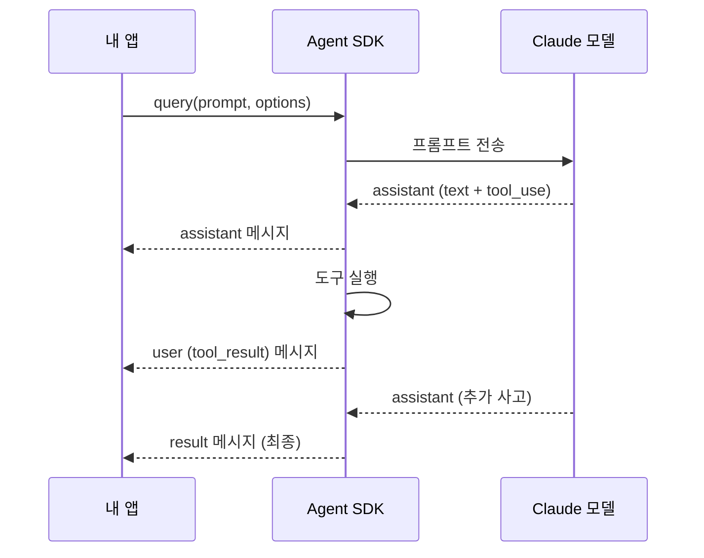
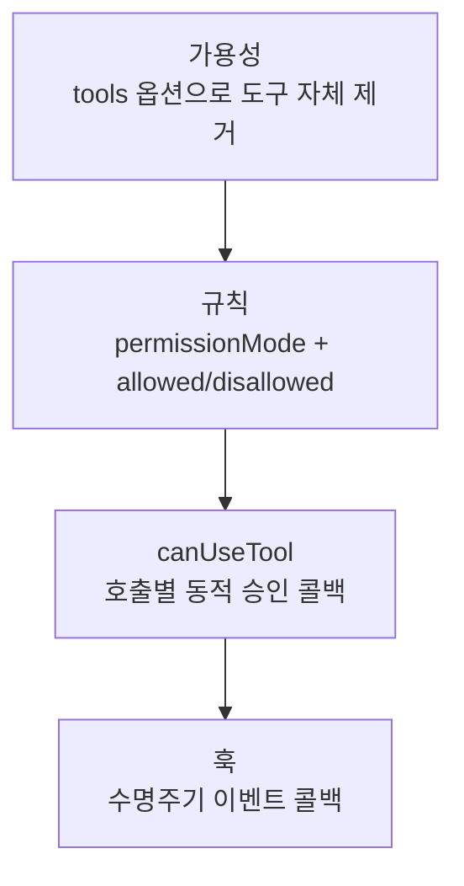
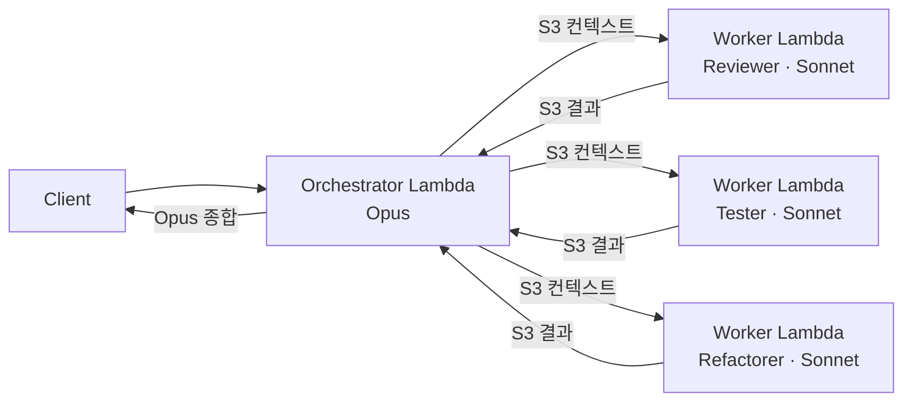

> 해당 포스팅은 현재 재직 중인 회사와 관련이 없고, 개인 역량 개발을 위한 스터디 자료로 활용할 예정입니다.

## 들어가며

이 글에서는 Claude Code의 Agent SDK, 곧 `query` 한 함수에 담긴 에이전틱 루프, 인프로세스 커스텀 도구, Zod/Pydantic 구조화 출력, 권한·훅 콜백, 세션 외부화, 컨테이너 호스팅, 그리고 실전 프로젝트까지 정리합니다. 본문의 기본 골격은 AWS Korea가 공개한 Claude Code Deep Dive Workshop의 Chapter 6이며 Anthropic 공식 문서로 교차 검증했습니다.

| 인용한 자료 | 무엇인가 | 본문 표기 |
| --- | --- | --- |
| Claude Code Deep Dive Workshop | AWS Korea가 GitHub에 공개한 실습 워크샵 | Chapter 6 |
| Anthropic Docs — Agent SDK | 공식 문서 (Overview, Quickstart, Custom Tools 등) | References 참조 |
| AWS 기술 블로그 | Amazon Bedrock + Claude Agent SDK로 서버리스 멀티 에이전트 구현 (Jesam Kim) | 보충 |

중간에 "보충"으로 표시한 절은 워크샵 본문 밖에서 가져온 내용입니다. 어느 자료에서 온 것인지 절 머리에 적어 두었으며 링크를 포함한 전체 목록은 맨 아래 [References](#references)에 있습니다.

Ch.1\~4가 대화형의 세계, Ch.5가 CLI 자동화의 세계였다면 Ch.6은 라이브러리의 세계입니다. SDK는 `-p`의 프로그래밍 버전입니다. CLI가 셸 스크립트를 위한 도구였다면 SDK는 애플리케이션의 라이브러리입니다. 도구, 권한, 훅, 세션 등 Ch.1\~4에서 만든 자산이 코드 안에서 그대로 동작합니다.

---

## 목차

1. [SDK 기본](#1-sdk-기본)
2. [쿼리와 멀티턴](#2-쿼리와-멀티턴)
3. [커스텀 도구](#3-커스텀-도구)
4. [구조화 출력](#4-구조화-출력)
5. [권한과 훅](#5-권한과-훅)
6. [세션, 상태, CC 기능](#6-세션-상태-cc-기능)
7. [호스팅과 프로덕션](#7-호스팅과-프로덕션)
8. [실전 프로젝트: 사내 위키 Q&A 에이전트](#8-실전-프로젝트-사내-위키-qa-에이전트)
9. [Recap & Labs](#9-recap--labs)
10. [References](#references)

---

## 1. SDK 기본

> **해결하는 문제**: 저수준 API를 직접 다루면 코드의 80%가 보일러플레이트에 쓰인다. 에이전트 로직에만 집중할 수 없는가?

### 전체 구조에서의 위치

Agent SDK는 Claude Code의 에이전트 하네스를 라이브러리로 노출한 것입니다. 대화형 CLI, 헤드리스 `-p`, SDK, 이 셋은 같은 엔진을 쓰는 세 가지 인터페이스입니다.



| 비교 | 저수준 API 직접 사용 | Agent SDK |
| --- | --- | --- |
| 메시지 배열, tool_use 루프 | 직접 작성 | `query` 한 함수가 전체 관리 |
| 재시도, 컨텍스트, 캐싱 | 직접 구현 | SDK가 관리 |
| 권한, 파일 도구 | 전부 직접 만들어야 함 | Claude Code의 도구·권한·훅 그대로 |
| 코드 비율 | 80%가 보일러플레이트 | 80%가 도메인 로직 |

### 설치와 인증

**TypeScript:**

```bash
npm install @anthropic-ai/claude-agent-sdk

```

**Python:**

```bash
uv init && uv add claude-agent-sdk
# 또는
pip3 install claude-agent-sdk

```

인증:

```bash
# 방법 1: API 키
ANTHROPIC_API_KEY=sk-ant-...

# 방법 2: Amazon Bedrock (Ch.3)
CLAUDE_CODE_USE_BEDROCK=1
# + AWS 자격 (IAM 역할, 환경변수 등)

```

> ⚠️ `claude.ai` 구독 로그인으로는 서드파티 제품을 제공할 수 없습니다. API 키 또는 Bedrock 자격을 사용해야 합니다.

### 첫 에이전트

**TypeScript:**

```typescript
import { query } from "@anthropic-ai/claude-agent-sdk";

for await (const message of query({
  prompt: "utils.py의 크래시 버그를 찾아 수정해",
  options: {
    allowedTools: ["Read", "Edit", "Glob"],
    permissionMode: "acceptEdits"
  }
})) {
  if (message.type === "result")
    console.log("Done:", message.subtype);
}
// 실행: npx tsx agent.ts

```

**Python:**

```python
import asyncio
from claude_agent_sdk import (
    query, ClaudeAgentOptions, ResultMessage)

async def main():
    async for message in query(
        prompt="utils.py의 크래시 버그를 찾아 수정해",
        options=ClaudeAgentOptions(
            allowed_tools=["Read", "Edit", "Glob"],
            permission_mode="acceptEdits")):
        if isinstance(message, ResultMessage):
            print("Done:", message.subtype)

asyncio.run(main())

```

> 📌 **핵심**: `query` 한 함수가 유일한 진입점입니다. 모든 옵션은 여기로 들어가며 결과는 메시지 스트림으로 나옵니다.

### 메시지 스트림 해부



| 메시지 타입 | 내용 | 용도 |
| --- | --- | --- |
| `system` (init) | 세션 시작, 모델과 도구 구성 | 첫 메시지 |
| `assistant` | text 블록(사고) + tool_use 블록(호출) | 진행 관찰 |
| `user` (tool_result) | 도구 실행 결과 반환 | 진행 추적 |
| `result` | subtype, result, usage, session_id | 최종 결과 수신 |

> 💡 **필터링 요령**: `assistant`의 `text`와 `result`만 표시하면 잡음이 제거됩니다. Ch.5의 `stream-json` 이벤트와 구조가 같습니다.

### options 한눈에 보기

| 분류 | 옵션 | 파트 |
| --- | --- | --- |
| **능력** | `allowedTools`, `disallowedTools`, `tools`, `mcpServers` | P3, P5 |
| **감독** | `permissionMode`, `canUseTool`, `hooks` | P5 |
| **역할 정의** | `systemPrompt` (preset, append), `agents` | P2, P6 |
| **출력** | `outputFormat` (json_schema) | P4 |
| **세션** | `continue`, `resume`, `forkSession` | P6 |
| **실행** | `model`, `maxTurns`, `cwd`, `env`, `settingSources` | P2, P6 |

### SDK 권한 모드 5종

| 모드 | 동작 | 적합 장면 |
| --- | --- | --- |
| `acceptEdits` | 파일 편집·일반 FS 자동 승인 | 신뢰 개발 워크플로 |
| `dontAsk` | `allowedTools` 밖은 전부 거부 | 잠금형 헤드리스 |
| `auto` (TS 한정) | 분류기가 호출별 승인/거부 | 가드레일 자율 에이전트 |
| `bypassPermissions` | 전 도구 무확인 | 샌드박스 CI 한정 |
| `default` | `canUseTool` 콜백이 승인 처리 | 커스텀 승인 UI |

---

## 2. 쿼리와 멀티턴

> **해결하는 문제**: 스트리밍으로 진행을 보여줄 것인가, 결과만 수집할 것인가? 대화를 어떻게 이어가는가?

### 스트리밍 vs 단일 수집

|  | 스트리밍 | 단일 수집 |
| --- | --- | --- |
| **패턴** | `async for`로 메시지 즉시 처리 | 루프를 돌리되 `result`만 취함 |
| **적합** | 타자기 UI, 진행 표시 | 배치, CI 파이프라인 |
| **관찰** | 도구 호출 관찰, 로깅 겸용 | 코드 단순, 지연 무관 |

### 스트리밍 소비 패턴

```typescript
// TypeScript
for await (const m of query({ prompt, options })) {
  switch (m.type) {
    case "assistant":
      for (const b of m.content) {
        if (b.type === "text") process.stdout.write(b.text);
        if (b.type === "tool_use") console.log(`🔧 ${b.name}`);
      }
      break;
    case "result":
      console.log(`\n✅ ${m.subtype} | $${m.total_cost_usd}`);
      break;
  }
}

```

### 단일 수집 패턴

```python
# Python
async def run(prompt: str, options) -> ResultMessage:
    final = None
    async for m in query(prompt=prompt, options=options):
        if isinstance(m, ResultMessage):
            final = m
    if final is None or final.subtype != "success":
        raise RuntimeError(f"agent failed: {final and final.subtype}")
    return final

res = await run("의존성 취약점을 정리해", opts)
print(res.result, res.total_cost_usd)

```

> 📌 `run()` 함수는 서비스의 빌딩 블록이 됩니다. Part 8 실전 프로젝트에서 재사용합니다.

### 멀티턴: 세션 이어가기

```typescript
// 첫 대화
const result1 = await run("프로젝트 구조를 분석해", opts);
const sid = result1.session_id;

// 후속 대화 — 같은 맥락
const result2 = await run("방금 분석에서 위험한 부분을 수정해", {
  ...opts, resume: sid
});

// 분기 — 원본 보존
const result3 = await run("다른 방향으로 리팩토링해봐", {
  ...opts, resume: sid, forkSession: true
});

```

Ch.5의 `-c`, `-r`, `--fork-session`과 동일한 의미론입니다.

### 시스템 프롬프트 옵션

| 옵션 | 동작 | 사용 장면 |
| --- | --- | --- |
| `systemPrompt: { append: "..." }` | 기본 프롬프트 뒤에 추가 | 코딩 조수 유지 + 규칙 추가 |
| `systemPrompt: { preset: "..." }` | 기본 프롬프트 전체 대체 | 비코딩 에이전트 (Q&A 봇 등) |
| `systemPrompt: { appendFile: "./rules.md" }` | 파일 내용을 추가 | 긴 규칙, 버전 관리 |

> Ch.5의 `--append-system-prompt` vs `--system-prompt` 판단 기준이 그대로 적용됩니다.

### 상한과 중단

| 옵션 | 용도 |
| --- | --- |
| `maxTurns` | 턴 상한, 초과 시 오류 결과. **무인 필수** |
| `model`, `effort` | 세션 모델과 노력 수준 지정 |
| AbortController (TS) / 취소 | 이터레이터 중단, 정리 종료 |
| `cwd` | 에이전트 작업 디렉토리 루트 |

### 에러 처리 두 층

| 층 | 발생 원인 | 처리 방식 |
| --- | --- | --- |
| **루프 층** (query 실패) | 인증, 네트워크, 미처리 예외 | `try/catch`로 감싸 재시도, 폴백 |
| **도구 층** (isError) | 핸들러가 `isError: true`로 반환 | Claude가 보고 재시도·우회. **루프는 계속** |

> ⚠️ **핵심 구분**: `throw`하면 루프가 중단되고 `isError`로 반환하면 루프가 이어집니다. Ch.5의 재시도 구조를 그대로 옮길 수 있습니다.

---

## 3. 커스텀 도구

> **해결하는 문제**: 사내 시스템을 Claude의 도구로 노출하려면 별도 MCP 서버를 배포해야 하는가? 내 앱 안에서 바로 할 수 없는가?

### 인프로세스 vs 외부 서버

|  | 인프로세스 MCP (오늘의 주인공) | 외부 MCP 서버 (Ch.4) |
| --- | --- | --- |
| **배포** | 내 앱 코드 안 | 별도 프로세스/컨테이너 |
| **네트워크** | 없음 (함수 호출) | stdio / SSE / HTTP |
| **적합** | 앱 전용 도구 | 조직 공유 도구 |
| **코드** | `tool()` + `createSdkMcpServer()` | MCP 서버 구현 |

### 도구 정의: 4요소

**TypeScript (Zod):**

```typescript
import { tool, createSdkMcpServer } from "@anthropic-ai/claude-agent-sdk";
import { z } from "zod";

const getTemperature = tool(
  "get_temperature",                              // 이름
  "지정 좌표의 현재 기온을 조회",                    // 설명
  { latitude: z.number().describe("위도"),         // 스키마
    longitude: z.number().describe("경도") },
  async (args) => {                                // 핸들러
    const t = await fetchTemp(args.latitude, args.longitude);
    return { content: [{ type: "text", text: `${t}°C` }] };
  }
);

```

**Python:**

```python
from claude_agent_sdk import tool

@tool(
    name="get_temperature",
    description="지정 좌표의 현재 기온을 조회",
    schema={"latitude": {"type": "number"}, "longitude": {"type": "number"}}
)
async def get_temperature(latitude: float, longitude: float):
    t = await fetch_temp(latitude, longitude)
    return {"content": [{"type": "text", "text": f"{t}°C"}]}

```

### 서버로 래핑

```typescript
const wikiServer = createSdkMcpServer([searchWiki, getPage]);

// query에 연결
for await (const m of query({
  prompt: "사내 위키에서 온보딩 절차를 찾아줘",
  options: {
    tools: [],                          // 내장 도구 제거
    mcpServers: { wiki: wikiServer },   // 커스텀만 사용
    allowedTools: ["mcp__wiki__*"],     // 권한 부여
    permissionMode: "dontAsk"
  }
})) { /* ... */ }

```

> 🔑 **원칙**: 내장 제한은 `tools: []`로 비우고 커스텀 도구만 `mcpServers`로 노출한 뒤 `allowedTools`로 승인합니다. 가용성과 권한은 별개 층입니다.

### 에러 규약: isError

```typescript
async (args) => {
  try {
    const r = await fetch(args.endpoint);
    if (!r.ok) return {
      content: [{ type: "text", text: `API error: ${r.status}` }],
      isError: true   // ← 루프 계속, Claude가 대응
    };
    return { content: [{ type: "text", text: await r.text() }] };
  } catch (e) {
    return {
      content: [{ type: "text", text: `failed: ${e}` }],
      isError: true   // ← throw 대신 isError
    };
  }
}
// ⚠️ throw하면 query 전체가 죽음 — isError로 루프 안에서 소화

```

### 이미지·리소스 반환

```typescript
return {
  content: [
    { type: "image", data: base64png, mimeType: "image/png" },
    { type: "resource", resource: { uri: "file:///tmp/out.csv", text: csvData } }
  ]
};

```

### 외부 MCP 결합

```typescript
options: {
  mcpServers: {
    wiki: wikiServer,         // 인프로세스
    sentry: { type: "sse", url: "http://localhost:8080/sse" }  // 외부
  },
  allowedTools: ["mcp__wiki__*", "mcp__sentry__search_issues"]
}

```

---

## 4. 구조화 출력

> **해결하는 문제**: Claude의 응답을 정규식으로 파싱하지 않고, 타입 세이프하게 받을 수 없는가?

### output_format + structured_output

```typescript
import { z } from "zod";

const RiskReport = z.object({
  risk_level: z.enum(["low", "medium", "high", "critical"]),
  findings: z.array(z.object({
    file: z.string(),
    line: z.number(),
    description: z.string()
  })),
  summary: z.string()
});

for await (const m of query({
  prompt: "이 프로젝트의 보안 위험도를 평가해",
  options: {
    outputFormat: {
      type: "json_schema",
      schema: z.toJSONSchema(RiskReport)
    }
  }
})) {
  if (m.type === "result") {
    const report = RiskReport.parse(m.structured_output);
    // report.risk_level, report.findings — 타입 세이프
  }
}

```

**Python (Pydantic):**

```python
from pydantic import BaseModel

class Finding(BaseModel):
    file: str
    line: int
    description: str

class RiskReport(BaseModel):
    risk_level: str  # low, medium, high, critical
    findings: list[Finding]
    summary: str

options = ClaudeAgentOptions(
    output_format={
        "type": "json_schema",
        "schema": RiskReport.model_json_schema()
    }
)
# 수신: report = RiskReport.model_validate(m.structured_output)

```

> 📌 스키마를 지정하면 검증된 JSON만 수신하며 불일치 시 SDK가 자동으로 재시도합니다. Ch.5의 `--json-schema`와 동일한 계약입니다.

### 다단 도구 + 구조화 출력

에이전트가 도구를 여러 번 호출한 뒤 최종 결과만 스키마로 반환합니다. 도구 호출 중간에는 자유 텍스트를 쓰고 마지막 `result`에서만 스키마가 적용됩니다.

### 오류 시 subtype 처리

```typescript
if (m.type === "result") {
  if (m.subtype === "success") {
    // structured_output 사용
  } else {
    // "error_max_turns", "error_tool" 등 — 실패 처리
    console.error(`Failed: ${m.subtype}`);
  }
}

```

---

## 5. 권한과 훅

> **해결하는 문제**: 에이전트의 도구 사용을 코드 레벨에서 어떻게 통제하고 수명주기에 어떻게 개입하는가?

### 통제 4수단



| 수단 | 무엇을 막는가 | 설정 위치 |
| --- | --- | --- |
| **가용성** | 도구 자체를 목록에서 제거 | `tools: []`, `disallowedTools` |
| **규칙** | 허용/거부 패턴 선언 | `permissionMode`, `allowedTools` |
| **canUseTool** | 호출별 동적 승인/거부 | 콜백 함수 |
| **훅** | 이벤트 전후 개입, 변조, 감사 | `hooks` 옵션 |

> 🔑 **조합 원칙**: 선언으로 대부분을 막고 `canUseTool`은 판단이 애매한 경우에만 사용합니다.

### canUseTool 콜백

```typescript
options: {
  permissionMode: "default",
  canUseTool: async ({ toolName, input }) => {
    // 쓰기 도구는 사람 승인 필요
    if (["Edit", "Write"].includes(toolName)) {
      const approved = await askUserApproval(toolName, input);
      return approved ? "allow" : "deny";
    }
    return "allow";
  }
}

```

### SDK 훅: 함수 핸들러

```typescript
options: {
  hooks: {
    preToolUse: async ({ toolName, input }) => {
      // 감사 로그
      logger.info(`tool: ${toolName}`, { input });
      // 차단: undefined 반환 = 통과, "block" 반환 = 차단
      if (toolName === "Bash" && input.command.includes("rm -rf"))
        return "block";
    },
    postToolUse: async ({ toolName, output }) => {
      // 결과 로깅, 메트릭 수집
      metrics.increment(`tool.${toolName}`);
    }
  }
}

```

Ch.4의 셸 스크립트 훅과 달리 SDK 훅은 **프로세스 내 함수**입니다. DB 조회, HTTP 호출, 큐 발행 등 어떤 비동기 로직이든 넣을 수 있습니다.

### 5관문 평가 순서

```
1. 가용성 (tools에 있는가?)
2. disallowedTools (명시 거부?)
3. permissionMode 규칙 (allowedTools 매칭?)
4. canUseTool 콜백 (동적 판단?)
5. hooks.preToolUse (최종 관문?)

```

어느 관문에서든 거부되면 호출이 차단됩니다.

---

## 6. 세션, 상태, CC 기능

> **해결하는 문제**: 세션을 어떻게 영속하고 비용을 어떻게 추적하며 Ch.1~4의 자산을 SDK에서 어떻게 쓰는가?

### 세션 좌표

| 옵션 | 동작 |
| --- | --- |
| `resume: sessionId` | 기존 세션 이어가기 |
| `continue: true` | 현재 디렉토리 최근 세션 |
| `forkSession: true` | 원본 보존 분기 |

### 외부 스토리지

기본 저장 위치는 로컬 디스크(`~/.claude/projects/`)입니다. 다중 호스트 서비스는 트랜스크립트를 **S3**나 **Redis** 같은 외부 저장소로 미러링해 두면 어떤 워커든 세션을 재개합니다.

```
워커 A → S3에 트랜스크립트 저장
워커 B → S3에서 복원 → resume: sessionId

```

> 📌 **기본은 격리**입니다. 외부화는 스케일링이 필요할 때만 도입합니다.

### 비용 추적

```typescript
if (m.type === "result") {
  db.insert({
    session_id: m.session_id,
    cost_usd: m.total_cost_usd,
    input_tokens: m.usage.input_tokens,
    output_tokens: m.usage.output_tokens,
    turns: m.num_turns
  });
}

```

### settingSources

```typescript
options: {
  settingSources: ["project"]  // User 설정 무시, Project만 적용
}

```

CI/CD나 프로덕션에서 환경별 설정을 격리할 때 유용합니다.

### 서브에이전트

```typescript
options: {
  agents: {
    reviewer: {
      model: "sonnet",
      systemPrompt: "보안 코드 리뷰어입니다...",
      allowedTools: ["Read", "Grep"]
    }
  }
}

```

Ch.2의 서브에이전트 정의와 동일한 구조입니다.

### CC 기능 그대로 쓰기

> 📌 `query` 하나가 CC 하네스 전체를 포함합니다:

| CC 기능 | SDK 접근 |
| --- | --- |
| CLAUDE.md | `cwd` 지정 시 자동 로드 |
| 내장 도구 (Read, Edit, Bash, Grep, Glob) | 기본 포함, `tools: []`로 제거 가능 |
| MCP 서버 | `mcpServers` 옵션 |
| Permissions | `permissionMode` + `allowedTools` |
| Hooks | `hooks` 옵션 (함수 핸들러) |
| Skills | `settingSources`로 로드 |
| Plugins | `pluginDir` 옵션 |

---

## 7. 호스팅과 프로덕션

> **해결하는 문제**: Agent SDK를 서비스로 운영하려면 어떤 아키텍처가 필요한가?

### 서브프로세스 아키텍처

SDK는 내부적으로 Claude Code CLI 바이너리를 **서브프로세스**로 실행합니다. 그래서 다음 세 가지를 고려해야 합니다.

- CPU/메모리를 넉넉하게 잡아야 합니다
- 컨테이너 배포 시 CLI 바이너리가 포함되어야 합니다 (pip/npm 설치 시 자동 번들)
- 프로세스가 자연스럽게 격리됩니다

### Dockerfile

```dockerfile
FROM node:20-slim
WORKDIR /app

COPY package*.json ./
RUN npm ci --omit=dev

COPY . .

# 비루트 실행
RUN useradd -m agent
USER agent

ENV CLAUDE_CODE_USE_BEDROCK=1
EXPOSE 3000
CMD ["node", "server.js"]

```

### Kubernetes 포인트

| 항목 | 권장 |
| --- | --- |
| **리소스** | CPU/메모리 limits 필수 (서브프로세스 고려) |
| **자격** | IRSA / Pod Identity로 Bedrock 역할, 시크릿 0 |
| **상태** | 세션은 외부 스토리지, 파드는 언제든 교체 가능 |
| **프로브** | liveness = 프로세스, readiness = 의존성 점검 |
| **게이트웨이** | Ch.3 조직 경로와 병행 가능 |

### 스케일링

쿼리 하나가 프로세스 하나입니다. 동시성은 큐 + 워커 모델로 잡습니다.

- 프로세스당 동시 쿼리 수 제한
- 큐로 버스트 흡수, 워커 풀 소비
- 세션 외부화로 워커 무상태화
- p95 실행 시간으로 워커 수 산정
- `maxTurns`가 개별 폭주 봉쇄

### OTel 2층 관측

```bash
# 컨테이너 환경변수 (Ch.3 표준 세트)
CLAUDE_CODE_ENABLE_TELEMETRY=1
OTEL_METRICS_EXPORTER=otlp
OTEL_LOGS_EXPORTER=otlp
OTEL_EXPORTER_OTLP_ENDPOINT=http://otel-collector:4317
OTEL_RESOURCE_ATTRIBUTES=service=wiki-agent,env=prod

```

| 층 | 지표 |
| --- | --- |
| **SDK 층** (자동) | 토큰, 비용, 턴 수, 지연 |
| **앱 층** (직접 추가) | 요청 ID, 구조화 실패율, 도구 에러율 |

### 격리 3축

| 축 | 수단 |
| --- | --- |
| **실행 격리** | 비루트, 테넌트별 컨테이너, gVisor |
| **자격 최소화** | IRSA, 테넌트 자격 미공유 |
| **네트워크 통제** | 이그레스 도메인 화이트리스트 (Ch.3 Part 4) |

### Bedrock 프로덕션 연결

```bash
CLAUDE_CODE_USE_BEDROCK=1
AWS_REGION=ap-northeast-2
ANTHROPIC_MODEL=apac.anthropic.claude-sonnet-5-v1:0

# 조직 게이트웨이 경유 시 (Ch.3 Part 3)
# ANTHROPIC_BASE_URL=https://claude-gw.corp.example

```

### 프로덕션 체크리스트: 4축 8칸

| 축 | 체크 항목 |
| --- | --- |
| **상한과 통제** | `maxTurns`, `dontAsk`, allowlist, 게이트웨이 한도 |
| **격리** | 비루트, 테넌트 분리, 이그레스 통제 |
| **상태** | 세션 외부 미러, 재시도 멱등성, TTL |
| **관측** | OTel 배선, 비용 절단, 실패율 알람 |

### 보충: 서버리스 멀티 에이전트 - Orchestrator-Worker on Lambda

> 📕 출처: AWS 기술 블로그 「Amazon Bedrock과 Claude Agent SDK로 서버리스 멀티 에이전트 구현하기」 (Jesam Kim, 2026.03) — References [13]

워크샵이 "쿼리 하나 = 에이전트 하나"에 집중했다면 이 블로그는 **여러 전문 에이전트를 Lambda로 병렬 실행**하는 프로덕션 패턴을 다룹니다.

**아키텍처: Orchestrator-Worker (Fan-out / Fan-in)**



**핵심 설계 결정:**

| 결정 | 이유 |
| --- | --- |
| Worker = Sonnet, 종합 = Opus | 토큰 비용 약 40% 절감, 판단이 필요한 종합에만 Opus |
| S3로 컨텍스트/결과 전달 | Lambda 페이로드 6MB 제한 우회, 대규모 코드베이스 대응 |
| Worker별 독립 15분 타임아웃 | 3개 에이전트 병렬 = 각각 15분 확보 |
| `bypassPermissions` + `allowed_tools` 최소화 | Lambda에서는 대화형 승인 불가 → 도구 allowlist로 보안 |
| Bedrock 네이티브 인증 (`CLAUDE_CODE_USE_BEDROCK=1`) | API 키 관리 불필요, IAM 역할만으로 인증 |

**Worker 코어 패턴 (Python):**

```python
options = ClaudeAgentOptions(
    permission_mode="bypassPermissions",
    model="global.anthropic.claude-sonnet-4-6",
    max_turns=10,
    system_prompt=REVIEWER_SKILL,  # Skill = 체크리스트 + 출력 형식
    allowed_tools=["Read", "Write", "Edit", "Bash", "Grep", "Glob"],
    cwd="/tmp/workspace",
)
async for msg in query(prompt=user_prompt, options=options):
    # Lambda 타임아웃 10초 전 안전 종료
    if lambda_context.get_remaining_time_in_millis() < 10_000:
        break

```

**Dockerfile (하나의 이미지, 두 Lambda):**

```dockerfile
FROM public.ecr.aws/lambda/python:3.12
COPY requirements.txt ${LAMBDA_TASK_ROOT}/
RUN pip install --no-cache-dir -r ${LAMBDA_TASK_ROOT}/requirements.txt
COPY shared/ ${LAMBDA_TASK_ROOT}/shared/
COPY handler.py orchestrator.py worker.py ${LAMBDA_TASK_ROOT}/
ENV CLAUDE_CODE_USE_BEDROCK=1
ENV HOME=/tmp
CMD ["handler.handler"]

```

> 💡 `claude-agent-sdk`를 pip으로 설치하면 Claude CLI 바이너리가 번들되므로 Node.js를 별도로 설치할 필요가 없습니다. Lambda 배포 시 `--image-config Command=`로 Orchestrator와 Worker의 핸들러만 다르게 지정합니다.

**워크샵과의 연결:**

- Part 1의 `query()` + `ClaudeAgentOptions` → Worker 코어에 그대로 적용
- Part 5의 `permissionMode: "bypassPermissions"` + `allowedTools` → Lambda 무인 실행의 보안 모델
- Part 7의 Dockerfile + Bedrock 연결 → 이 블로그의 배포 패턴과 동일
- 차이점: 워크샵은 단일 에이전트 호스팅, 이 블로그는 **멀티 에이전트 오케스트레이션**

---

## 8. 실전 프로젝트: 사내 위키 Q&A 에이전트

> **해결하는 문제**: 지금까지 배운 구성 요소를 모두 합치면 어떤 서비스가 되는가?

### 설계: 전체 구성

| 계층 | 역할 | 파트 |
| --- | --- | --- |
| **API** (Fastify) | POST /ask, 잡 큐, 승인 웹훅 | P5 UI 패턴 |
| **에이전트 코어** | query + wiki 도구 + 스키마 | P2, P3, P4 |
| **통제** | tools 축소, dontAsk, 훅 감사 | P5 |
| **상태** | session_id 저장, S3 미러, usage 집계 | P6 |
| **인프라** | 컨테이너, IRSA, OTel | P7, Ch.3 |

### 에이전트 코어

```typescript
const Answer = z.object({
  answer: z.string(),
  sources: z.array(z.string()),
  confidence: z.enum(["low", "medium", "high"])
});

export async function ask(q: string, sid?: string) {
  for await (const m of query({ prompt: q, options: {
    systemPrompt: { preset: "너는 사내 위키 Q&A 도우미다. ..." },
    tools: [],  mcpServers: { wiki: wikiServer },
    allowedTools: ["mcp__wiki__*"],
    permissionMode: "dontAsk",  maxTurns: 8,  resume: sid,
    outputFormat: {
      type: "json_schema",
      schema: z.toJSONSchema(Answer)
    }
  }})) {
    if (m.type === "result") return m;
  }
}

```

### API 노출: 잡 모델

```typescript
app.post("/ask", async (req, rep) => {
  const job = jobs.enqueue(req.body.q, req.body.session_id);
  return rep.code(202).send({ job_id: job.id });
});

app.get("/jobs/:id", async (req) => jobs.status(req.params.id));
// done이면 { answer, sources, confidence, session_id }

```

### 승인 루프 (쓰기 도구 추가 시)

```typescript
// canUseTool → Slack 버튼 webhook → resolve
canUseTool: async ({ toolName, input }) => {
  if (isWriteTool(toolName)) {
    const decision = await slackApproval(toolName, input);
    return decision;  // "allow" | "deny"
  }
  return "allow";
}

```

### 테스트 전략

| 레벨 | 대상 | 방법 |
| --- | --- | --- |
| 단위 | 도구 핸들러 | mock 입력 → isError 경계 |
| 통합 | query 루프 | `maxTurns: 3` + 고정 프롬프트 |
| 계약 | 구조화 출력 | 스키마 검증 + subtype 분기 |
| E2E | API → 에이전트 → 응답 | 실 쿼리 + cost 상한 |

### 운영 런북 4문서

| 문서 | 내용 |
| --- | --- |
| **DEPLOY.md** | Dockerfile, ECR push, K8s manifest |
| **RUNBOOK.md** | 장애 대응 흐름, 롤백, 스케일 조절 |
| **COST.md** | 일간 토큰 리포트, 알람 임계값 |
| **SECURITY.md** | 권한 정책, 감사 로그 보존, 격리 검증 |

---

## 9. Recap & Labs

### 핵심 요약 표

| Part | 한 줄 핵심 |
| --- | --- |
| 1. SDK 기본 | `query` 한 함수 = 에이전틱 루프 전체, 엔진 하나에 인터페이스 셋 |
| 2. 쿼리와 멀티턴 | 스트리밍/단일수집, resume/fork, maxTurns 필수 |
| 3. 커스텀 도구 | 인프로세스 MCP, 4요소 정의, isError로 루프 유지 |
| 4. 구조화 출력 | Zod/Pydantic 스키마 = 파싱에서 계약으로 |
| 5. 권한과 훅 | 통제 4수단: 선언으로 대부분을 처리하고 canUseTool은 애매한 경우에만 |
| 6. 세션·상태 | resume/fork, 외부 스토리지, CC 기능 그대로 사용 |
| 7. 호스팅 | 서브프로세스 고려, 4축 8칸 체크리스트 |
| 8. 실전 | 구성 요소 결합 = 서비스 |

### FAQ 6가지

| Q | A |
| --- | --- |
| SDK와 `-p`의 차이? | 같은 엔진. SDK는 프로그래밍 API, `-p`는 셸 인터페이스 |
| `tools: []`이면 뭘 할 수 있나? | 아무것도. 커스텀 도구만 `mcpServers`로 제공해야 함 |
| `throw` vs `isError` 차이? | throw = 루프 중단, isError = 루프 유지 + Claude 대응 |
| canUseTool에서 타임아웃은? | 직접 구현. 무응답 시 기본값(deny 권장) 반환 |
| Bedrock에서 구조화 출력 되나? | 네. `CLAUDE_CODE_USE_BEDROCK=1`이면 동일 동작 |
| TypeScript vs Python 기능 차이? | `auto` 모드는 TS 한정. 나머지는 동일 |

### 실습 3종

| Lab | 주제 | 소요 | 핵심 확인 | 사전 준비 |
| --- | --- | --- | --- | --- |
| Lab 1 | query + 구조화 출력 | ~15분 | 스트리밍, result 메시지, Zod 스키마 | Node 18+, API 키 또는 Bedrock |
| Lab 2 | 도구 통제 + 보안 분석 | ~20분 | allowedTools 제한, 구조화 출력 결합 | Lab 1 환경 |
| Lab 3 | Python + 세션 이어가기 | ~15분 | Python SDK, resume, 멀티턴 | Python 3.10+, pip |

---

### Lab 1: query + 구조화 출력 (TypeScript)

**목표**: `query` 함수로 에이전트를 실행하고 스트리밍 메시지를 관찰한 뒤 Zod 스키마로 구조화된 결과를 받습니다. **소요 시간**: ~15분 **사전 준비**: Node.js 18+, `ANTHROPIC_API_KEY` 또는 `CLAUDE_CODE_USE_BEDROCK=1`

Step 1: 프로젝트 준비

```bash
mkdir -p ~/lab-ch6 && cd ~/lab-ch6
npm init -y
npm install @anthropic-ai/claude-agent-sdk zod typescript tsx
mkdir -p src
echo "const buggy = (x) => x.split('').reveres().join('');" > src/buggy.js

```

Step 2: 기본 query 실행 — 스트리밍 관찰

```typescript
// lab1-stream.ts
import { query } from "@anthropic-ai/claude-agent-sdk";

for await (const msg of query({
  prompt: "src/buggy.js의 버그를 찾아서 설명해줘",
  options: {
    allowedTools: ["Read", "Glob"],
    permissionMode: "acceptEdits",
    maxTurns: 5,
  },
})) {
  console.log(`[${msg.type}]`, JSON.stringify(msg).slice(0, 200));
}

```

```bash
npx tsx lab1-stream.ts

```

실제 출력 (Bedrock, claude-opus-5):

```
[system]    hook_started → hook_response (SessionStart 훅 2개 실행)
[system]    init — cwd, session_id, tools 목록 표시
[assistant] text: "I'll read the file..." + tool_use: Read("src/buggy.js")
[user]      tool_result: "File does not exist" (경로 오류 → 에이전트가 재시도)
[assistant] tool_use: Glob("src/buggy.js")
[user]      tool_result: "src/buggy.js" (파일 발견)
[assistant] tool_use: Read("src/buggy.js")
[user]      tool_result: "const buggy = (x) => x.split('').reveres().join('');"
[assistant] text: "**버그: reveres()는 오타입니다. reverse()로 수정해야 합니다**"
[result]    session_id: "cd12a8dc-...", total_cost_usd: 0.338, duration: 15.6초

```

> 📌 **관찰 포인트**:
> 1. `system` 메시지에서 **SessionStart 훅**이 먼저 실행됩니다 (Ch.4에서 설정한 훅이 SDK에서도 동작)
> 2. 에이전트가 Read 실패 → Glob로 파일 탐색 → 다시 Read 성공이라는 **자율적 재시도 루프**를 보여줍니다
> 3. 모델은 Bedrock 경유 `claude-opus-5`, 비용은 $0.34 (단순 버그 분석 기준)

```bash
# ESM 모드 미설정 시 에러가 나면:
npm pkg set type=module
# Bedrock 인증:
export CLAUDE_CODE_USE_BEDROCK=1
export AWS_REGION=us-west-2

```

Step 3: 단일 수집 — result만 추출

```typescript
// lab1-collect.ts
import { query } from "@anthropic-ai/claude-agent-sdk";

async function run(prompt: string) {
  for await (const msg of query({
    prompt,
    options: {
      allowedTools: ["Read", "Glob"],
      permissionMode: "acceptEdits",
      maxTurns: 5,
    },
  })) {
    if (msg.type === "result") return msg;
  }
}

const result = await run("src/buggy.js의 버그를 찾아서 설명해줘");
console.log("subtype:", result?.subtype);
console.log("result:", result?.result);
console.log("cost:", result?.usage);
console.log("session_id:", result?.session_id);

```

```bash
npx tsx lab1-collect.ts

```

실제 출력:

```
subtype: success
result: **버그: `reveres()` — `reverse()` 오타**
  - 배열에는 `reveres`라는 메서드가 없으므로 TypeError로 즉시 실패
  - split('')은 코드 유닛 단위 → 이모지/서로게이트 페어 깨짐
  - 수정안: [...x].reverse().join('')

cost: {
  input_tokens: 10,
  cache_creation_input_tokens: 10166,
  cache_read_input_tokens: 194155,
  output_tokens: 704
}
session_id: 425c7a5a-e449-40df-a880-02201a95fb00

```

> 📌 **관찰 포인트**:
> 1. Claude가 오타(`reveres`)뿐 아니라 **부수적 문제**(입력 검증 부재, 유니코드 안전성)까지 스스로 발견합니다
> 2. `cache_read_input_tokens: 194155` — 이전 Step 2에서 캐시된 프롬프트를 재사용하여 비용을 절감합니다
> 3. `session_id`를 저장하면 이후 `resume`으로 이어서 대화할 수 있습니다 (Lab 3에서 실습)

```bash
# 💡 이전 실행의 session_id를 저장해두면:
export SID=425c7a5a-e449-40df-a880-02201a95fb00
# → Lab 3에서 resume으로 이어가기 가능

```

Step 4: Zod 구조화 출력

```typescript
// lab1-schema.ts
import { query } from "@anthropic-ai/claude-agent-sdk";

// JSON Schema를 직접 정의 (z.toJSONSchema()는 draft-2020-12를 생성하여 호환 문제 발생)
const BugReportSchema = {
  type: "object",
  properties: {
    file: { type: "string" },
    line: { type: "number" },
    severity: { type: "string", enum: ["low", "medium", "high", "critical"] },
    description: { type: "string" },
    fix: { type: "string" },
  },
  required: ["file", "line", "severity", "description", "fix"],
};

for await (const msg of query({
  prompt: "src/buggy.js의 버그를 분석해줘",
  options: {
    allowedTools: ["Read"],
    permissionMode: "acceptEdits",
    maxTurns: 5,
    outputFormat: {
      type: "json_schema",
      schema: BugReportSchema,
    },
  },
})) {
  if (msg.type === "result") {
    const report = JSON.parse(msg.result);
    console.log("파일:", report.file);
    console.log("라인:", report.line);
    console.log("심각도:", report.severity);
    console.log("설명:", report.description);
    console.log("수정안:", report.fix);
  }
}

```

```bash
npx tsx lab1-schema.ts

```

실제 출력:

```
파일: src/buggy.js
라인: 1
심각도: high
설명: Typo in method name: `reveres()` is not a valid Array method
      (should be `reverse()`). Any call to `buggy()` throws TypeError,
      so the function is completely non-functional at runtime.
수정안: Rename `reveres()` to `reverse()`. Optionally use
      `[...x].reverse().join('')` to handle surrogate pairs/emoji correctly.

```

> 🔑 **핵심**: JSON Schema를 직접 정의하면 `severity`가 반드시 `"low" | "medium" | "high" | "critical"` 중 하나로 반환됩니다. `jq`나 정규식으로 파싱할 필요 없이 `JSON.parse()`만으로 타입세이프한 결과를 받습니다. ⚠️ `z.toJSONSchema()`는 JSON Schema draft-2020-12를 생성하여 Claude Code CLI와 호환되지 않습니다. 스키마 객체를 직접 정의하세요.

**검증**:

```
□ 스트리밍: system → assistant → user(tool_result) → result 순서 확인
□ 단일 수집: result.subtype === "success", session_id 존재
□ 구조화 출력: Zod 파싱 성공, severity가 enum 값 중 하나

```

---

### Lab 2: 도구 통제와 보안 분석 (TypeScript)

**목표**: `allowedTools`로 에이전트의 능력 범위를 제한하고 구조화 출력과 결합하여 읽기 전용 보안 분석 파이프라인을 만듭니다. **소요 시간**: ~20분 **사전 준비**: Lab 1 환경

Step 1: 분석 대상 파일 추가

```bash
cd ~/lab-ch6
cat > src/api.js << 'EOF'
const express = require('express');
const app = express();

app.get('/users/:id', (req, res) => {
  const query = `SELECT * FROM users WHERE id = ${req.params.id}`;
  db.query(query, (err, result) => res.json(result));
});

app.post('/login', (req, res) => {
  if (req.body.password === "admin123") return res.json({ token: "secret" });
  res.status(401).json({ error: "unauthorized" });
});

app.listen(3000);
EOF

```

Step 2: Read 전용 에이전트 + 구조화 출력

```typescript
// lab2-security.ts
import { query } from "@anthropic-ai/claude-agent-sdk";

const SecurityFinding = {
  type: "object",
  properties: {
    findings: {
      type: "array",
      items: {
        type: "object",
        properties: {
          severity: { type: "string", enum: ["critical", "high", "medium", "low"] },
          category: { type: "string" },
          file: { type: "string" },
          line: { type: "number" },
          description: { type: "string" },
          fix: { type: "string" },
        },
        required: ["severity", "category", "file", "line", "description", "fix"],
      },
    },
    overall_risk: { type: "string", enum: ["low", "medium", "high", "critical"] },
  },
  required: ["findings", "overall_risk"],
};

for await (const msg of query({
  prompt: "src/ 폴더의 모든 파일을 보안 관점에서 분석해줘. 절대 파일을 수정하지 마.",
  options: {
    allowedTools: ["Read", "Glob", "Grep"],  // Edit, Write, Bash 없음!
    permissionMode: "dontAsk",               // allowedTools 밖은 전부 거부
    maxTurns: 10,
    outputFormat: { type: "json_schema", schema: SecurityFinding },
  },
})) {
  if (msg.type === "result") {
    const report = JSON.parse(msg.result);
    console.log(`전체 위험도: ${report.overall_risk}`);
    console.log(`발견 건수: ${report.findings.length}`);
    for (const f of report.findings) {
      console.log(`  [${f.severity}] ${f.file}:${f.line} - ${f.category}: ${f.description}`);
    }
  }
}

```

```bash
npx tsx lab2-security.ts

```

실제 출력 (Bedrock, claude-opus-5):

```
전체 위험도: low
발견 건수: 3
  [low] src/buggy.js:1 - correctness: reveres() 오타, 호출 시 TypeError 발생
  [low] src/buggy.js:1 - input-validation: x가 문자열이 아니면 split에서 실패
  [low] src/buggy.js:1 - dead-code: export도 참조도 없는 죽은 코드

```

> ⚠️ **실제 결과 vs 기대**: Claude가 `src/buggy.js`만 분석하고 `src/api.js`의 SQL Injection과 하드코딩 비밀번호를 놓쳤습니다. `maxTurns: 10`이지만 에이전트가 첫 파일에서 결과를 내고 멈춘 것입니다. **교훈**: 에이전트는 "충분하다"고 판단하면 나머지 파일을 건너뛸 수 있습니다. 프롬프트를 더 구체적으로 쓰면 개선됩니다:
> ```
> // 프롬프트 개선 예시:
> prompt: "src/ 폴더의 모든 .js 파일을 하나씩 열어 OWASP Top 10 기준으로 보안 분석해줘.
>          반드시 모든 파일을 분석해야 하며, 파일별로 최소 1건의 finding을 보고해줘."
>
> ```
> 그래서 **시스템 프롬프트에 Skill을 정의**합니다 (Part 8 실전 프로젝트의 `REVIEWER_SKILL` 참조). 에이전트에게 "체크리스트를 따르라"고 명시하면 누락이 줄어듭니다.

**프롬프트 구체화 후 재실행 결과:**

```
src/api.js — 4건 (OWASP)
  [A03 Injection]        api.js:5   SQL Injection. req.params.id를 템플릿 리터럴로 직접 연결
  [A07 Auth Failures]    api.js:10  하드코딩된 공유 비밀번호(admin123), username 검증 없음
  [A02 Crypto Failures]  api.js:10  하드코딩된 정적 토큰("secret"), 서명·만료·사용자 바인딩 없음
  [A05 Misconfiguration] api.js:6   에러 핸들링 부재 + HTTPS/헬멧/CORS 없이 평문 리스닝

src/buggy.js — OWASP 해당 없음
  (오타 버그만 존재, 공격면 없는 순수 함수)

```

> 📌 **비교**:
> - 1차 실행 (일반 프롬프트): buggy.js만 분석, api.js 누락 → 발견 3건 (전부 low)
> - 2차 실행 (OWASP + 모든 파일 명시): api.js의 **critical 취약점 4건** 발견 프롬프트에 **분석 기준**(OWASP Top 10)과 **탐색 범위**(모든 .js 파일)를 명시하는 것만으로 결과가 완전히 달라집니다.

> 🔑 **정리**: `allowedTools`로 읽기 전용을 강제하는 것은 정상 동작합니다. 구조화 출력도 스키마대로 반환됩니다. 단, **에이전트의 탐색 범위와 분석 깊이**는 도구 제한과 별개로 프롬프트와 Skill로 조절해야 합니다.

**검증**:

```
□ Claude가 Read/Glob/Grep만 사용하고 Edit/Write/Bash는 시도하지 않는지
□ 구조화 출력: findings 배열에 severity, category, file, line이 채워지는지
□ overall_risk가 enum 값 중 하나인지
□ 1차: buggy.js만 분석 → 2차: OWASP 명시 후 api.js 4건 발견
□ 프롬프트 구체화 전후 결과 비교 체감

```

---

### Lab 3: Python + 세션 이어가기

**목표**: Python SDK로 에이전트를 실행하고 `resume`으로 이전 세션을 이어서 멀티턴 대화를 합니다. **소요 시간**: ~15분 **사전 준비**: Python 3.10+, `pip install claude-agent-sdk`

Step 1: 설치

```bash
cd ~/lab-ch6
python3 -m venv .venv
source .venv/bin/activate
pip install claude-agent-sdk

```

Step 2: 첫 실행 + session_id 저장

```python
# lab3-session.py
import asyncio
from claude_agent_sdk import query, ClaudeAgentOptions, ResultMessage

async def main():
    # 1단계: 분석
    session_id = None
    async for msg in query(
        prompt="src/buggy.js를 분석하고 버그 목록을 알려줘",
        options=ClaudeAgentOptions(
            allowed_tools=["Read", "Glob"],
            permission_mode="acceptEdits",
            max_turns=15,
        ),
    ):
        if isinstance(msg, ResultMessage):
            session_id = msg.session_id
            print(f"[1단계 완료] session_id: {session_id}")
            print(f"결과: {(msg.result or '(no result)')[:200]}")

    # 2단계: 같은 세션 이어가기 (resume)
    if session_id:
        async for msg in query(
            prompt="방금 찾은 버그를 수정해줘",
            options=ClaudeAgentOptions(
                allowed_tools=["Read", "Edit"],
                permission_mode="acceptEdits",
                max_turns=15,
                resume=session_id,  # 이전 세션 이어가기
            ),
        ):
            if isinstance(msg, ResultMessage):
                print(f"\n[2단계 완료] 수정 결과: {(msg.result or '(no result)')[:200]}")

asyncio.run(main())

```

```bash
source .venv/bin/activate  # venv 활성화 필수
python3 lab3-session.py

```

실제 출력 (Bedrock, claude-opus-5):

```
[1단계 완료] session_id: c3338d9b-...
결과: src/buggy.js 분석 결과
  | High | L15 | 그래핌 클러스터 파괴 — 코드 포인트 단위 뒤집기 |
  | ...  | ... | 유니코드 정확성 이슈 3건 + 문서 오류 1건       |

[2단계 완료] 수정 결과:
  Intl.Segmenter로 그래핌 클러스터 단위 뒤집기 적용
  타입 체크 + export 추가

```

> 📌 **관찰 포인트**:
> 1. **resume 동작 확인**: 2단계에서 "방금 찾은 버그를 수정해줘"라고만 말했는데, 1단계의 분석 결과를 기억하고 바로 수정합니다
> 2. **파일 상태 의존**: 이전 Lab에서 buggy.js가 이미 수정되었다면 `reveres()` 오타 대신 **유니코드 그래핌 이슈** 같은 다른 버그를 발견합니다. 에이전트는 파일의 **현재 상태**를 분석합니다
> 3. `max_turns: 15`: 5턴으로는 Read→분석→결과까지 부족합니다. 실무에서는 10~15턴이 안전한 기본값입니다

> ⚠️ **트러블슈팅**:
> - macOS: `pip3 install` 에러 → `python3 -m venv .venv && source .venv/bin/activate` 필수
> - `msg.result`가 None → `(msg.result or '(no result)')[:200]`으로 방어
> - `max_turns=5`에서 턴 상한 에러 → 15로 증가
> - Python 3.14: async generator 정리 경고 → 동작에는 영향 없음

**검증**:

```
□ 1단계: session_id가 반환됨
□ 2단계: resume으로 이전 맥락 유지, "방금 찾은 버그"를 정확히 수정
□ src/buggy.js가 실제로 수정됨 (cat src/buggy.js로 확인)

```

---

### 🎯 전체 완료 체크리스트

```
Lab 1: query + 구조화 출력
  □ 4가지 메시지 타입 관찰 (system, assistant, user, result)
  □ result 메시지에서 subtype, usage, session_id 추출
  □ Zod 스키마로 타입세이프 결과 수신

Lab 2: 도구 통제 + 보안 분석
  □ allowedTools로 Read/Glob/Grep만 허용, Edit/Write/Bash 거부
  □ 구조화 출력으로 severity/category/file/line 추출
  □ SQL Injection, 하드코딩 비밀번호 발견

Lab 3: Python + 세션
  □ Python SDK async for 패턴 동작
  □ resume으로 멀티턴 대화
  □ 실제 파일 수정 확인

```

### 워크샵 6챕터 총정리

| Ch | 주제 | 한 줄 |
| --- | --- | --- |
| 1 | Overview | 에이전틱 루프, 4층 아키텍처, 보안 4계층 |
| 2 | Subagents | 격리된 인스턴스, 5스코프, @mention 디스패치 |
| 3 | Admin Setup | 설치, 인증, 게이트웨이, 거버넌스, 모니터링 |
| 4 | Settings | 4스코프 5우선순위, Permissions, Hooks, MCP, Commands |
| 5 | CLI Reference | 100+ 플래그, Headless, 세션, CI/CD, 자동화 5패턴 |
| 6 | Agent SDK | query 루프, 커스텀 도구, 구조화 출력, 프로덕션 호스팅 |

---

## References

### 1차 출처 (본문 작성 기반)

| # | 출처 | 상세 |
| --- | --- | --- |
| [1] | **Claude Code Deep Dive Workshop — Chapter 6: Agent SDK** | AWS Korea, 2026.07. Choi WooHyung PSA |

### 2차 출처 (교차 검증)

| # | 출처 | 상세 |
| --- | --- | --- |
| [2] | **Anthropic Docs — Agent SDK Overview** | [docs.anthropic.com/en/docs/claude-code/agent-sdk](https://docs.anthropic.com/en/docs/claude-code/agent-sdk) |
| [3] | **Anthropic Docs — Agent SDK Quickstart** | [docs.anthropic.com/en/docs/claude-code/agent-sdk/quickstart](https://docs.anthropic.com/en/docs/claude-code/agent-sdk/quickstart) |
| [4] | **Anthropic Docs — Custom Tools** | [docs.anthropic.com/en/docs/claude-code/agent-sdk/custom-tools](https://docs.anthropic.com/en/docs/claude-code/agent-sdk/custom-tools) |
| [5] | **Anthropic Docs — Structured Outputs** | [docs.anthropic.com/en/docs/claude-code/agent-sdk/structured-outputs](https://docs.anthropic.com/en/docs/claude-code/agent-sdk/structured-outputs) |
| [6] | **Anthropic Docs — Permissions** | [docs.anthropic.com/en/docs/claude-code/agent-sdk/permissions](https://docs.anthropic.com/en/docs/claude-code/agent-sdk/permissions) |
| [7] | **Anthropic Docs — Sessions** | [docs.anthropic.com/en/docs/claude-code/agent-sdk/sessions](https://docs.anthropic.com/en/docs/claude-code/agent-sdk/sessions) |
| [8] | **Anthropic Docs — Hosting** | [docs.anthropic.com/en/docs/claude-code/agent-sdk/hosting](https://docs.anthropic.com/en/docs/claude-code/agent-sdk/hosting) |
| [9] | **GitHub — anthropics/claude-sdk-demos** | 공식 예제 저장소 |
| [10] | **Claude Code Deep Dive — Ch.3 Admin Setup** | Gateway, OIDC, 비용 통제 참조 |
| [11] | **Claude Code Deep Dive — Ch.4 Settings** | Hooks, Permissions, MCP 참조 |
| [12] | **Claude Code Deep Dive — Ch.5 CLI Reference** | -p, 세션, CI 자동화 참조 |
| [13] | **AWS 기술 블로그 — Amazon Bedrock과 Claude Agent SDK로 서버리스 멀티 에이전트 구현하기** | [aws.amazon.com/ko/blogs/tech/implement-serverless-multiagent-bedrock-claude-agent-sdk/](https://aws.amazon.com/ko/blogs/tech/implement-serverless-multiagent-bedrock-claude-agent-sdk/) (Jesam Kim, 2026.03) |

