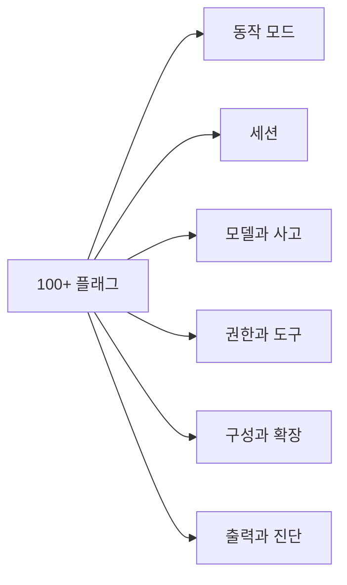
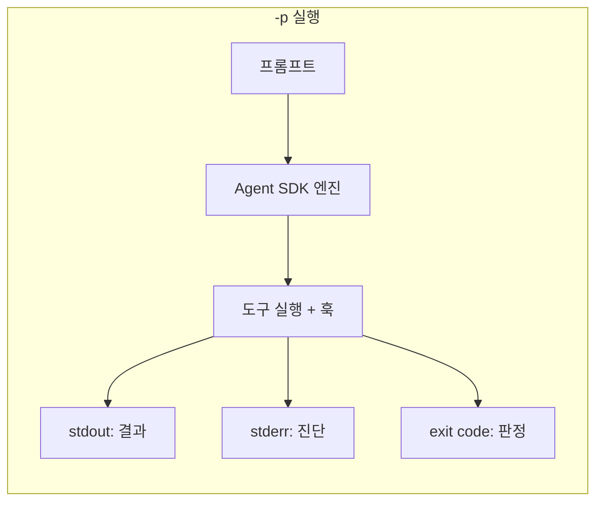
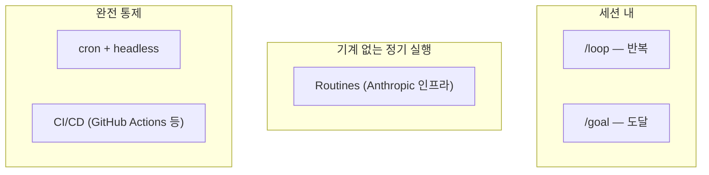
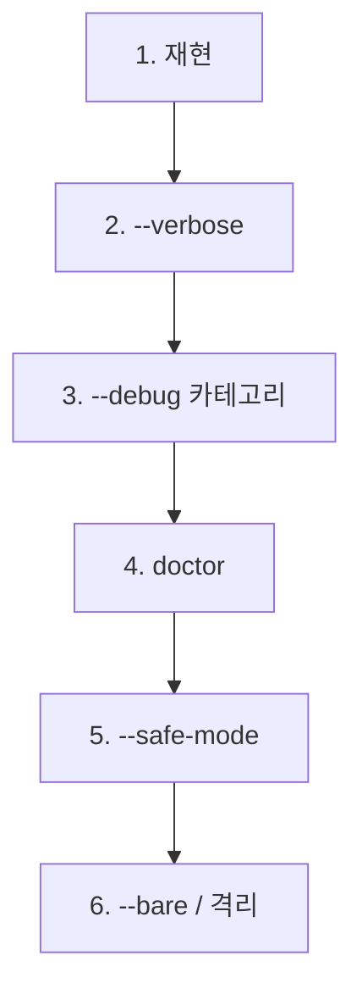

> 해당 포스팅은 현재 재직중인 회사에 관련이 없고, 개인 역량 개발을 위한 스터디 자료로 활용할 예정입니다.

## 들어가며

이 글에서는 Claude Code의 100여 가지 플래그, 헤드리스 파이프라인, 세션 관리, 스케줄 자동화, CI/CD 통합, 자동화 패턴, 환경변수, 디버깅까지 정리합니다. 본문의 기본 골격은 AWS Korea가 공개한 Claude Code Deep Dive Workshop의 Chapter 5이고, 거기에 두 개의 교육 과정에서 학습한 내용을 덧붙였습니다.

| 인용한 자료 | 무엇인가 | 본문 표기 |
| --- | --- | --- |
| Claude Code Deep Dive Workshop | AWS Korea가 GitHub에 공개한 실습 워크샵 | Chapter 5 |
| Claude Code in Action | Anthropic 공식 온라인 교육 과정 (Skilljar 플랫폼) | Lesson NEW-06 등 |
| Claude Code on Amazon Bedrock | AWS Skill Builder의 온라인 학습 프로그램 | Module 8 등 |

중간에 "보충"으로 표시한 절은 워크샵 본문 밖에서 가져온 내용입니다. 어느 과정의 어느 차시에서 온 것인지 절 머리에 적어 두었고, 링크를 포함한 전체 목록은 맨 아래 [References](#references)에 있습니다.

Ch.1~4가 "대화형의 세계"였다면, Ch.5는 **"CLI 자동화의 세계"**입니다. `-p` 한 글자가 대화형과 무인 파이프라인 사이의 스위치이며, Ch.4에서 만든 설정 자산(Permissions, Hooks, MCP)이 무인 환경에서도 그대로 동작합니다.

---

## 목차

1. [claude 명령과 플래그](#1-claude-명령과-플래그)
2. [Headless 심화](#2-headless-심화)
3. [세션 제어](#3-세션-제어)
4. [스케줄과 자동실행](#4-스케줄과-자동실행)
5. [CI/CD 통합](#5-cicd-통합)
6. [자동화 패턴](#6-자동화-패턴)
7. [환경변수](#7-환경변수)
8. [디버깅](#8-디버깅)
9. [Recap & Labs](#9-recap--labs)
10. [References](#references)

---

## 1. claude 명령과 플래그

> **해결하는 문제**: "100개 넘는 플래그를 어떻게 분류하고, 어떤 조합을 쓰면 되는가?"

### 명령 구조

```bash
$ claude                                     # 대화형 세션
$ claude "explain this project"              # 초기 프롬프트로 시작
$ claude -p "query"                          # 실행 후 종료 (headless)
$ cat logs.txt | claude -p "explain"         # 파이프 입력
$ claude -c                                  # 이 디렉토리 최근 대화 계속
$ claude -r "auth-refactor" "Finish this PR" # 이름으로 세션 재개

```

### 서브커맨드 지도

| 분류 | 서브커맨드 | 용도 |
| --- | --- | --- |
| **계정/설치** | `auth login/logout/status`, `setup-token`, `update`, `doctor`, `project purge` | 인증, 설치, 진단, 정리 |
| **운영** | `agents`, `attach`, `logs`, `stop`, `respawn`, `rm`, `daemon`, `remote-control` | 백그라운드/원격 세션 관리 |
| **확장** | `mcp login/logout`, `gateway --config`, `ultrareview`, `plugin`, `import` | MCP 인증, 게이트웨이, 심층리뷰, 플러그인, 타 에이전트 설정 가져오기 |
| **인프라** | `self-hosted-runner setup/doctor/orchestrator`, `auto-mode defaults/reset` | 자체 호스팅 러너, auto mode 설정 |

> 💡 오타를 쳐도 근접 서브커맨드를 제안합니다: `claude udpate` → "Did you mean claude update?"

### 플래그 6분류 체계



| 분류 | 대표 플래그 | 해결하는 문제 |
| --- | --- | --- |
| **동작 모드** | `-p`, `--bg`, `--remote`, `--worktree`, `--bare`, `--safe-mode`, `--remote-control` | 세션이 어디서 어떻게 뜨는가 |
| **세션** | `-c`, `-r`, `--from-pr`, `--fork-session`, `-n`, `--autocompact` | 맥락을 이어가거나 분기, 자동 compact |
| **모델과 사고** | `--model`, `--effort`, `--fallback-model`, `--advisor`, `--teammate-mode` | 지능과 비용의 조절, 팀메이트 표시 |
| **권한과 도구** | `--permission-mode`, `--tools`, `--allowed/disallowedTools`, `--disable-slash-commands` | 무인 실행의 능력 범위 |
| **구성과 확장** | `--settings`, `--agents`, `--mcp-config`, `--plugin-dir`, `--strict-mcp-config` | 세션별 설정 오버레이 |
| **출력과 진단** | `--output-format`, `--json-schema`, `--input-format`, `--verbose`, `--debug` | 결과 형식과 관측 |

### 모델 플래그 상세

```bash
$ claude --model opus                      # 별칭 사용
$ claude --effort high                     # low..max (모델별 상이)
$ claude --fallback-model sonnet,haiku     # 과부하 시 순차 시도
$ claude --advisor opus                    # 어드바이저 도구 활성
# 우선순위: 플래그 > ANTHROPIC_MODEL > settings

```

### 권한과 도구 플래그

```bash
$ claude --permission-mode plan            # 6모드 중 선택 (Ch.4)
$ claude -p --allowed-tools "Bash(git log *)" "Read"  # 무확인 허용
$ claude --disallowedTools "Edit"          # 도구 자체 제거
$ claude --disallowedTools "mcp__*"        # 전 MCP 도구 제거
$ claude --tools "Bash,Edit,Read"          # 내장 도구만 한정

```

> **왜 **`--disallowedTools`**가 두 가지 역할인가?** 베어이름(`"Edit"`)은 도구를 컨텍스트에서 완전 제거하고, 스코프 규칙(`"Bash(rm *)"`)은 도구는 유지하되 해당 호출만 거부합니다.

### --bare vs --safe-mode

| 속성 | `--bare` | `--safe-mode` |
| --- | --- | --- |
| **목적** | 속도 (스크립트 가속) | 진단 (고장 원인 이분) |
| **비활성화** | 훅, 스킬, 플러그인, MCP, CLAUDE.md | 전 커스터마이즈 |
| **유지** | Bash, 읽기, 편집 도구 | managed 정책, 인증, 권한 |
| **사용 장면** | `-p` 반복 호출의 기동 시간 절약 | 커스텀이 원인인지 이분 판정 |

### 보충: v2.1 이후 추가된 주요 플래그

> 📕 출처: Anthropic 공식 문서 CLI Reference — References [6]

워크샵 이후 추가되거나 변경된 플래그 중 실무에서 유용한 것들입니다:

| 플래그 | 용도 | 비고 |
| --- | --- | --- |
| `--remote-control`, `--rc` | 세션에 Remote Control을 활성화하여 Claude.ai/모바일에서도 제어 | 서버 모드는 `claude remote-control` 서브커맨드 |
| `--autocompact <auto \| tokens>` | 세션 자동 compact 윈도우 설정 | 설정 파일 변경 없이 세션 단위 |
| `--teammate-mode` | 팀메이트(sub-agent) 표시 방식: `in-process`(기본), `auto`, `tmux`, `iterm2` | 병렬 에이전트 모니터링 |
| `--input-format` | `-p` 입력 형식 지정: `text`(기본) 또는 `stream-json` | 프로그래밍적 입력 처리 |
| `--strict-mcp-config` | `--mcp-config`로 지정한 MCP 서버만 사용, 나머지 전부 무시 | CI에서 MCP 환경 격리 |
| `--disable-slash-commands` | 모든 스킬과 슬래시 명령 비활성 | 무인 실행의 공격 면적 축소 |
| `--forward-subagent-text` | 서브에이전트의 텍스트/thinking을 출력 스트림에 포함 | 디버깅, 관측 |
| `--append-subagent-system-prompt` | 모든 서브에이전트 시스템 프롬프트에 텍스트 추가 | 서브에이전트 규칙 일괄 적용 |
| `--prompt-suggestions` | 각 턴 후 다음 프롬프트 예측 메시지 방출 | IDE 통합 |
| `--cwd <path>` | `claude agents`에서 특정 디렉터리의 세션만 표시 | 멀티 프로젝트 관리 |

> ⚠️ `--enable-auto-mode`는 v2.1.111에서 제거되었습니다. Auto mode는 이제 Shift+Tab 순환에 기본 포함되며, `--permission-mode`로 제어합니다.

> 📌 Permission mode는 현재 6개: `plan`, `default`, `acceptEdits`, `auto`, `dontAsk`, `bypassPermissions`. 워크샵의 `autoEdit`/`fullAuto`는 각각 `acceptEdits`/`auto`로 이름이 변경되었습니다.

### 조합 관용구 5선

```bash
# 1. CI 리뷰: 예산과 도구를 잠근 헤드리스
claude -p --max-budget-usd 2 --allowed-tools "Read" "Grep" ...

# 2. 빠른 배치: 최소 기동 + 저비용 모델
claude --bare -p --model haiku "..."

# 3. 격리 실험: PR 분기 워크트리
claude -w '#123' --permission-mode plan

# 4. 세션 재현: 소스 고정 + 오버레이
claude --setting-sources project --settings ./ci.json -p "..."

# 5. 무인 야간: dontAsk + 폴백 체인
claude -p --permission-mode dontAsk --fallback-model sonnet,haiku "..."

```

---

## 2. Headless 심화

> **해결하는 문제**: "`-p`로 어떻게 파이프라인을 만들고, 결과를 구조화하며, 비용을 제어하는가?"

### -p의 본질

`-p`는 단순 출력 모드가 아닙니다. **Agent SDK 경로를 타는 단발 에이전트 실행**입니다. 도구, 훅, 설정이 모두 살아있는 채로 결과만 표준출력에 남깁니다.



| 계약 | 채널 | 용도 |
| --- | --- | --- |
| 결과 | stdout | 본문 또는 JSON 봉투 |
| 진단 | stderr | 에러, 경고, 훅 메시지 |
| 판정 | exit code | 0=성공, 비0=실패/상한도달 |

### 입력 6경로

```bash
claude -p "직접 인자"                        # 1. 인자
cat error.log | claude -p "원인 분석"        # 2. 파이프
claude -p "$(cat prompt.txt)"               # 3. 명령 치환
claude -p "요약해" < notes.md               # 4. 리다이렉트
claude -p <<'EOF'                            # 5. 히어독
여러 줄 지시문 ...
EOF
claude -c -p "이어서 리팩토링"               # 6. 세션 이어받기

```

> 💡 파이프(stdin) = 데이터, 인자 = 지시. 이 분리를 이해하면 스크립트 설계가 깔끔해집니다.

### Exit Code 계약

```bash
claude -p "테스트 실패 원인을 찾아 수정" --max-turns 15
case $? in
  0) echo "OK" ;;
  *) echo "FAIL (code $?)" ; exit 1 ;;
esac

```

| exit code | 의미 | 활용 |
| --- | --- | --- |
| 0 | 정상 완료 | 파이프라인 다음 단계 진행 |
| 비0 | 오류, 상한 도달 등 | 게이트 차단, 알람 발송 |
| `auth status`: 0/1 | 로그인/미로그인 | CI 전제조건 확인 |
| `ultrareview`: 0/1 | 통과/발견 | PR 머지 게이트 |

### --output-format json

```bash
$ claude -p "고위험 파일 3개" --output-format json
{
  "type": "result",
  "subtype": "success",
  "result": "1. src/auth/... (본문)",
  "session_id": "...",
  "total_cost_usd": 0.0284,
  "num_turns": 4,
  "duration_ms": 21033,
  "usage": { "input_tokens": ..., "output_tokens": ... }
}

```

| 필드 | 용도 |
| --- | --- |
| `.result` | 본문 텍스트 |
| `.total_cost_usd` | 비용 관측 |
| `.session_id` | 세션 재개 열쇠 |
| `.is_error` | 오류 봉투 분기 |

### stream-json 이벤트 순서

| 순서 | type | 내용 |
| --- | --- | --- |
| 1 | `system` | 세션 시작, 모델/도구 목록 |
| 2~N | `assistant` | 모델 응답 메시지 단위 |
| 2~N | `user` (tool_result) | 도구 실행 결과 회신 |
| 마지막 | `result` | 최종 봉투 (json과 동일) |

추가 옵션: `--include-partial-messages` (토큰 단위), `--include-hook-events` (훅 수명주기)

### --json-schema 구조화 출력

"파싱에서 계약으로" — 자유 텍스트를 jq로 파싱하는 대신, 스키마로 출력 형식을 강제합니다.

```bash
claude -p "이 diff의 위험도를 평가해" \
  --json-schema '{
    "type": "object",
    "properties": {
      "risk": {"type": "string", "enum": ["low","medium","high"]},
      "reason": {"type": "string"},
      "block": {"type": "boolean"}
    },
    "required": ["risk","reason","block"]
  }'

```

> SDK에서는 Zod(TypeScript), Pydantic(Python)으로 동일한 스키마를 정의합니다 (Ch.6).

### 예산과 턴 상한

```bash
claude -p "의존성 취약점 정리해 패치 PR 초안까지" \
  --max-turns 20 \
  --max-budget-usd 3.00

```

| 상한 | 기본값 | 설계 요령 |
| --- | --- | --- |
| `--max-turns` | 무제한 | 파일럿 실측 p95의 1.5배로 시작 |
| `--max-budget-usd` | 무제한 | 초과 종료는 실패가 아니라 신호 |

> ⚠️ **무인 실행에서 상한 미지정은 금지입니다.** 상한 없으면 비용이 발산할 수 있습니다.

### 캐시 최적화

```bash
claude -p --exclude-dynamic-system-prompt-sections \
  "이 모듈의 순환 의존을 정리해"

```

시스템 프롬프트의 기기별 섹션(작업 경로, 환경 정보)이 캐시를 깨뜨립니다. 이 플래그는 동적 섹션을 첫 사용자 메시지로 이동시켜, 여러 사용자/기계가 같은 작업을 돌릴 때 프롬프트 캐시 적중률을 높입니다.

### 에러 처리와 재시도 골격

```bash
run_claude() {
  local attempt=1
  while [ $attempt -le 3 ]; do
    OUT=$(claude -p "$1" --output-format json \
      --max-turns 15 2>err.log) && { echo "$OUT"; return 0; }
    grep -qiE 'rate|overloaded|529' err.log || break
    sleep $(( attempt * 20 )); attempt=$((attempt+1))
  done
  return 1  # 진짜 실패: 재시도 무의미
}

```

> `--fallback-model`이 모델 과부하의 1차 방어이고, 재시도 함수는 일시 오류 한정 2차 방어입니다.

---

## 3. 세션 제어

> **해결하는 문제**: "대화를 어디에 저장하고, 어떻게 이어가며, 분기하고, 웹으로 넘기는가?"

### 세션 저장 구조

| 항목 | 상세 |
| --- | --- |
| 저장 위치 | `~/.claude/projects/` 아래 프로젝트별 JSONL |
| 기본 수명 | 30일 자동 정리 (`cleanupPeriodDays`, Ch.4) |
| 저장 끄기 | `-p`는 `--no-session-persistence`, 전 모드는 env 변수 |
| 일괄 정리 | `claude project purge` (`--dry-run`으로 예행) |

### continue vs resume

|  | `-c` / `--continue` | `-r` / `--resume` |
| --- | --- | --- |
| 동작 | 현재 디렉토리 최근 대화 직행 | ID 또는 이름으로 특정 재개 |
| 범위 | add-dir로 얹은 세션 포함 | 현 프로젝트 + 워크트리 한정 검색 |
| 헤드리스 | `-c -p`로 이어받기 가능 | 인자 없이는 대화형 픽커 |
| 용도 | 일상 복귀의 기본기 | 명명된 세션, bg 세션 재개 |

### --from-pr

```bash
$ claude --from-pr 123
$ claude --from-pr https://github.com/org/repo/pull/123

```

Claude가 만든 PR은 세션과 자동 링크됩니다. 리뷰어 코멘트 대응 흐름: 코멘트 확인 → `claude --from-pr 123` → 그 PR을 만든 맥락 그대로 후속 수정.

> GitHub, GitHub Enterprise, GitLab MR, Bitbucket PR URL 모두 수용합니다.

### fork와 session-id

```bash
# 원본 보존 분기: 재개하되 새 세션 ID로
$ claude --resume auth-refactor --fork-session

# 고정 좌표: 스크립트가 세션 ID를 소유
$ SID=$(uuidgen)
$ claude -p --session-id "$SID" "1단계: 스캔"
$ claude -p --resume "$SID" "2단계: 스캔 결과로 수정"

```

> 대화형의 `/fork`와 동일한 개념이 CLI에서는 `--fork-session`으로 구현됩니다.

### 체크포인트와 Rewind

| 방법 | 용도 |
| --- | --- |
| `/undo` | 마지막 턴 되돌리기 |
| `/rewind N` | N턴 전으로 이동 |
| Git checkpoint | 파일 변경 시점별 자동 스냅샷 |
| `--fork-session` | 분기점 보존 후 실험 |

### 웹 왕복 (Remote / Teleport)

```bash
# 로컬에서 웹 세션 생성
$ claude --remote
# → URL 반환, 브라우저에서 이어서 작업

# 웹에서 만든 세션을 로컬로 회수
$ claude --teleport <session-id>

```

### Remote Control

| 역할 | 동작 |
| --- | --- |
| 로컬 → 웹 | `--remote`로 URL 발급 |
| 웹 → 로컬 | `--teleport`로 회수 |
| 용도 | 모바일에서 확인, 팀원에게 세션 공유 |

---

## 4. 스케줄과 자동실행

> **해결하는 문제**: "반복 작업을 어떤 표면에서 실행할지, Routines와 cron의 차이는 무엇인가?"

### 자동화 표면 5종 지도



| 표면 | 트리거 | 인프라 | 제어 수준 |
| --- | --- | --- | --- |
| `/loop` | 세션 안 반복 지시 | 로컬 | 대화형 |
| `/goal` | 조건 도달 판정 | 로컬 | 대화형 |
| Routines | Cron / HTTP POST / GitHub 이벤트 | Anthropic 클라우드 | 최소 구축 |
| cron + `-p` | crontab | 내 서버 | 완전 통제 |
| CI/CD | PR, push, schedule | GitHub/GitLab Runner | 이벤트 기반 |

### 보충: Routines 상세

> 📕 출처: Anthropic 공식 교육 과정 「Claude Code in Action」 Lesson NEW-06 (Routines & Headless) — References [2]

핵심: **Routines = 저장된 프롬프트 + 레포 + 커넥터 + 트리거 → 클라우드에서 실행**

| 구성 요소 | 설명 |
| --- | --- |
| Prompt | Claude에게 할 일을 지시 |
| Repository | 작업할 레포 |
| Connectors | 필요한 외부 연결 |
| Trigger | 언제 실행할지 |

만드는 방법 2가지:

- **Web**: `claude.ai/code/routines` — 이름, 지시, 레포, 트리거 선택
- **터미널**: `/schedule daily dependency audit at 9am`

**⚠️ 3가지 제한 사항:**

| 제한 | 설명 |
| --- | --- |
| Research Preview | 동작과 제한이 계속 변할 수 있음 |
| 최소 1시간 간격 | 더 자주 필요하면 cron 사용 |
| 기본 브랜치 클론 + `claude/` 접두사 브랜치만 push | main을 덮어쓰지 못하도록 하는 가드레일 |

### Deep Links

```
claude://open?prompt=이+프로젝트를+설명해줘&cwd=/path/to/project

```

런북, Notion, 위키에 임베드하면 클릭 한 번으로 Claude Code 세션 진입.

### --bg와 --exec

```bash
# 백그라운드로 Claude 세션 기동
$ claude --bg "flaky 테스트 원인 조사"
# → 세션 ID 반환, 터미널 즉시 복귀

$ claude logs 7c5dcf5d     # 진행 확인
$ claude attach 7c5dcf5d   # 터미널로 회수

# 셸 명령을 PTY 잡으로
$ claude --bg --exec 'pytest -x'

```

> ⚠️ `--bg`와 `-p`는 병용 불가합니다 (v2.1.198 규칙).

### cron + headless 레시피

```bash
# crontab -e
SHELL=/bin/bash
PATH=/usr/local/bin:/usr/bin:/bin:/home/dev/.local/bin

# 매일 07:00 의존성 감사
0 7 * * 1-5  cd /home/dev/payments && \
  ./scripts/nightly-deps-audit.sh >> ~/logs/deps.log 2>&1

```

**cron 3대 함정:**

1. PATH가 빈약 → 반드시 명시
2. 인증 만료 → Bedrock SSO 헬퍼/역할 설정 (Ch.3)
3. 실패 알람 없음 → 스크립트 내 exit 게이트 + notify

---

## 5. CI/CD 통합

> **해결하는 문제**: "이벤트 기반으로 Claude를 부르되, 묻지 않고 / 넘치지 않고 / 흔적을 남기려면?"

### 비대화 3원칙

| 원칙 | 구현 | 왜? |
| --- | --- | --- |
| **P1: 묻지 않는다** | `-p` + `--allowed-tools` 명시, 확인 프롬프트 원천 제거 | 무인 환경에 프롬프트 대기 불가 |
| **P2: 넘치지 않는다** | `--max-turns`, `--max-budget-usd`, 모델 하향 기본 | 비용 발산 방지 |
| **P3: 흔적을 남긴다** | `--output-format json` 저장, 아티팩트 업로드 | 감사, 디버깅 재료 |

### CI 인증 전략

| 방식 | 설명 | 장기 시크릿 |
| --- | --- | --- |
| **AWS OIDC (권장)** | 역할 인수 + Bedrock | 0개 |
| 구독 조직 | `claude setup-token`으로 장기 토큰 | 1개 (시크릿 저장소) |
| API 조직 | `ANTHROPIC_API_KEY` 시크릿 | 1개 |
| 게이트웨이 조직 | `BASE_URL` + 서비스 자격 | 1개 |

> 🔑 공통 원칙: 잡 권한 최소화, 키는 마스킹 로그, 포크 PR 실행 주의.

### GitHub Actions 기본 골격

```yaml
# .github/workflows/audit.yml
jobs:
  deps-audit:
    runs-on: ubuntu-latest
    permissions: { id-token: write, contents: read }
    steps:
      - uses: actions/checkout@v4
      - uses: aws-actions/configure-aws-credentials@v4
        with:
          role-to-assume: ${{ vars.CLAUDE_ROLE }}
          aws-region: ap-northeast-2
      - run: curl -fsSL https://claude.ai/install.sh | bash
      - run: |
          CLAUDE_CODE_USE_BEDROCK=1 \
          ./scripts/nightly-deps-audit.sh

```

### PR 리뷰 잡

```yaml
on: { pull_request: { types: [opened, synchronize] } }
# ... checkout(fetch-depth: 0), 인증, 설치 생략 ...
- name: Review
  run: |
    git diff origin/${{ github.base_ref }}...HEAD > pr.diff
    claude -p "pr.diff를 리뷰해 심각 도별로 정리" \
      --allowed-tools "Read" "Grep" "Bash(git diff *)" \
      --max-turns 12 --max-budget-usd 1.50 \
      --json-schema "$(cat .ci/review-schema.json)" \
      > review.json
    jq -e '.block == false' review.json  # 게이트

```

### 보충: 관리형 대안 — Managed Code Review

> 📕 출처: Anthropic 공식 교육 과정 「Claude Code in Action」 Lesson NEW-07 (GitHub Actions and Code Review) — References [3]

| 항목 | 관리형 Code Review | DIY GitHub Action |
| --- | --- | --- |
| 설정 | 켜기만 하면 됨 | 워크플로우 직접 구성 |
| 범위 | PR 리뷰 (코멘트만) | 리뷰 이상의 모든 것 (구현, 보고, 스케줄) |
| 특징 | 전체 코드베이스 맥락, 인라인 코멘트, 중복 제거 | 완전 제어 |
| 제한 | 승인/차단 불가, autofix 없음 | — |

> 💡 **관리형 서비스부터 시작하세요.** Claude가 CI에서 실제로 "무언가를 해야 하는" 순간 Action으로 이동.

### GitLab CI

```yaml
claude-review:
  stage: test
  image: ubuntu:24.04
  rules:
    - if: $CI_PIPELINE_SOURCE == "merge_request_event"
  before_script:
    - apt-get update && apt-get install -y curl git jq
    - curl -fsSL https://claude.ai/install.sh | bash
    - export PATH="$HOME/.local/bin:$PATH"
  script:
    - ./scripts/mr-review.sh  # -p + 상한 + 스키마 동일
  artifacts: { paths: [review.json], when: always }

```

> 같은 원칙, 다른 문법. 스크립트를 재사용하면 CI 플랫폼은 부차 변수입니다.

### --init 준비 훅

```json
{ "hooks": { "Setup": [
  { "matcher": "init",
    "hooks": [{ "type": "command",
      "command": "npm ci && cp .env.ci .env" }]
  }
] } }

```

```bash
# CI 스텝에서:
- run: claude -p --init "테스트 실패를 조사해 수정"
# → -p 실행 전에 init 매처 Setup 훅이 선행

```

### 비용 통제 다이얼

| 수단 | 설명 |
| --- | --- |
| `--max-budget-usd` | 호출 단위 달러 상한 |
| `--max-turns` | 턴 수 제한 |
| 모델 하향 | 리뷰/분류는 sonnet/haiku 기본 |
| paths 필터 | 발동 조건 축소 (docs 변경은 스킵) |
| `--exclude-dynamic...` | 캐시 적중률 향상 |
| Gateway 한도 | 조직 수준 안전망 (Ch.3) |

---

## 6. 자동화 패턴

> **해결하는 문제**: "현장에서 검증된 자동화 스크립트 패턴은 무엇인가?"

### Pattern 1: 이슈 트리아지

```bash
#!/usr/bin/env bash
set -uo pipefail
N=$1
gh issue view "$N" --json title,body > issue.json
OUT=$(claude --bare -p "issue.json을 분류해" \
  --model haiku --max-turns 6 \
  --json-schema "$(cat .ci/triage-schema.json)") || exit 1
LABEL=$(echo "$OUT" | jq -r '.category')
gh issue edit "$N" --add-label "$LABEL"
echo "$OUT" | jq -r '.summary' | gh issue comment "$N" -F -

```

> 안전선: 닫기 금지, 제안까지만. 확정은 사람.

### Pattern 2: 로그 분석 (map-reduce)


**왜 map-reduce인가?** 대량 로그를 통째로 넣으면 토큰 비용이 폭발합니다. 셸이 압축/분할을, Claude가 해석/상관을 맡는 분업이 비용과 품질을 동시에 지킵니다.

### Pattern 3: 일일 보고서

```bash
#!/usr/bin/env bash
SINCE=$(date -d yesterday +%F)
{ git log --since="$SINCE" --oneline;
  gh pr list --state all --search "updated:>=$SINCE" --json number,title,state;
  gh issue list --search "created:>=$SINCE" --json number,title;
} > digest.txt

claude -p "digest.txt로 팀 브리핑: 요약, 리스크, 오늘 볼 것 3" \
  --max-turns 8 --max-budget-usd 0.50 > report.md

curl -s -X POST "$SLACK_WEBHOOK" \
  -d "$(jq -n --rawfile t report.md '{text:$t}')"

```

### Pattern 4: 문서 파이프라인

```bash
# 변경된 모듈만 문서 재생성
for m in $(git diff --name-only HEAD~1 | grep '^src/' | cut -d/ -f2 | sort -u); do
  claude -p "src/$m 모듈의 API 문서를 docs/$m.md로 갱신" \
    --allowed-tools "Read" "Grep" "Write(./docs/**)" \
    --max-turns 10
done

# 한영 병행: 갱신분만 번역
for f in $(git diff --name-only -- docs/*.md); do
  claude --bare -p "기술 용어를 보존해 영어로 번역" \
    < "$f" > "docs/en/$(basename $f)"
done

```

### Pattern 5: 배치 마이그레이션

```bash
for f in $(cat targets.txt); do
  grep -qx "$f" done.txt 2>/dev/null && continue
  claude -p "$f를 신규 ORM API로 마이그레이션" \
    --allowed-tools "Read" "Edit" "Bash(npm run test *)" \
    --max-turns 12 || { echo "$f" >> failed.txt; git checkout -- "$f"; continue; }
  npm run test -- --related "$f" || { echo "$f" >> failed.txt; git checkout -- "$f"; continue; }
  git add "$f" && git commit -m "migrate: $f"
  echo "$f" >> done.txt
done

```

핵심 설계: 파일 1개 = 변환 + 테스트 + 커밋 **원자 단위**. 실패 시 `git checkout`으로 원복하고 `failed.txt`에 기록 → 배치가 멈추지 않고 사람이 나중에 개입.

### 보충: 검증 3단계

> 📕 출처: Anthropic 공식 교육 과정 「Claude Code in Action」 Lesson NEW-08 (Verifying Unsupervised Runs) — References [4]

| 단계 | 방법 | 원칙 |
| --- | --- | --- |
| 1. Diff 우선 | `/code-review` + `git diff` | 요약이 아닌 변경 자체를 읽기 |
| 2. 테스트 게이트 | PostToolUse Hook → exit 2 | 신뢰가 아닌 와이어링으로 강제 |
| 3. Cold Second Opinion | 새 세션/sub-agent로 맥락 없이 리뷰 | 확증 편향 차단 |

> 감시하지 않을수록 더 많이 검증합니다.

---

## 7. 환경변수

> **해결하는 문제**: "어떤 환경변수가 있고, 어떻게 점검하며, 보안 원칙은 무엇인가?"

### 7칸 분류 지도

| 분류 | 대표 변수 | 용도 |
| --- | --- | --- |
| **인증** | `ANTHROPIC_API_KEY`, `CLAUDE_CODE_USE_BEDROCK`, `AWS_PROFILE` | 공급자 선택과 자격 |
| **네트워크** | `HTTPS_PROXY`, `HTTP_PROXY`, `NO_PROXY` | 프록시, 방화벽 우회 |
| **모델/사고** | `ANTHROPIC_MODEL`, `CLAUDE_CODE_MAX_MODEL` | 기본 모델, 상한 모델 |
| **기능 스위치** | `CLAUDE_CODE_SIMPLE`, `CLAUDE_CODE_DISABLE_NONESSENTIAL_TRAFFIC` | bare 모드, 텔레메트리 |
| **관측** | `CLAUDE_CODE_ENABLE_TELEMETRY`, `OTEL_EXPORTER_OTLP_ENDPOINT` | OTel, 비용 추적 |
| **디렉토리/기록** | `CLAUDE_CONFIG_DIR`, `CLAUDE_TRANSCRIPT_DIR` | 설정/기록 위치 재정의 |
| **기록** | `CLAUDE_CODE_SESSION_PERSISTENCE` | 세션 저장 제어 |

### 점검 원라이너

```bash
# 인증 상태 확인
claude auth status --text && echo "OK" || echo "NOT LOGGED IN"

# Bedrock 연결 확인
CLAUDE_CODE_USE_BEDROCK=1 claude -p "hello" --max-turns 1 2>&1 | head -1

# 프록시 적용 확인
env | grep -i proxy

```

### 보안 원칙

| 원칙 | 설명 |
| --- | --- |
| 시크릿은 env에만 | settings.json에 API 키를 넣지 말 것 |
| CI에서는 Secrets 저장소 | GitHub Secrets, AWS Secrets Manager 등 |
| 로그 마스킹 | `--output-format json`의 result에 키가 새지 않도록 |
| 최소 권한 | 필요한 변수만 export, 나머지는 unset |

---

## 8. 디버깅

> **해결하는 문제**: "Claude Code가 이상하게 동작할 때, 어떤 순서로 진단하는가?"

### 진단 흐름 6단



| 단계 | 명령 | 목적 |
| --- | --- | --- |
| 1. 재현 | 동일 프롬프트 재실행 | 일시 오류 배제 |
| 2. verbose | `--verbose` | 턴 단위 전체 출력 확인 |
| 3. debug | `--debug tool,permission,hook` | 카테고리별 필터 진단 |
| 4. doctor | `claude doctor` | 환경 자동 진단 + 수정 제안 |
| 5. safe-mode | `--safe-mode` | 전 커스터마이즈 비활성 → 이분 판정 |
| 6. bare/격리 | `--bare` 또는 새 디렉토리 | 최소 환경에서 재현 여부 |

### --debug 카테고리

```bash
claude --debug tool,permission,hook,mcp -p "test"
# 쉼표로 여러 카테고리 동시 활성
# --debug-file ./debug.log 로 파일 출력도 가능

```

| 카테고리 | 출력 내용 |
| --- | --- |
| `tool` | 도구 호출/결과 상세 |
| `permission` | 허용/차단 판정 경로 |
| `hook` | 훅 매칭, 실행, exit code |
| `mcp` | MCP 서버 통신 |
| `model` | 모델 선택, 폴백 |
| `session` | 세션 로드/저장 |

### 헤드리스 전용 이슈

| 증상 | 원인 | 해결 |
| --- | --- | --- |
| 무한 대기 | 확인 프롬프트 발생 | `--allowed-tools` 또는 `--permission-mode dontAsk` |
| 예상 외 종료 | `--max-turns` 도달 | 상한 상향 또는 작업 분할 |
| 빈 출력 | exit 비0 + stderr에 에러 | `2>err.log` 후 확인 |
| 비용 폭발 | 상한 미설정 + 루프 | `--max-budget-usd` 필수 지정 |

---

## 9. Recap & Labs

### 핵심 요약 표

| Part | 한 줄 핵심 |
| --- | --- |
| 1. 명령과 플래그 | 서브커맨드 2지도 + 플래그 6서랍이면 전집 정리 |
| 2. Headless | `-p`는 SDK 경유 단발 에이전트, 구조화 출력으로 계약 |
| 3. 세션 제어 | 어디서든 이어가고(-c/-r), 분기하고(fork), 웹으로 넘기기(remote) |
| 4. 스케줄 | 5종 표면 지도: /loop, /goal, Routines, cron, CI |
| 5. CI/CD | 3원칙: 묻지 않고, 넘치지 않고, 남긴다 |
| 6. 자동화 패턴 | 트리아지, 로그분석, 보고서, 문서, 배치 — 5패턴 |
| 7. 환경변수 | 7칸 분류, 점검 원라이너, 시크릿은 env에만 |
| 8. 디버깅 | 6단 진단: 재현→verbose→debug→doctor→safe-mode→bare |

### FAQ 6가지

| Q | A |
| --- | --- |
| `-p`에서 CLAUDE.md 적용되나? | `--bare` 없으면 적용됨. `--bare`는 건너뜀 |
| `--max-turns` 초과하면? | 오류 exit code로 종료, 결과 없음 |
| Routines와 cron 차이? | Routines=Anthropic 인프라(서버 불필요), cron=내 서버(완전 통제) |
| `--from-pr`과 `-w` 차이? | `--from-pr`=맥락 복원, `-w`=코드 격리(워크트리) |
| CI에서 비용 상한 없으면? | 무한 루프 가능 → 반드시 `--max-budget-usd` 지정 |
| `stream-json`은 언제? | 실시간 진행 UI가 필요할 때 (타자기 효과, 진행률 표시) |

### 실습 3종

| Lab | 주제 | 핵심 확인 | 소요 |
| --- | --- | --- | --- |
| Lab 1 | Headless 파이프라인 | `-p`, JSON 봉투, `--json-schema`, exit code, 예산 상한 | ~10분 |
| Lab 2 | 세션 제어 | `-c`, `-r`, `session-id`, `fork-session`, 저장 구조 | ~10분 |
| Lab 3 | 자동화 스크립트 | 배치 분석, 재시도 골격, 일일 보고서 | ~15분 |

---

### Lab 1: Headless 파이프라인

**목표**: `-p`의 본질(SDK 경유 단발 에이전트)과 구조화 출력, exit code 계약을 확인합니다. **소요 시간**: ~10분 **사전 준비**: `claude` CLI, `jq`

Step 1: 실습 프로젝트 준비

```bash
mkdir -p ~/lab-ch5 && cd ~/lab-ch5 && git init
echo "const x = 1;" > index.js

```

Step 2: 기본 `-p` 실행

```bash
claude -p "이 프로젝트에 파일이 몇 개 있는지 알려줘"
# → 텍스트 출력 후 즉시 종료

```

Step 3: JSON 봉투 확인

```bash
claude -p "index.js의 역할을 한 줄로 설명해" --output-format json
# → { "type":"result", "result":"...", "total_cost_usd":..., "num_turns":... }

```

Step 4: jq로 필드 추출

```bash
OUT=$(claude -p "이 프로젝트를 한 줄로 요약해" --output-format json)
echo "$OUT" | jq -r '.result'          # 본문만
echo "$OUT" | jq '.total_cost_usd'     # 비용
echo "$OUT" | jq '.num_turns'          # 턴 수

```

Step 5: `--json-schema` 구조화 출력

```bash
claude -p "index.js를 분석해줘" \
  --json-schema '{
    "type": "object",
    "properties": {
      "language": {"type": "string"},
      "lines": {"type": "integer"},
      "summary": {"type": "string"}
    },
    "required": ["language", "lines", "summary"]
  }'
# → {"language":"JavaScript","lines":1,"summary":"..."} 정확한 구조

```

> 🔑 **핵심**: `--json-schema`는 "파싱에서 계약으로" 전환합니다. 정규식으로 텍스트를 파싱할 필요가 없습니다.

Step 6: exit code 계약 확인

```bash
claude -p "완료" --max-turns 1; echo "Exit: $?"
# → Exit: 0 (정상)

claude -p "index.js를 리팩토링하고 테스트까지 작성해" --max-turns 1; echo "Exit: $?"
# → Exit: 비0 (턴 상한 초과)

```

Step 7: 파이프 입력 + 예산 상한

```bash
# 파이프 입력
cat index.js | claude -p "이 코드의 문제점을 찾아줘"

# 예산 상한
claude -p "이 프로젝트를 완전히 리팩토링해" \
  --max-turns 5 --max-budget-usd 0.50
echo "Exit: $?"

```

**검증**:

```
□ --output-format json에서 result, total_cost_usd 필드 확인
□ --json-schema로 정확한 JSON 구조 반환
□ --max-turns 초과 시 비0 exit code
□ 파이프 입력이 프롬프트 컨텍스트로 전달됨

```

---

### Lab 2: 세션 제어

**목표**: 대화를 이어가고(`-c`), 골라잡고(`-r`), 분기하고(`fork`), 스크립트가 좌표를 소유하는(`session-id`) 흐름을 확인합니다. **소요 시간**: ~10분 **사전 준비**: Lab 1 프로젝트 또는 아무 git 저장소

Step 1: 대화형 세션 시작 → 종료

```bash
cd ~/lab-ch5
claude
# 세션 안에서:
> 이 프로젝트에 README.md를 만들어줘
> exit

```

Step 2: `-c`로 최근 대화 이어받기

```bash
claude -c
# → 방금 만든 README.md 맥락이 남아있음
> 방금 만든 README에 설치 방법 섹션 추가해줘
> exit

```

Step 3: `-c -p`로 헤드리스 이어받기

```bash
claude -c -p "README.md에 License 섹션도 추가해"
# → 이전 대화 맥락 유지한 채 실행 후 종료

```

Step 4: `-r` 픽커로 세션 선택

```bash
claude -r
# → 대화형 픽커에서 세션 목록 표시, 선택하여 재개

```

Step 5: `session-id` 고정 좌표

```bash
SID=$(uuidgen)
claude -p --session-id "$SID" "1단계: index.js 분석"
claude -p --resume "$SID" "2단계: 분석 결과 기반으로 개선안 제시"
# → 같은 세션에서 2단계가 1단계 맥락을 이어감

```

> 📌 **이것이 스크립트 자동화의 핵심입니다**: `session-id`로 좌표를 고정하면 다단계 파이프라인에서 맥락을 유지할 수 있습니다.

Step 6: `fork-session` (분기)

```bash
claude -c
> 이 프로젝트를 TypeScript로 전환할 계획을 세워줘
> exit

# 동일 지점에서 분기
claude -c --fork-session
# → 새 세션 ID로 원본 보존 분기
> 아니야, Python으로 전환하는 걸로 바꿔
> exit

```

Step 7: 세션 저장 위치 확인

```bash
ls ~/.claude/projects/
# → 프로젝트별 디렉터리 존재 확인

```

**검증**:

```
□ -c로 이전 대화 맥락이 유지됨
□ -c -p로 헤드리스에서도 이전 세션 이어감
□ session-id로 스크립트가 세션 좌표를 소유
□ fork-session으로 원본 보존 분기
□ ~/.claude/projects/ 아래 JSONL 존재

```

---

### Lab 3: 자동화 스크립트

**목표**: 구조화 출력 + jq 집계 → 배치 분석, 에러 재시도, 일일 보고서까지 자동화 패턴을 조립합니다. **소요 시간**: ~15분 **사전 준비**: Lab 1 프로젝트, `jq`

Step 1: 실습 파일 준비

```bash
cd ~/lab-ch5
mkdir -p src scripts
cat > src/auth.js << 'EOF'
function login(user, pass) {
  if (pass === "admin") return true;
  return fetch("/api/auth", { body: JSON.stringify({user, pass}) });
}
module.exports = { login };
EOF

cat > src/utils.js << 'EOF'
function sleep(ms) { return new Promise(r => setTimeout(r, ms)); }
function retry(fn, n=3) { /* TODO */ }
module.exports = { sleep, retry };
EOF

```

Step 2: 배치 분석 (다중 파일 → 구조화 출력 → 집계)

```bash
for f in src/*.js; do
  claude --bare -p "이 파일의 보안 위험도를 평가해" \
    --max-turns 6 --max-budget-usd 0.30 \
    --json-schema '{
      "type":"object",
      "properties":{
        "file":{"type":"string"},
        "risk_score":{"type":"number"},
        "top_issue":{"type":"string"}
      },
      "required":["file","risk_score","top_issue"]
    }' < "$f"
done | jq -s 'sort_by(-.risk_score)' > report.json

echo "=== 보안 분석 결과 ==="
jq -r '.[] | "[\(.risk_score)] \(.file): \(.top_issue)"' report.json

```

> 🔑 `--bare`로 훅/MCP 탐색을 건너뛰어 기동 시간을 절약합니다. 배치에서는 파일 수만큼 기동하므로 차이가 큽니다.

Step 3: 에러 처리 + 재시도 골격

```bash
cat > scripts/run-claude.sh << 'EOF'
#!/usr/bin/env bash
set -uo pipefail

run_claude() {
  local prompt="$1" schema="$2" attempt=1
  while [ $attempt -le 3 ]; do
    OUT=$(claude --bare -p "$prompt" \
      --output-format json \
      --json-schema "$schema" \
      --max-turns 10 --max-budget-usd 1.00 \
      2>err.log) && {
      echo "$OUT" | jq -r '.result'; return 0
    }
    grep -qiE 'rate|overloaded|529' err.log || break
    echo "재시도 $attempt/3..." >&2
    sleep $((attempt * 20))
    attempt=$((attempt + 1))
  done
  return 1
}
EOF
chmod +x scripts/run-claude.sh

```

Step 4: 일일 보고서 (간이 버전)

```bash
cat > scripts/daily-summary.sh << 'EOF'
#!/usr/bin/env bash
set -uo pipefail
cd ~/lab-ch5

# 수집: 최근 커밋
git log --oneline -10 > digest.txt

# 서술: Claude가 요약
claude -p "digest.txt를 보고 팀 브리핑을 작성해: 요약, 주요 변경, 오늘 볼 것" \
  --max-turns 8 --max-budget-usd 0.50 > daily-report.md

echo "=== 일일 보고서 생성 완료 ==="
cat daily-report.md
EOF
chmod +x scripts/daily-summary.sh

# 실행 테스트
git add -A && git commit -m "lab files"
bash scripts/daily-summary.sh

```

**검증**:

```
□ report.json에 파일별 risk_score + top_issue 구조화 데이터
□ jq -s로 배열 집계 + 정렬 동작
□ --bare로 기동 시간 단축 체감
□ daily-report.md 생성 완료

```

---

## References

### 1차 출처 (본문 작성 기반)

| # | 출처 | 상세 |
| --- | --- | --- |
| [1] | **Claude Code Deep Dive Workshop — Chapter 5: CLI Reference** | AWS Korea, 2026.07. Choi WooHyung PSA |
| [2] | **Anthropic 공식 교육 — *****Claude Code in Action*****: Routines & Headless** | Anthropic Skilljar 과정 |
| [3] | **Anthropic 공식 교육 — *****Claude Code in Action*****: GitHub Actions and Code Review** | Anthropic Skilljar 과정 |
| [4] | **Anthropic 공식 교육 — *****Claude Code in Action*****: Verifying Unsupervised Runs** | Anthropic Skilljar 과정 |
| [5] | **AWS Bedrock Online Program — *****Claude Code on Bedrock*****: Automation and Scaling** | AWS |

### 2차 출처 (교차 검증)

| # | 출처 | 상세 |
| --- | --- | --- |
| [6] | **Anthropic Docs — CLI Reference** | [docs.anthropic.com/en/docs/claude-code/cli-reference](https://docs.anthropic.com/en/docs/claude-code/cli-reference) |
| [7] | **Anthropic Docs — GitHub Actions** | [docs.anthropic.com/en/docs/claude-code/github-actions](https://docs.anthropic.com/en/docs/claude-code/github-actions) |
| [8] | **GitHub — anthropics/claude-code-action** | [github.com/anthropics/claude-code-action](https://github.com/anthropics/claude-code-action) |
| [9] | **Claude Code Deep Dive — Ch.3 Admin Setup** | Gateway, OIDC, 비용 통제 참조 |
| [10] | **Claude Code Deep Dive — Ch.4 Settings** | Hooks, Permissions, MCP 참조 |

