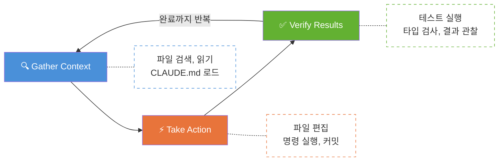
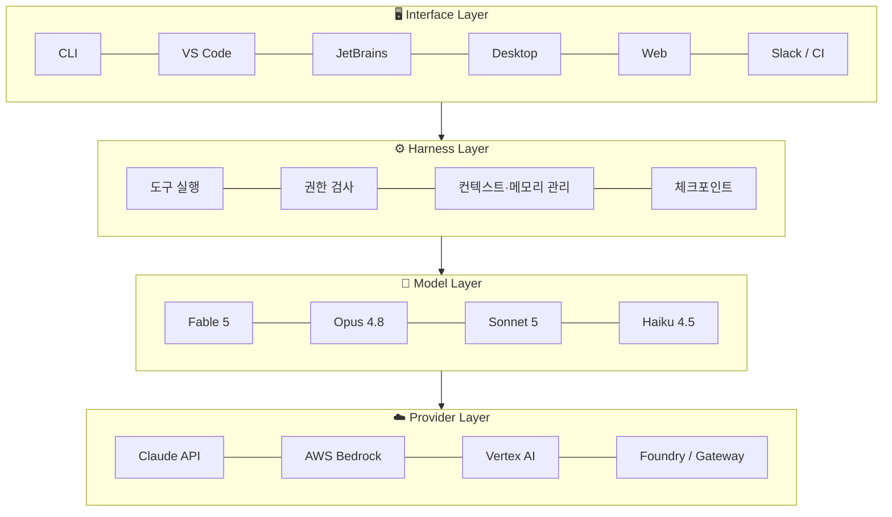
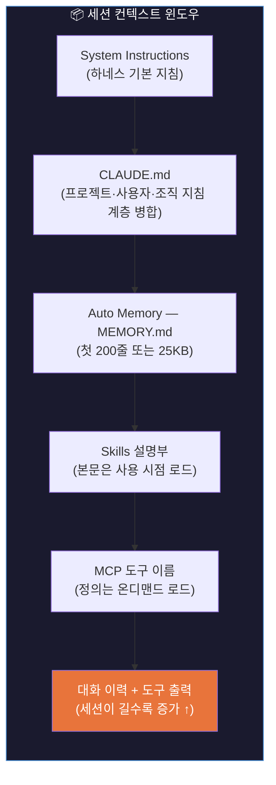
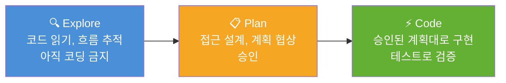

> 해당 포스팅은 현재 재직중인 회사에 관련이 없고, 개인 역량 개발을 위한 스터디 자료로 활용할 예정입니다.

## 들어가며

이 글에서는 Claude Code의 정체성, 아키텍처, 설치, 인증부터 핵심 워크플로까지 정리합니다. 본문의 기본 골격은 AWS Korea가 공개한 [Claude Code Deep Dive Workshop](https://github.com/whchoi98/claude-code-workshop)의 Chapter 1이고, 여기에 Anthropic 공식 교육 과정 「Claude Code in Action」과 AWS Skill Builder의 「Claude Code on Amazon Bedrock」 프로그램에서 배운 내용을 덧붙였습니다. 링크를 포함한 전체 출처 목록은 맨 아래 [References](#references)에 있습니다.

---

## 1. Claude Code란 무엇인가

### 공식 정의

> Claude Code는 코드베이스를 읽고, 파일을 편집하고, 명령을 실행하며 개발 도구와 통합되는 Anthropic의 **Agentic Coding 도구**입니다. 자연어 지시를 받아 멀티스텝 작업을 자율적으로 완수합니다.

핵심 키워드 세 가지:

| 키워드 | 의미 |
|--------|------|
| **Agentic** | 자율적으로 도구를 호출하며 멀티스텝 작업을 완수 |
| **Everywhere** | 터미널, VS Code, JetBrains, Desktop, Web, Slack까지 동일 엔진 |
| **By Anthropic** | Claude 모델을 만든 Anthropic의 1차 도구 — 모델 통합이 가장 깊음 |

### Agentic Coding vs Code Completion

| 구분 | Code Completion (기존) | Agentic Coding (Claude Code) |
|------|----------------------|------------------------------|
| 컨텍스트 | 현재 파일, 커서 주변 | 저장소 전체 + 터미널 + git 상태 |
| 동작 | 다음 몇 줄 제안 | 여러 파일 편집 + 명령 실행 |
| 검증 | 개발자 몫 | 테스트로 스스로 검증 후 수정 |
| 환경 | IDE 안에서만 | 터미널, IDE, 웹 어디서든 |

---

## 2. Agentic Loop — 핵심 동작 원리

Claude Code의 심장은 **3단계 루프**입니다:



사용자는 언제든 `Esc`로 개입해 방향을 조정할 수 있습니다. "계획만 세워줘"부터 "전부 자동으로 해줘"까지 자율성 수준을 조절하는 **4가지 모드**가 있다:

| 모드 | 설명 |
|------|------|
| **Plan** | 소스 수정 없이 탐색과 계획만 |
| **Default** | 편집과 명령마다 확인 |
| **Accept Edits** | 파일 작업 자동, 그 외 질문 |
| **Auto** | 백그라운드 안전 검사로 전행동 평가 |

`Shift+Tab`으로 모드를 순환하며 작업 위험도에 맞춰 선택합니다.

---

## 3. 모델 패밀리 (2026.07)

Claude Code가 활용하는 최신 모델 라인업:

| 모델 | 포지셔닝 | 용도 |
|------|----------|------|
| **Claude Fable 5** | 최상위 Mythos-class | 가장 어려운 대규모 작업, 장시간 자율 세션 |
| **Claude Opus 4.8** | 깊은 추론 | 복잡한 리팩토링, 아키텍처 결정 |
| **Claude Sonnet 5** | 기본 모델 (네이티브 1M 컨텍스트) | 일상 코딩 작업 전반 |
| **Claude Haiku 4.5** | 빠른 응답, 비용 효율 | 간단한 변환, 검색, 분류 |

**Alias 시스템**으로 세션 중 `/model` 명령으로 전환:
- `best` → Fable 5 접근 가능시 자동 선택
- `opusplan` → Plan은 Opus, 실행은 Sonnet (품질과 비용 균형)
- `sonnet` / `haiku` → 일상/경량 작업

---

## 4. 아키텍처: Agentic Harness 4계층

Claude Code는 **모델을 감싼 하네스**(Harness)입니다. 4개 계층이 언어 모델을 유능한 코딩 에이전트로 변환합니다:



### 실행 환경 3종

| 환경 | 설명 |
|------|------|
| **Local** (기본) | 내 머신에서 실행, 파일과 도구에 완전 접근 |
| **Cloud** | Anthropic 관리 VM에서 실행, 원격 저장소 작업 |
| **Remote Control** | 실행은 내 머신, 조작은 브라우저 (로컬 유지 + 웹 UI) |

### 도구 시스템 5가지 카테고리

| 카테고리 | 도구 | 설명 |
|----------|------|------|
| File Ops | Read, Edit, Write | 파일 읽기/수정/생성 |
| Search | Glob, Grep | 코드베이스 탐색 |
| Execution | Bash, PowerShell | 명령 실행, git, 테스트 |
| Web | WebSearch, WebFetch | 웹 검색과 문서 조회 |
| Code Intel | LSP | 타입 오류, 정의 이동 |

### 도구별 핵심 패턴

| 도구 | 핵심 동작 | 승인 필요 |
|------|----------|-----------|
| **Read** | 파일 읽기 + 이미지/PDF 멀티모달 입력, 라인 범위 선택 | ❌ 불필요 |
| **Edit** | diff 기반 수정, 변경 전후 표시, 부분 수락 가능 | ✅ 필요 |
| **Write** | 신규 파일 생성 | ✅ 필요 |
| **NotebookEdit** | Jupyter 셀 단위 수정 | ✅ 필요 |
| **Bash** | 명령 실행, 타임아웃 존재, allow/deny 규칙 적용 | ✅ 필요 |
| **PowerShell** | Windows 네이티브 셸 (opt-in: `CLAUDE_CODE_USE_POWERSHELL_TOOL=1`) | ✅ 필요 |
| **Grep** | ripgrep 기반 내용 검색, 정규식 지원 | ❌ 불필요 |
| **Glob** | 파일명 패턴 매칭 | ❌ 불필요 |
| **LSP** | 편집 직후 타입 오류 진단, 정의 이동, 참조 찾기 | ❌ 불필요 |
| **WebSearch** | 웹 검색 결과 요약 | 도메인 규칙 |
| **WebFetch** | URL 콘텐츠 조회 (도메인 단위 allow/deny) | 도메인 규칙 |
| **Monitor** | 백그라운드 명령 출력을 실시간 수신, 이벤트 기반 대응 | ✅ 필요 |
| **Agent** | 독립 컨텍스트 서브에이전트 생성, 완료 시 요약 회수 | 자동/명시 |

### 권한 규칙 문법 (Permissions)

```json
// settings.json 또는 CLAUDE.md에서 정의
{
  "permissions": {
    "allow": [
      "Read",
      "Grep",
      "Glob",
      "Bash(npm run:*)",
      "Bash(git diff:*)",
      "WebFetch(domain:docs.example.com)"
    ],
    "deny": [
      "Bash(rm -rf:*)",
      "Bash(curl:*)"
    ]
  }
}
```

- **allow**: 승인 없이 자동 실행
- **ask** (기본): 매번 확인 후 실행
- **deny**: 무조건 차단 (Auto 모드에서도 불가)
- 패턴: `도구이름(접두사:*)` 형식으로 세밀 제어

### Git 워크플로 통합

```bash
> 변경 내용 커밋하고 PR 만들어줘
# gh CLI를 통해 커밋 메시지 작성, PR 생성, 리뷰어 지정까지 자동
# allow 규칙에 Bash(git:*), Bash(gh:*) 등록하면 무승인 진행
```

- 커밋, 브랜치, 체리픽, 리베이스 등 모든 git 작업 가능
- `gh` CLI로 PR 생성, 이슈 관리, Actions 상태 확인
- `/diff` 명령으로 턴별·파일별 변경 내역 시각적 검토

### MCP (Model Context Protocol)

외부 서비스를 도구로 연결하는 개방형 표준. GitHub, Slack, 사내 시스템의 기능이 Claude의 도구로 등록됩니다.

```bash
claude mcp add <server-name>   # 서버 등록
/mcp                           # 상태 확인
```

---

## 5. 컨텍스트 관리

### 세션 시작 시 로드되는 것



`/context` 명령으로 사용량을 시각화하고, `/mcp`로 서버별 비용을 확인할 수 있습니다.

### Auto Compaction

컨텍스트 윈도우(Sonnet 5 기준 1M 토큰)가 한계에 접근하면:

1. **임계 감지** → 사용량 모니터링
2. **출력 정리** → 오래된 도구 출력부터 제거
3. **대화 요약** → 요청과 핵심 코드는 보존
4. **Thrashing 방지** → 반복 실패 시 루프 대신 오류 표시

> 💡 초반의 세부 지시는 Compaction으로 사라질 수 있으니, **영속 규칙은 반드시 CLAUDE.md에** 둘 것.

---

## 6. 보안 아키텍처: 네 겹의 방어선

| 레이어 | 역할 |
|--------|------|
| **Permissions** | allow/ask/deny 규칙 + 4가지 모드 |
| **Sandboxing** | 파일시스템과 네트워크 격리 |
| **Checkpoints** | 편집 전 자동 스냅샷 → `Esc Esc` 또는 `/rewind`로 복구 |
| **Audit** | 세션 JSONL 기록, Hooks, ConfigChange 감사, OpenTelemetry |

### 공식문서 기준 추가 보안 조치

| 조치 | 설명 |
|------|------|
| **Working directory boundary** | 시작 디렉터리와 하위 폴더만 쓰기 허용, 상위는 명시적 승인 필요 |
| **Sandbox bash** | `/sandbox`로 활성화, filesystem + network 격리 내에서 자율 작업 |
| **Prompt injection 방어** | 컨텍스트 분석, 입력 세정, 의심스러운 bash 명령 자동 차단 |
| **격리 컨텍스트 윈도우** | WebFetch는 별도 컨텍스트 윈도우에서 실행 (악성 프롬프트 주입 방지) |
| **Trust verification** | 최초 코드베이스 실행 시, 새 MCP 서버 시 신뢰 확인 (`-p` 플래그 사용 시 비활성) |
| **Command injection 탐지** | 의심스러운 bash 명령은 allowlist에 있어도 수동 승인 필요 |
| **Fail-closed** | 매칭되지 않는 명령은 기본적으로 수동 승인 |
| **Cloud session 격리** | 각 클라우드 세션은 격리된 VM, 네트워크 제한, 감사 로그, 자동 정리 |
| **Remote Control** | 로컬 실행 유지, TLS로 API 통신, 짧은 수명의 범위 제한 자격증명 사용 |

### 데이터 프라이버시 핵심

- 로컬 실행 시 코드는 사용자 머신에 존재
- 모델 추론에 필요한 컨텍스트**만** API로 전송 (TLS 암호화)
- Bedrock 사용 시 트래픽이 AWS 계정 경계 안에서 처리
- ZDR(Zero Data Retention) 옵션으로 보존 없음 설정 가능
- 상업용 계정 기본 학습 미사용, 명시 동의 시에만

---

## 7. 설치 가이드

### 시스템 요구사항

- **OS**: macOS 13+, Ubuntu 20.04+, Windows 10 1809+, Alpine 3.19+
- **하드웨어**: 4GB+ RAM, x64 또는 ARM64
- **의존성**: ripgrep 기본 포함, Node.js 불필요
- **네트워크**: HTTPS 443 (프록시, 커스텀 CA 지원)

### Native 설치 (권장)

```bash
# macOS / Linux / WSL 공통
curl -fsSL https://claude.ai/install.sh | bash

# 프로젝트에서 첫 실행
cd your-project
claude
```

```powershell
# Windows PowerShell
irm https://claude.ai/install.ps1 | iex
```

```cmd
:: Windows CMD
curl -fsSL https://claude.ai/install.cmd -o install.cmd
install.cmd && del install.cmd
```

### 기타 설치 경로

| 방법 | 명령 | 특징 |
|------|------|------|
| Homebrew | `brew install --cask claude-code` | stable 채널, 수동 업그레이드 |
| WinGet | `winget install Anthropic.ClaudeCode` | Windows 표준 |
| apt | GPG 서명 저장소 등록 후 `sudo apt install claude-code` | Debian/Ubuntu |
| dnf | 저장소 등록 후 `sudo dnf install claude-code` | Fedora/RHEL |
| npm (레거시) | `npm install -g @anthropic-ai/claude-code` | Node 18+ 필요 |

### 릴리스 채널

| 채널 | 설명 |
|------|------|
| `latest` (기본) | 릴리스 즉시 반영 |
| `stable` | 약 1주 지연, 회귀 릴리스 제외 |

```bash
# stable 채널로 설치
curl -fsSL https://claude.ai/install.sh | bash -s stable

# 특정 버전 고정
curl -fsSL https://claude.ai/install.sh | bash -s 2.1.89
```

### 설치 검증

```bash
claude --version    # 버전 확인
claude doctor       # 종합 자가 진단 (f 키로 자동 수정)
claude update       # 즉시 수동 업데이트
```

---

## 8. 인증 경로 6단계

여러 자격증명이 공존할 때 **우선순위** 순서:

| 순위 | 방법 | 설명 |
|------|------|------|
| 1 | Cloud Provider | `CLAUDE_CODE_USE_BEDROCK` 등 설정 시 최우선 |
| 2 | AUTH_TOKEN | Bearer 헤더, 게이트웨이 인증용 |
| 3 | API_KEY | X-Api-Key 헤더, 대화형에서 1회 승인 |
| 4 | apiKeyHelper | 설정 스크립트 동적 키, 볼트 연동 |
| 5 | OAUTH_TOKEN | `claude setup-token`으로 만든 1년 토큰, CI용 |
| 6 | /login OAuth | 구독 사용자 기본값 (Pro/Max/Team/Enterprise) |

### AWS Bedrock 인증 상세

```bash
# Bedrock 경로 활성화
export CLAUDE_CODE_USE_BEDROCK=1
export AWS_REGION=ap-northeast-2

# 자격증명은 표준 AWS 체계 그대로
aws sso login --profile dev
export AWS_PROFILE=dev

# 실행 후 /status로 활성 공급자와 모델 확인
claude
```

- Bedrock 모델 alias: `sonnet` → 최신 Sonnet, `opus` → 최신 Opus
- IAM 정책으로 모델 접근 범위 통제 가능
- VPC PrivateLink 경로로 사내망 전용 운영 가능

### API Key 보안 수칙

| 규칙 | 설명 |
|------|------|
| 코드에 금지 | 소스와 이미지에 키를 굽지 않기, pre-commit 스캐너로 차단 |
| 볼트 관리 | Secrets Manager, Vault에서 발급, `apiKeyHelper`로 동적 주입 |
| 최소 권한 | Console의 Claude Code 롤로 키 용도 자체를 제한 |
| 회전과 폐기 | 주기 회전, 퇴사·유출 시 즉시 폐기 |

### CI용 장기 토큰

```bash
# 1년 유효 OAuth 토큰 생성
claude setup-token
# CI 환경에서 사용
export CLAUDE_OAUTH_TOKEN="..."
claude -p "PR diff 리뷰" --allowed-tools "Read,Grep,Glob"
```

---

## 9. Quick Start — 첫 세션 운영

### 명령 기본형

```bash
claude                              # 대화형 REPL 시작
claude "질문 또는 작업"             # 초기 프롬프트와 함께 시작
claude -p "작업"                    # 헤드리스, 결과만 출력 후 종료
claude --model opus                 # 모델 지정 시작
claude --continue                   # 최근 세션 이어서
claude --resume                     # 세션 선택해 재개
cat data.csv | claude -p "요약"     # 파이프 입력
```

### 프롬프트 작성 4원칙 — Delegate, Don't Dictate

| 원칙 | 설명 |
|------|------|
| **구체적으로** | 관련 경로, 제약, 참고 패턴을 처음부터 명시 |
| **검증 기준 제공** | 테스트 케이스, 기대 출력 등 스스로 확인할 기준 |
| **탐색과 분리** | 복잡한 문제는 Plan 모드로 조사 먼저, 코딩은 그 다음 |
| **대화로 교정** | 완벽한 첫 프롬프트보다 중간 개입과 반복 교정이 빠름 |

### 슬래시 명령 지도

| 단계 | 명령 | 용도 |
|------|------|------|
| 프로젝트 셋업 | `/init`, `/memory`, `/mcp`, `/agents`, `/permissions` | 초기 설정 |
| 작업 중 | `/plan`, `/model`, `/effort`, `/context`, `/compact`, `/btw` | 진행과 컨텍스트 |
| 병렬 실행 | `/agents`, `/tasks`, `/background`, `/batch` | 위임과 분산 |
| 배포 전 | `/diff`, `/code-review`, `/security-review` | 품질 게이트 |
| 세션 간 | `/clear`, `/resume`, `/branch`, `/teleport` | 전환과 재개 |
| 문제 시 | `/rewind`, `/doctor`, `/debug`, `/feedback` | 복구와 진단 |

### /clear vs /compact vs /btw

| 명령 | 선택 기준 |
|------|----------|
| `/clear` | 새 작업 시작 — 컨텍스트 초기화 (이전 대화는 /resume으로 복귀) |
| `/compact` | 같은 작업, 공간 확보 — 이력 요약해 지속, 초점 지시 전달 가능 |
| `/btw` | 곁가지 질문 — 대화 이력에 남지 않는 사이드 질문, 컨텍스트 오염 방지 |

### 세션 관리

```bash
claude --continue              # 이 디렉토리의 최근 세션 재개
claude --resume                # 세션 목록에서 선택 재개
claude --from-pr 123           # PR을 만든 세션 찾아 재개
> /resume                       # 세션 안에서 피커 열기
> /clear 결제모듈-리팩토링      # 이전 대화에 이름 붙여 보관
```

### 세션 분기

| 명령 | 동작 |
|------|------|
| `/branch [이름]` | 현 시점에서 대화 사본 생성, 나는 사본으로 전환해 작업 |
| `/fork <지시>` | 전체 맥락을 물려받은 서브에이전트 생성, 나는 원본에서 계속 |

### /rewind 체크포인트 복구

```bash
Esc Esc              # 최근 체크포인트로 빠른 되감기
> /rewind             # 체크포인트 목록에서 시점 선택
# 코드만 / 대화만 / 둘 다 — 복구 범위 선택
# 한계: 파일 변경만 복구, DB나 배포 등 외부 부작용은 대상 아님
```

## 10. 주요 사용 사례 6선

### Case 1: 디버깅

```bash
claude "npm test가 실패해. 원인을 찾아 고치고 테스트가 통과하는지 확인해줘"
```

→ 테스트 실행 → 스택트레이스 추적 → null 가드 누락 확인 → Edit → 재실행 검증

### Case 2: 리팩토링

```bash
> src/ 전체에서 콜백 스타일 fs 호출을 fs/promises 기반 async/await로 바꿔줘.
  변경 후 lint와 테스트로 검증해줘.
```

→ Grep으로 호출 지점 수집 → 파일별 Edit → lint & test → 실패 시 재수정

### Case 3: 신기능 개발 (Plan 모드)

```bash
> Shift+Tab 두 번으로 Plan 모드 진입
> /users API에 커서 기반 페이지네이션을 추가하고 싶어. 먼저 계획을 세워줘.
# → 계획 승인 후 → "구현하고 테스트까지 실행해줘"
```

### Case 4: 코드베이스 학습

```bash
cd unfamiliar-project && claude
> 이 프로젝트의 전체 구조를 설명해줘.
> 인증은 어디서 어떻게 처리돼?
> 결제 실패 시 재시도 로직을 따라가며 호출 흐름을 정리해줘.
```

→ 온보딩 기간을 며칠에서 시간 단위로 단축

### Case 5: 테스트 작성

```bash
claude "auth 모듈의 테스트를 작성하고 실행해서 실패하면 수정까지 해줘"
```

### Case 6: DevOps 자동화

```bash
tail -200 app.log | claude -p "이상 징후가 있으면 원인 후보와 함께 보고"
claude "이 Dockerfile을 멀티스테이지로 최적화하고 이미지 크기 변화를 보고해줘"
```

---

## 11. 인터페이스 — 터미널 밖의 Claude Code

동일 엔진이 6가지 표면에서 동작합니다:

| 인터페이스 | 핵심 특징 |
|-----------|----------|
| **VS Code / Cursor** | 인라인 Diff, @-mentions, Plan 패널 검토, 선택 영역 공유 |
| **JetBrains** | IntelliJ 계열 전체 지원, IDE diff 뷰어, 별도 CLI 필요 |
| **Desktop 앱** | 병렬 세션 (git 격리), 시각적 diff, 예약 작업, 클라우드 세션 |
| **Web (claude.ai/code)** | 설치 없이 클라우드 세션, 장시간 병렬 작업, /autofix-pr |
| **Slack** | @Claude 멘션 → 스레드 컨텍스트 → PR 회신 |
| **Chrome (Beta)** | 라이브 웹앱 조작, 콘솔 로그 읽기, DOM 검사, 폼 자동화 |

### 공식문서 기준 추가 통합

| 목적 | 최적 옵션 |
|------|----------|
| 다른 기기에서 로컬 세션 이어가기 | Remote Control |
| Telegram, Discord, iMessage, 웹훅 → 세션에 이벤트 푸시 | **Channels** (신규) |
| 로컬 시작 → 모바일에서 계속 | `claude --cloud` + Claude 모바일 앱 |
| 반복 스케줄 실행 | Routines 또는 Desktop 예약 작업 |
| PR 리뷰·이슈 분류 자동화 | GitHub Actions / GitLab CI/CD |
| 모든 PR에 자동 코드 리뷰 | **GitHub Code Review** (신규) |
| 맞춤 에이전트 구축 | **Agent SDK** |

> 💡 모든 표면은 동일한 Claude Code 엔진에 연결되므로 CLAUDE.md, settings, MCP 서버가 전부 공유됩니다.

### Teleport & Remote Control

```bash
claude --teleport        # 클라우드 세션을 로컬로 가져오기
claude --remote "작업"   # 로컬 세션을 클라우드로 보내기
> /remote-control         # 폰/브라우저에서 로컬 세션 원격 조종
```

### 예약 실행 두 경로

| 경로 | 실행 위치 | 조건 |
|------|----------|------|
| Desktop 예약 작업 | 내 머신 | 머신이 켜져 있어야 동작 |
| Routines (claude.ai) | Anthropic 관리 인프라 | 머신 꺼져도 스케줄 유지 |

---

## 12. CLAUDE.md & Memory 시스템

### 메모리 4계층 (우선순위 내림차순)

| 계층 | 위치 | 스코프 |
|------|------|--------|
| **Managed** | Anthropic/조직 정책 | 모든 사용자에 강제 적용 |
| **User** | `~/.claude/CLAUDE.md` | 사용자의 모든 프로젝트 |
| **Project** | 프로젝트 루트 `CLAUDE.md` | 해당 프로젝트 전체 |
| **Local** | `.claude/CLAUDE.md` (gitignore) | 개인 로컬 전용 |

### CLAUDE.md 작성 핵심

- **200줄 이내** 유지 (토큰 효율)
- `@import` 로 공통 규칙 공유 (AGENTS.md 등)
- `rules` 경로 스코프로 디렉터리별 규칙 분리
- Compaction 이후에도 영속되는 유일한 지시 수단

### Skills — 반복 절차의 패키징

동일한 다단계 지시를 두 번 타이핑했다면, 그것은 Skill입니다.

```
.claude/skills/verify-refactor/
├── skill.md           ← 간결한 메인 파일 (트리거 설명 + 절차)
├── reference.md       ← 상세 자료 (필요할 때만 Claude가 읽음)
└── check.sh           ← 실행 스크립트 (컨텍스트에 로드하지 않고 실행)
```

**Verification Skill** 예시: 리팩토링 완료 시 자동으로 테스트 실행 → diff 읽기 → 테스트 약화 여부 확인 → Pass/Fail 보고.

| 지시 표면 | 위치 | 역할 |
|-----------|------|------|
| **CLAUDE.md** | 프로젝트 루트 | 항상 적용되는 컨벤션 |
| **Skill** | `.claude/skills/` | 작업 매칭 시에만 로드되는 절차 |
| **Hook** | settings.json | 절대 건너뛸 수 없는 코드 (아래 참조) |

### Hooks — 건너뛸 수 없는 규칙

> CLAUDE.md = 요청(request) — Claude가 보통 따르지만 건너뛸 수 있음  
> Hook = 보장(guarantee) — 루프의 고정된 지점에서 실행되는 결정론적 코드

| 이벤트 | 발생 시점 | 용도 |
|--------|-----------|------|
| **PreToolUse** | 도구 호출 **전** | 차단/수정 가능 (가장 강력) |
| **PostToolUse** | 도구 호출 **후** | 자동 포맷팅, 자동 린트 |
| **Stop** | Claude가 턴을 끝내려 할 때 | "아직 안 끝났어" 강제 |
| **SessionStart** | 세션 시작 시 | 환경 초기화 |
| **PreCompact / PostCompact** | Compact 전/후 | 컨텍스트 관리 |

#### PreToolUse JSON 반환

```json
{
  "hookSpecificOutput": {
    "hookEventName": "PreToolUse",
    "permissionDecision": "deny",
    "permissionDecisionReason": "Secret detected in command"
  }
}
```

`permissionDecision` 값: `allow` | `deny` | `ask`

#### Exit Code 규칙

| Exit Code | 의미 |
|-----------|------|
| **0** | 성공 (JSON 있으면 파싱) |
| **2** | 차단 — 거의 모든 곳에서 멈춤 |
| 그 외 (1 포함) | 비차단 — stderr 로깅만, Claude 계속 진행 |

> ⚠️ Exit code 1은 차단하지 않습니다! 멈추려면 반드시 `exit 2`.

### Auto Memory

```bash
/memory          # 메모리 확인·편집
# 자동 학습: 교정 내용을 MEMORY.md에 축적
# 세션 시작 시 첫 200줄 또는 25KB 로드
```

---

## 13. 긴 세션 조종 전략

긴 작업(여러 파일에 걸친 리팩토링, 새 기능 구현)은 짧은 작업과 다른 게임입니다.

### 핵심 두 가지 습관

1. **작업 시작 전에 범위를 설정** (Plan Mode)
2. **실행 중에 조종** (/compact, Rewind, /goal, /loop)

### /compact 방향 지시

```bash
/compact Focus on the --version flag implementation
# 명령어 뒤의 텍스트가 요약의 방향을 정하는 "핸들"
```

### /goal — 완료 조건 설정

```bash
/goal all tests in src/billing pass, and the type checker reports zero errors
# 평가자가 턴마다 조건 충족 여부를 확인 → 달성까지 자율 작업
/goal clear    # 목표 조기 해제
```

### /loop — 간격 실행

```bash
/loop 5m check CI status and report failures
# 외부 상태(CI, 배포 등)를 가져오고 변화가 있으면 행동
```

> 💡 **Plan 반복 수정 > 실행 후 정리**: 계획을 반복 수정하는 것이 Claude를 실행시키고 결과를 기대한 뒤 정리하는 것보다 훨씬 빠릅니다.

---

## 14. Workflow Patterns — 반복 가능한 실무 패턴 10선

### Pattern 1: Explore-Plan-Code (EPC)

가장 기본이 되는 3단계 리듬. 큰 변경일수록 단계 분리 효과가 큽니다.



### Pattern 2: TDD Workflow

실패하는 테스트가 곧 명세. Red → Green → Refactor.

```bash
> validateCoupon 함수를 TDD로 만들자.
  1) 먼저 실패하는 테스트 작성: 만료 쿠폰 거부, 중복 사용 거부, 정상 쿠폰 할인율 반환
  2) 테스트 실행해서 실패 확인
  3) 통과할 최소 구현 작성
  4) 재실행으로 전부 통과 확인 후 리팩토링
```

### Pattern 3: Code Review

```bash
> /code-review              # 현재 diff 리뷰
> /code-review --fix        # 발견 사항 자동 수정
> /code-review --comment    # PR 인라인 코멘트 게시
> /code-review ultra        # 클라우드 멀티에이전트 심층 리뷰
> /security-review          # 보안 관점 읽기 전용 검사
```

### Pattern 4: Multi-Agent & /batch

```bash
> /fork 이 변경의 문서 업데이트를 맡아줘     # 곁가지 위임
> /batch src/ 전체를 Solid에서 React로 마이그레이션  # 5-30개 단위 분해 → 병렬 실행
> /tasks                                      # 백그라운드 작업 현황
```

### Pattern 5: Visual Workflow

디자인 시안 이미지를 붙여넣으면 그대로 구현 → 스크린샷 비교 → 자가 수정. `/chrome` 연결로 실동작 검증.

### Pattern 6: Headless 자동화

```bash
claude -p "package.json에서 outdated 의존성 요약"
tail -200 app.log | claude -p "이상 징후 보고"
claude -p "보안 이슈 스캔" --allowed-tools "Read,Grep,Glob" --permission-mode plan
```

### Pattern 7: Pipeline & JSON 출력

```bash
claude -p "현재 디렉토리 스택 분석" --output-format json | jq '.result'
claude -p "..." --output-format stream-json   # 실시간 이벤트 스트림
```

### Pattern 8: CI 통합 (GitHub Actions 예시)

```yaml
on: [pull_request]
steps:
  - run: curl -fsSL https://claude.ai/install.sh | bash
  - run: claude -p "이 PR의 diff를 리뷰하고 위험을 보고" --allowed-tools "Read,Grep,Glob,Bash(git diff:*)"
    env:
      ANTHROPIC_API_KEY: ${{ secrets.ANTHROPIC_API_KEY }}
```

### Pattern 9: Routines 예약 실행

```bash
> /schedule    # Routine 생성 (Anthropic 관리 인프라, 머신 꺼져도 동작)
> /loop 10m CI 상태 확인하고 실패하면 원인 요약   # 세션 내 반복 (머신 필요)
```

### Pattern 10: /goal 지속 실행

```bash
> /goal 전체 테스트 스위트가 통과하고 lint 경고가 0이 될 때까지
# → 턴을 넘겨도 조건 충족까지 계속 작업, Fable 5와 조합 시 장시간 자율 작업
```

### 패턴 조합 예시 — 신규 기능의 전체 여정

```
1. EPC + Plan → 기능 설계
2. /fork → 문서·예제 업데이트 병렬 위임
3. /code-review --fix && /security-review → 품질 게이트
4. 커밋 + PR + /autofix-pr → 배송과 CI 감시
5. /usage 확인, /clear → 다음 작업 준비
```

### 비용 관리 전략 (3축)

| 레버 | 전략 |
|------|------|
| **모델** | 일상 → sonnet, 난제 → opus, 배치 → haiku |
| **컨텍스트** | /clear, /compact, rules 경로 스코프로 윈도우 최소화 |
| **캐시** | CLAUDE.md 수정과 모델 전환은 캐시 미스 유발 — 최소화 |

`/usage` 명령으로 소비처를 분해하고, OpenTelemetry로 팀 단위 추적.

### 컨텍스트 관리 규율

| 상황 | 명령 |
|------|------|
| 작업 전환 | `/clear` (+이름으로 세션 저장) |
| 같은 작업 지속 중 길어짐 | `/compact` 초점 지시 |
| 곁가지 질문 | `/btw` (컨텍스트 오염 방지) |
| 탐색 위임 | 서브에이전트로 격리 |
| 상태 점검 | `/context` 주기 확인 |

### 안티패턴 & 교정

| ❌ 안티패턴 | ✅ 교정 |
|------------|---------|
| 한 세션에서 서로 다른 작업 뒤섞기 | 작업 경계마다 `/clear` |
| 거대 파일 통째로 붙여넣기 | 경로 지목과 라인 범위 활용 |
| 검증 기준 없는 막연한 지시 | 테스트, 기대 출력 명세 동봉 |
| 실패한 방향을 수동 재타이핑으로 반복 | `/rewind`로 시점 복귀 후 재지시 |
| 모든 작업을 Opus로 | 난이도별 모델 배분 |

---

## 15. 구독 모델과 라이선스

| 플랜 | 대상 | 특징 |
|------|------|------|
| Claude Pro / Max | 개인 개발자 | 월정액 구독, OAuth 로그인 |
| Team / Enterprise | 조직 | 중앙 청구, SSO, 정책 통제 |
| Claude Console | API 선호 | 종량제, Claude Code 전용 롤 |
| Bedrock / Vertex / Foundry | 엔터프라이즈 | 자체 클라우드 청구 |
| Free plan | — | **Claude Code 미포함** (웹 채팅 전용) |

---

## 16. 엔터프라이즈 운영 포인트

### Docker로 격리 실행

```dockerfile
FROM ubuntu:24.04
RUN apt-get update && apt-get install -y curl git ca-certificates
RUN curl -fsSL https://claude.ai/install.sh | bash
ENV PATH="/root/.local/bin:${PATH}"
WORKDIR /workspace
```

```bash
docker run -it --rm \
  -e ANTHROPIC_API_KEY \
  -v $(pwd):/workspace claude-dev claude
```

### 조직 차원 버전 통제 (managed settings)

| 설정 | 효과 |
|------|------|
| `minimumVersion` | 이 값 미만 설치 거부 |
| `requiredMinimumVersion` | 미만 버전은 실행 자체 거부 |
| `requiredMaximumVersion` | 초과 버전 실행 거부 (상한) |
| `DISABLE_AUTOUPDATER` | 백그라운드 확인만 중지 |
| `DISABLE_UPDATES` | 수동 포함 모든 업데이트 차단 |

### Devcontainer로 팀 일관 환경

```json
{
  "name": "claude-dev",
  "image": "mcr.microsoft.com/devcontainers/base:ubuntu",
  "postCreateCommand": "curl -fsSL https://claude.ai/install.sh | bash",
  "remoteEnv": {
    "ANTHROPIC_API_KEY": "${localEnv:ANTHROPIC_API_KEY}"
  }
}
```

---

## 마무리

Claude Code는 단순한 코딩 어시스턴트가 아닙니다. **저장소 전체를 이해하고, 계획을 세우고, 실행하고, 검증까지 완수하는 에이전트**입니다.

핵심을 한 줄로 요약하면:

> **"읽고, 편집하고, 실행하는 에이전트 — Gather, Act, Verify를 반복하며, 터미널을 넘어 모든 개발 표면에서 동일 엔진으로 동작합니다."**

다음 챕터에서는 Subagents, Enterprise 배포, Settings, CLI Reference, Agent SDK까지 이어집니다. Claude Code를 "사용 가능한" 수준이 아닌 **"운영 가능한" 수준**으로 끌어올리는 여정이 계속됩니다.

---

## References

### 1차 출처 (본문 작성 기반)

| # | 출처 | 상세 |
|---|------|------|
| [1] | **Claude Code Deep Dive Workshop — Chapter 1: Overview** | Choi WooHyung (Prin. Solutions Architect, AWS Korea). [github.com/whchoi98/claude-code-workshop](https://github.com/whchoi98/claude-code-workshop) |
| [2] | **Claude Code in Action** | Anthropic 공식 온라인 교육 과정 (Skilljar 플랫폼). 2026 리뉴얼 커리큘럼 (10 레슨) + 기존 커리큘럼 (21 레슨). [anthropic.skilljar.com/claude-code-in-action](https://anthropic.skilljar.com/claude-code-in-action) |
| [3] | **Claude Code on Amazon Bedrock** | AWS Skill Builder 온라인 학습 프로그램. 본문에서 인용한 모듈: Module 0 「Claude Code를 다룬다는 것」 (자기 주도 학습, 약 1시간. Agentic AI의 개념, 아키텍처, 디자인 패턴, 엔지니어링 원칙 전반). [skillbuilder.aws](https://skillbuilder.aws/learn/KNBAUVDS3Z/m0--claude-code---amazon-bedrock------/KK153UQNHS) |

### 공식문서 (교차 검증)

| # | 문서 | URL |
|---|------|-----|
| [4] | Claude Code Overview | [docs.anthropic.com/en/docs/claude-code/overview](https://docs.anthropic.com/en/docs/claude-code/overview) |
| [5] | Claude Code Security | [docs.anthropic.com/en/docs/claude-code/security](https://docs.anthropic.com/en/docs/claude-code/security) |
| [6] | Claude Code CLI Reference | [docs.anthropic.com/en/docs/claude-code/cli-reference](https://docs.anthropic.com/en/docs/claude-code/cli-reference) |
| [7] | Claude Code Settings | [docs.anthropic.com/en/docs/claude-code/settings](https://docs.anthropic.com/en/docs/claude-code/settings) |
| [8] | Claude Code Hooks | [docs.anthropic.com/en/docs/claude-code/hooks](https://docs.anthropic.com/en/docs/claude-code/hooks) |
| [9] | Claude Code MCP | [docs.anthropic.com/en/docs/claude-code/mcp](https://docs.anthropic.com/en/docs/claude-code/mcp) |

### 추가 참고

| # | 자료 | 설명 |
|---|------|------|
| [10] | Anthropic 데이터 사용 정책 | [privacy.anthropic.com](https://privacy.anthropic.com) |
| [11] | AWS Bedrock Claude 모델 가이드 | [docs.aws.amazon.com/bedrock/latest/userguide/model-parameters-claude.html](https://docs.aws.amazon.com/bedrock/latest/userguide/model-parameters-claude.html) |
| [12] | Model Context Protocol (MCP) 공식 스펙 | [modelcontextprotocol.io](https://modelcontextprotocol.io) |

---
