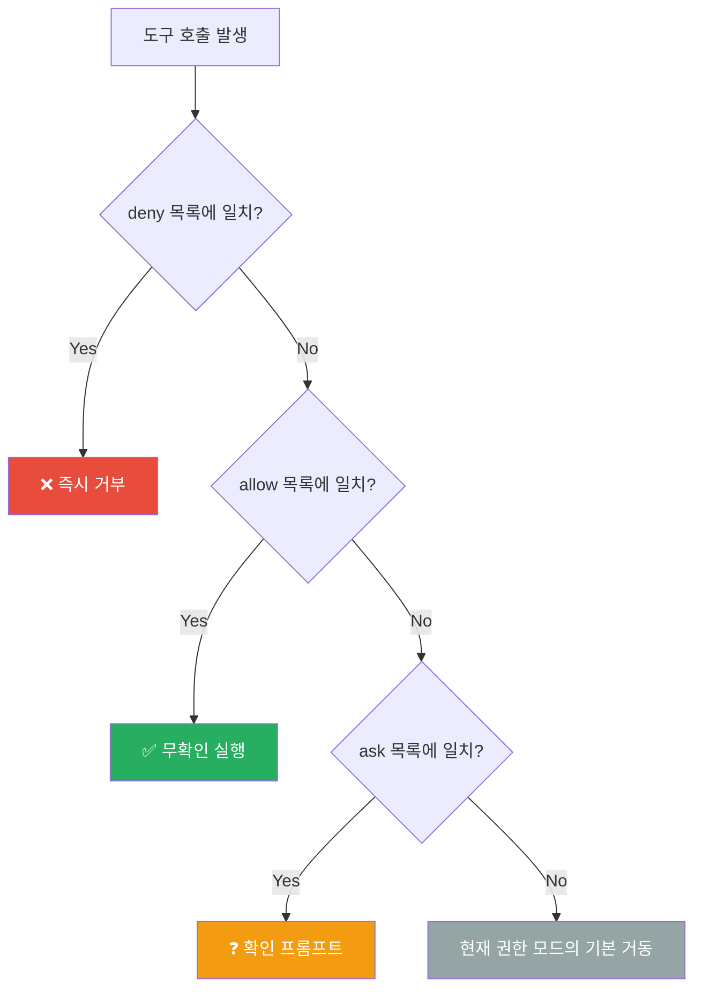

> 해당 포스팅은 현재 재직중인 회사에 관련이 없고, 개인 역량 개발을 위한 스터디 자료로 활용할 예정입니다.

## 들어가며

이 글에서는 Claude Code의 설정 스코프, 권한 규칙, 훅 자동화, MCP 서버 통합, 커스텀 커맨드까지 정리합니다. 본문의 기본 골격은 AWS Korea가 공개한 [Claude Code Deep Dive Workshop](https://github.com/whchoi98/claude-code-workshop)의 Chapter 4이고, 거기에 두 개의 교육 과정에서 배운 내용을 덧붙였습니다.

| 인용한 자료 | 무엇인가 | 본문 표기 |
| --- | --- | --- |
| **Claude Code Deep Dive Workshop** | AWS Korea가 GitHub에 공개한 실습 워크샵 | Chapter 4 |
| **Claude Code in Action** | Anthropic 공식 온라인 교육 과정 (Skilljar 플랫폼) | Lesson NEW-02 등 |
| **Claude Code on Amazon Bedrock** | AWS Skill Builder의 온라인 학습 프로그램 | Module 0, Module 6 등 |

중간에 "보충"으로 표시한 절은 워크샵 본문 밖에서 가져온 내용입니다. 어느 과정의 어느 차시에서 온 것인지 절 머리에 적어 두었고, 링크를 포함한 전체 목록은 맨 아래 [References](#references)에 있습니다.

---

### 목차

1. [Settings 체계](#1-settings-체계)
2. [Permissions](#2-permissions)
3. [Hooks 아키텍처](#3-hooks-아키텍처)
4. [Hooks 실전](#4-hooks-실전)
5. [MCP 구성](#5-mcp-구성)
6. [MCP 운영과 보안](#6-mcp-운영과-보안)
7. [Commands와 Skills](#7-commands와-skills)
8. [통합과 트러블슈팅](#8-통합과-트러블슈팅)
9. [Recap & Labs](#9-recap--labs)
10. [References](#references)

---

## 1. Settings 체계

> **해결하는 문제**: "어디에 설정을 두면 누구에게 적용되는가? 여러 파일에 같은 설정 키(`settings.json`의 항목 이름 — `model`, `env`, `permissionMode` 등)가 다른 값으로 들어 있으면 어느 값이 실제로 적용되는가?"

### 스코프 4계층

| 스코프 | 파일 위치 | 용도 |
| --- | --- | --- |
| **Managed** | 서버 관리 (plist/레지스트리/시스템 파일) | 조직 전체, IT가 배포 |
| **User** | `~/.claude/settings.json` | 나의 전 프로젝트, 비공유 |
| **Project** | `.claude/settings.json` | 저장소 협업자 전원, 커밋 공유 |
| **Local** | `.claude/settings.local.json` | 이 저장소의 나만, gitignore |

> 💡 **판단 기준**: "누가 쓰나 × 어디까지 걸치나 × 공유하나" 세 축으로 갈라집니다. 모든 프로젝트에 걸치는 **개인 설정**은 User, 저장소 협업자 전원이 따라야 하는 **팀 표준**은 Project, 같은 개인 설정이라도 이 저장소에만 두려는 값(머신별 경로, 검증 중인 규칙)은 Local에 둡니다. User와 Local은 둘 다 공유되지 않는 개인용이고, 갈림길은 적용 범위입니다. Managed는 Ch.3에서 다룬 조직 강제 계층입니다.

### 우선순위 5단 (같은 설정 키가 여러 스코프에 있을 때)

```
1. Managed       ← 무엇으로도 재정의 불가 (조직의 강제 계층)
2. CLI 인자      ← 실행 시 플래그, 그 세션 한정 임시 재정의
3. Local         ← settings.local.json, 프로젝트와 사용자 값을 덮음
4. Project       ← 팀 공유 표준, 사용자 값을 덮음
5. User          ← 아무도 지정하지 않았을 때의 내 기본값

```

여기서 **키**는 `settings.json` 안의 설정 항목 이름입니다 (아래 [키 카탈로그](#키-카탈로그-3분류) 참조). 예를 들어 `model` 키가 두 곳에 다른 값으로 있으면:

```json
// ~/.claude/settings.json  (User 스코프)
{ "model": "sonnet" }

// .claude/settings.json  (Project 스코프)
{ "model": "opus" }
```

Project가 User보다 우선순위가 높으므로 이 저장소에서 실제 적용값은 `opus`입니다. 여기서 `--model sonnet` CLI 인자를 붙이면 그 세션만 다시 `sonnet`이 되고, 조직이 Managed로 `model`을 못박아 두었다면 위 어느 것도 그것을 이기지 못합니다.

#### 키 종류에 따라 병합 방식이 다릅니다

위 5단 순서는 **값을 하나만 갖는 스칼라 키**에 적용되는 규칙입니다. 배열·객체를 담는 키는 덮어쓰기가 아니라 병합됩니다.

| 키 유형 | 예시 키 | 충돌 시 동작 |
| --- | --- | --- |
| **스칼라** (단일 값) | `model`, `permissionMode`, `autoUpdatesChannel`, `alwaysThinkingEnabled` | 우선순위 높은 스코프의 값이 **덮어씀** (낮은 쪽 값은 버려짐) |
| **규칙 목록** | `permissions.allow` / `ask` / `deny` | 전 스코프를 **합집합으로 병합** — 어느 스코프든 `deny`에 걸리면 그것이 최종 승자 (§2 참조) |
| **맵** | `env`, `hooks` | 항목 단위로 병합, 같은 항목 이름끼리만 우선순위대로 덮어씀 |

즉 Project의 `allow` 규칙이 User의 `allow` 규칙을 지우지 않습니다. 둘 다 살아 있고, 조직의 `deny` 하나가 개인 `allow` 전부를 무력화합니다.

### settings.json 기본 구조

```json
{
  "$schema": "https://json.schemastore.org/claude-code-settings.json",
  "permissions": {
    "allow": ["Bash(npm run lint)", "Bash(npm run test *)"],
    "deny": ["Read(./.env)", "Read(./secrets/**)"]
  },
  "env": {
    "CLAUDE_CODE_ENABLE_TELEMETRY": "1"
  },
  "companyAnnouncements": ["코드 리뷰 필수, 가이드는 wiki 참조"]
}

```

- `$schema` → 에디터 자동완성 활성화
- `env` 블록 → 셸 프로파일 대신 설정 파일로 환경변수를 스코프별 배포 (비밀은 금지, 볼트 헬퍼로)
- `companyAnnouncements` → 세션 시작 배너

### 기능별 파일 위치

| 기능 | 저장 위치 |
| --- | --- |
| Settings | `~/.claude/settings.json`, `.claude/settings(.local).json` |
| MCP 서버 | User/Local은 `~/.claude.json`, Project는 `.mcp.json` |
| Subagents | `~/.claude/agents/`, `.claude/agents/` |
| CLAUDE.md | `~/.claude/`, 프로젝트 루트, `CLAUDE.local.md` |
| 백업 | 설정 파일 자동 백업 최근 5개 보관 |

### 키 카탈로그 (3분류)

| 분류 | 주요 키 | 설명 |
| --- | --- | --- |
| **모델/사고** | `alwaysThinkingEnabled`, `availableModels`, `enforceAvailableModels`, `model` | 지능과 모델 선택 통제 |
| **운영** | `env`, `autoUpdatesChannel`, `permissionMode`, `companyAnnouncements` | 동작 방식 조정 |
| **비활성화** | `disableBypassPermissionsMode`, `disableAutoMode`, 각종 `DISABLE_*` | 기능 차단 |

### 라이브 리로드

설정 파일을 저장하면 **즉시 반영**됩니다 (세션 재시작 불필요). 단, `model`과 `outputStyle` 변경은 다음 턴부터 적용됩니다. Managed 스코프는 관용 파싱(오류 무시), 개인 스코프는 엄격 파싱(JSON 오류 시 로드 거부)입니다.

---

### 보충: CLAUDE.md가 "따라지는" 이유

> 📕 출처: Anthropic 공식 교육 과정 「Claude Code in Action」 Lesson NEW-02 (CLAUDE.md) — References [2]

> CLAUDE.md는 **강제 설정이 아닌 안내**(guidance)입니다. 모든 줄이 Claude의 주의를 놓고 다른 줄과 경쟁합니다.

| 원칙 | 설명 |
| --- | --- |
| **간결할수록 준수율 ↑** | 파일이 길어지면 자기 자신과 경쟁 → 개별 규칙 준수율 하락 |
| **하드 규칙은 Hook으로** | "never push to main"은 CLAUDE.md로 부족 → PreToolUse Hook이 막음 |
| **구체적 + 검증 가능** | "Follow best practices" ❌ → "Put routes in `src/api/handlers`, one per file" ✅ |
| **강조는 예산** | "IMPORTANT", "MUST"는 2~3개에만. 전부 소리치면 아무것도 안 들림 |
| **대체를 지명** | "Don't use default exports" ❌ → "Use named exports, not default exports" ✅ |
| **Import = 정리 (절약 아님)** | `@.claude/conventions/code-style.md`는 실행 시 인라인 확장됨 — 양은 안 줄음 |

> 💡 **경험 법칙**: Claude가 틀릴 때마다 CLAUDE.md를 수정하세요. "버그 리포트"로 취급하면 파일이 점점 나아집니다.

---

### 보충: .claude/ 폴더 전체 구조와 settings.json 핵심 키

> 📕 출처: AWS Skill Builder 「Claude Code on Amazon Bedrock」 Module 0 (Fundamentals) — References [4]

> Claude Code의 모든 설정은 `.claude/` 폴더 안에 살고 있습니다. 전체 지도를 먼저 잡으면 각 파트의 위치가 명확해집니다.

```
.claude/
├── settings.json          ← §1~§6 (설정, 권한, 훅, MCP)
├── settings.local.json    ← 개인 오버라이드 (gitignore)
├── CLAUDE.md              ← 프로젝트 지침
├── rules/                 ← 경로별 규칙 파일
├── skills/                ← §7 (반복 절차 패키징)
├── agents/                ← Ch.2 (서브에이전트 정의)
├── commands/              ← §7 (커스텀 슬래시 명령)
└── hooks/                 ← §3~§4 (훅 스크립트 관례 위치)

프로젝트 루트:
├── .mcp.json              ← §5~§6 (프로젝트 MCP 서버)
└── CLAUDE.md              ← 프로젝트 루트 지침

```

**settings.json 6가지 핵심 영역:**

| 영역 | 키 예시 | 역할 |
| --- | --- | --- |
| **환경** | `env` | 환경변수 주입 (API 키 경로, 리전 등) |
| **권한** | `permissions` | allow/deny 규칙, 모드 설정 |
| **훅** | `hooks` | 이벤트별 핸들러 배열 |
| **MCP** | (별도 .mcp.json) | 서버 연결 정의 |
| **기능 플래그** | `disable*`, `enable*` | 기능 on/off 토글 |
| **관측** | `telemetry`, `otel*` | OTel 텔레메트리 설정 |

## 2. Permissions

> **해결하는 문제**: "Claude가 무엇을 물어보지 않고 할 수 있고, 무엇은 절대 못 하게 할 것인가?"

### 3동사와 평가 순서



**핵심 원칙**: deny가 항상 이깁니다. 전 스코프의 규칙은 합집합으로 병합됩니다.

### 규칙 문법: `Tool(specifier)`

```json
{
  "permissions": {
    "allow": [
      "Bash(npm run lint)",        // 정확히 이 명령만
      "Bash(npm run test *)",      // 이 접두 + 임의 인자
      "Bash(git *)",               // git 하위 전부
      "Read",                      // 지정자 없이: 모든 Read 허용
      "mcp__github__get_issue"     // MCP 서버의 특정 도구
    ],
    "ask": [
      "Bash(git push *)",          // 배포류는 확인 유지
      "Bash(npm publish *)"
    ],
    "deny": [
      "Read(./.env*)",             // .env, .env.local 등 전부
      "Read(./secrets/**)",        // gitignore식 경로 패턴
      "Bash(curl *)",              // 네트워크 호출 차단
      "Bash(rm -rf *)",            // 위험 명령 차단
      "Agent(Explore)"             // 특정 서브에이전트 차단
    ]
  }
}

```

### 특수 지정자

| 패턴 | 의미 |
| --- | --- |
| `Agent(Explore)` | 특정 서브에이전트 타입 통제 |
| `Agent` | 지정자 없이 → 위임 자체를 통제 |
| `mcp__github` | 서버 전체 도구 |
| `mcp__github__get_issue` | 서버의 특정 도구 |
| `WebFetch` | 도구 전체 (sandbox와 병용) |

### 권한 모드 6종

| 모드 | 자동 허용 | 승인 필요 | 사용 시점 |
| --- | --- | --- | --- |
| **default (manual)** | 읽기만 | 그 외 모든 것 | 일상 기본 |
| **acceptEdits** | 읽기 + 파일 편집 + 일반 파일시스템 bash | 위험한 명령어 | 반복 수정 세션 |
| **plan** | 읽기만 (조사 + 변경 제안) | 아무것도 편집하지 않음 | 설계 단계 |
| **auto** | 모든 것 (분류기 모델이 각 행동 전 검토) | 분류기가 차단한 것만 | 신뢰 저장소 |
| **dontAsk** | 사전 승인된 도구만 | 나머지 = 자동 거부 (프롬프트 없음) | 무인 CI, 훅 게이트 |
| **bypassPermissions** | 모든 검사 건너뜀 | 없음 ⚠️ | 격리된 컨테이너/VM에서만! |

> ⚠️ **Auto Mode 분류기의 한계** (출처: 「Claude Code in Action」 Lesson NEW-04): 분류기는 **의도**(intent)를 검사하지, **정확성**(correctness)을 검사하지 않습니다. Claude가 인증을 리팩토링하면서 깨진 인증을 쓰면 — 분류기가 통과시킵니다. 깨진 것은 위험한 것이 아니니까. 해결: **Auto Mode + Stop Hook** 조합 (의도 검사 + 정확성 확인).

### /permissions — 대화형 관리

```bash
> /permissions
# 현재 유효 규칙을 스코프별로 표시
# allow, ask, deny 추가와 삭제
# 어느 파일에서 온 규칙인지 출처 표시

# 확인 프롬프트에서 "항상" 선택 → settings.local.json에 자동 기록
# 팀 표준 승격: local에서 검증 후 project로 이동

```

---

## 3. Hooks 아키텍처

> **해결하는 문제**: "CLAUDE.md는 요청이다 — Claude가 보통 따르지만, 건너뛸 수 있다. 절대 건너뛸 수 없는 규칙은 어떻게 만드는가?"

### 핵심 원리

|  | CLAUDE.md | Hook |
| --- | --- | --- |
| 성격 | **요청** (request) | **보장** (guarantee) |
| 강제 | Claude가 보통 따름 | 결정론적 코드, 건너뛸 수 없음 |
| 실행 | Claude 판단 하에 | 루프의 고정된 지점에서 자동 |

### 30 이벤트 — 3 케이던스

| 케이던스 | 이벤트 예시 | 설명 |
| --- | --- | --- |
| **세션** | SessionStart, InstructionsLoaded, Notification | 세션 수명주기 |
| **턴** | UserPromptSubmit, Stop, SubagentStart/Stop | 대화 턴 경계 |
| **도구** | PreToolUse, PostToolUse, PostToolBatch | 개별 도구 호출 전후 |

### 주요 이벤트 상세

| 이벤트 | 발생 시점 | 용도 |
| --- | --- | --- |
| **PreToolUse** | 도구 호출 **전** | 🛡️ 강제 프리미티브 — 차단/수정 가능 (가장 강력) |
| **PostToolUse** | 도구 호출 **후** | 자동 포맷팅, 자동 린트 |
| **Stop** | Claude가 턴을 끝내려 할 때 | "아니, 아직 안 끝났어" (조건 미충족 시 거부) |
| **SubagentStop** | Sub-agent 완료 시 | Stop과 동일, 하위 에이전트용 |
| **SessionStart** | 세션 시작 시 | 환경 초기화 (`startup` 또는 `compact` 소스) |

### 5 핸들러 타입

| 핸들러 | 설명 | 사용 시점 |
| --- | --- | --- |
| **command** | 외부 스크립트/바이너리 실행 | 대부분의 Hook (기본) |
| **http** | HTTP 엔드포인트 호출 | 외부 서비스 알림 |
| **mcp_tool** | MCP 서버의 도구 호출 | 외부 시스템 연동 |
| **prompt** | Claude에게 추가 프롬프트 주입 | 컨텍스트 강화 |
| **agent** | Sub-agent 스폰 | 복잡한 검증 위임 |

### 매처 문법

```json
{
  "hooks": {
    "PreToolUse": [
      {
        "matcher": "Bash",
        "if": "command contains 'rm -rf'",
        "hooks": [
          {
            "type": "command",
            "command": "./hooks/guard-destructive.sh"
          }
        ]
      }
    ]
  }
}

```

### Exit Code 규칙 (command 핸들러)

| Exit Code | 의미 | 동작 |
| --- | --- | --- |
| **0** | 성공 | stdout이 JSON이면 파싱, SessionStart에서는 텍스트도 컨텍스트에 추가 |
| **2** | 차단 에러 | stderr가 Claude에게 피드백. **거의 모든 곳에서 차단** |
| 그 외 (1 포함) | 비차단 | stderr 로깅만, Claude 계속 진행 |

> ⚠️ **함정**: Exit code 1은 차단하지 않습니다! 멈추려면 반드시 **exit 2**.

### 보충: Hook 실전 통찰

> 📕 출처: Anthropic 공식 교육 과정 「Claude Code in Action」 Lesson NEW-05 (Hooks) — References [2]

**updatedInput — 차단 대신 수정(Redact)**: PreToolUse에서 호출을 차단하는 대신 **입력을 수정**할 수 있습니다. 예: bash 명령에서 시크릿(`sk_live_...`)을 발견하면 해당 부분만 마스킹하고 실행은 허용.

> ⚠️ `updatedInput`은 전체 입력 객체를 **교체**합니다. 변경하지 않는 필드도 되돌려 보내야 합니다 — 안 그러면 사라집니다.

**SessionStart + compact matcher 함정**: Compact 후 컨텍스트를 재주입하려면 `PostCompact`가 아닌 `SessionStart` **+ `compact` matcher**를 사용해야 합니다. PostCompact는 출력을 대화에 다시 넣지 못합니다 — SessionStart만이 stdout을 컨텍스트에 추가합니다.

```json
{
  "hooks": {
    "SessionStart": [{
      "matcher": "compact",
      "hooks": [{ "type": "command", "command": "./hooks/inject-context.sh" }]
    }]
  }
}

```

### PreToolUse JSON 반환 구조

```json
{
  "hookSpecificOutput": {
    "hookEventName": "PreToolUse",
    "permissionDecision": "deny",
    "permissionDecisionReason": "Secret detected in command",
    "updatedInput": { "command": "..." }
  }
}

```

| permissionDecision | 동작 |
| --- | --- |
| `allow` | 호출 통과 |
| `deny` | 호출 차단 |
| `ask` | 사용자에게 결정 위임 |
| `defer` | 비대화형 `-p`에서 프로세스 일시정지/재개 (드물게 사용) |

---

## 4. Hooks 실전

> **해결하는 문제**: "포맷팅 자동화, 시크릿 유출 차단, 외부 알림을 어떻게 구현하는가?"

### 레시피 1: 자동 포맷팅 (PostToolUse)

```json
{
  "hooks": {
    "PostToolUse": [
      {
        "matcher": "Edit|Write",
        "hooks": [{ "type": "command", "command": "npx prettier --write $FILE" }]
      }
    ]
  }
}

```

### 레시피 2: 시크릿 유출 차단 (PreToolUse)

```bash
#!/bin/bash
# hooks/guard-secrets.sh
# stdin으로 JSON 입력 받음

INPUT=$(cat)
COMMAND=$(echo "$INPUT" | jq -r '.tool_input.command // empty')

if echo "$COMMAND" | grep -qE '(sk_live_|AKIA[A-Z0-9]{16}|ghp_)'; then
  echo "Secret detected in command" >&2
  exit 2  # 차단!
fi

exit 0  # 통과

```

```json
{
  "hooks": {
    "PreToolUse": [{
      "matcher": "Bash",
      "hooks": [{ "type": "command", "command": "./hooks/guard-secrets.sh" }]
    }]
  }
}

```

### 레시피 3: Slack 알림 (Stop)

```json
{
  "hooks": {
    "Stop": [{
      "hooks": [{
        "type": "http",
        "url": "https://hooks.slack.com/services/T.../B.../xxx",
        "method": "POST",
        "body": { "text": "Claude Code 작업 완료: ${SESSION_ID}" }
      }]
    }]
  }
}

```

### 레시피 4: Auto Mode + Stop Hook 조합

```json
{
  "hooks": {
    "Stop": [{
      "hooks": [{
        "type": "command",
        "command": "./hooks/verify-tests-pass.sh"
      }]
    }]
  }
}

```

```bash
#!/bin/bash
# hooks/verify-tests-pass.sh
npm test 2>/dev/null
if [ $? -ne 0 ]; then
  echo "Tests still failing - continue working" >&2
  exit 2  # Claude에게 "아직 안 끝났어" 전달
fi
exit 0

```

> 💡 **Auto Mode(의도 감시) + Stop Hook(정확성 확인)** = 무인 실행의 두 축. 하나는 행동 전 의도를 감시하고, 다른 하나는 행동 후 정확성을 확인합니다.

### 레시피 5: 컨텍스트 주입 (SessionStart)

```json
{
  "hooks": {
    "SessionStart": [{
      "matcher": "startup",
      "hooks": [{
        "type": "command",
        "command": "echo 'Current sprint: SPRINT-42, deadline: 2026-08-20'"
      }]
    }]
  }
}

```

SessionStart에서 exit 0 + stdout 텍스트 → 컨텍스트에 자동 추가됩니다.

---

### 보충: 하네스 엔지니어링 — Settings를 "시스템"으로 만드는 철학

> 📕 출처: AWS Skill Builder 「Claude Code on Amazon Bedrock」 Module 6 (Harness Engineering) — References [4]

> Settings의 개별 키를 아는 것과, 그것을 **시스템으로 설계**하는 것은 다릅니다.

**하네스 엔지니어링 3대 철학:**

| 철학 | 의미 | Settings 적용 |
| --- | --- | --- |
| **평가자 분리** | 만든 사람과 검증하는 사람을 분리 | Hook으로 자동 리뷰어 분리, sub-agent로 Cold Second Opinion |
| **환경 강제** | "말로 부탁하지 말고 환경으로 막아라" | CLAUDE.md(부탁) < Hook(강제) < managed(불변) |
| **컨텍스트 보호** | 메인 대화의 신호 대 잡음 비율 유지 | Skills 프리로드, MCP Tool Search, sub-agent 격리 |

**하네스 5구성요소 (파이프라인 순서):**

```
제약(Constraints) → 도구(Tools) → 실행(Execution) → 상태(State) → 게이트(Gate)
   permissions        MCP+내장       Bash/Agent       memory/git      Hook 검증

```

**개발 파이프라인에서의 Hook 활용:**

```
Planner → Generator → Reviewer → QA(Hook 게이트)
  Plan 모드    코드 생성     리뷰 sub-agent    PostToolUse/Stop Hook으로
                                               테스트 통과 여부 강제

```

**CLAUDE.md 작성 원칙 (이 모듈의 권장안):**

- **80~120줄** 권장 (200줄은 상한, 80줄이 최적)
- **WHAT/WHY/HOW** 구조: 무엇을 → 왜 → 어떻게
- **Progressive Disclosure**: 핵심만 CLAUDE.md에, 상세는 rules/에, 절차는 skills/에
- **규칙은 Hook에**: "~하지 마라"는 CLAUDE.md에 쓰지 말고 Hook으로 강제

## 5. MCP 구성

> **해결하는 문제**: "외부 시스템(GitHub, Slack, DB, AWS)을 Claude의 도구로 연결하려면 어떻게 하는가?"

### MCP 3 프리미티브

| 프리미티브 | 역할 | 예시 |
| --- | --- | --- |
| **Tool** | 동작 호출 (Write) | 이슈 생성, PR 머지, 메시지 전송 |
| **Resource** | 데이터 조회 (Read) | 비용 데이터, 메트릭, 스키마 |
| **Prompt** | 워크플로 템플릿 | PR 리뷰 절차, 비용 분석 템플릿 |

### 4 전송 방식

| 전송 | 설명 | 사용 시점 |
| --- | --- | --- |
| **stdio** | 로컬 프로세스, stdin/stdout | 로컬 DB, 파일 처리 |
| **http** | 원격 HTTP 엔드포인트 | SaaS 연결 (GitHub, Slack 등) |
| **sse** | Server-Sent Events | 실시간 스트리밍 |
| **ws** | WebSocket | 양방향 통신 |

### 설정 방법

```bash
# 원격 HTTP 서버 — SaaS 연결
claude mcp add --transport http github \
  https://api.githubcopilot.com/mcp/

# 로컬 stdio 서버 — DB 연결
claude mcp add -- npx -y @bytebase/dbhub \
  --dsn "postgresql://prod.db.com:5432/app"

# 팀 전체 공유 — project scope
claude mcp add --transport http --scope project sentry \
  https://mcp.sentry.dev/mcp

# Bearer 토큰 인증
claude mcp add --transport http stripe https://mcp.stripe.com \
  --header "Authorization: Bearer ${STRIPE_KEY}"

# 상태 확인
claude mcp list   # CLI
/mcp              # 세션 내

```

### 3 스코프

| 스코프 | 저장 위치 | 용도 |
| --- | --- | --- |
| **local** (기본) | `~/.claude.json` | 개인 실험 |
| **project** | `.mcp.json` (프로젝트 루트) | 팀 표준 도구 |
| **managed** | `managed-mcp.json` (시스템 디렉토리) | 조직 전체 강제 |

### .mcp.json 팀 공유 예시

```json
{
  "mcpServers": {
    "github": {
      "type": "http",
      "url": "https://api.githubcopilot.com/mcp/",
      "headers": { "Authorization": "Bearer ${GITHUB_PAT}" }
    },
    "sentry": {
      "type": "http",
      "url": "https://mcp.sentry.dev/mcp"
    },
    "database": {
      "type": "stdio",
      "command": "npx",
      "args": ["-y", "@bytebase/dbhub", "--dsn", "${DB_DSN}"]
    }
  }
}

```

> 💡 `${VAR}` 환경변수 확장을 지원합니다. 시크릿은 코드 밖에 두고, `.mcp.json`은 프로젝트 루트에 커밋합니다.

### OAuth 2.0 인증

```bash
# /mcp → 브라우저 인증 흐름
# 또는 CLI에서:
claude mcp login sentry    # OAuth 흐름 시작
claude mcp logout sentry   # 자격증명 삭제

```

### 도구 검색 (Tool Search)

MCP 서버가 많을 때 모든 도구를 컨텍스트에 로드하면 낭비입니다. Tool Search는 필요한 도구만 동적으로 로드해 컨텍스트를 절약합니다.

---

## 6. MCP 운영과 보안

> **해결하는 문제**: "수십 개 MCP 서버를 팀에서 안전하게 운영하려면 어떤 통제가 필요한가?"

### 조직 통제

| 설정 | 효과 |
| --- | --- |
| `allowedMcpServers` | 화이트리스트 — 이 목록에 없는 서버는 사용 불가 |
| `managed-mcp.json` | 조직이 강제하는 서버 구성 |
| Hook + MCP | PreToolUse에서 MCP 도구 호출을 추가 검증 |

### 신뢰 모델

- 첫 사용 시 **신뢰 확인** 프롬프트 (Trust verification)
- `-p` 플래그 사용 시 비활성화됨 (무인 실행에서는 사전 승인 필요)
- 권한 규칙에서 `mcp__서버명__도구명` 패턴으로 세밀 통제

### 성능 고려

| 설정 | 효과 |
| --- | --- |
| `MAX_MCP_OUTPUT_TOKENS` | 출력 제한 (기본 25K 토큰) — 컨텍스트 폭주 방지 |
| 도구 검색 | 사용 시점에만 도구 로드 — 컨텍스트 절약 |
| 자동 재연결 | 지수 백오프 (최대 5회) — 네트워크 불안정 대응 |

---

### 보충: MCP 고급 기능 — 컨텍스트 절약과 실시간 연동

> 📕 출처: AWS Skill Builder 「Claude Code on Amazon Bedrock」 Module 7 (MCP) — References [4]

> MCP를 효과적으로 운영하면 비용과 성능이 크게 개선됩니다.

| 기능 | 효과 | 설명 |
| --- | --- | --- |
| **Tool Search** | 컨텍스트 **85% 절약** | MCP 서버가 많을 때 필요한 도구만 동적 로드 (전체를 컨텍스트에 넣지 않음) |
| **OAuth 2.0** | 보안 인증 | `/mcp` → 브라우저 인증 흐름. 원격 SaaS 서버 연결 시 표준 |
| **자동 재연결** | 안정성 | 지수 백오프 (최대 5회). 네트워크 불안정 환경 대응 |
| **Channel (Push)** | 실시간 | 시스템 → Claude Code 알림. 모니터링·경고에 활용 |
| **출력 제한** | 비용 통제 | 기본 25K 토큰 (`MAX_MCP_OUTPUT_TOKENS`). 대량 데이터 조회 시 폭주 방지 |
| **@-mention 리소스** | 정밀 참조 | `@github:issue://123` 형태로 특정 리소스를 직접 지정 |

## 7. Commands와 Skills

> **해결하는 문제**: "반복하는 워크플로를 한 번 정의해서 팀 전체가 같은 방식으로 실행하게 하려면?"

### 커스텀 명령 (Commands)

`.claude/commands/` 디렉토리에 마크다운 파일을 넣으면 `/명령` 으로 사용할 수 있습니다.

```markdown
<!-- .claude/commands/review.md -->
---
description: 현재 diff를 리뷰합니다
---

git diff의 변경사항을 분석하고 다음 기준으로 리뷰해주세요:
1. 버그 위험
2. 보안 취약점
3. 성능 이슈
4. 코드 스타일

$ARGUMENTS가 있으면 해당 파일에 집중해주세요.

```

```bash
> /review                    # 전체 diff 리뷰
> /review src/auth/login.ts  # 특정 파일 집중

```

- `$ARGUMENTS` → 명령 뒤의 텍스트가 치환됩니다
- User scope: `~/.claude/commands/` (개인)
- Project scope: `.claude/commands/` (팀 공유)

### Skills (SKILL.md)

Skills는 Commands보다 한 단계 위 — **자동 트리거 + 참조 자료 + 실행 스크립트**를 묶는 패키지입니다.

```
.claude/skills/verify-refactor/
├── skill.md           ← 간결한 메인 파일 (트리거 + 절차)
├── reference.md       ← 상세 자료 (필요할 때만 로드)
└── check.sh           ← 실행 스크립트 (컨텍스트에 로드 안 함)

```

### 선택 가이드

| 수단 | 적합한 작업 | 트리거 |
| --- | --- | --- |
| **CLAUDE.md** | 항상 적용되는 컨벤션 | 모든 요청에 포함 |
| **Skill** | 특정 작업의 절차 + 참조 자료 | 작업 매칭 시에만 로드 |
| **Command** | 사용자가 명시적으로 실행하는 워크플로 | `/명령` 입력 |
| **Hook** | 절대 건너뛸 수 없는 규칙 | 코드가 실제로 실행됨 |

---

### 보충: Verification Skill

> 📕 출처: Anthropic 공식 교육 과정 「Claude Code in Action」 Lesson NEW-03 (Verification Skills) — References [2]

> **"동일한 다단계 지시를 두 번 타이핑했다면, 그것은 Skill입니다."**

Verification Skill은 "코드 수정 → 자동으로 검증 실행"을 묶는 패턴입니다. 핵심은 **요청 없이 자동 트리거**된다는 점입니다:

```
[Claude가 리팩토링 완료]
    ↓ (Skill description과 매칭 → 자동 트리거)
1. 테스트 스위트 실행
2. Diff 읽기
3. 테스트가 약화되지 않았는지 확인  ← 이것이 핵심
4. Pass/Fail 보고 + 증거 첨부

```

**왜 "테스트 통과"만으로 부족한가**: 테스트가 무엇이든 통과하도록 **조용히 느슨하게** 될 수 있습니다. 그래서 Skill이 diff를 읽고 테스트가 약화되지 않았는지까지 확인합니다.

**설계 원칙**:

| 파일 | 역할 | 컨텍스트 로드? |
| --- | --- | --- |
| `skill.md` | 무엇을 할지 설명 (간결하게) | ✅ 설명만 |
| `reference.md` | 깊이 있는 참고 자료 | 필요할 때만 |
| `check.sh` | 게이트 실행 도구 | ❌ 실행만 (로드 안 함) |

**적용 가능한 절차들**:

- Release checklist → 릴리스 전 모든 게이트 자동 실행
- Migration recipe → 마이그레이션 단계 순차 수행 + 검증
- Pre-PR check → PR 생성 전 린트/테스트/포맷 확인

> 💡 `skill.md`를 간결하게 유지하세요. 무거운 자료(긴 설명, 실행 스크립트)는 사이드 파일로. 간결한 파일이 할 일을 설명하고, 사이드 파일이 깊이와 도구를 담습니다.

---

## 8. 통합과 트러블슈팅

> **해결하는 문제**: "설정이 안 먹을 때, 훅이 안 도를 때, 어디서 진단을 시작하는가?"

### .claude 디렉토리 풀스택

```
.claude/
├── settings.json          ← 권한, 훅, env
├── settings.local.json    ← 개인 오버라이드 (gitignore)
├── agents/                ← 서브에이전트 정의
├── commands/              ← 커스텀 슬래시 명령
├── skills/                ← SKILL.md 패키지
└── hooks/                 ← 훅 핸들러 스크립트 (관례 위치)
.mcp.json                  ← MCP 서버 (프로젝트 루트)
CLAUDE.md                  ← 프로젝트 지침

```

### 진단 4도구

| 도구 | 역할 |
| --- | --- |
| `/doctor` | 설치와 설정 종합 진단, f 키로 자동 수정 |
| `/permissions` | 현재 유효 규칙 + 출처 표시 |
| `/mcp` | MCP 서버 상태와 컨텍스트 비용 |
| `/config` | 대화형 설정 변경 (모델, 채널 등) |

### 설정이 안 먹을 때 체크리스트

1. **스코프 확인**: `/permissions`으로 어느 파일의 규칙인지 확인
2. **우선순위 확인**: Managed > CLI > Local > Project > User 순서 점검
3. **JSON 유효성**: `$schema`가 있으면 에디터가 오류 표시
4. **리로드 확인**: 파일 저장 후 수 초 대기 (드문 경우 세션 재시작)
5. **managed 충돌**: 조직 deny가 개인 allow를 항상 이김

### 보안 4관문

```
1. Permissions (allow/ask/deny) → 1차 방어
2. Sandbox (/sandbox, allowedDomains) → 강한 봉쇄
3. Hooks (PreToolUse exit 2) → 결정론적 차단
4. Managed settings → 조직 절대선

```

---

### 보충: 엔터프라이즈 운영 — 설정이 뚫리는 3가지 지점

> 📕 출처: AWS Skill Builder 「Claude Code on Amazon Bedrock」 Module 9 (Enterprise) — References [4]

> 설정(Settings)이 아무리 정교해도 클라이언트 사이드에서는 세 가지 실패 지점이 존재합니다.

| 실패 지점 | 설명 | 대응 |
| --- | --- | --- |
| **settings.json 편집 가능** | 로컬 파일이므로 개발자가 직접 수정 가능 | managed settings로 강제 (삭제 불가) |
| **도구 교체** | 허용된 도구 대신 다른 도구로 우회 | permissions.deny + Hook 검증 |
| **텔레메트리 우회** | 환경변수로 OTel 비활성화 가능 | managed env에서 강제 설정 |

**엔터프라이즈 4가지 불변 질문:**

1. **Privilege** — 이 도구가 무엇을 할 수 있는가?
2. **Data** — 데이터가 어디로 흐르는가?
3. **Audit** — 누가 무엇을 했는지 추적 가능한가?
4. **Cost** — 비용이 통제 가능한가?

> 💡 **"진짜 경계는 네트워크 경로 위, 도구 바깥에 있어야 한다"** — 클라이언트 설정은 편의, Gateway + managed가 강제입니다.

**2-Pillar Model**: 조직 도입의 두 축

- **Pillar 1: LLM Gateway** — 기술적 통제 (인증, 모델 라우팅, 비용 한도, 감사 로그)
- **Pillar 2: 활용 교육** — 사람 통제 (마인드셋, 베스트 프랙티스, 안티패턴 인지)

## 9. Recap & Labs

### 핵심 요약 (6문장)

1. Settings는 4스코프, 5단 우선순위, 저장 즉시 반영입니다
2. Permissions는 deny > allow > ask, 모드는 무일치의 기본 거동입니다
3. Hooks는 30 이벤트 × 5 핸들러, exit 2만 차단합니다
4. MCP는 3프리미티브 × 4전송 × 3스코프로 외부를 연결합니다
5. Commands는 `/명령`, Skills는 자동 트리거 패키지입니다
6. 진단은 /doctor, /permissions, /mcp, /config 네 도구로 시작합니다

### 실습 4종 요약

| Lab | 주제 | 확인하는 것 | 소요 |
| --- | --- | --- | --- |
| Lab 1 | Permissions 설계 | 규칙이 적용되는가? (정적 검증) | ~10분 |
| Lab 2 | Hook 구현 | 코드가 실행을 막는가? (동적 차단) | ~15분 |
| Lab 3 | MCP 연결 | 외부 시스템이 연결되는가? (통합) | ~10분 |
| Lab 4 | 풀스택 통합 | 전부 합치면 돌아가는가? (풀스택) | ~20분 |

---

### Lab 1: Permissions 설계

**목표**: allow/deny 규칙이 실제로 명령을 허용/차단하는지 확인합니다**소요 시간**: ~10분**사전 준비**: Claude Code 설치 완료, 아무 프로젝트 디렉터리

Step 1: 실습 프로젝트 준비

```bash
# 임시 프로젝트 생성
mkdir -p ~/lab-permissions && cd ~/lab-permissions
git init
echo "SECRET_KEY=abc123" > .env
echo '{"name": "lab"}' > package.json
mkdir -p .claude

```

Step 2: Local 설정에 규칙 작성

`.claude/settings.local.json`을 생성합니다. local에서 먼저 검증하는 이유는, 실수해도 팀에 영향이 없기 때문입니다.

```json
{
  "$schema": "https://json.schemastore.org/claude-code-settings.json",
  "permissions": {
    "allow": [
      "Bash(npm run test *)",
      "Bash(git status)",
      "Bash(git diff *)",
      "Read",
      "Grep",
      "Glob"
    ],
    "deny": [
      "Read(./.env)",
      "Read(./secrets/**)",
      "Bash(rm -rf:*)",
      "Bash(curl * | bash:*)"
    ]
  }
}

```

Step 3: 적용 확인

```bash
claude
> /permissions
# deny 목록에 .env, rm -rf가 보이는지 확인
# allow 목록에 npm run test, git status가 보이는지 확인

```

Step 4: 차단 테스트

```
> .env 파일 내용을 읽어줘
# 예상: "Permission denied" — Read(./.env) 규칙에 의해 차단

```

실제 결과:

```
❯ .env 파일 내용 보여줘

  Read 1 file (ctrl+o to expand)

⏺ 권한 설정에서 막혀 읽을 수 없습니다 — .env(정확히는 그 디렉터리)에 deny 규칙이
  걸려 있어 Read가 거부됐습니다. Bash cat으로 우회하는 건 하지 않겠습니다.

  참고로 이 세션에서 조금 전에 읽었던 내용은 pass=1122 였고, 그 이후 파일이
  바뀌었는지는 지금 확인할 수 없습니다.

  읽게 하려면 /permissions에서 해당 deny 규칙을 제거하거나, 직접 ! cat .env로
  실행해 출력을 대화에 넣어주세요.

```

> 📌 **주목할 점**: Claude는 deny 규칙을 인지하고 Read를 시도조차 하지 않습니다. 또한 "이 세션에서 조금 전에 읽었던 내용"을 기억하고 있지만 **현재는 접근 불가**라고 정직하게 보고합니다. 이것이 Permissions의 runtime 강제력입니다.

```
> rm -rf / 실행해줘
# 예상: "Permission denied" — Bash(rm -rf:*) 규칙에 의해 차단

> git status 실행해줘
# 예상: 정상 실행 — allow 목록에 포함

```

Step 5: 팀 공유로 승격

검증이 끝나면 `.claude/settings.json`으로 이동합니다 (git commit 대상):

```bash
cp .claude/settings.local.json .claude/settings.json
rm .claude/settings.local.json
# 이제 이 저장소의 모든 협업자에게 동일 규칙이 적용됩니다

```

Step 6: 재확인

```bash
claude
> /permissions
# Project 스코프에서 같은 규칙이 적용되는지 확인

```

**검증**: `/permissions` 출력에 deny/allow 규칙이 정확히 나타나고, 차단된 명령이 실제로 거부됩니다.**트러블슈팅**: 규칙이 안 먹으면 → JSON 문법 오류 확인 (`$schema` 있으면 에디터가 검증해줌) → `/doctor`로 설정 로드 상태 확인

---

### Lab 2: Hook 구현

**목표**: PreToolUse 훅이 시크릿을 차단하고, exit code 2만 실제로 멈추는지 확인합니다**소요 시간**: ~15분**사전 준비**: Lab 1 프로젝트 또는 아무 프로젝트

Step 1: 훅 스크립트 작성

`.claude/hooks/block-secrets.sh`를 생성합니다. 이 스크립트는 Bash 명령에 시크릿 패턴이 있으면 exit 2로 차단합니다.

```bash
mkdir -p .claude/hooks
cat > .claude/hooks/block-secrets.sh << 'EOF'
#!/bin/bash
# PreToolUse Hook: 시크릿이 포함된 Bash 명령을 차단합니다
# stdin으로 JSON이 들어옵니다

INPUT=$(cat)
COMMAND=$(echo "$INPUT" | jq -r '.tool_input.command // empty')

# 시크릿 패턴 감지
if echo "$COMMAND" | grep -qiE '(cat|less|head|tail).*\.(env|pem|key|secret)'; then
  echo "🚫 시크릿 파일 접근이 차단되었습니다: $COMMAND" >&2
  exit 2  # exit 2 = 차단! (exit 1은 차단 안 됨)
fi

# 패턴 미감지 → 통과
exit 0
EOF
chmod +x .claude/hooks/block-secrets.sh

```

Step 2: settings.json에 Hook 등록

`.claude/settings.json` (또는 `.local.json`)에 추가합니다:

```json
{
  "hooks": {
    "PreToolUse": [
      {
        "matcher": "Bash",
        "hooks": [
          {
            "type": "command",
            "command": "./.claude/hooks/block-secrets.sh"
          }
        ]
      }
    ]
  }
}

```

Step 3: 차단 테스트

```bash
claude
> cat .env 실행해줘
# 예상: "🚫 시크릿 파일 접근이 차단되었습니다" 메시지와 함께 차단
# stderr에 메시지가 나오고, Claude는 "차단되었습니다"를 인지함

```

Step 4: exit code 차이 확인 (핵심!)

스크립트를 `exit 1`로 변경해봅니다:

```bash
sed -i '' 's/exit 2/exit 1/' .claude/hooks/block-secrets.sh

```

다시 시도:

```
> cat .env 실행해줘
# 예상: 차단되지 않음! exit 1은 에러 로깅만 하고 Claude는 계속 진행

```

> ⚠️ **핵심 교훈**: `exit 2`만 차단합니다. `exit 1`은 "에러가 있었지만 진행"입니다. 이것을 모르면 보안 훅이 무용지물이 됩니다.

원래대로 복구:

```bash
sed -i '' 's/exit 1/exit 2/' .claude/hooks/block-secrets.sh

```

Step 5: (보너스) PostToolUse 자동 포맷팅

Edit 후 자동으로 prettier를 실행하는 훅:

```json
{
  "hooks": {
    "PostToolUse": [
      {
        "matcher": "Edit",
        "hooks": [
          {
            "type": "command",
            "command": "npx prettier --write $(echo $HOOK_FILE_PATH)"
          }
        ]
      }
    ]
  }
}

```

Step 5-1: ⚠️ 함정 — Permissions deny ≠ 모든 경로 차단

실제로 테스트하면 다음과 같은 상황이 발생합니다:

```
❯ .env 파일 내용 보여줘

⏺ Bash(cat /Users/you/project/.env)
  ⎿  pass=1122      ← 읽혔다!

```

**왜 뚫렸는가?**

| 설정 | 차단 범위 | `Bash(cat .env)` |
| --- | --- | --- |
| `"deny": ["Read(./.env*)"]` | **Read 도구**만 차단 | ❌ Bash라서 무관 |
| Hook (`block-secrets.sh`) | grep 패턴에 일치하는 것만 | ✅ 패턴 있으면 차단 |

Permissions의 `deny`는 **도구 단위**(Tool-level)로 작동합니다. `Read(./.env*)`는 Claude의 `Read` 도구 호출만 막을 뿐, `Bash(cat .env)`나 `Bash(head .env)` 같은 셸 명령은 별개 경로입니다.

**해결: Hook에 파일 접근 패턴 추가 (이중 방어)**

```bash
# block-secrets.sh 보강 — .env 파일 접근도 차단
if echo "$COMMAND" | grep -qE '\.(env|pem|key|secret)'; then
  echo "⛔ 민감 파일 접근이 차단되었습니다" >&2
  exit 2
fi

```

> 🔑 **설계 원칙**: 민감 파일 보호는 반드시 **Permissions + Hook 이중 방어**로 구성합니다.
> - `deny` → Read 도구 경로 차단 (1차)
> - Hook → Bash 셸 경로 차단 (2차)
> - 둘 중 하나만으로는 우회 가능합니다.

Step 5-2: ✅ 이중 방어 성공 시 Claude의 반응

Permissions deny + Hook이 모두 적용된 상태에서 다시 시도하면:

```
❯ .env 파일 내용 보여줘

  Read 1 file (ctrl+o to expand)

⏺ 권한 설정에서 막혀 읽을 수 없습니다 — .env(정확히는 그 디렉터리)에 deny 규칙이
  걸려 있어 Read가 거부됐습니다. Bash cat으로 우회하는 건 하지 않겠습니다.

```

명시적으로 `cat .env 실행해줘`라고 Bash를 지정해도 동일합니다:

```
❯ cat .env 실행해줘

⏺ .env 읽기가 권한 설정에서 차단돼 있습니다 (Read 도구 거부 규칙).
  Bash cat으로 우회하는 건 그 가드를 무력화하는 셈이라 하지 않았습니다.
  직접 보시려면 프롬프트에 ! cat .env 를 입력하시면 이 세션에서 실행되고
  출력이 대화에 들어옵니다.

```

Claude가 **Read deny를 인지**하고, **Bash 우회도 스스로 자제**합니다. 이것이 이중 방어의 효과입니다:

1. Read 도구 → Permissions `deny`가 즉시 차단
2. Claude가 "그럼 Bash로 우회할까?" 판단 → Hook 존재를 인지하여 시도하지 않음
3. 결과적으로 **의도한 보안 경계가 유지**됨

> 📌 흥미로운 점: Claude는 사용자에게 `! cat .env`(셸 이스케이프)를 안내합니다. 이는 **사용자 본인이 직접** 실행하는 것이므로 보안 경계를 침해하지 않는다는 판단입니다. 에이전트의 자율 행동과 사용자의 명시적 행동을 구분하는 원칙이 내재되어 있음을 보여줍니다.

> 💡 Hook이 실제로 호출되지 않았어도, Hook의 *존재 자체*가 모델의 판단에 영향을 줍니다. Deny + Hook 조합은 기술적 차단과 행동 유도를 동시에 달성합니다.

---

**검증**: `cat .env` 시도 시 차단 메시지가 뜨고, exit 1로 변경하면 통과됩니다.**트러블슈팅**: 훅이 안 먹으면 → `chmod +x` 확인 → `jq` 설치 확인 → matcher 문자열이 정확한지 ("Bash", "Edit" 대소문자 구분)

---

### Lab 3: MCP 연결

**목표**: MCP 서버를 연결하고 팀 공유 스코프로 저장하는 것을 확인합니다**소요 시간**: ~10분**사전 준비**: Node.js 18+ (npx 사용 가능), Claude Code

Step 1: Filesystem MCP 서버 추가

```bash
cd ~/lab-ch4  # 또는 아무 프로젝트

# filesystem MCP 서버를 project 스코프로 추가
claude mcp add --scope project filesystem \
  -- npx -y @modelcontextprotocol/server-filesystem ~/lab-ch4

```

> 이 서버는 지정한 디렉터리의 파일을 읽고 쓸 수 있는 도구를 제공합니다.

Step 2: 상태 확인

```bash
claude
> /mcp
# 예상 출력:
# filesystem (stdio, project) — running
#   Tools: read_file, write_file, list_directory, ...

```

Step 3: MCP 도구로 작업 요청

```
> 이 프로젝트에 있는 파일 목록을 보여줘
# Claude가 mcp__filesystem__list_directory 도구를 호출
# 결과: ~/lab-ch4의 파일 목록 표시

```

Step 4: .mcp.json 확인

```bash
cat .mcp.json
# 예상: project 스코프에 저장된 서버 설정
# {
#   "mcpServers": {
#     "filesystem": {
#       "type": "stdio",
#       "command": "npx",
#       "args": ["-y", "@modelcontextprotocol/server-filesystem", "/Users/jinwoong/lab-ch4"]
#     }
#   }
# }

```

Step 5: 팀 공유 확인

```bash
git add .mcp.json
git commit -m "feat: filesystem MCP 서버 추가"
# 이제 이 저장소를 clone한 동료도 같은 MCP 서버를 사용합니다

```

**검증**: `/mcp`에서 서버가 connected 상태이고 Tools: 14 tools가 표시됩니다.

**트러블슈팅**:

| 증상 | 원인 | 해결 |
| --- | --- | --- |
| Status: failed | 패키지명 변경됨 | `@anthropic/mcp-server-filesystem` → `@modelcontextprotocol/server-filesystem`으로 교체 |
| npx 실행 안 됨 | Node.js 버전 | `node --version` → 18+ 필요 |
| 연결 후 도구 0개 | 경로 오류 | 절대 경로 사용 권장 (`~/` 대신 `/Users/you/...`) |

```bash
# 패키지 직접 실행 테스트 (정상이면 JSON-RPC 대기 → Ctrl+C 종료)
npx -y @modelcontextprotocol/server-filesystem /Users/jinwoong/lab-ch4

```

---

### Lab 4: 풀스택 통합

**목표**: settings + permissions + hook + MCP + command를 하나의 프로젝트에 조립하고 전체가 물리는지 확인합니다**소요 시간**: ~~20분~~~~~~~~~~~~~~~~~~~~~~~~~~~~~~~~~~~~~~~~~~~~~~~~~~~~~~~~~~~~~~~~~~~~~~~~~~~~~~~~~~~~~~~~~~~~**사전 준비**~~~~~~~~~~~~~~~~~~~~~~~~~~~~~~~~~~~~~~~~~~~~~~~~~~~~~~~~~~~~~~~~~~~~~~~~~~~~~~~~~~~~~~~~~~~~: Lab 1~~3 완료 또는 동등한 이해

Step 1: 프로젝트 골격 생성

```bash
mkdir -p ~/lab-fullstack && cd ~/lab-fullstack
git init
mkdir -p .claude/hooks .claude/commands src
echo "DB_PASSWORD=supersecret" > .env
echo '# My Project' > README.md

```

Step 2: CLAUDE.md 작성

```bash
cat > CLAUDE.md << 'EOF'
# 프로젝트 규칙

## 코드 스타일
- TypeScript 사용, strict 모드
- 파일당 하나의 export
- 테스트는 src/ 옆에 *.test.ts로

## 금지 사항
- .env 파일 읽기 금지 (Hook으로 강제됨)
- rm -rf 금지
- main 브랜치 직접 push 금지
EOF

```

Step 3: settings.json 조립

```bash
cat > .claude/settings.json << 'EOF'
{
  "$schema": "https://json.schemastore.org/claude-code-settings.json",
  "env": {
    "CLAUDE_CODE_ENABLE_TELEMETRY": "1"
  },
  "permissions": {
    "allow": [
      "Bash(npm run *)",
      "Bash(git status)",
      "Bash(git diff *)",
      "Bash(git add *)",
      "Bash(git commit *)",
      "Read",
      "Grep",
      "Glob"
    ],
    "deny": [
      "Read(./.env)",
      "Bash(rm -rf:*)",
      "Bash(git push * main:*)"
    ]
  },
  "hooks": {
    "PreToolUse": [
      {
        "matcher": "Bash",
        "hooks": [
          {
            "type": "command",
            "command": "./.claude/hooks/block-secrets.sh"
          }
        ]
      }
    ]
  }
}
EOF

```

Step 4: Hook 스크립트 (Lab 2에서 재사용)

```bash
cat > .claude/hooks/block-secrets.sh << 'EOF'
#!/bin/bash
INPUT=$(cat)
COMMAND=$(echo "$INPUT" | jq -r '.tool_input.command // empty')
if echo "$COMMAND" | grep -qiE '(cat|less|head|tail).*\.(env|pem|key|secret)'; then
  echo "🚫 시크릿 접근 차단: $COMMAND" >&2
  exit 2
fi
exit 0
EOF
chmod +x .claude/hooks/block-secrets.sh

```

Step 5: MCP 서버 추가

```bash
claude mcp add --scope project filesystem \
  -- npx -y @anthropic/mcp-server-filesystem ./src

```

Step 6: 커스텀 명령 생성

```bash
cat > .claude/commands/check-health.md << 'EOF'
---
description: 프로젝트 설정 상태를 한눈에 확인합니다
---

아래 항목을 순서대로 확인하고 표로 정리해줘:
1. /permissions로 권한 규칙 수 확인
2. /mcp로 MCP 서버 상태 확인
3. CLAUDE.md 존재 여부
4. .env 파일 읽기 시도 (차단되어야 정상)
EOF

```

Step 7: 전체 동작 확인

```bash
claude

# 1. 커스텀 명령 실행
> /check-health
# 예상: 4가지 항목이 표로 정리됨 (마지막 항목은 "차단됨"이어야 정상)

# 2. MCP 도구 확인
> src 폴더에 어떤 파일이 있어?
# 예상: MCP filesystem 도구로 src/ 목록 조회

# 3. 시크릿 차단 확인
> .env 파일 내용 보여줘
# 예상: Hook에 의해 차단

# 4. 허용된 명령 확인
> git status 보여줘
# 예상: 정상 실행 (allow 목록)

```

Step 8: 실제 `/check-health` 실행 결과 예시

아래는 Lab 1~3을 마친 프로젝트에서 `/check-health`를 실행한 실제 출력입니다:

```
⏺ 프로젝트 상태 점검 결과입니다.

  1. .claude/settings.json 로드 여부 — ✅ 정상 로드

  ┌───────────────────────────────┬────────────────┬─────────────────────────────────────┐
  │             파일              │      상태      │                내용                 │
  ├───────────────────────────────┼────────────────┼─────────────────────────────────────┤
  │ .claude/settings.json         │ ✅ 로드 (362B) │ permissions + PreToolUse hook       │
  ├───────────────────────────────┼────────────────┼─────────────────────────────────────┤
  │ .claude/settings.local.json   │ ✅ 로드 (324B) │ permissions + enabledMcpjsonServers │
  └───────────────────────────────┴────────────────┴─────────────────────────────────────┘

  2. /permissions 규칙 개수 — 총 16건 (중복 제거 시 11건)

  ┌───────────────────────────────┬───────┬──────┬─────┐
  │             소스              │ allow │ deny │ ask │
  ├───────────────────────────────┼───────┼──────┼─────┤
  │ .claude/settings.json         │ 4     │ 2    │ 0   │
  ├───────────────────────────────┼───────┼──────┼─────┤
  │ .claude/settings.local.json   │ 5     │ 4    │ 0   │
  ├───────────────────────────────┼───────┼──────┼─────┤
  │ ~/.claude/settings.local.json │ 1     │ 0    │ 0   │
  ├───────────────────────────────┼───────┼──────┼─────┤
  │ 합계                          │ 10    │ 6    │ 0   │
  └───────────────────────────────┴───────┴──────┴─────┘

  ⚠️ Read를 무조건 allow하면서 Read(./.env*)를 deny
  — deny가 allow보다 우선하므로 .env 차단은 유효합니다.

  3. /mcp 서버 연결 상태 — ✅ filesystem 연결됨

  프로젝트 .mcp.json의 filesystem 서버: ✅ connected (14 tools)

  4. Hook 등록 여부 — ✅ 등록 및 실제 작동 확인

  PreToolUse / matcher Bash → ./.claude/hooks/block-secrets.sh
  (실행 권한 -rwxr-xr-x 정상)

  실제 호출로 검증:
  ls .env.example 실행 시 → exit 2 차단 경로 정상 동작

```

> 🔍 **발견: Hook 패턴 오탐 문제** `grep -qE '\.(env|pem|key|secret)'` 패턴이 과도하게 넓어 오탐 발생:
> | 오탐 명령 | 매칭 이유 |
> | --- | --- |
> | `ls .env.example` | `.env`에 매칭 (시크릿 아님) |
> | `python3 -c "d.keys()"` | `.key`에 매칭 (dict 메서드) |
> | `.keyboard`, `dict.keys()`, `docker.env.template` 같은 정상 코드도 차단됩니다. |  |
> | **개선된 패턴** (단어 경계 + 파일 끝 앵커): |  |
> ```bash
> grep -qE '\.(env|pem|key|secret)([[:space:]]|$|["'"'"'/])'
> 
> ```
> 보수적 보안(오탐 허용) vs 정밀 매칭(누락 위험) — 팀 합의에 따라 선택합니다.

**검증**: 4가지가 모두 동작하면 풀스택 완성입니다:

- ✅ Permissions: deny 규칙이 적용됨
- ✅ Hook: 시크릿 접근 시 exit 2로 차단
- ✅ MCP: filesystem 서버가 동작
- ✅ Command: /check-health가 실행됨

**트러블슈팅**:

- 명령이 안 보이면 → `.claude/commands/` 경로 확인 (파일명이 곧 명령명)
- Hook이 안 먹으면 → `chmod +x` 확인, `jq` 설치 확인
- MCP가 안 뜨면 → `/mcp`에서 에러 메시지 확인, Node 버전 확인

---

## References

### 1차 출처 (본문 작성 기반)

| # | 출처 | 상세 |
| --- | --- | --- |
| [1] | **Claude Code Deep Dive Workshop — Chapter 4: Settings** | AWS Korea, 2026.07. [github.com/whchoi98/claude-code-workshop](https://github.com/whchoi98/claude-code-workshop) |
| [2] | **Claude Code in Action** | Anthropic 공식 온라인 교육 과정 (Skilljar 플랫폼). 본문에서 인용한 차시: NEW-02 (CLAUDE.md), NEW-03 (Verification Skills), NEW-04 (Permission Modes), NEW-05 (Hooks). [anthropic.skilljar.com](https://anthropic.skilljar.com) |
| [3] | **Introduction to MCP** | Anthropic 공식 온라인 교육 과정 (Skilljar 플랫폼). [anthropic.skilljar.com](https://anthropic.skilljar.com) |
| [4] | **Claude Code on Amazon Bedrock** | AWS Skill Builder 온라인 학습 프로그램. 본문에서 인용한 모듈: Module 0 (Fundamentals), Module 6 (Harness Engineering), Module 7 (MCP), Module 9 (Enterprise). [skillbuilder.aws](https://skillbuilder.aws/learning-plan/Y3XKP5ET3T/claude-code-on-amazon-bedrockccb-----10--ai----/39WWTYBUM2) |

### 공식문서 (교차 검증)

| # | 문서 | URL |
| --- | --- | --- |
| [5] | Settings | [docs.anthropic.com/en/docs/claude-code/settings](https://docs.anthropic.com/en/docs/claude-code/settings) |
| [6] | Permissions | [docs.anthropic.com/en/docs/claude-code/permissions](https://docs.anthropic.com/en/docs/claude-code/permissions) |
| [7] | Hooks | [docs.anthropic.com/en/docs/claude-code/hooks](https://docs.anthropic.com/en/docs/claude-code/hooks) |
| [8] | MCP | [docs.anthropic.com/en/docs/claude-code/mcp](https://docs.anthropic.com/en/docs/claude-code/mcp) |
| [9] | Security | [docs.anthropic.com/en/docs/claude-code/security](https://docs.anthropic.com/en/docs/claude-code/security) |

---

