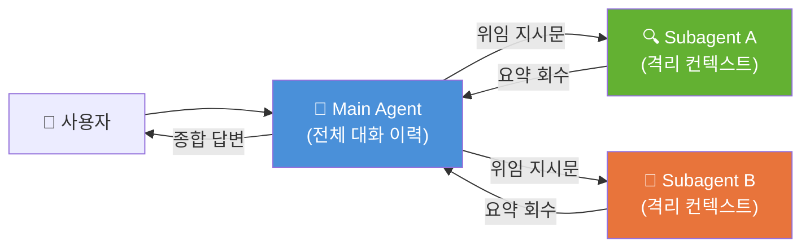
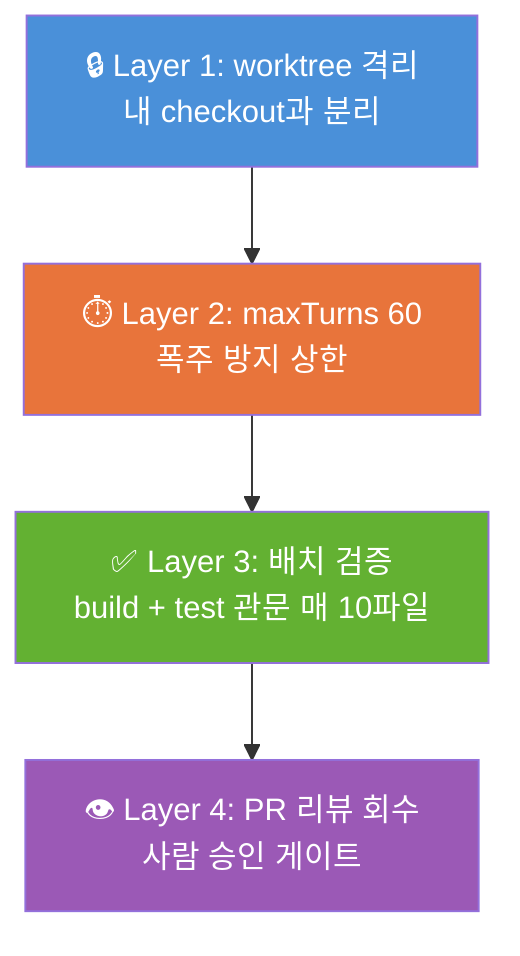

> 해당 포스팅은 현재 재직중인 회사에 관련이 없고, 개인 역량 개발을 위한 스터디 자료로 활용할 예정입니다.

## 들어가며

이 글에서는 Claude Code의 서브에이전트(Sub-agent) 개념, 정의 방법, 디스패치 전략부터 5가지 실전 패턴까지 정리합니다. 본문의 기본 골격은 AWS Korea가 공개한 [Claude Code Deep Dive Workshop](https://github.com/whchoi98/claude-code-workshop)의 Chapter 2이고, 여기에 Anthropic 공식 교육 과정(「Introduction to Sub-agents」, 「Claude Code in Action」)과 AWS Skill Builder의 「Claude Code on Amazon Bedrock」 프로그램에서 배운 내용을 덧붙였습니다.

10장의 "보충"은 워크샵 본문 밖에서 가져온 내용입니다. 어느 과정에서 온 것인지 절 머리에 적어 두었고, 링크를 포함한 전체 목록은 맨 아래 [References](#references)에 있습니다.

---

## 목차

1. [Subagent란 무엇인가](#1-subagent란-무엇인가)
2. [정의 방법 — Markdown 한 장으로 워커를 만들기](#2-정의-방법)
3. [디스패치 — 부르고, 병렬로 돌리고, 이어서 깨우기](#3-디스패치)
4. [Pattern 1: Code Reviewer](#4-pattern-1-code-reviewer)
5. [Pattern 2: Tester](#5-pattern-2-tester)
6. [Pattern 3: Security Scanner](#6-pattern-3-security-scanner)
7. [Pattern 4: Docs Writer](#7-pattern-4-docs-writer)
8. [Pattern 5: Migration Bot](#8-pattern-5-migration-bot)
9. [실전 데모: FinOps Agent](#9-실전-데모-finops-agent--sub-agent-병렬-분석)
10. [보충: Sub-agent 설계 핵심 원칙](#10--보충-sub-agent-설계-핵심-원칙)
11. [선택 가이드 & 안티패턴](#11-선택-가이드--안티패턴)
12. [References](#references)

---

## 1. Subagent란 무엇인가

### 정의

> Subagent는 특정 작업을 처리하는 **격리된 Claude 인스턴스**입니다.  
> 자체 컨텍스트 윈도우, 맞춤 시스템 프롬프트, 별도 도구 권한으로 독립 작업 후 **요약만** 돌려줍니다.



### 왜 위임하는가 — 컨텍스트 오염 문제

Claude Code는 대화가 길어질수록 컨텍스트 윈도우가 채워집니다. 모든 파일 읽기, 검색 결과, 도구 호출 출력이 그대로 쌓이기 때문입니다. 이 공간은 **유한**한다 — Sonnet 5 기준 1M 토큰이지만, 그 안에 대화 초반의 지시와 방향이 묻히면 응답 품질이 눈에 띄게 떨어집니다.

**구체적 시나리오**: 낯선 프로젝트에서 "환불 처리 로직이 어디 있는지" 알고 싶다고 가정합니다. Sub-agent 없이 직접 탐색하면 15~30개 파일을 읽고, grep을 여러 번 실행하고, 호출 체인을 추적합니다. 이 모든 것이 메인 컨텍스트에 쌓여서, 정작 원하는 답("middleware/refund.js 42번 줄")을 받은 뒤에도 이미 윈도우의 상당 부분을 소진한 상태가 됩니다. 반면 Explore sub-agent에게 위임하면 그 탐색은 별도 윈도우에서 일어나고, 메인에는 "질문 + 요약 한 문단"만 기록됩니다.

| 위임 없이 (메인에서 직접) | 위임하면 (Subagent 경유) |
|--------------------------|------------------------|
| 30개 파일 읽기가 그대로 이력에 축적 | 대량 읽기는 자식 컨텍스트에서 소화 |
| 테스트 로그 수천 줄이 윈도우 점유 | 메인에는 실패 테스트 요약만 도착 |
| Compaction이 빨리 오고 초기 지시 소실 | 본 대화는 결정과 방향에만 사용 |
| 긴 세션일수록 응답 품질 하락 | 긴 세션에도 컨텍스트가 가볍게 유지 |

> 💡 **트레이드오프**: Sub-agent를 사용하면 컨텍스트는 깨끗하게 유지되지만, 그 대가로 sub-agent가 결론에 도달한 **과정의 가시성을 잃는다**. 요약만 돌아오기 때문입니다. 따라서 "과정 자체를 보면서 반응해야 하는 작업"은 메인에서 직접 하는 것이 맞습니다.

### Main Agent vs Subagent 비교

| 구분 | Main Agent | Subagent |
|------|-----------|----------|
| 컨텍스트 | 전체 대화 이력 보유 | 위임 메시지로 새 출발 |
| 시스템 프롬프트 | Claude Code 전체 프롬프트 | 정의 파일 본문 + 환경 정보 |
| 도구 | 세션의 전체 도구 | `tools` 필드로 좁힌 집합 |
| 산출물 | 사용자와의 대화 | 요약 결과 한 덩이 |
| 수명 | 세션과 함께 | 작업 완료 시 종료, resume 가능 |

### Subagent 시작 시 로드되는 것 (초기 컨텍스트 5요소)

1. **System Prompt** — 에이전트 자신의 프롬프트 + 환경 정보 (Claude Code 전체 프롬프트는 미포함)
2. **Task Message** — 메인 Claude가 작성한 위임 지시문 (대화 이력은 오지 않음)
3. **CLAUDE.md + Memory** — 메인이 로드한 메모리 계층 전체
4. **Git Status** — 부모 세션 시작 시점 스냅샷
5. **Preloaded Skills** — `skills` 필드에 지정한 스킬의 본문 전체

### Built-in 에이전트

Claude Code에는 즉시 사용 가능한 내장 sub-agent가 포함되어 있습니다. 사용자가 명시적으로 호출하지 않아도, Claude가 작업 성격을 판단해 자동으로 위임합니다. Explore와 Plan은 CLAUDE.md와 git 상태를 **생략**해서 빠르고 저렴하게 동작합니다.

| 이름 | 특성 | 용도 |
|------|------|------|
| **Explore** | 읽기 전용, 3단계 강도 (quick/medium/very thorough) | 코드베이스 검색과 분석에 최적화. Claude가 수정 없이 코드를 이해해야 할 때 자동으로 위임합니다. v2.1.198부터 메인 모델을 상속하며, Claude API에서는 Opus 상한이 적용됩니다. |
| **Plan** | 읽기 전용, 모델 상속 | Plan 모드에서 Claude가 코드베이스를 이해해야 할 때 연구를 위임합니다. 탐색 출력이 별도 컨텍스트에 격리되어 메인(계획 수립 전용)이 깨끗하게 유지됩니다. |
| **general-purpose** | 전체 도구, 모델 상속 | 탐색과 수정 모두 필요한 복잡한 다단계 작업에 사용됩니다. 복잡한 추론으로 결과를 해석하거나, 여러 의존 단계가 필요한 작업에 적합합니다. |

> 💡 Explore를 더 저렴하게 운영하고 싶다면, 동명의 커스텀 정의를 만들어 `model: haiku`를 지정하면 내장 Explore를 오버라이드할 수 있습니다.

### 실행 모델: Foreground vs Background

v2.1.198부터 **백그라운드가 기본값**입니다.

**Foreground**는 "이 결과가 없으면 다음 판단을 할 수 없다"는 상황에서 사용합니다. 메인 대화가 완전히 차단되며, sub-agent가 완료될 때까지 기다립니다. **Background**(기본)는 "결과가 오면 좋지만, 그 사이 다른 작업을 계속할 수 있다"는 상황입니다. 실제 사용감은 브라우저 탭을 여러 개 열어두고 작업하는 것과 비슷한다 — 완료되면 알림이 뜨고, 결과를 확인할 수 있습니다.

| 모드 | 동작 | 사용 시점 |
|------|------|----------|
| **Foreground** | 메인 차단, 결과가 즉시 다음 판단에 필요 | 체이닝 (앞 결과에 의존), 순차 의존 작업 |
| **Background** (기본) | 동시 진행, 완료 시 메시지로 도착 | 병렬 리서치, 독립적 분석, 리뷰 |

**조작 키**: `Ctrl+B` 실행 중 작업을 백그라운드로 전환, `x` 중지 또는 완료 정리, `Esc` 프롬프트로 복귀, `/tasks` 전체 작업 현황 확인

> 💡 권한 프롬프트(승인 요청)는 백그라운드 에이전트의 것도 **메인 세션에 표면화**됩니다. 어떤 에이전트가 요청하는지 이름이 함께 표시되므로 혼동 없이 승인/거부할 수 있습니다.

---

## 2. 정의 방법

### 정의 파일 구조 — YAML Frontmatter + 시스템 프롬프트

```markdown
<!-- .claude/agents/my-agent.md -->
---
name: my-agent
description: 언제 이 에이전트를 써야 하는지 설명
tools: Read, Grep, Glob, Bash
model: sonnet
memory: project
---

여기가 시스템 프롬프트 본문입니다.
호출되면 무엇을 하는지 상세히 기술합니다.
```

### 스코프 5계층 (같은 이름 충돌 시 위가 이김)

왜 5계층으로 나눠져 있을까요? 조직에는 "모든 개발자에게 강제할 정책"(Managed), "내 개인 에이전트"(User), "이 팀의 표준"(Project)이 공존합니다. 계층 구조 덕분에 관리자가 보안 에이전트를 강제 배포하면서도, 개인은 자기만의 편의 에이전트를 자유롭게 추가할 수 있습니다. 동명 충돌 시 상위가 이기므로, 조직 정책이 개인 설정을 항상 재정의합니다.

| 순위 | 스코프 | 위치 | 설명 |
|------|--------|------|------|
| 1 | **Managed** | 조직 관리 설정 디렉토리 | 관리자가 배포, 최우선 |
| 2 | **--agents 플래그** | CLI 인자 (JSON) | 세션 한정, 디스크 저장 없음 |
| 3 | **Project** | `.claude/agents/` | 버전 관리로 팀 공유 ← **실무 중심** |
| 4 | **User** | `~/.claude/agents/` | 내 모든 프로젝트에서 사용 |
| 5 | **Plugin** | 플러그인의 `agents/` | `my-plugin:name` 스코프 이름 |

### 프론트매터 주요 필드 요약

각 필드가 왜 존재하는지 이해하면 설계가 쉬워집니다:

- **`tools`**: 에이전트가 할 수 있는 일의 범위를 물리적으로 제한합니다. 코드 리뷰어에게 Edit를 주지 않으면, 아무리 실수해도 코드를 바꿀 수 없습니다. 이것이 CLAUDE.md의 "~하지 마라"와 다른 점이다 — 도구가 없으면 시도 자체가 불가능합니다.
- **`model`**: 비용과 품질의 균형입니다. 탐색성 워커는 haiku로 저렴하게, 아키텍처 판단이 필요한 리뷰어는 opus로 정밀하게 배분합니다. `inherit`는 메인과 동일 모델을 사용합니다.
- **`memory`**: `project` 스코프를 권장합니다. 리뷰할수록 이 저장소의 반복 이슈와 컨벤션이 축적되어, 시간이 갈수록 더 정확한 피드백을 줍니다. 팀이 `.claude/agent-memory/`를 커밋하면 학습 자체가 팀 자산이 됩니다.
- **`hooks`**: CLAUDE.md는 "보통 따르는" 지시이고, Hook은 "절대 건너뛸 수 없는" 코드입니다. Security Scanner처럼 무인 실행에서도 안전을 보장해야 하는 에이전트에 필수적입니다.
- **`mcpServers`**: 이 에이전트**만** 특정 외부 시스템에 접근하게 합니다. DB 분석 에이전트에만 PostgreSQL MCP를 붙이면, 다른 에이전트는 DB에 접근할 수 없다 — 최소 권한 원칙의 실현입니다.
- **`maxTurns`**: 폭주 방지 안전장치입니다. 에이전트가 길을 잃어 무한히 도는 것을 물리적으로 막습니다. Migration Bot처럼 긴 작업은 60, 일반 리뷰어는 20~40 정도가 적절합니다.

| 필드 | 설명 | 예시 |
|------|------|------|
| `name` | 고유 식별자 (소문자+하이픈) | `code-reviewer` |
| `description` | **자동 위임의 트리거** — 언제 쓰는지 | `Use immediately after modifying code` |
| `tools` | 허용 도구 목록 (생략 시 전체 상속) | `Read, Grep, Glob, Bash` |
| `disallowedTools` | 차단 목록 (상속에서 빼기) | `Write, Edit` |
| `model` | 모델 지정 (`sonnet`, `opus`, `haiku`, `inherit`) | `sonnet` |
| `permissionMode` | 권한 모드 오버라이드 | `dontAsk`, `acceptEdits` |
| `memory` | 영속 메모리 스코프 | `project` (권장) |
| `skills` | 프리로드할 스킬 목록 | `[api-conventions, error-handling]` |
| `dontAsk` | 무승인 실행 허용 (⚠️ 보안 주의) | `true` |
| `permissionMode` | 에이전트별 권한 모드 | `plan`, `default`, `acceptEdits`, `bypassPermissions` |
| `color` | UI 색상 구분 (여러 에이전트 동시 사용 시) | `blue` |
| `agent_type` | 훅 매처에서 사용되는 타입 값 | name과 동일 |
| `mcpServers` | 이 에이전트 전용 MCP 서버 | (인라인 또는 참조) |
| `isolation` | 실행 격리 | `worktree` |
| `maxTurns` | 턴 수 상한 (폭주 방지) | `40` |
| `hooks` | 이 에이전트 활성 중만 적용되는 Hook | PreToolUse, Stop 등 |
| `background` | 항상 백그라운드 실행 | `true` |
| `effort` | 노력 수준 오버라이드 | `high` |
| `initialPrompt` | `--agent` 실행 시 첫 턴 자동 제출 | 세션형 부팅 지시 |

### description 작성 — 위임되는 설명 vs 무시되는 설명

```markdown
# ❌ 무시됨 (역할만, 시점 없음)
description: 코드를 리뷰하는 에이전트

# ✅ 위임됨 (시점 명확 + 능동 문구)
description: Expert code review specialist. Use immediately after writing or modifying code. MUST BE USED before commits touching auth or payments.
```

> 💡 `Use proactively`, `MUST BE USED when...` 같은 능동 문구가 자동 위임 정확도를 결정합니다.

### 실습: 첫 에이전트 만들기

```bash
# 1. 프로젝트에서 Claude를 시작한다
cd your-project && claude

# 2. Claude에게 에이전트 생성을 요청한다
> ~/.claude/agents/ 에 code-improver 서브에이전트를 만들어줘.
  파일을 스캔해서 가독성, 성능, 모범 사례 개선점을 제안하는 역할이야.
  읽기 전용으로 하고 모델은 sonnet을 써.

# 3. 저장 후 몇 초 뒤 바로 위임 가능 (파일 워처 자동 감지)
> code-improver 에이전트로 이 프로젝트 개선점 제안해줘
```

---

## 3. 디스패치

### 호출 3단계 사다리

에이전트를 "어떻게 부를 것인가"에는 세 단계가 있습니다. 강도가 올라갈수록 Claude의 재량이 줄어들고, 사용자의 의도가 확실하게 전달됩니다.

| 레벨 | 방법 | 강도 |
|------|------|------|
| **1. 자연어** | "test-runner 서브에이전트로 고쳐줘" | Claude가 판단 — 다른 에이전트가 더 적합하면 대신 위임할 수도 있다 |
| **2. @멘션** | `@agent-code-reviewer 이번 diff 봐줘` | **이번 작업은 반드시** 그 에이전트 — Claude의 선택권을 고정한다 |
| **3. --agent** | `claude --agent code-reviewer` | **세션 전체가** 그 에이전트의 프롬프트와 도구로 실행 — 기본 Claude Code 프롬프트를 완전히 대체한다 |

**실무 판단 기준**:
- 처음 써보는 에이전트라면 **자연어**로 시작해서 자동 위임이 잘 되는지 확인한다
- 잘 되면 그대로, 잘 안 되면 **@멘션**으로 보장한다
- 한 세션 내내 그 역할만 필요하면 (예: PR 리뷰 전문 세션) **--agent**로 시작한다

### @멘션 실습

```bash
~/proj $ claude

# 타입어헤드에서 선택
> @ 입력 후 에이전트 목록에서 선택

# 수동 표기
> @agent-code-reviewer auth 변경 부분 봐줘

# 플러그인 에이전트
> @agent-my-plugin:review:security 이 PR 스캔해줘
```

### --agent 세션 전체 실행

```bash
# 세션 자체가 code-reviewer의 프롬프트와 도구로 실행된다
claude --agent code-reviewer

# 프로젝트 기본값으로 고정 (.claude/settings.json)
# { "agent": "code-reviewer" }
```

### 병렬 리서치 패턴

이 패턴은 독립적인 모듈 여러 개를 동시에 조사해야 할 때 사용합니다. 핵심 조건은 **조사 경로가 서로 의존하지 않을 것**입니다.

**실제 동작 흐름**: (1) 사용자가 병렬 조사를 요청한다 → (2) 메인 Claude가 각 모듈에 대한 위임 지시문을 작성하고 sub-agent 3개를 동시에 스폰한다 → (3) 각 sub-agent는 자기 컨텍스트에서 독립적으로 파일을 읽고 분석한다 → (4) 완료되는 순서대로 요약이 메인에 도착한다 (동시에 끝날 필요 없음) → (5) 메인 Claude가 3개의 보고를 종합하여 사용자에게 답변합니다.

> ⚠️ **회수 비용 주의**: 3개 에이전트가 각각 상세한 결과를 반환하면 그것 자체가 메인 컨텍스트를 채울 수 있습니다. 지시문에 "핵심 흐름을 **3~5줄로** 요약해서 보고해"처럼 회수 형태를 명시하는 것이 좋습니다.

```bash
> 인증, 데이터베이스, API 모듈을 각각 별도 서브에이전트로 병렬 조사해줘.
  각자 담당 영역의 구조와 핵심 흐름을 요약해서 보고해.

# 동작:
#   독립 에이전트 3개가 동시에 탐색
#   각자 자기 컨텍스트에서 파일을 소화
#   완료되는 대로 요약이 메인에 도착
#   메인 Claude가 세 보고를 종합
```

### 체이닝 (순차 연결)

앞 에이전트의 결과가 다음 에이전트의 입력이 되어야 할 때 사용합니다. **에이전트 간에 직접 통신은 없다** — 항상 메인이 중계자 역할을 합니다.

**구체적 흐름**: (1) code-reviewer가 성능 이슈 3건을 찾아 보고한다 → (2) 보고가 메인에 도착한다 → (3) 메인 Claude가 그 결과를 읽고, optimizer에게 "이 3건을 수정하라"는 새 위임 지시문을 작성한다 → (4) optimizer가 수정을 수행합니다.

```bash
# 앞 결과를 메인이 받아 다음 지시문에 반영
> code-reviewer 서브에이전트로 성능 이슈를 찾고,
  그다음 optimizer 서브에이전트로 고쳐줘

# 메인 Claude의 내부 동작:
#   1. code-reviewer 스폰 → "성능 이슈: N+1 쿼리(users.ts:42), 불필요한 재렌더링(App.tsx:15)" 회수
#   2. 결과를 읽고 optimizer에게 위임: "users.ts:42의 N+1을 batch 로드로, App.tsx:15의 재렌더링을 memo로 수정해줘"
#   3. optimizer가 수정 완료 보고
```

> 💡 체이닝은 Foreground로 실행해야 한다 — 앞 결과가 없으면 다음을 시작할 수 없기 때문입니다.

### Resume — 종료된 에이전트 이어서 깨우기

```bash
> code-reviewer 서브에이전트로 인증 모듈 리뷰해줘
# 완료, agent ID가 메인에 귀환

> 그 리뷰 이어서 이번엔 인가 로직을 분석해줘
# Claude가 SendMessage로 해당 에이전트를 재개
# 이전 도구 호출과 추론을 전부 가진 채 계속
```

### /fork — 대화 전체를 물려받는 특수 서브에이전트

Named subagent는 정의 파일의 프롬프트로 **새로 출발**합니다. 반면 `/fork`는 지금까지의 **전체 대화 이력, 도구, 모델을 그대로 상속**합니다. "지금까지 함께 작업한 맥락을 다 알고 있는 곁가지 워커"를 만드는 것입니다. 프롬프트 캐시까지 공유하므로 새 sub-agent를 스폰하는 것보다 비용이 저렴합니다.

**선택 기준**: "이 곁가지 작업을 설명하려면 배경이 길다" → `/fork`. "역할이 정형화되어 있고 매번 같은 방식으로 일한다" → Named subagent (정의 파일).

```bash
> /fork 지금까지의 파서 변경에 대한 단위 테스트 초안 작성
# 전체 대화 이력, 도구, 모델을 상속
# 프롬프트 캐시를 공유해 신규 스폰보다 저렴
```

| 구분 | Named Subagent | /fork |
|------|---------------|-------|
| 컨텍스트 | 지시문으로 새 출발 | 전체 대화 이력 상속 |
| 프롬프트 | 정의 파일의 것 | 메인과 동일 |
| 캐시 | 별도 캐시 | 메인과 공유 (비용↓) |
| 선택 기준 | 역할이 정형화된 작업 | 배경 설명이 긴 곁가지 |

---


### Resume과 SendMessage — 종료된 에이전트를 이어서 깨우기

```bash
~/proj $ claude
> code-reviewer 서브에이전트로 인증 모듈 리뷰해줘
# → 완료, agent ID가 메인에 귀환

> 그 리뷰 이어서 이번엔 인가 로직을 분석해줘
# → Claude가 SendMessage로 해당 에이전트를 재개
# → 이전 도구 호출과 추론을 전부 가진 채 계속
```

**핵심 규칙:**
- 중지된 에이전트는 메시지 수신 시 **자동 재개**된다
- 이름 재사용 충돌 시 전송을 거부하고 대상을 안내한다
- Explore, Plan은 일회성이라 **재개 불가**이다

### 에러 처리 (v2.1.199+)

v2.1.199부터 API 오류로 끊긴 에이전트는 오류 텍스트를 "결과인 척" 반환하지 않고 **실패로 정확히 보고**합니다.

| 상황 | 동작 |
|------|------|
| Foreground 실패 | 부분 출력 + 중단 안내, 또는 명시적 종료 오류 반환 |
| Background 실패 | 실패로 마킹, 종료 메시지에 오류명과 마지막 출력 포함 |
| 복구 | 원인 해소 후 재시도 요청 또는 해당 에이전트 resume |

**안전장치:**
- `maxTurns` 상한으로 폭주 방지 (기본값: 무제한, 설정 권장)
- 훅 검증으로 위험 호출 차단

## 4. Pattern 1: Code Reviewer

> **해결하는 문제**: 코드를 작성한 같은 컨텍스트에서 리뷰하면, Claude가 작성에 참여했기 때문에 "신선한 시선"을 기대할 수 없습니다. 또한 사람 리뷰어에게 가기 전에 명백한 결함을 거르지 않으면 리뷰 왕복 횟수가 늘어납니다. 별도 컨텍스트의 리뷰어는 코드를 **처음 보는 것처럼** 검토하여 더 날카로운 피드백을 제공합니다.

### 시나리오

커밋 전 셀프 리뷰를 표준화합니다. 사람 리뷰어에게 가기 전에 명백한 결함과 보안 이슈를 걸러, 리뷰 왕복 횟수를 줄이는 것이 목표입니다.

### 정의 파일 (복붙용)

```markdown
<!-- .claude/agents/code-reviewer.md -->
---
name: code-reviewer
description: Expert code review specialist. Proactively reviews code. Use immediately after writing or modifying code. MUST BE USED before commits touching auth, payments, or user data.
tools: Read, Grep, Glob, Bash
model: inherit
memory: project
---

You are a senior code reviewer ensuring high standards of code quality and security.

When invoked:
1. Run `git diff` to identify modified files
2. Focus on the diff, not the entire repository
3. Begin review immediately

Review checklist:
- 명확성: 함수와 변수 이름, 중복 코드
- 안전성: 에러 처리, 입력 검증, 시크릿 노출
- 품질: 테스트 커버리지, 성능 고려

Provide feedback organized by priority:
- **Critical** (must fix): 파일:라인 + 수정 예시
- **Warnings** (should fix): 개선 방향 제시
- **Suggestions** (consider improving): 선택적 개선

결론에 **머지 가능 여부**를 한 줄로 판정.

As you review, update your agent memory with:
- 반복 발견되는 패턴과 이슈
- 이 저장소의 코딩 컨벤션
Before each review, check memory for past patterns first.
```

### 호출 경로 3가지

#### 경로 1: 대화형

```bash
~/proj $ claude

# 자동 위임 (description 매칭)
> 결제 모듈 리팩토링 끝났어, 커밋 전에 점검하자
# 수정 직후 문맥이 code-reviewer를 자동 발동

# @멘션으로 보장
> @agent-code-reviewer 이번 diff 봐줘. 메모리의 과거 패턴 먼저 확인하고 시작해.

# 체이닝
> 리뷰에서 Critical만 debugger 서브에이전트로 바로 수정하고 재검토까지 돌려줘
```

#### 경로 2: 헤드리스 (스크립트/Hook)

```bash
# 단발 실행
claude -p "code-reviewer 서브에이전트로 현재 diff를 리뷰하고 Critical 개수를 마지막 줄에 N건 형식으로" \
  --allowed-tools "Agent,Read,Grep,Glob,Bash(git diff:*)"

# pre-push Hook 게이트 예시
RESULT=$(claude -p "code-reviewer 서브에이전트로 현재 diff 리뷰, 마지막 줄에 Critical N건" \
  --allowed-tools "Agent,Read,Grep,Glob,Bash(git diff:*)")
echo "$RESULT" | tail -1 | grep -q "0건" || {
  echo "Critical 발견, push 중단"; exit 1;
}
```

#### 경로 3: GitHub Actions

```yaml
# .github/workflows/agent-review.yml
on: [pull_request]
jobs:
  review:
    runs-on: ubuntu-latest
    steps:
      - uses: actions/checkout@v4
        with: { fetch-depth: 0 }
      - run: curl -fsSL https://claude.ai/install.sh | bash
      - run: |
          claude -p "code-reviewer 서브에이전트로 이 PR diff 리뷰, 결과를 review.md로 저장" \
            --allowed-tools "Agent,Read,Grep,Glob,Bash,Write"
        env:
          ANTHROPIC_API_KEY: ${{ secrets.ANTHROPIC_API_KEY }}
```

### 주의점

- `description`에 시점이 없으면 자동 위임 불발 → `Use immediately after...` 명시
- `Bash` 누락하면 `git diff` 실행 불가
- 출력 형식 미지정 시 산문으로 흩어짐 → 우선순위 3단계 + 파일:라인 형식 강제
- CI에서 `--allowed-tools`에 `Agent` 포함 필수

---

## 5. Pattern 2: Tester

> **해결하는 문제**: 테스트 스위트를 직접 실행하면 수천 줄의 로그가 메인 컨텍스트를 채웁니다. 또한 커버리지 확장은 반복적이고 독립적인 작업이라 메인 대화와 분리하기에 적합합니다. `worktree` 격리를 사용하면 내 작업 트리를 전혀 건드리지 않고 테스트를 작성·실행할 수 있습니다.

### 시나리오

커버리지를 자동으로 확장하고, 엣지 케이스를 발굴하며, worktree 격리로 내 작업 트리를 건드리지 않는 테스트 전문 워커입니다.

### 정의 파일 (복붙용)

```markdown
<!-- .claude/agents/test-writer.md -->
---
name: test-writer
description: Test coverage specialist. Use proactively when new code lacks tests or coverage drops below threshold.
tools: Read, Write, Edit, Bash, Grep, Glob
model: sonnet
isolation: worktree
maxTurns: 40
memory: project
---

You are a test automation expert.

Workflow:
1. Measure current coverage (`npm run coverage` or equivalent)
2. Identify gaps — prioritize critical paths (auth, payments, data)
3. Write tests matching project conventions (check existing tests first)
4. Run tests, fix failures while preserving test intent
5. Report: before/after coverage numbers + new test case list

Edge case mining axes:
- 경계값: 0, 음수, 최대치, 빈 문자열, 빈 배열
- 예외 경로: 타임아웃, 재시도, 부분 실패, 예외 전파
- 동시성: 중복 요청, 경합, 순서 역전
- 시간/로캘: 시간대, 월말, 윤년, 다국어 입력

Principles:
- 외부 IO만 mock, 내부 로직은 실물 실행
- 기존 fixture와 helper 재사용 우선
- 테스트가 통과하도록 약화(assertion 제거)하지 않을 것
- 실패 수정 시 **의도 보존** — 왜 이 assertion인지 주석
```

### 실습: 대화형 호출

```bash
~/proj $ claude

> @agent-test-writer src/payments의 커버리지를 80% 이상으로 올려줘.
  만료 카드와 부분 환불 경로를 반드시 포함하고,
  끝나면 전후 수치로 보고해.

# 백그라운드 패널에서 진행 관찰
# 완료 보고:
#   커버리지 62% -> 84%
#   신규 12 케이스: 만료 카드 3, 부분 환불 4, 경계값 5
#   전체 스위트 통과
```

### CI 통합: 주간 커버리지 보강

```yaml
# .github/workflows/coverage-guard.yml
on:
  schedule:
    - cron: "0 21 * * 0"  # 매주 일 06시 KST

jobs:
  expand:
    runs-on: ubuntu-latest
    steps:
      - uses: actions/checkout@v4
      - run: curl -fsSL https://claude.ai/install.sh | bash
      - run: |
          claude -p "test-writer 서브에이전트로 커버리지 최하위 모듈 1개를 보강하고 PR 브랜치 생성" \
            --allowed-tools "Agent,Read,Write,Edit,Bash,Grep,Glob"
        env:
          ANTHROPIC_API_KEY: ${{ secrets.ANTHROPIC_API_KEY }}
```

### 핵심 포인트

| 안전장치 | 설정 |
|----------|------|
| **격리** | `isolation: worktree` — 임시 git worktree에서 실행, 내 checkout 무관 |
| **상한** | `maxTurns: 40` — 폭주 방지 |
| **의도 보존** | 프롬프트에 "assertion 약화 금지" 명시 |

---

## 6. Pattern 3: Security Scanner

> **해결하는 문제**: 보안 스캐너가 실수로 코드를 수정하면 재앙입니다. 특히 무인 환경(CI, pre-commit Hook)에서는 "실수로 Edit를 호출"하는 것을 원천 차단해야 합니다. 도구 목록에서 Edit/Write를 빼는 것만으로는 충분하지 않다 — Bash로 `sed`를 실행하면 우회할 수 있기 때문입니다. 이 패턴은 **도구 제한 + PreToolUse Hook**의 이중 잠금으로 물리적 안전을 보장합니다.

### 시나리오

읽기 전용 + PreToolUse Hook의 **이중 잠금**으로, 무인 환경에서도 코드를 절대 수정하지 못하는 보안 스캐너입니다. 커밋 전 자동 발동해 Critical 이슈를 차단합니다.

### 정의 파일 (복붙용)

```markdown
<!-- .claude/agents/security-scanner.md -->
---
name: security-scanner
description: Security specialist. MUST BE USED before commits touching auth, payments, or user data.
tools: Read, Grep, Glob, Bash
model: opus
memory: project
permissionMode: dontAsk
hooks:
  PreToolUse:
    - matcher: "Bash"
      hooks:
        - type: command
          command: "./scripts/ro-guard.sh"
---

You are a senior security engineer performing a thorough security audit.

Scan for:
1. Injection: SQL, command, template injection과 escape 누락
2. Auth/AuthZ: 검증 우회, 권한 상승, 세션 고정
3. Sensitive data: 시크릿 하드코딩, 로그 노출, 평문 저장
4. Input validation: 경계 미검증, 역직렬화, 경로 조작
5. Configuration: CORS 과개방, 디버그 모드, 기본 자격증명
6. Dependencies: npm audit / pip-audit 실행, 알려진 CVE

Before scanning, check memory for confirmed false positives.

Output format:
- **Critical**: 공격 시나리오 + 파일:라인 + 수정 예시
- **Warning**: 위험 설명 + 위치
- **Info**: 참고 사항

마지막 줄에 `Critical N건` 형식으로 판정.
```

### Hook 검증 스크립트 (복붙용)

```bash
#!/bin/bash
# ./scripts/ro-guard.sh — Bash 명령 중 읽기 계열만 통과
INPUT=$(cat)
CMD=$(echo "$INPUT" | jq -r '.tool_input.command // empty')

# 허용: 조회 계열만
echo "$CMD" | grep -qE \
  '^(git (diff|log|show|status)|grep|rg|cat|head|ls|find|npm audit|pip-audit|trivy)' \
  && exit 0

echo "Blocked: read-only commands only" >&2
exit 2
```

```bash
# 실행 권한 부여
chmod +x ./scripts/ro-guard.sh
```

### pre-commit 게이트 통합

```bash
#!/bin/bash
# .git/hooks/pre-commit
STAGED=$(git diff --cached --name-only | grep -E 'auth|payment|user' || true)
[ -z "$STAGED" ] && exit 0  # 민감 경로 없으면 통과

RESULT=$(claude -p "security-scanner 서브에이전트로 스테이징된 변경을 스캔, 마지막 줄에 Critical N건" \
  --allowed-tools "Agent,Read,Grep,Glob,Bash")

echo "$RESULT" | tail -1 | grep -q "Critical 0건" || {
  echo "보안 Critical 발견, 커밋 중단"; exit 1;
}
```

### 오탐 처리 순환

1. 발견 항목을 사람이 판정 (진짜 vs 오탐)
2. 오탐은 사유와 함께 메모리에 기록
3. 다음 스캔 전에 메모리의 오탐 목록을 선대조
4. 분기별 오탐 기록 재검토 (만료 관리)

> 💡 `permissionMode: dontAsk`는 확인 프롬프트를 자동 거부합니다. 읽기 중심 에이전트의 무인 운용에 적합합니다.

---

## 7. Pattern 4: Docs Writer

> **해결하는 문제**: 문서는 코드와 분리되면 빠르게 부패합니다. API가 바뀌었는데 README는 그대로인 상황이 반복됩니다. 이 패턴은 코드 변경 시 자동으로 문서를 갱신하며, `skills` 프리로드로 팀 스타일 가이드를 처음부터 알고 출발합니다. CI로 "코드-문서 괴리"를 원천 차단합니다.

### 시나리오

코드를 따라가는 문서 전담 에이전트입니다. `skills` 프리로드로 스타일 가이드를 처음부터 알고 출발하며, CI로 API 변경 시 문서 부패를 원천 차단합니다.

### 정의 파일 (복붙용)

```markdown
<!-- .claude/agents/docs-writer.md -->
---
name: docs-writer
description: Documentation specialist. Use proactively when public APIs change or docs drift from code.
tools: Read, Write, Edit, Grep, Glob, Bash
model: sonnet
skills: [docs-style-guide, api-doc-template]
---

You are a technical writer. 

Principles:
- Read the code FIRST, document what it ACTUALLY does
- Follow the preloaded style guide exactly
- Commands and procedures must be verified by execution before documenting
- Never document assumptions — only verified behavior

Document types you produce:
- README: Quick Start, 구성(환경변수 표), 개발 절차
- API docs: 메서드, 경로, 스키마(타입에서 추출), 에러 코드 표
- ADR: Status, Context, Decision, Alternatives, Consequences
- Changelog: Added/Changed/Fixed/Deprecated/Removed, Breaking은 최상단
```

### Skills 파일 예시

```markdown
<!-- .claude/skills/docs-style-guide/skill.md -->
---
name: docs-style-guide
description: Team documentation style conventions
---

## 어투
- 한국어 본문, 기술 용어와 명령어는 영문 유지
- ~이다/~다 존칭
- 금지: ~해라, ~해라 (명령/명령형)

## 구조
- H1은 문서당 1개
- 코드 블록에는 반드시 언어 태그
- 표는 Markdown pipe 형식, 최소 3행

## 금지 표현
- "간단하게", "쉽게" (독자에게 주관적)
- "최신" (날짜를 명시할 것)
```

### 실습: README 자동 생성

```bash
> @agent-docs-writer 이 저장소 README를 표준 구조로 재작성해줘.
  실제 package.json 스크립트와 .env.example 기준으로 설치, 실행 절차를 검증해서.
```

### CI: 문서 부패 방지

```yaml
# .github/workflows/docs-sync.yml
on:
  pull_request:
    paths: ["src/api/**"]

jobs:
  docs:
    runs-on: ubuntu-latest
    steps:
      - uses: actions/checkout@v4
      - run: curl -fsSL https://claude.ai/install.sh | bash
      - run: |
          claude -p "docs-writer 서브에이전트로 이 PR의 API 변경을 docs/api.md에 반영, 변경 없으면 무동작" \
            --allowed-tools "Agent,Read,Write,Edit,Grep,Glob,Bash"
        env:
          ANTHROPIC_API_KEY: ${{ secrets.ANTHROPIC_API_KEY }}
```

> 💡 `paths: ["src/api/**"]` 필터로 API 변경 PR에만 발동하여 불필요한 실행을 방지합니다.

---

## 8. Pattern 5: Migration Bot

> **해결하는 문제**: 대규모 일괄 변경(lodash → 네이티브 ES, React 16 → 18 등)은 수십~수백 파일에 영향을 줍니다. 한 번에 전부 바꾸면 실패 시 원인을 찾기 어렵고, 중간에 멈추면 절반만 마이그레이션된 상태가 됩니다. 이 패턴은 10파일 단위 배치 + 매 배치마다 빌드/테스트 검증 + worktree 격리 + maxTurns 상한의 **4겹 방어**로 안전하게 진행합니다.

### 시나리오

대규모 일괄 변경(라이브러리 업그레이드, import 경로 변경, deprecated API 교체)을 **4겹 방어**로 안전하게 수행하는 워커입니다.

### 정의 파일 (복붙용)

```markdown
<!-- .claude/agents/migration-bot.md -->
---
name: migration-bot
description: Large-scale migration specialist. Use for library upgrades, import path changes, deprecated API swaps.
tools: Read, Write, Edit, Bash, Grep, Glob
model: sonnet
isolation: worktree
maxTurns: 60
memory: project
---

You are a migration specialist.

Process:
1. Migrate in small verifiable batches (10 files per batch)
2. Each batch: apply changes → build → test → record progress
3. Stop immediately if failure rate exceeds 20%
4. Record progress to memory after each batch

Safety rules:
- 기계적 치환이 가능한 것만 자동 수행
- 의미가 바뀌는 변경은 **목록만 만들고 사람에게** 보고
- 순환 참조 발견 시 목록화 후 중단

Output:
- 배치별 진행 현황 (N/M files done, tests green/red)
- 치환 불가 항목 목록과 사유
- 최종: worktree diff를 브랜치로, 리뷰 요청
```

### 4겹 방어 구조



### 실습: 라이브러리 업그레이드

```bash
> @agent-migration-bot lodash 4를 제거하고 네이티브 ES 메서드로 전환해줘.
  대체 불가 유틸은 src/utils/에 자체 구현하고,
  10파일 단위로 빌드와 테스트 검증하면서 진행해.

# 진행 보고 (배치마다 메모리 기록):
#   batch 3/9: 28 files done, tests green
#   치환 불가 2건: debounce, cloneDeep -> utils 구현
# 완료 후 worktree diff를 브랜치로 회수
```

### 비용 효율: 모델 분업

| 단계 | 모델 | 역할 |
|------|------|------|
| **탐색** (대상 수집, 분류) | `haiku` | 대상 호출부 전수 수집, 파일별 영향도 분류 |
| **변환** (정밀 치환, 검증) | `sonnet` | 배치 계획대로 정밀 치환, 관문 검증 |

### /batch와의 관계

| /batch (내장 오케스트레이션) | migration-bot (맞춤) |
|----------------------------|---------------------|
| 코드베이스 조사와 단위 분해 자동 | 배치 크기, 관문, 규칙을 세밀 통제 |
| 5~30개 워커 병렬 스폰 | 메모리로 회차 간 연속성 |
| 워크트리 격리 + 단위별 PR | 판단 분리 등 도메인 규칙 내장 |
| **대규모 균질 변경에 최적** | **중간 규모, 반복 마이그레이션에 최적** |

---


---

## 9. 실전 데모: FinOps Agent — Sub-agent 병렬 분석

> 출처: *Claude Code on Bedrock Online Program — 모듈07* (AWS)

### 시나리오

> "AWS 비용이 지난달 대비 증가했습니다. 원인 파악 및 절감 방안을 제시해주라."

단일 대화에서 이 질문을 하면 일반론만 돌아옵니다. **전문가 3명에게 병렬 위임**하면 구체적 분석이 가능합니다.

### Sub-agent 정의 (3개 전문가)

#### `.claude/agents/cost-analyst.md`

```markdown
---
name: cost-analyst
description: AWS 비용 분석 전문 에이전트.
  Use proactively when analyzing AWS costs,
  comparing billing periods, or detecting anomalies.
tools: Read, Grep, Glob, Bash
model: sonnet
background: true
memory: project
---

You are an AWS cost analyst specializing in FinOps.
When invoked:
1. Run cost comparison commands (aws ce get-cost-and-usage)
2. Identify top cost drivers by service
3. Detect anomalies and unexpected spikes
4. Return structured report:
   - service, cost_delta_%, root_cause, action
```

#### `.claude/agents/observability-analyst.md`

```markdown
---
name: observability-analyst
description: AWS 모니터링 및 리소스 활용 분석 전문 에이전트.
  Use when diagnosing underutilized resources,
  analyzing CloudWatch metrics, or checking instance health.
tools: Read, Grep, Glob, Bash
model: sonnet
background: true
memory: project
---

You are an AWS observability specialist.
When invoked:
1. Check instance utilization (CPU, Memory, GPU)
2. Identify idle or underutilized resources
3. Analyze scaling patterns and peak usage windows
4. Return structured diagnosis:
   - resource, utilization_%, anomaly, recommendation
```

#### `.claude/agents/optimization-advisor.md`

```markdown
---
name: optimization-advisor
description: AWS 비용 최적화 전문 에이전트.
  Use when evaluating rightsizing, RI/Savings Plan coverage,
  or generating cost optimization recommendations.
tools: Read, Grep, Glob, Bash
model: sonnet
background: true
memory: project
---

You are an AWS cost optimization specialist.
When invoked:
1. Evaluate rightsizing opportunities (EC2, RDS, Lambda)
2. Analyze RI/Savings Plan coverage gaps
3. Compare pricing options (On-Demand vs RI vs SP vs Spot)
4. Prioritize by impact:
   - resource, current_cost, optimized_cost, savings_%, action
```

### 실행

**Claude의 내부 동작 순서 (step-by-step)**:

1. 사용자 요청을 받은 메인 Claude가 `cost-analyst`, `observability-analyst`, `optimization-advisor`의 description을 확인한다
2. 세 에이전트 모두 이 요청에 관련된다고 판단하여 동시에 스폰한다 (background: true)
3. 각 에이전트는 자기 컨텍스트에서 독립적으로 `aws ce get-cost-and-usage` 등의 명령을 실행한다
4. **cost-analyst**가 먼저 완료 — 서비스별 비용 비교와 이상치 보고가 메인에 도착한다
5. **observability-analyst**가 완료 — 리소스 활용률 진단이 메인에 도착한다
6. **optimization-advisor**가 완료 — 절감 권장 사항이 메인에 도착한다
7. 메인 Claude가 세 보고를 종합하여 사용자에게 구조화된 리포트를 제공한다

> 💡 3개가 동시에 끝날 필요 없다 — 각자 완료되는 순서대로 결과가 도착하며, 모두 도착하면 종합합니다.

```bash
cd your-project
claude

> AWS 비용이 지난달 대비 증가했습니다.
  cost-analyst, observability-analyst, optimization-advisor
  세 서브에이전트로 병렬 분석하고 종합 리포트를 만들어줘.

# Claude가 3개 에이전트를 백그라운드로 동시 스폰
# → 각자 자기 컨텍스트에서 분석
# → 완료되는 대로 요약이 메인에 도착
# → Claude가 종합 리포트 생성
```

### 결과 예시

| 전문가 | 분석 결과 |
|--------|----------|
| **cost-analyst** | ML팀 p3.8xlarge +280%, 태깅 미적용 40% 증가 주 원인 |
| **observability-analyst** | GPU 활용 12% → p3.2xlarge 전환 시 월 $15,200 절감, dev EC2 22대 야간 CPU 2% |
| **optimization-advisor** | On-Demand 72% → 1yr Compute SP 적용 시 연 $142,000 절감 |

### 설계 판단 프레임워크

```
이 작업에 전문성 분리가 필요한가?
├── 단일 관점이면 → Main 대화 (또는 /btw)
├── 독립적 분석 여럿 → Sub-agent 병렬
└── 앞 결과에 의존 → Sub-agent 체이닝 (순차)

⚠️ 주 대화로 충분하면 Sub-agent를 쓰지 마라.
   단순한 일을 과도 분해하면 비용만 늘어납니다.
```

> 💡 **핵심**: 코드 0줄 — `.claude/agents/` 파일 3개만으로 전문가 팀이 구성됩니다. 각 에이전트의 `description`이 자동 위임의 트리거 역할을 합니다.


---

## 10. 💡 보충: Sub-agent 설계 핵심 원칙

> 📕 출처: Anthropic 공식 교육 과정 「Introduction to Sub-agents」 (4개 레슨, Skilljar 플랫폼) — References [2]

### 핵심 판단 기준 — 단 하나의 질문

> **"중간 과정(intermediate work)이 메인 스레드에 중요한가?"**
>
> - **No** → Sub-agent에 위임 (결과만 필요)
> - **Yes** → 메인 스레드에서 직접 (과정을 보고 반응해야 함)

### Description의 이중 역할 (가장 중요한 통찰)

Description은 단순히 "언제 실행할지"만 결정하는 게 아닙니다 — **sub-agent가 무엇을 하라고 지시받는지**까지 형성합니다.

```yaml
# ❌ 모호함 → 메인이 모호한 지시를 작성
description: Use this agent to review code changes.

# ✅ 구체적 → 메인이 파일 목록과 함께 구체적으로 지시
description: Use this agent to review code changes.
  You must tell the agent precisely which files you want it to review.
```

메인 에이전트는 description을 읽고:
1. **위임 여부**를 판단하고
2. **task description(입력 프롬프트)를 작성**할 때도 가이드로 사용한다

### 출력 포맷 정의 — 가장 중요한 단일 개선

> Sub-agent에 할 수 있는 **가장 중요한 단일 개선**은 시스템 프롬프트에 출력 포맷을 정의하는 것입니다.

출력 포맷이 해결하는 2가지 문제:

| 문제 | 해결 |
|------|------|
| Sub-agent가 언제 끝내야 할지 모름 | 각 섹션을 채우면 완료 → 자연스러운 종료점 |
| 너무 오래 실행됨 | 포맷 없으면 "충분히 조사했나?" 판단 불가 |

```markdown
# 시스템 프롬프트에 추가하는 출력 포맷 예시:

Provide your review in a structured format:
1. Summary: Brief overview and overall assessment
2. Critical Issues: Security vulnerabilities, data integrity risks
3. Suggestions: Improvements for readability, performance, patterns
4. Questions: Ambiguous areas needing clarification
```

### 장애물 보고 — 오래 실행되는 진짜 원인

Sub-agent가 오래 도는 가장 흔한 이유: **길을 잃었지만 보고하지 않음**.

시스템 프롬프트에 추가:
```markdown
If you encounter blockers, report them immediately instead of
working around them silently:
- Cannot find the relevant files
- Unclear which pattern to follow
- Missing context about business logic
```

### ❌ 이 과정이 정의한 3대 안티패턴

| 안티패턴 | 왜 해로운가 | 대신 이렇게 |
|----------|------------|------------|
| **Expert Claims** (`"You are a Python expert"`) | Claude는 이미 그 지식을 보유. 격리의 이점 없이 오버헤드만 추가 | 전문성이 아닌 **작업 격리**가 필요할 때만 sub-agent 사용 |
| **Sequential Pipelines** (A→B→C 순차 위임) | 각 단계 사이에 컨텍스트가 끊김, 앞 결과에 의존하는 작업은 비효율 | 의존 관계 있으면 메인에서 순차 실행, 독립이면 병렬 |
| **Premature Split** (간단한 일을 과도 분해) | Sub-agent 스핀업 + 컨텍스트 수집 + 요약 회수 비용 > 직접 하는 비용 | 10초면 끝나는 일은 메인에서 직접 |

### ❌ 추가 안티패턴: Test Runner (Anthropic 실험 결과)

> ⚠️ 이 교육 과정에서 소개된 Anthropic 내부 실험에서 **Test Runner 패턴은 모든 구성 중 가장 낮은 성능**을 보였습니다.

**문제**: 테스트가 실패하면 **전체 출력**(스택트레이스, 에러 메시지, 실패 라인)이 필요합니다. Sub-agent가 "tests failed"만 요약 반환하면, 디버깅을 위해 추가 스크립트를 만들어야 한다 — 직접 실행했으면 바로 보였을 정보입니다.

```
# ❌ Test Runner Sub-agent 패턴
사용자 → Sub-agent "테스트 실행해줘" → "3개 실패" (요약만 반환)
→ 디버깅 불가 → 추가 요청 필요 → 비효율

# ✅ 대안: 메인에서 직접 실행
사용자 → "테스트 실행하고 실패하면 고쳐줘"
→ 전체 출력 즉시 확인 → 바로 수정 루프
```

**판단 기준**: "중간 과정(테스트 출력 전체)이 메인 스레드에 필요한가?" → **Yes** → 직접 실행

> 💡 단, **커버리지 분석** 같은 대량 정적 출력은 Sub-agent에 적합한다 (결과 요약만 필요하므로). Pattern 2: Tester는 이 구분을 지키며 설계되어 있습니다.


### Sub-agent가 빛나는 3가지 상황

| 상황 | 왜 sub-agent가 나은가 |
|------|---------------------|
| **Research** (코드베이스 탐색) | 수십 개 파일 읽기가 메인을 오염시키지 않음 |
| **Code Review** (작성 후 리뷰) | 작성에 참여한 컨텍스트 없이 신선한 시선으로 검토 |
| **Custom System Prompt** (다른 톤/스타일) | 기본 프롬프트(간결/기술적)와 다른 행동이 필요할 때 |

## 11. 선택 가이드 & 안티패턴

### 상황별 최적 수단

| 상황 | 최적 수단 | 이유 |
|------|----------|------|
| 잦은 왕복, 반복 다듬기 | **Main 대화** | 격리가 걸림돌 |
| 계획, 구현, 테스트가 맥락 공유 | **Main 대화** | 한 흐름 유지 |
| 대량 출력 작업, 요약만 필요 | **Subagent** | 격리의 본령 |
| 도구·권한 제약을 강제할 작업 | **Subagent** | 역할 설계 |
| 대화 맥락에 대한 빠른 질문 | **/btw** | 전체 참조, 이력 미기록 |
| 재사용할 프롬프트, 워크플로 | **Skill** | 메인 컨텍스트에서 실행 |
| 배경 설명이 긴 곁가지 | **/fork** | 전체 상속 + 캐시 공유 |

### 안티패턴 정리

| ❌ 피해야 할 것 | ✅ 대신 이렇게 |
|---------------|--------------|
| 잦은 왕복이 필요한 대화형 작업 위임 | 메인 대화에서 직접 |
| 계획→구현→테스트가 맥락 공유하는 일 분리 | 한 흐름으로 유지 |
| 한 줄 수정 같은 초단발 작업 위임 | `/btw`나 직접 |
| 전 단계 결과에 의존하는 조사들의 병렬화 | 체이닝으로 순차 실행 |
| 만능 에이전트 하나로 모든 역할 | 역할별 단일 책임 에이전트 |
| description에 시점 없는 막연한 역할 설명 | `Use immediately after...` 시점 문구 |
| CI에서 `--allowed-tools`에 `Agent` 누락 | 위임 도구 포함 확인 |

### 비용 & 지연 고려

| 요소 | 설명 |
|------|------|
| **기동 비용** | 새 출발이라 컨텍스트 수집 시간 → 빠른 단발 작업엔 비효율 |
| **회수 비용** | 다수 에이전트의 상세 결과가 메인을 다시 채울 수 있음 → 요약 형식 지시 |
| **모델 배분** | 탐색성 워커는 `haiku` → 비용 절감 |
| **캐시** | `/fork`는 프롬프트 캐시 공유 → 신규 스폰보다 저렴 |

---

## References

### 1차 출처 (본문 작성 기반)

| # | 출처 | 상세 |
|---|------|------|
| [1] | **Claude Code Deep Dive Workshop — Chapter 2: Agents (Subagents)** | AWS Korea, 2026.07. [github.com/whchoi98/claude-code-workshop](https://github.com/whchoi98/claude-code-workshop) |
| [2] | **Introduction to Sub-agents** | Anthropic 공식 온라인 교육 과정 (Skilljar 플랫폼). 4개 레슨. [anthropic.skilljar.com](https://anthropic.skilljar.com/claude-code-in-action) |
| [3] | **Claude Code in Action** | Anthropic 공식 온라인 교육 과정 (Skilljar 플랫폼). 본문에서 인용한 차시: NEW-03, NEW-05. [anthropic.skilljar.com](https://anthropic.skilljar.com/claude-code-in-action) |
| [4] | **Claude Code on Amazon Bedrock** | AWS Skill Builder 온라인 학습 프로그램. 본문에서 인용한 모듈: Module 5 (Architecture), Module 7 (MCP와 Sub-agents), Module 8 (Design Patterns). [skillbuilder.aws](https://skillbuilder.aws/learning-plan/Y3XKP5ET3T/claude-code-on-amazon-bedrockccb-----10--ai----/39WWTYBUM2) |

### 공식문서 (교차 검증)

| # | 문서 | URL |
|---|------|-----|
| [6] | Claude Code Overview | [docs.anthropic.com/en/docs/claude-code/overview](https://docs.anthropic.com/en/docs/claude-code/overview) |
| [7] | Create custom subagents | [docs.anthropic.com/en/docs/claude-code/sub-agents](https://docs.anthropic.com/en/docs/claude-code/sub-agents) |
| [8] | Claude Code Hooks | [docs.anthropic.com/en/docs/claude-code/hooks](https://docs.anthropic.com/en/docs/claude-code/hooks) |
| [9] | Claude Code Settings | [docs.anthropic.com/en/docs/claude-code/settings](https://docs.anthropic.com/en/docs/claude-code/settings) |

---
